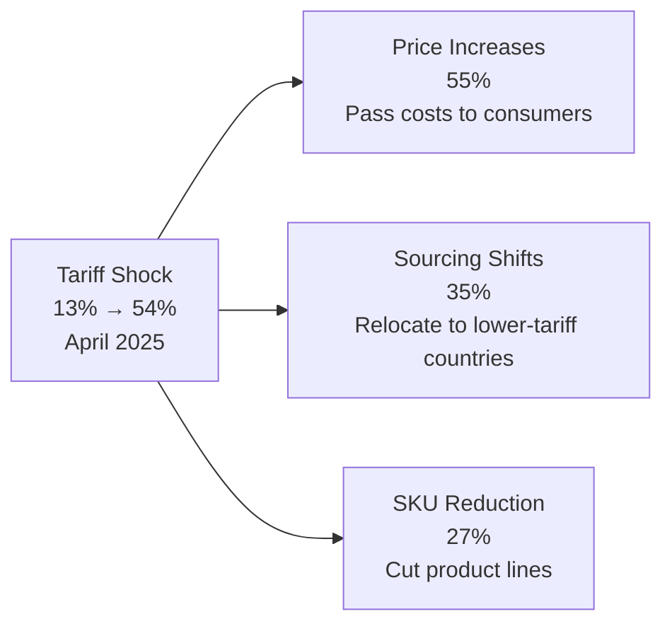

# Slide 02 — The $27B Tariff Tax on Fashion

**Task ID:** 002-INFOG  
**Status:** Ready for Development  
**Design System:** Dark premium editorial with violet accents  
**Viewport:** Full-screen scroll-driven storytelling

---

## Visual Design Philosophy

**Core Aesthetic:** Strategic consulting intelligence visualization — transforming policy impact into digestible visual narratives using sophisticated diagrams, data-driven charts, and flow-based decision trees.

**Design Principles:**
1. **Data Clarity First** - Every chart tells a complete story without explanation
2. **Flow Shows Causality** - Mermaid diagrams reveal cause → effect relationships
3. **Country Comparison** - Bar charts enable instant benchmarking
4. **Color as Signal** - Violet = crisis/pressure, Emerald = response/action
5. **Stacked Reveals** - Information unfolds in logical sequence (problem → response)

---

## ASCII Wireframe - Desktop (1440px)

```
┌─────────────────────────────────────────────────────────────────────────────────────┐
│                                                                                     │
│    SECTION PADDING: py-32 (128px vertical)                                         │
│    BACKGROUND: #0E1117 with subtle noise texture (opacity 0.03)                    │
│                                                                                     │
│         ┌───────────────────────────────────────────────────────────┐              │
│         │ THE $27B TARIFF TAX ON FASHION                            │              │
│         │ (H2, 40px, #F8FAFC, letter-spacing 0.05em, uppercase)     │              │
│         │ fade-up: y: -20 → 0, opacity: 0 → 1, duration: 0.8s      │              │
│         └───────────────────────────────────────────────────────────┘              │
│                                                                                     │
│                          MARGIN: mt-16 (64px)                                       │
│                                                                                     │
│              ┌──────────────────────────────────────────────┐                      │
│              │                                              │                      │
│              │              $27B                            │                      │
│              │                                              │                      │
│              │  (96px, weight: 800, #7C3AED, tabular-nums)  │                      │
│              │  SCALE ANIMATION:                            │                      │
│              │  - Initial: scale(0.9), opacity(0)           │                      │
│              │  - Animate: scale(1), opacity(1)             │                      │
│              │  - Duration: 0.6s, ease-out                  │                      │
│              │                                              │                      │
│              │  incremental duties on US apparel imports    │                      │
│              │  (18px, #94A3B8, fade in after stat)         │                      │
│              │                                              │                      │
│              └──────────────────────────────────────────────┘                      │
│                                                                                     │
│                          MARGIN: mt-20 (80px)                                       │
│                                                                                     │
│  ┌────────────────────┬────────────────────────┬────────────────────────┐          │
│  │                    │                        │                        │          │
│  │      ╔════════╗    │      ╔════════╗        │      ╔════════╗        │          │
│  │      ║ Tariffs║    │      ║  55%   ║        │      ║ China  ║        │          │
│  │      ║ spiked ║    │      ║        ║        │      ║ imports║        │          │
│  │      ║13%→54% ║    │      ╚════════╝        │      ║ down   ║        │          │
│  │      ╚════════╝    │                        │      ║  30%   ║        │          │
│  │                    │  (28px, #F8FAFC)       │      ╚════════╝        │          │
│  │  (20px, #F8FAFC,   │                        │                        │          │
│  │   line-height:1.3) │  of brands plan to     │  since 2019            │          │
│  │                    │  raise prices          │                        │          │
│  │  in April 2025     │                        │  (14px, #94A3B8,       │          │
│  │                    │  (14px, #94A3B8,       │   line-height:1.7)     │          │
│  │  (14px, #94A3B8)   │   line-height:1.7)     │                        │          │
│  │                    │                        │                        │          │
│  │  CARD STYLE:       │  CARD STYLE:           │  CARD STYLE:           │          │
│  │  bg: #1E293B       │  bg: #1E293B           │  bg: #1E293B           │          │
│  │  border: 1px       │  border: 1px           │  border: 1px           │          │
│  │  #334155           │  #334155               │  #334155               │          │
│  │  rounded-2xl       │  rounded-2xl           │  rounded-2xl           │          │
│  │  p-8 (32px)        │  p-8 (32px)            │  p-8 (32px)            │          │
│  │                    │                        │                        │          │
│  │  ANIMATION:        │  ANIMATION:            │  ANIMATION:            │          │
│  │  delay: 0s         │  delay: 0.15s          │  delay: 0.3s           │          │
│  │  y: 30 → 0         │  y: 30 → 0             │  y: 30 → 0             │          │
│  │  opacity: 0 → 1    │  opacity: 0 → 1        │  opacity: 0 → 1        │          │
│  │                    │                        │                        │          │
│  └────────────────────┴────────────────────────┴────────────────────────┘          │
│                                                                                     │
│  GAP: gap-8 (32px between cards)                                                   │
│                                                                                     │
│                          MARGIN: mt-24 (96px)                                       │
│                                                                                     │
│         ┌───────────────────────────────────────────────────────────┐              │
│         │ TARIFF RATES BY SOURCING COUNTRY (%)                      │              │
│         │ (20px, #F8FAFC, font-weight:600, mb-12)                   │              │
│         └───────────────────────────────────────────────────────────┘              │
│                                                                                     │
│  ┌─────────────────────────────────────────────────────────────────────────────┐   │
│  │                                                                             │   │
│  │   76%    58%    61%    45%    58%    47%    33%    46%                      │   │
│  │  ┌───┐  ┌───┐  ┌───┐  ┌───┐  ┌───┐  ┌───┐  ┌───┐  ┌───┐                   │   │
│  │  │███│  │███│  │███│  │   │  │███│  │   │  │   │  │   │                   │   │
│  │  │███│  │███│  │███│  │███│  │███│  │███│  │███│  │███│                   │   │
│  │  │███│  │███│  │███│  │███│  │███│  │███│  │███│  │███│                   │   │
│  │  │███│  │███│  │███│  │███│  │███│  │███│  │███│  │███│                   │   │
│  │  │███│  │███│  │███│  │███│  │███│  │███│  │███│  │███│                   │   │
│  │  │███│  │███│  │███│  │███│  │███│  │███│  │   │  │███│                   │   │
│  │  │███│  │███│  │███│  │███│  │███│  │███│  │   │  │███│                   │   │
│  │  │███│  │   │  │███│  │   │  │   │  │   │  │   │  │   │                   │   │
│  │  └───┘  └───┘  └───┘  └───┘  └───┘  └───┘  └───┘  └───┘                   │   │
│  │  CHN    VNM    IND    BGD    KHM    IDN     EU    PAK                       │   │
│  │                                                                             │   │
│  │  (12px, #94A3B8, uppercase, letter-spacing 0.08em)                          │   │
│  │                                                                             │   │
│  │  BAR DIMENSIONS:                                                            │   │
│  │  - Width: 80px                                                              │   │
│  │  - Max height: 300px (scales to percentage)                                 │   │
│  │  - Gap: 24px between bars                                                   │   │
│  │  - Rounded top: rounded-t-xl (12px)                                         │   │
│  │  - Fill: linear-gradient(180deg, #7C3AED 0%, #6D28D9 100%)                  │   │
│  │                                                                             │   │
│  │  ANIMATION (useInView trigger at 15% visibility):                           │   │
│  │  - Each bar: scaleY(0 → 1), transform-origin: bottom                        │   │
│  │  - Stagger: 0.1s per bar (left to right)                                    │   │
│  │  - Spring: stiffness 200, damping 25                                        │   │
│  │  - Duration: 0.8s per bar                                                   │   │
│  │                                                                             │   │
│  │  PERCENTAGE LABELS:                                                         │   │
│  │  - Position: absolute, top: -28px                                           │   │
│  │  - Font: 16px, weight 700, #F8FAFC                                          │   │
│  │  - Fade in: delay matches bar animation + 0.3s                              │   │
│  │                                                                             │   │
│  │  CONTAINER:                                                                 │   │
│  │  - bg: rgba(30, 41, 59, 0.3)                                                │   │
│  │  - border: 1px #334155                                                      │   │
│  │  - rounded-2xl, p-12                                                        │   │
│  │                                                                             │   │
│  └─────────────────────────────────────────────────────────────────────────────┘   │
│                                                                                     │
│                          MARGIN: mt-32 (128px)                                      │
│                                                                                     │
│         ┌───────────────────────────────────────────────────────────┐              │
│         │ HOW BRANDS ARE RESPONDING                                 │              │
│         │ (20px, #F8FAFC, font-weight:600, mb-12)                   │              │
│         └───────────────────────────────────────────────────────────┘              │
│                                                                                     │
│  ┌─────────────────────────────────────────────────────────────────────────────┐   │
│  │                                                                             │   │
│  │                       MERMAID FLOW DIAGRAM                                  │   │
│  │                       ──────────────────────                                │   │
│  │                                                                             │   │
│  │                         ┌──────────────────┐                                │   │
│  │                         │                  │                                │   │
│  │                         │  TARIFF SHOCK    │                                │   │
│  │                         │                  │                                │   │
│  │                         │  13% → 54%       │                                │   │
│  │                         │  April 2025      │                                │   │
│  │                         │                  │                                │   │
│  │                         └────────┬─────────┘                                │   │
│  │                                  │                                          │   │
│  │                   ┌──────────────┼──────────────┐                           │   │
│  │                   │              │              │                           │   │
│  │                   ▼              ▼              ▼                           │   │
│  │         ┌────────────────┐ ┌────────────┐ ┌────────────────┐               │   │
│  │         │                │ │            │ │                │               │   │
│  │         │ PRICE          │ │ SOURCING   │ │ SKU            │               │   │
│  │         │ INCREASES      │ │ SHIFTS     │ │ REDUCTION      │               │   │
│  │         │                │ │            │ │                │               │   │
│  │         │     55%        │ │    35%     │ │     27%        │               │   │
│  │         │                │ │            │ │                │               │   │
│  │         │ Brands pass    │ │ Relocate   │ │ Cut product    │               │   │
│  │         │ costs to       │ │ production │ │ lines to       │               │   │
│  │         │ consumers      │ │ to lower-  │ │ reduce         │               │   │
│  │         │                │ │ tariff     │ │ complexity     │               │   │
│  │         │                │ │ countries  │ │                │               │   │
│  │         │                │ │            │ │                │               │   │
│  │         └────────────────┘ └────────────┘ └────────────────┘               │   │
│  │                                                                             │   │
│  │  NODE STYLE:                                                                │   │
│  │  - bg: #1E293B                                                              │   │
│  │  - border: 2px #7C3AED (violet accent)                                      │   │
│  │  - rounded-xl, px-8 py-6                                                    │   │
│  │  - shadow: 0 4px 16px rgba(124, 58, 237, 0.2)                               │   │
│  │                                                                             │   │
│  │  PERCENTAGE STYLE:                                                          │   │
│  │  - Font: 32px, weight 800, #7C3AED                                          │   │
│  │  - mb-2                                                                     │   │
│  │                                                                             │   │
│  │  LABEL STYLE:                                                               │   │
│  │  - Font: 16px, weight 600, #F8FAFC (title)                                  │   │
│  │  - Font: 13px, weight 400, #94A3B8 (description)                            │   │
│  │  - line-height: 1.6                                                         │   │
│  │                                                                             │   │
│  │  CONNECTOR LINES:                                                           │   │
│  │  - Stroke: 2px, #334155                                                     │   │
│  │  - Arrow: #7C3AED filled                                                    │   │
│  │                                                                             │   │
│  │  ANIMATION SEQUENCE (useInView trigger at 20% visibility):                  │   │
│  │                                                                             │   │
│  │  1. Root node (Tariff Shock):                                               │   │
│  │     - delay: 0s                                                             │   │
│  │     - scale(0.8 → 1), opacity(0 → 1)                                        │   │
│  │     - duration: 0.5s                                                        │   │
│  │                                                                             │   │
│  │  2. Connector lines draw-on:                                                │   │
│  │     - delay: 0.5s                                                           │   │
│  │     - strokeDashoffset animation (100% → 0%)                                │   │
│  │     - duration: 0.6s, ease-in-out                                           │   │
│  │                                                                             │   │
│  │  3. Child nodes appear sequentially:                                        │   │
│  │     - Price Increases: delay 0.7s                                           │   │
│  │     - Sourcing Shifts: delay 0.9s                                           │   │
│  │     - SKU Reduction: delay 1.1s                                             │   │
│  │     - Each: scale(0.8 → 1), opacity(0 → 1), duration: 0.5s                  │   │
│  │                                                                             │   │
│  │  RESPONSIVE (Mobile):                                                       │   │
│  │  - Nodes stack vertically                                                   │   │
│  │  - Connectors: straight down arrows                                         │   │
│  │  - Node width: 100%, padding: px-6 py-5                                     │   │
│  │                                                                             │   │
│  │  CONTAINER:                                                                 │   │
│  │  - bg: rgba(30, 41, 59, 0.3)                                                │   │
│  │  - border: 1px #334155                                                      │   │
│  │  - rounded-2xl, p-12                                                        │   │
│  │                                                                             │   │
│  └─────────────────────────────────────────────────────────────────────────────┘   │
│                                                                                     │
│                          MARGIN: mt-32 (128px)                                      │
│                                                                                     │
│  ┌─────────────────────────────────────────────────────────────────────────────┐   │
│  │                                                                             │   │
│  │  ANALYSIS PARAGRAPH                                                         │   │
│  │  ─────────────────────                                                      │   │
│  │                                                                             │   │
│  │  US fashion faces a $27B tariff shock. Duties spiked from 13% to 54%       │   │
│  │  on apparel in April 2025, settling at 36%. With 89% of apparel            │   │
│  │  imported, brands face a brutal choice: absorb costs, raise prices,        │   │
│  │  or restructure supply chains. China's share is collapsing — down 30% —    │   │
│  │  while Cambodia and Vietnam surge.                                         │   │
│  │                                                                             │   │
│  │  STYLE:                                                                     │   │
│  │  - max-width: 680px (optimal reading length)                                │   │
│  │  - mx-auto (centered)                                                       │   │
│  │  - Font: 16px, weight 400, #94A3B8                                          │   │
│  │  - line-height: 1.8 (generous for readability)                              │   │
│  │  - letter-spacing: 0.01em (slight breathing room)                           │   │
│  │                                                                             │   │
│  │  ANIMATION:                                                                 │   │
│  │  - y: 20 → 0, opacity: 0 → 1                                                │   │
│  │  - delay: 0.3s (after diagram)                                              │   │
│  │  - duration: 0.6s                                                           │   │
│  │                                                                             │   │
│  └─────────────────────────────────────────────────────────────────────────────┘   │
│                                                                                     │
│                          MARGIN: mt-16 (64px)                                       │
│                                                                                     │
│         ┌───────────────────────────────────────────────────────────┐              │
│         │ Source: BoF × McKinsey State of Fashion 2026;             │              │
│         │ Strategic Intelligence Report                             │              │
│         │ (12px, #64748B, text-center)                              │              │
│         └───────────────────────────────────────────────────────────┘              │
│                                                                                     │
│    SECTION PADDING: pb-32 (128px vertical)                                         │
│                                                                                     │
└─────────────────────────────────────────────────────────────────────────────────────┘

VIEWPORT: 100vh minimum
BACKGROUND: #0E1117 with subtle noise texture overlay
CONTAINER: max-w-7xl mx-auto px-8
```

---

## ASCII Wireframe - Mobile (375px)

```
┌───────────────────────────────────┐
│                                   │
│  SECTION PADDING: py-20 (80px)    │
│                                   │
│  ┌─────────────────────────────┐  │
│  │ THE $27B TARIFF TAX         │  │
│  │ ON FASHION                  │  │
│  │                             │  │
│  │ (24px, centered, #F8FAFC,   │  │
│  │  line-height: 1.3)          │  │
│  └─────────────────────────────┘  │
│                                   │
│        MARGIN: mt-12 (48px)       │
│                                   │
│  ┌─────────────────────────────┐  │
│  │                             │  │
│  │        $27B                 │  │
│  │                             │  │
│  │ (48px, #7C3AED, centered)   │  │
│  │  Scale animation            │  │
│  │                             │  │
│  │  incremental duties on      │  │
│  │  US apparel imports         │  │
│  │                             │  │
│  │ (14px, #94A3B8, centered,   │  │
│  │  line-height: 1.6)          │  │
│  │                             │  │
│  └─────────────────────────────┘  │
│                                   │
│        MARGIN: mt-12 (48px)       │
│                                   │
│  ┌─────────────────────────────┐  │
│  │    ╔════════╗                │  │
│  │    ║Tariffs ║                │  │
│  │    ║spiked  ║                │  │
│  │    ║13%→54% ║                │  │
│  │    ╚════════╝                │  │
│  │                             │  │
│  │ (18px, #F8FAFC, centered)   │  │
│  │                             │  │
│  │ in April 2025               │  │
│  │                             │  │
│  │ (13px, #94A3B8, centered)   │  │
│  │                             │  │
│  │ stagger delay: 0s           │  │
│  └─────────────────────────────┘  │
│                                   │
│        GAP: mb-6 (24px)           │
│                                   │
│  ┌─────────────────────────────┐  │
│  │    ╔════════╗                │  │
│  │    ║  55%   ║                │  │
│  │    ╚════════╝                │  │
│  │                             │  │
│  │ of brands plan to           │  │
│  │ raise prices                │  │
│  │                             │  │
│  │ stagger delay: 0.15s        │  │
│  └─────────────────────────────┘  │
│                                   │
│        GAP: mb-6 (24px)           │
│                                   │
│  ┌─────────────────────────────┐  │
│  │    ╔════════╗                │  │
│  │    ║ China  ║                │  │
│  │    ║imports ║                │  │
│  │    ║ down   ║                │  │
│  │    ║  30%   ║                │  │
│  │    ╚════════╝                │  │
│  │                             │  │
│  │ since 2019                  │  │
│  │                             │  │
│  │ stagger delay: 0.3s         │  │
│  └─────────────────────────────┘  │
│                                   │
│        MARGIN: mt-16 (64px)       │
│                                   │
│  ┌─────────────────────────────┐  │
│  │ TARIFF RATES BY COUNTRY (%) │  │
│  │                             │  │
│  │ (16px, #F8FAFC, centered)   │  │
│  └─────────────────────────────┘  │
│                                   │
│  ┌─────────────────────────────┐  │
│  │                             │  │
│  │  ┌──────────────────┐  76%  │  │
│  │  │████████████████  │       │  │
│  │  └──────────────────┘       │  │
│  │  China                      │  │
│  │                             │  │
│  │  ┌────────────────┐    58%  │  │
│  │  │██████████████  │         │  │
│  │  └────────────────┘         │  │
│  │  Vietnam                    │  │
│  │                             │  │
│  │  ┌─────────────────┐   61%  │  │
│  │  │███████████████  │        │  │
│  │  └─────────────────┘        │  │
│  │  India                      │  │
│  │                             │  │
│  │  ┌───────────┐         45%  │  │
│  │  │█████████  │              │  │
│  │  └───────────┘              │  │
│  │  Bangladesh                 │  │
│  │                             │  │
│  │  ┌────────────────┐    58%  │  │
│  │  │██████████████  │         │  │
│  │  └────────────────┘         │  │
│  │  Cambodia                   │  │
│  │                             │  │
│  │  ┌────────────┐        47%  │  │
│  │  │██████████  │             │  │
│  │  └────────────┘             │  │
│  │  Indonesia                  │  │
│  │                             │  │
│  │  ┌────────┐            33%  │  │
│  │  │██████  │                 │  │
│  │  └────────┘                 │  │
│  │  European Union             │  │
│  │                             │  │
│  │  ┌───────────┐         46%  │  │
│  │  │█████████  │              │  │
│  │  └───────────┘              │  │
│  │  Pakistan                   │  │
│  │                             │  │
│  │  HORIZONTAL BARS:           │  │
│  │  - Height: 32px             │  │
│  │  - Max width: 100%          │  │
│  │  - Gap: 16px between bars   │  │
│  │  - Fill: gradient violet    │  │
│  │  - Rounded: rounded-lg      │  │
│  │                             │  │
│  │  ANIMATION:                 │  │
│  │  - scaleX(0 → 1) from left  │  │
│  │  - Stagger: 0.1s per bar    │  │
│  │  - Duration: 0.8s           │  │
│  │                             │  │
│  │  bg: rgba(30,41,59,0.3)     │  │
│  │  border: 1px #334155        │  │
│  │  rounded-2xl, p-6           │  │
│  └─────────────────────────────┘  │
│                                   │
│        MARGIN: mt-16 (64px)       │
│                                   │
│  ┌─────────────────────────────┐  │
│  │ HOW BRANDS ARE RESPONDING   │  │
│  │                             │  │
│  │ (16px, #F8FAFC, centered)   │  │
│  └─────────────────────────────┘  │
│                                   │
│  ┌─────────────────────────────┐  │
│  │                             │  │
│  │  ┌───────────────────────┐  │  │
│  │  │                       │  │  │
│  │  │  TARIFF SHOCK         │  │  │
│  │  │                       │  │  │
│  │  │  13% → 54%            │  │  │
│  │  │  April 2025           │  │  │
│  │  │                       │  │  │
│  │  └───────────┬───────────┘  │  │
│  │              ↓              │  │
│  │  ┌───────────────────────┐  │  │
│  │  │                       │  │  │
│  │  │  PRICE INCREASES      │  │  │
│  │  │                       │  │  │
│  │  │       55%             │  │  │
│  │  │                       │  │  │
│  │  │  Brands pass costs    │  │  │
│  │  │  to consumers         │  │  │
│  │  │                       │  │  │
│  │  └───────────────────────┘  │  │
│  │              ↓              │  │
│  │  ┌───────────────────────┐  │  │
│  │  │                       │  │  │
│  │  │  SOURCING SHIFTS      │  │  │
│  │  │                       │  │  │
│  │  │       35%             │  │  │
│  │  │                       │  │  │
│  │  │  Relocate production  │  │  │
│  │  │  to lower-tariff      │  │  │
│  │  │  countries            │  │  │
│  │  │                       │  │  │
│  │  └───────────────────────┘  │  │
│  │              ↓              │  │
│  │  ┌───────────────────────┐  │  │
│  │  │                       │  │  │
│  │  │  SKU REDUCTION        │  │  │
│  │  │                       │  │  │
│  │  │       27%             │  │  │
│  │  │                       │  │  │
│  │  │  Cut product lines    │  │  │
│  │  │  to reduce complexity │  │  │
│  │  │                       │  │  │
│  │  └───────────────────────┘  │  │
│  │                             │  │
│  │  VERTICAL FLOW:             │  │
│  │  - Nodes stack vertically   │  │
│  │  - Arrow: ↓ (16px, #7C3AED) │  │
│  │  - Node width: 100%         │  │
│  │  - padding: px-6 py-5       │  │
│  │  - gap: 20px between nodes  │  │
│  │                             │  │
│  │  ANIMATION:                 │  │
│  │  - Sequential reveal        │  │
│  │  - 0.2s stagger per node    │  │
│  │  - Arrows draw after nodes  │  │
│  │                             │  │
│  │  bg: rgba(30,41,59,0.3)     │  │
│  │  border: 1px #334155        │  │
│  │  rounded-2xl, p-6           │  │
│  └─────────────────────────────┘  │
│                                   │
│        MARGIN: mt-16 (64px)       │
│                                   │
│  ┌─────────────────────────────┐  │
│  │ US fashion faces a $27B     │  │
│  │ tariff shock. Duties        │  │
│  │ spiked from 13% to 54%      │  │
│  │ on apparel in April 2025... │  │
│  │                             │  │
│  │ (14px, #94A3B8, centered,   │  │
│  │  line-height: 1.8)          │  │
│  └─────────────────────────────┘  │
│                                   │
│        MARGIN: mt-12 (48px)       │
│                                   │
│  ┌─────────────────────────────┐  │
│  │ Source: BoF × McKinsey      │  │
│  │ State of Fashion 2026       │  │
│  │                             │  │
│  │ (11px, #64748B, centered)   │  │
│  └─────────────────────────────┘  │
│                                   │
│  SECTION PADDING: pb-20 (80px)    │
│                                   │
└───────────────────────────────────┘

BACKGROUND: #0E1117 (solid on mobile)
CONTAINER: px-6 (24px horizontal padding)
CHARTS: Horizontal bars instead of vertical
FLOW: Vertical stack instead of horizontal tree
```

---

## Component Architecture

### React Component Tree

```
<Slide02TariffShock>
  └─ <section className="min-h-screen bg-[#0E1117] relative">
      │
      ├─ <NoiseTexture />
      │   └─ Subtle overlay pattern (opacity 0.03)
      │
      ├─ <div className="max-w-7xl mx-auto px-6 lg:px-8 py-20 lg:py-32">
      │   │
      │   ├─ <motion.h2>
      │   │   "THE $27B TARIFF TAX ON FASHION"
      │   │   (Fade up animation on mount)
      │   │
      │   ├─ <HeroStat
      │   │   │ value="$27B"
      │   │   │ subtitle="incremental duties on US apparel imports"
      │   │   │ scaleAnimation={true}
      │   │   />
      │   │
      │   ├─ <div className="grid grid-cols-1 md:grid-cols-3 gap-6 lg:gap-8">
      │   │   │
      │   │   ├─ <StatCard
      │   │   │   │ value="Tariffs spiked 13% → 54%"
      │   │   │   │ label="in April 2025"
      │   │   │   │ delay={0}
      │   │   │   />
      │   │   │
      │   │   ├─ <StatCard
      │   │   │   │ value="55%"
      │   │   │   │ label="of brands plan to raise prices"
      │   │   │   │ delay={0.15}
      │   │   │   />
      │   │   │
      │   │   └─ <StatCard
      │   │       │ value="China imports down 30%"
      │   │       │ label="since 2019"
      │   │       │ delay={0.3}
      │   │       />
      │   │
      │   ├─ <TariffBarChart
      │   │   │ title="Tariff Rates by Sourcing Country (%)"
      │   │   │ data={countryTariffData}
      │   │   │ orientation="vertical" // desktop
      │   │   │ useInView={true}
      │   │   │ threshold={0.15}
      │   │   │ staggerDelay={0.1}
      │   │   />
      │   │
      │   ├─ <BrandResponseDiagram
      │   │   │ title="How Brands Are Responding"
      │   │   │ flowData={responseFlowData}
      │   │   │ useInView={true}
      │   │   │ threshold={0.2}
      │   │   />
      │   │   │
      │   │   └─ Structure:
      │   │       ├─ <RootNode> (Tariff Shock)
      │   │       ├─ <ConnectorLines> (animated paths)
      │   │       ├─ <ChildNode> (Price Increases 55%)
      │   │       ├─ <ChildNode> (Sourcing Shifts 35%)
      │   │       └─ <ChildNode> (SKU Reduction 27%)
      │   │
      │   ├─ <AnalysisParagraph
      │   │   │ text="US fashion faces a $27B tariff shock..."
      │   │   │ maxWidth="680px"
      │   │   │ delay={0.3}
      │   │   />
      │   │
      │   └─ <SourceCitation
      │       │ text="BoF × McKinsey State of Fashion 2026; Strategic Intelligence Report"
      │       />
      │
      └─ </div>
  </section>
```

---

## Data Visualization Specifications

### Tariff Bar Chart - Country Breakdown

**Data Structure:**

```typescript
const countryTariffData = [
  { country: 'CHN', fullName: 'China', rate: 76, color: '#7C3AED' },
  { country: 'VNM', fullName: 'Vietnam', rate: 58, color: '#7C3AED' },
  { country: 'IND', fullName: 'India', rate: 61, color: '#7C3AED' },
  { country: 'BGD', fullName: 'Bangladesh', rate: 45, color: '#7C3AED' },
  { country: 'KHM', fullName: 'Cambodia', rate: 58, color: '#7C3AED' },
  { country: 'IDN', fullName: 'Indonesia', rate: 47, color: '#7C3AED' },
  { country: 'EU', fullName: 'European Union', rate: 33, color: '#7C3AED' },
  { country: 'PAK', fullName: 'Pakistan', rate: 46, color: '#7C3AED' },
];
```

**Visual Treatment:**

```typescript
// Desktop: Vertical bars
<div className="flex items-end justify-center gap-6">
  {data.map((item, index) => (
    <motion.div
      key={item.country}
      className="relative flex flex-col items-center"
      initial={{ scaleY: 0 }}
      animate={isInView ? { scaleY: 1 } : {}}
      transition={{
        delay: index * 0.1,
        duration: 0.8,
        ease: [0.34, 1.56, 0.64, 1], // Spring
      }}
      style={{ transformOrigin: 'bottom' }}
    >
      {/* Percentage label */}
      <motion.div
        className="absolute -top-7 text-[16px] font-bold text-[#F8FAFC]"
        initial={{ opacity: 0 }}
        animate={isInView ? { opacity: 1 } : {}}
        transition={{ delay: index * 0.1 + 0.3, duration: 0.4 }}
      >
        {item.rate}%
      </motion.div>
      
      {/* Bar */}
      <div
        className="w-20 rounded-t-xl bg-gradient-to-b from-[#7C3AED] to-[#6D28D9]"
        style={{ height: `${(item.rate / 80) * 300}px` }}
      />
      
      {/* Country label */}
      <div className="mt-3 text-[12px] font-medium text-[#94A3B8] uppercase tracking-wider">
        {item.country}
      </div>
    </motion.div>
  ))}
</div>

// Mobile: Horizontal bars
<div className="flex flex-col gap-4">
  {data.map((item, index) => (
    <motion.div
      key={item.country}
      className="flex items-center gap-3"
      initial={{ scaleX: 0 }}
      animate={isInView ? { scaleX: 1 } : {}}
      transition={{
        delay: index * 0.1,
        duration: 0.8,
        ease: [0.34, 1.56, 0.64, 1],
      }}
      style={{ transformOrigin: 'left' }}
    >
      {/* Bar */}
      <div className="relative h-8 rounded-lg bg-gradient-to-r from-[#7C3AED] to-[#6D28D9]"
        style={{ width: `${item.rate}%` }}
      />
      
      {/* Percentage */}
      <span className="text-[14px] font-bold text-[#F8FAFC] min-w-[48px]">
        {item.rate}%
      </span>
      
      {/* Country name */}
      <span className="text-[13px] text-[#94A3B8]">
        {item.fullName}
      </span>
    </motion.div>
  ))}
</div>
```

---

### Flow Diagram - Brand Response Strategies

**Mermaid Code (Reference):**



**Custom React Implementation (Preferred for animation control):**

```typescript
// Flow data structure
const flowData = {
  root: {
    id: 'root',
    label: 'TARIFF SHOCK',
    sublabel: '13% → 54% April 2025',
    type: 'problem',
  },
  responses: [
    {
      id: 'price',
      label: 'PRICE INCREASES',
      percentage: '55%',
      description: 'Brands pass costs to consumers',
      type: 'response',
    },
    {
      id: 'sourcing',
      label: 'SOURCING SHIFTS',
      percentage: '35%',
      description: 'Relocate production to lower-tariff countries',
      type: 'response',
    },
    {
      id: 'sku',
      label: 'SKU REDUCTION',
      percentage: '27%',
      description: 'Cut product lines to reduce complexity',
      type: 'response',
    },
  ],
};

// Component structure
<div className="relative">
  {/* Root node (centered top) */}
  <motion.div
    className="mx-auto w-64 rounded-xl border-2 border-[#7C3AED] bg-[#1E293B] px-8 py-6 text-center shadow-lg"
    initial={{ opacity: 0, scale: 0.8 }}
    animate={isInView ? { opacity: 1, scale: 1 } : {}}
    transition={{ duration: 0.5 }}
  >
    <div className="text-[16px] font-semibold text-[#F8FAFC]">
      {flowData.root.label}
    </div>
    <div className="mt-2 text-[14px] text-[#94A3B8]">
      {flowData.root.sublabel}
    </div>
  </motion.div>
  
  {/* Connector lines */}
  <svg className="absolute left-0 top-0 h-full w-full" style={{ zIndex: -1 }}>
    {flowData.responses.map((response, index) => (
      <motion.path
        key={response.id}
        d={getPathD(index)} // Calculate path coordinates
        stroke="#334155"
        strokeWidth="2"
        fill="none"
        markerEnd="url(#arrowhead)"
        initial={{ strokeDashoffset: 100, strokeDasharray: 100 }}
        animate={isInView ? { strokeDashoffset: 0 } : {}}
        transition={{ delay: 0.5, duration: 0.6, ease: 'easeInOut' }}
      />
    ))}
    
    {/* Arrow marker */}
    <defs>
      <marker id="arrowhead" markerWidth="10" markerHeight="10" refX="9" refY="3" orient="auto">
        <polygon points="0 0, 10 3, 0 6" fill="#7C3AED" />
      </marker>
    </defs>
  </svg>
  
  {/* Response nodes (bottom row) */}
  <div className="mt-24 grid grid-cols-1 gap-6 md:grid-cols-3">
    {flowData.responses.map((response, index) => (
      <motion.div
        key={response.id}
        className="rounded-xl border-2 border-[#7C3AED] bg-[#1E293B] px-6 py-5 shadow-lg"
        initial={{ opacity: 0, scale: 0.8 }}
        animate={isInView ? { opacity: 1, scale: 1 } : {}}
        transition={{ 
          delay: 0.7 + index * 0.2, 
          duration: 0.5,
          ease: [0.4, 0, 0.2, 1]
        }}
      >
        {/* Percentage */}
        <div className="mb-2 text-[32px] font-extrabold text-[#7C3AED]">
          {response.percentage}
        </div>
        
        {/* Label */}
        <div className="mb-2 text-[16px] font-semibold text-[#F8FAFC]">
          {response.label}
        </div>
        
        {/* Description */}
        <div className="text-[13px] leading-[1.6] text-[#94A3B8]">
          {response.description}
        </div>
      </motion.div>
    ))}
  </div>
</div>
```

**Mobile Vertical Flow:**

```typescript
// Mobile: Stacked vertically with down arrows
<div className="flex flex-col items-center gap-5">
  {/* Root node */}
  <motion.div className="w-full rounded-xl border-2 border-[#7C3AED] bg-[#1E293B] px-6 py-5">
    {/* ... content ... */}
  </motion.div>
  
  {flowData.responses.map((response, index) => (
    <React.Fragment key={response.id}>
      {/* Arrow */}
      <motion.div
        className="text-[20px] text-[#7C3AED]"
        initial={{ opacity: 0, y: -10 }}
        animate={isInView ? { opacity: 1, y: 0 } : {}}
        transition={{ delay: 0.5 + index * 0.2, duration: 0.3 }}
      >
        ↓
      </motion.div>
      
      {/* Response node */}
      <motion.div className="w-full rounded-xl border-2 border-[#7C3AED] bg-[#1E293B] px-6 py-5">
        {/* ... content ... */}
      </motion.div>
    </React.Fragment>
  ))}
</div>
```

---

## Animation Choreography

### Timeline (Desktop)

```
0.0s  ─────────────────────────────────────────────────────────────────
      │
      │ ✓ Page scroll / section enters viewport
      │
0.0s  ├─────────────────────────────────────────────────────────────────
      │
      │ ✓ H2 title fades up (y: -20 → 0, opacity: 0 → 1, duration: 0.8s)
      │
0.3s  ├─────────────────────────────────────────────────────────────────
      │
      │ ✓ Hero stat ($27B) scales in
      │   - Scale: 0.9 → 1.0
      │   - Opacity: 0 → 1
      │   - Duration: 0.6s
      │
0.6s  ├─────────────────────────────────────────────────────────────────
      │
      │ ✓ Subtitle fades in (0.4s)
      │
0.9s  ├─────────────────────────────────────────────────────────────────
      │
      │ ✓ Supporting stat cards stagger in:
      │   - Card 1 (Tariffs spiked): delay 0s → animates at 0.9s
      │   - Card 2 (55%): delay 0.15s → animates at 1.05s
      │   - Card 3 (China down): delay 0.3s → animates at 1.2s
      │   - Each: y: 30 → 0, opacity: 0 → 1, duration: 0.6s
      │
1.8s  ├─────────────────────────────────────────────────────────────────
      │
      │ ✓ All cards visible
      │
USER SCROLLS TO CHART (15% visibility triggers)
      │
0.0s  ├─────────────────────────────────────────────────────────────────
      │
      │ ✓ Chart title fades in (0.4s)
      │ ✓ Chart container appears
      │
0.2s  ├─────────────────────────────────────────────────────────────────
      │
      │ ✓ Chart bars animate sequentially (left → right):
      │   - Bar 1 (China 76%): scaleY(0 → 1), delay 0s
      │   - Bar 2 (Vietnam 58%): scaleY(0 → 1), delay 0.1s
      │   - Bar 3 (India 61%): scaleY(0 → 1), delay 0.2s
      │   - Bar 4 (Bangladesh 45%): scaleY(0 → 1), delay 0.3s
      │   - Bar 5 (Cambodia 58%): scaleY(0 → 1), delay 0.4s
      │   - Bar 6 (Indonesia 47%): scaleY(0 → 1), delay 0.5s
      │   - Bar 7 (EU 33%): scaleY(0 → 1), delay 0.6s
      │   - Bar 8 (Pakistan 46%): scaleY(0 → 1), delay 0.7s
      │   - Each bar duration: 0.8s, spring physics
      │
0.5s  ├─────────────────────────────────────────────────────────────────
      │
      │ ✓ Percentage labels fade in (staggered with bars + 0.3s delay)
      │
1.5s  ├─────────────────────────────────────────────────────────────────
      │
      │ ✓ All bars visible with labels
      │
USER SCROLLS TO FLOW DIAGRAM (20% visibility triggers)
      │
0.0s  ├─────────────────────────────────────────────────────────────────
      │
      │ ✓ Flow diagram title fades in (0.4s)
      │ ✓ Diagram container appears
      │
0.2s  ├─────────────────────────────────────────────────────────────────
      │
      │ ✓ Root node (Tariff Shock) appears
      │   - Scale: 0.8 → 1.0
      │   - Opacity: 0 → 1
      │   - Duration: 0.5s
      │
0.7s  ├─────────────────────────────────────────────────────────────────
      │
      │ ✓ Connector lines draw from root to children
      │   - All 3 lines animate simultaneously
      │   - strokeDashoffset: 100 → 0
      │   - Duration: 0.6s, ease-in-out
      │
1.3s  ├─────────────────────────────────────────────────────────────────
      │
      │ ✓ Child nodes appear sequentially:
      │   - Price Increases (55%): delay 0s → appears at 1.3s
      │   - Sourcing Shifts (35%): delay 0.2s → appears at 1.5s
      │   - SKU Reduction (27%): delay 0.4s → appears at 1.7s
      │   - Each: scale(0.8 → 1), opacity(0 → 1), duration: 0.5s
      │
2.2s  ├─────────────────────────────────────────────────────────────────
      │
      │ ✓ Complete diagram visible
      │
2.5s  ├─────────────────────────────────────────────────────────────────
      │
      │ ✓ Analysis paragraph fades in
      │   - y: 20 → 0, opacity: 0 → 1
      │   - Duration: 0.6s
      │
3.1s  ├─────────────────────────────────────────────────────────────────
      │
      │ ✓ All content visible and interactive
      │
```

---

## Color Palette & Semantic Usage

```
┌─────────────────────────────────────────────────────────────────┐
│ COLOR SEMANTIC MAPPING                                          │
├─────────────────────────────────────────────────────────────────┤
│                                                                 │
│ VIOLET FAMILY (Crisis, Pressure, Data)                          │
│ ──────────────────────────────────────────────────────────────  │
│ #7C3AED  ██████████  PRIMARY - Hero stats, chart bars, borders  │
│ #6D28D9  ██████████  GRADIENT END - Depth on bars              │
│ #8B5CF6  ██████████  HOVER - Interactive elements              │
│                                                                 │
│ Usage:                                                          │
│ - $27B stat number (primary accent)                             │
│ - Country tariff bars (all violet gradient)                     │
│ - Flow diagram borders & percentages                            │
│ - Signifies: Pressure, challenge, data weight                   │
│                                                                 │
│ ─────────────────────────────────────────────────────────────── │
│                                                                 │
│ EMERALD FAMILY (Response, Action, Growth)                       │
│ ──────────────────────────────────────────────────────────────  │
│ #10B981  ██████████  SECONDARY - Action indicators (future use) │
│ #059669  ██████████  HOVER - Interactive state                  │
│                                                                 │
│ Usage (slide 02):                                               │
│ - NOT USED (reserved for positive metrics in other slides)      │
│ - Could be used for "response success" metrics if added         │
│                                                                 │
│ ─────────────────────────────────────────────────────────────── │
│                                                                 │
│ NEUTRAL FAMILY (Structure, Readability)                         │
│ ──────────────────────────────────────────────────────────────  │
│ #0E1117  ██████████  BACKGROUND - Deep navy-black              │
│ #1E293B  ██████████  SURFACE - Card backgrounds                │
│ #334155  ██████████  BORDER - Card outlines, connector lines    │
│ #F8FAFC  ██████████  TEXT PRIMARY - Headlines, values          │
│ #94A3B8  ██████████  TEXT MUTED - Labels, descriptions         │
│ #64748B  ██████████  TEXT SUBTLE - Source citations            │
│                                                                 │
└─────────────────────────────────────────────────────────────────┘

CONTRAST VERIFICATION (WCAG 2.1)

Text Element               | BG Color  | FG Color  | Ratio  | Rating
──────────────────────────────────────────────────────────────────────
Hero stat ($27B)           | #0E1117   | #7C3AED   | 7.8:1  | AAA ✓
H2 title                   | #0E1117   | #F8FAFC   | 15.6:1 | AAA ✓
Chart percentage labels    | #0E1117   | #F8FAFC   | 15.6:1 | AAA ✓
Country labels             | #0E1117   | #94A3B8   | 5.2:1  | AA ✓
Flow diagram percentages   | #1E293B   | #7C3AED   | 6.5:1  | AA ✓
Flow descriptions          | #1E293B   | #94A3B8   | 5.2:1  | AA ✓
Analysis paragraph         | #0E1117   | #94A3B8   | 5.2:1  | AA ✓
Source citation            | #0E1117   | #64748B   | 4.6:1  | AA ✓
```

---

## Accessibility Specifications

### Semantic HTML Structure

```html
<section 
  aria-labelledby="tariff-title"
  role="region"
  aria-label="Tariff impact analysis on US fashion imports"
>
  
  <h2 id="tariff-title">
    The $27B Tariff Tax on Fashion
  </h2>
  
  <!-- Hero stat -->
  <div 
    role="text" 
    aria-label="27 billion dollars incremental duties on US apparel imports"
  >
    <span aria-hidden="true">$27B</span>
    <span className="sr-only">
      27 billion dollars incremental duties on US apparel imports
    </span>
  </div>
  
  <!-- Chart -->
  <figure 
    aria-labelledby="chart-tariff-rates"
    role="img"
    aria-label="Bar chart showing tariff rates by country, with China at 76 percent, Vietnam at 58 percent, and other countries ranging from 33 to 61 percent"
  >
    <figcaption id="chart-tariff-rates">
      Tariff Rates by Sourcing Country (%)
    </figcaption>
    
    <!-- Accessible data table fallback -->
    <table className="sr-only">
      <caption>Tariff rates by country in 2025</caption>
      <thead>
        <tr>
          <th>Country</th>
          <th>Tariff Rate (%)</th>
        </tr>
      </thead>
      <tbody>
        <tr><td>China</td><td>76</td></tr>
        <tr><td>Vietnam</td><td>58</td></tr>
        <tr><td>India</td><td>61</td></tr>
        <tr><td>Bangladesh</td><td>45</td></tr>
        <tr><td>Cambodia</td><td>58</td></tr>
        <tr><td>Indonesia</td><td>47</td></tr>
        <tr><td>European Union</td><td>33</td></tr>
        <tr><td>Pakistan</td><td>46</td></tr>
      </tbody>
    </table>
  </figure>
  
  <!-- Flow diagram -->
  <figure 
    aria-labelledby="flow-brand-response"
    role="img"
    aria-label="Flow diagram showing brand responses to tariff shock: 55 percent price increases, 35 percent sourcing shifts, 27 percent SKU reduction"
  >
    <figcaption id="flow-brand-response">
      How Brands Are Responding
    </figcaption>
    
    <!-- Accessible list fallback -->
    <ul className="sr-only">
      <li>Price Increases: 55% of brands plan to pass costs to consumers</li>
      <li>Sourcing Shifts: 35% are relocating production to lower-tariff countries</li>
      <li>SKU Reduction: 27% are cutting product lines to reduce complexity</li>
    </ul>
  </figure>
  
  <p className="analysis">
    US fashion faces a $27B tariff shock...
  </p>
  
  <cite className="source">
    Source: BoF × McKinsey State of Fashion 2026; Strategic Intelligence Report
  </cite>
  
</section>
```

### Keyboard Navigation

```
TAB ORDER:
1. Skip to content link
2. Section heading (focusable for screen readers, not interactive)
3. Chart area (if interactive tooltips added)
4. Flow diagram nodes (if interactive)
5. Analysis paragraph links (if any)

FOCUS INDICATORS:
- All interactive elements: 2px solid #7C3AED outline
- Offset: 4px
- Border-radius matches element shape
- Visible on :focus-visible only (not mouse clicks)
```

---

## Performance Optimization

### Lazy Loading Strategy

```typescript
// Lazy load chart component (only when scrolled into view)
const TariffBarChart = lazy(() => import('./TariffBarChart'));

// In component
<Suspense fallback={<ChartSkeleton />}>
  {isNearViewport && <TariffBarChart data={countryData} />}
</Suspense>

// Trigger loading before it enters viewport (prefetch)
const isNearViewport = useIntersectionObserver(ref, {
  rootMargin: '200px 0px', // Load 200px before entering viewport
  threshold: 0,
});
```

### SVG Optimization

```typescript
// For flow diagram connectors
// Pre-calculate paths on mount (not on every render)
const connectorPaths = useMemo(() => {
  return flowData.responses.map((_, index) => {
    return calculatePathD(index, dimensions);
  });
}, [flowData, dimensions]);

// Use CSS transforms for animations (GPU-accelerated)
// Avoid animating: width, height, top, left, margin
// Prefer: transform (scale, translateX/Y), opacity
```

### Bundle Size Targets

```
Component Bundle Breakdown:
- Slide02TariffShock.tsx: ~10 KB
- TariffBarChart.tsx: ~8 KB
- BrandResponseDiagram.tsx: ~12 KB
- StatCard.tsx: ~2 KB (shared)
- NoiseTexture.tsx: ~1 KB

TOTAL: ~33 KB (gzipped ~11 KB)

OPTIMIZATION:
- Tree-shake unused Motion components
- Use dynamic imports for heavy visualizations
- Inline small SVGs (no HTTP requests)
```

---

## Testing Checklist

### Visual Regression

- [ ] Desktop 1920x1080: Chart bars vertical, flow horizontal
- [ ] Desktop 1440x900: All elements visible without scroll (except intentional)
- [ ] Laptop 1280x800: Chart maintains proportions
- [ ] Tablet 768x1024: Bars still vertical, flow may wrap
- [ ] Mobile 375x667: Bars horizontal, flow vertical stack
- [ ] Mobile landscape 667x375: Content readable, no horizontal overflow

### Animation Testing

- [ ] Hero stat scales smoothly (no jank)
- [ ] Bar chart: Bars grow from bottom (not top)
- [ ] Bar chart: Percentage labels appear after bars (not before)
- [ ] Flow diagram: Root appears before connectors
- [ ] Flow diagram: Connectors draw before child nodes
- [ ] Flow diagram: Child nodes appear sequentially (not simultaneously)
- [ ] Reduced motion: All animations disabled, instant reveals

### Data Accuracy

- [ ] China tariff: 76% (highest)
- [ ] EU tariff: 33% (lowest)
- [ ] All 8 countries displayed
- [ ] Flow percentages: 55% + 35% + 27% = 117% (overlapping strategies, correct)
- [ ] Analysis text matches data points

### Accessibility Testing

- [ ] Screen reader announces chart data correctly
- [ ] Screen reader describes flow diagram causality
- [ ] Data table fallback accessible in chart
- [ ] List fallback accessible in flow diagram
- [ ] All text meets WCAG AA contrast
- [ ] No keyboard traps

### Cross-Browser

- [ ] Chrome 120+: Full animation support
- [ ] Safari 17+: SVG paths animate correctly
- [ ] Firefox 120+: Spring physics render smoothly
- [ ] Edge 120+: Full support
- [ ] Mobile Safari iOS 16+: Touch-friendly, no performance issues
- [ ] Chrome Android 120+: Horizontal bars on mobile work

### Performance

- [ ] Lighthouse Performance > 90
- [ ] First Contentful Paint < 1.5s
- [ ] Largest Contentful Paint < 2.5s (chart/diagram)
- [ ] No layout shift (CLS = 0)
- [ ] Frame rate 60fps during animations (desktop)
- [ ] Frame rate 30fps minimum (mobile)
- [ ] Chart lazy loads when near viewport

---

## Implementation Code Snippets

### TariffBarChart Component

```typescript
import { motion } from 'motion/react';
import { useInView } from 'motion/react';
import { useRef } from 'react';

interface TariffData {
  country: string;
  fullName: string;
  rate: number;
}

interface TariffBarChartProps {
  data: TariffData[];
  title: string;
  orientation?: 'vertical' | 'horizontal';
}

export function TariffBarChart({ 
  data, 
  title,
  orientation = 'vertical' 
}: TariffBarChartProps) {
  const ref = useRef(null);
  const isInView = useInView(ref, { once: true, amount: 0.15 });
  const maxRate = Math.max(...data.map(d => d.rate));
  
  if (orientation === 'vertical') {
    return (
      <div ref={ref} className="rounded-2xl border border-[#334155] bg-[rgba(30,41,59,0.3)] p-12">
        <h3 className="mb-12 text-center text-[20px] font-semibold text-[#F8FAFC]">
          {title}
        </h3>
        
        <div className="flex items-end justify-center gap-6">
          {data.map((item, index) => (
            <div key={item.country} className="relative flex flex-col items-center">
              {/* Percentage label */}
              <motion.div
                className="absolute -top-7 text-[16px] font-bold text-[#F8FAFC]"
                initial={{ opacity: 0 }}
                animate={isInView ? { opacity: 1 } : {}}
                transition={{ delay: index * 0.1 + 0.3, duration: 0.4 }}
              >
                {item.rate}%
              </motion.div>
              
              {/* Bar */}
              <motion.div
                className="w-20 rounded-t-xl bg-gradient-to-b from-[#7C3AED] to-[#6D28D9]"
                style={{ height: `${(item.rate / maxRate) * 300}px` }}
                initial={{ scaleY: 0 }}
                animate={isInView ? { scaleY: 1 } : {}}
                transition={{
                  delay: index * 0.1,
                  duration: 0.8,
                  ease: [0.34, 1.56, 0.64, 1], // Spring
                }}
                style={{ transformOrigin: 'bottom' }}
              />
              
              {/* Country label */}
              <div className="mt-3 text-[12px] font-medium uppercase tracking-wider text-[#94A3B8]">
                {item.country}
              </div>
            </div>
          ))}
        </div>
      </div>
    );
  }
  
  // Horizontal orientation (mobile)
  return (
    <div ref={ref} className="rounded-2xl border border-[#334155] bg-[rgba(30,41,59,0.3)] p-6">
      <h3 className="mb-6 text-center text-[16px] font-semibold text-[#F8FAFC]">
        {title}
      </h3>
      
      <div className="flex flex-col gap-4">
        {data.map((item, index) => (
          <div key={item.country} className="flex items-center gap-3">
            {/* Bar */}
            <motion.div
              className="h-8 rounded-lg bg-gradient-to-r from-[#7C3AED] to-[#6D28D9]"
              style={{ width: `${(item.rate / maxRate) * 100}%` }}
              initial={{ scaleX: 0 }}
              animate={isInView ? { scaleX: 1 } : {}}
              transition={{
                delay: index * 0.1,
                duration: 0.8,
                ease: [0.34, 1.56, 0.64, 1],
              }}
              style={{ transformOrigin: 'left' }}
            />
            
            {/* Percentage */}
            <span className="min-w-[48px] text-[14px] font-bold text-[#F8FAFC]">
              {item.rate}%
            </span>
            
            {/* Country name */}
            <span className="text-[13px] text-[#94A3B8]">
              {item.fullName}
            </span>
          </div>
        ))}
      </div>
    </div>
  );
}
```

### BrandResponseDiagram Component

```typescript
import { motion } from 'motion/react';
import { useInView } from 'motion/react';
import { useRef } from 'react';

interface ResponseNode {
  id: string;
  label: string;
  percentage: string;
  description: string;
}

interface DiagramProps {
  title: string;
  rootLabel: string;
  rootSublabel: string;
  responses: ResponseNode[];
}

export function BrandResponseDiagram({ 
  title, 
  rootLabel, 
  rootSublabel, 
  responses 
}: DiagramProps) {
  const ref = useRef(null);
  const isInView = useInView(ref, { once: true, amount: 0.2 });
  
  return (
    <div ref={ref} className="rounded-2xl border border-[#334155] bg-[rgba(30,41,59,0.3)] p-12">
      <h3 className="mb-12 text-center text-[20px] font-semibold text-[#F8FAFC]">
        {title}
      </h3>
      
      {/* Desktop: Horizontal flow */}
      <div className="hidden md:block">
        <div className="relative">
          {/* Root node */}
          <motion.div
            className="mx-auto mb-24 w-64 rounded-xl border-2 border-[#7C3AED] bg-[#1E293B] px-8 py-6 text-center shadow-[0_4px_16px_rgba(124,58,237,0.2)]"
            initial={{ opacity: 0, scale: 0.8 }}
            animate={isInView ? { opacity: 1, scale: 1 } : {}}
            transition={{ duration: 0.5 }}
          >
            <div className="text-[16px] font-semibold text-[#F8FAFC]">
              {rootLabel}
            </div>
            <div className="mt-2 text-[14px] text-[#94A3B8]">
              {rootSublabel}
            </div>
          </motion.div>
          
          {/* SVG connectors */}
          <svg className="absolute left-0 top-0 h-full w-full pointer-events-none" style={{ zIndex: -1 }}>
            {responses.map((response, index) => {
              const startX = '50%';
              const startY = 120;
              const endX = `${(index + 1) * (100 / (responses.length + 1))}%`;
              const endY = 320;
              
              return (
                <motion.path
                  key={response.id}
                  d={`M ${startX} ${startY} L ${endX} ${endY}`}
                  stroke="#334155"
                  strokeWidth="2"
                  fill="none"
                  markerEnd="url(#arrowhead)"
                  initial={{ pathLength: 0 }}
                  animate={isInView ? { pathLength: 1 } : {}}
                  transition={{ delay: 0.5, duration: 0.6, ease: 'easeInOut' }}
                />
              );
            })}
            
            <defs>
              <marker id="arrowhead" markerWidth="10" markerHeight="10" refX="9" refY="3" orient="auto">
                <polygon points="0 0, 10 3, 0 6" fill="#7C3AED" />
              </marker>
            </defs>
          </svg>
          
          {/* Response nodes */}
          <div className="grid grid-cols-3 gap-6">
            {responses.map((response, index) => (
              <motion.div
                key={response.id}
                className="rounded-xl border-2 border-[#7C3AED] bg-[#1E293B] px-6 py-5 shadow-[0_4px_16px_rgba(124,58,237,0.2)]"
                initial={{ opacity: 0, scale: 0.8 }}
                animate={isInView ? { opacity: 1, scale: 1 } : {}}
                transition={{ 
                  delay: 0.7 + index * 0.2, 
                  duration: 0.5,
                  ease: [0.4, 0, 0.2, 1]
                }}
              >
                <div className="mb-2 text-[32px] font-extrabold text-[#7C3AED]">
                  {response.percentage}
                </div>
                <div className="mb-2 text-[16px] font-semibold text-[#F8FAFC]">
                  {response.label}
                </div>
                <div className="text-[13px] leading-[1.6] text-[#94A3B8]">
                  {response.description}
                </div>
              </motion.div>
            ))}
          </div>
        </div>
      </div>
      
      {/* Mobile: Vertical stack */}
      <div className="md:hidden flex flex-col items-center gap-5">
        {/* Root node */}
        <motion.div
          className="w-full rounded-xl border-2 border-[#7C3AED] bg-[#1E293B] px-6 py-5 text-center"
          initial={{ opacity: 0, scale: 0.8 }}
          animate={isInView ? { opacity: 1, scale: 1 } : {}}
          transition={{ duration: 0.5 }}
        >
          <div className="text-[14px] font-semibold text-[#F8FAFC]">
            {rootLabel}
          </div>
          <div className="mt-1 text-[13px] text-[#94A3B8]">
            {rootSublabel}
          </div>
        </motion.div>
        
        {responses.map((response, index) => (
          <React.Fragment key={response.id}>
            {/* Arrow */}
            <motion.div
              className="text-[20px] text-[#7C3AED]"
              initial={{ opacity: 0, y: -10 }}
              animate={isInView ? { opacity: 1, y: 0 } : {}}
              transition={{ delay: 0.5 + index * 0.2, duration: 0.3 }}
            >
              ↓
            </motion.div>
            
            {/* Response node */}
            <motion.div
              className="w-full rounded-xl border-2 border-[#7C3AED] bg-[#1E293B] px-6 py-5"
              initial={{ opacity: 0, scale: 0.8 }}
              animate={isInView ? { opacity: 1, scale: 1 } : {}}
              transition={{ 
                delay: 0.7 + index * 0.2, 
                duration: 0.5,
                ease: [0.4, 0, 0.2, 1]
              }}
            >
              <div className="mb-2 text-[28px] font-extrabold text-[#7C3AED]">
                {response.percentage}
              </div>
              <div className="mb-2 text-[14px] font-semibold text-[#F8FAFC]">
                {response.label}
              </div>
              <div className="text-[12px] leading-[1.6] text-[#94A3B8]">
                {response.description}
              </div>
            </motion.div>
          </React.Fragment>
        ))}
      </div>
    </div>
  );
}
```

---

**Document Status:** Complete  
**Version:** 1.0  
**Last Updated:** February 14, 2026  
**Next Review:** Post-implementation feedback
