# Kanban AI Assist Panel — Complete Specification

**Feature:** AI-powered task suggestions for Sprint Board  
**Design System:** StartupAI Premium Consulting Aesthetic  
**Pattern:** 3-Panel Layout (Main Board + Right Panel)  
**Date:** February 9, 2026

---

## Table of Contents

1. [Overview](#overview)
2. [3-Panel Architecture](#3-panel-architecture)
3. [Interaction Flow](#interaction-flow)
4. [Wireframes](#wireframes)
5. [Component Specifications](#component-specifications)
6. [Suggestion Logic](#suggestion-logic)
7. [Animation Specs](#animation-specs)
8. [Implementation Checklist](#implementation-checklist)

---

## Overview

### Problem Statement
Founders need **AI-powered guidance** to break down strategic tasks into actionable steps. Current Sprint Board shows tasks but provides no execution support.

### Solution
Add **✨ AI Assist icon** to each Kanban card that opens a **right-side panel** with:
- 3-5 contextual suggestions per task
- One-click **[+] button** to insert suggestions into task description
- Smart recommendations based on task type, tags, and column status

### Design Goals
1. **Seamless UX** — Panel slides in without disrupting board view
2. **Contextual Intelligence** — Suggestions adapt to task metadata
3. **Actionable** — One-click to apply suggestions
4. **Consulting-grade** — BCG aesthetic with strategic depth

---

## 3-Panel Architecture

### Layout Structure

```
┌─────────────────────────────────────────────────────────────────────────────┐
│ HEADER (Sticky)                                                             │
│ Sprint Board • Week of Feb 8–14, 2026                                       │
└─────────────────────────────────────────────────────────────────────────────┘
┌───────────────────────────────────────────────┬─────────────────────────────┐
│                                               │                             │
│   MAIN BOARD (Kanban Columns)                 │   RIGHT PANEL (380px)       │
│   ────────────────────────────────            │   ─────────────────         │
│                                               │                             │
│   ┌──────────┬──────────┬──────────┐         │   🤖 Task Assistant         │
│   │ Backlog  │  To Do   │In Progress│         │                             │
│   ├──────────┼──────────┼──────────┤         │   Current Task:             │
│   │          │          │          │         │   "Write 1-sentence UVP"    │
│   │  [Card]  │  [Card]  │  [Card]  │         │                             │
│   │    ✨     │    ✨     │    ✨     │         │   ──────────────────────    │
│   │          │          │          │         │                             │
│   │  [Card]  │  [Card]  │  [Card]  │         │   SUGGESTED ACTIONS         │
│   │    ✨     │    ✨     │    ✨     │         │                             │
│   │          │          │          │         │   □ UVP Option 1        [+] │
│   └──────────┴──────────┴──────────┘         │   □ UVP Option 2        [+] │
│                                               │   □ UVP Option 3        [+] │
│                                               │                             │
│                                               │   ──────────────────────    │
│                                               │                             │
│                                               │   WHY THIS MATTERS          │
│                                               │   Explanation text...       │
│                                               │                             │
│                                               │   ──────────────────────    │
│                                               │                             │
│                                               │   [+ Add selected (2)]      │
│                                               │   [Clear]                   │
│                                               │                             │
└───────────────────────────────────────────────┴─────────────────────────────┘
```

### Panel States

**1. Closed (Default)**
```
Main Board: Full width
Right Panel: Hidden (translate-x-full)
```

**2. Open (Active)**
```
Main Board: Compressed to ~70% width
Right Panel: Visible (380px, slide from right)
```

---

## Interaction Flow

### Mermaid: User Journey

```mermaid
sequenceDiagram
    participant U as User
    participant K as Kanban Card
    participant P as Right Panel
    participant T as Task Description

    U->>K: Click ✨ AI icon
    K->>P: Open panel (200ms slide-in)
    P->>P: Load suggestions (800ms)
    P->>U: Show 3-5 suggestions
    
    alt Quick Add (Single)
        U->>P: Click [+] button
        P->>T: Append suggestion to description
        P->>U: Show "✓ Added" (1.5s)
    else Batch Add (Multiple)
        U->>P: Check 2 suggestions
        U->>P: Click "+ Add selected (2)"
        P->>T: Append all to description
        P->>U: Show "✓ 2 added" (1.5s)
    end
    
    U->>P: Click X or ESC
    P->>K: Close panel (150ms slide-out)
```



### Mermaid: Suggestion Generation Logic

```mermaid
flowchart TD
    A[User clicks ✨] --> B{Get Task Context}
    B --> C[Task Title]
    B --> D[Task Description]
    B --> E[Tags]
    B --> F[Column Status]
    
    C --> G{Match Task Type}
    G -->|UVP| H[Load UVP Templates]
    G -->|ICP| I[Load ICP Templates]
    G -->|Pricing| J[Load Pricing Templates]
    G -->|Research| K[Load Research Templates]
    G -->|Generic| L[Load General Actions]
    
    H --> M[Generate 3-5 Suggestions]
    I --> M
    J --> M
    K --> M
    L --> M
    
    M --> N[Display in Panel]
```



---

## Wireframes

### Wireframe 1: Kanban Card with AI Icon

```
┌─────────────────────────────────────────────────────┐
│  Write 1-sentence UVP                          ✨   │  ← AI icon top-right
│  ─────────────────────────────────────────────────  │
│                                                     │
│  Craft a clear, compelling unique value            │
│  proposition that resonates with target            │
│  customers                                         │
│                                                     │
│  ┌────────────────────────────────────────────┐    │
│  │ High │ Strategy │ Marketing │              │    │
│  └────────────────────────────────────────────┘    │
│                                                     │
│  👤 You         📅 Feb 9         🏷️ 20m           │
│                                                     │
└─────────────────────────────────────────────────────┘
```

**Icon Placement:**
- Top-right corner of card
- Size: 16px × 16px
- Color: `#6b9d89` (sage) default, `#0d5f4e` (emerald) on hover
- Cursor: pointer
- Hover: Scale 1.1x

---

### Wireframe 2: Right Panel Structure

```
┌──────────────────────────────────────────────────┐
│  ✕                                               │  ← Close button
│                                                  │
│  🤖 Task Assistant                               │
│  ──────────────────────────────────────────────  │
│                                                  │
│  📋 Current Task                                 │
│  Write 1-sentence UVP                            │
│  Strategy • Marketing • High Priority            │  ← Context
│                                                  │
│  ──────────────────────────────────────────────  │
│                                                  │
│  SUGGESTED ACTIONS (3)                           │
│                                                  │
│  ☐  "AI operating system that turns            │
│      strategy into daily tasks"             [+] │  ← Quick add
│                                                  │
│  ☐  "From idea to execution in one              │
│      guided platform"                       [+] │
│                                                  │
│  ☐  "Command centre for solo founders—         │
│      strategy meets execution"              [+] │
│                                                  │
│  ──────────────────────────────────────────────  │
│                                                  │
│  💡 WHY THIS MATTERS                             │
│  A strong UVP should:                            │
│  • State the outcome (not features)             │
│  • Name the WHO (solo founders)                 │
│  • Imply the HOW (operating system)             │
│                                                  │
│  ──────────────────────────────────────────────  │
│                                                  │
│  [+ Add selected (0)]        [Clear]            │  ← Footer actions
│                                                  │
└──────────────────────────────────────────────────┘
```

---

### Wireframe 3: Micro-Interaction (Quick Add)

**Before Click:**
```
☐  "AI operating system that turns strategy into daily tasks"  [+]
```

**On Click [+]:**
```
☑  "AI operating system that turns strategy into daily tasks"  ✓ Added
                                                                ↑ (1.5s flash)
```

**Task Description Updated:**
```
Original:
"Craft a clear, compelling unique value proposition..."

After:
"Craft a clear, compelling unique value proposition...

Suggested UVP:
- AI operating system that turns strategy into daily tasks"
```

---

## Component Specifications

### 1. AI Icon on Kanban Card

**Component:** `<Sparkles />` from lucide-react

```tsx
<button
  onClick={() => openAIPanel(task)}
  className="absolute top-3 right-3 p-1.5 rounded-lg 
             text-[#6b9d89] hover:text-[#0d5f4e] 
             hover:bg-[#E8F4F1] 
             transition-all hover:scale-110"
  aria-label="AI Assist"
>
  <Sparkles className="w-4 h-4" />
</button>
```

**States:**
- Default: `text-[#6b9d89]` (sage)
- Hover: `text-[#0d5f4e]` + `bg-[#E8F4F1]` + scale 1.1x
- Active (panel open): `text-[#0d5f4e]` + `bg-[#DCF9E3]`

---

### 2. Right Panel Container

**Component:** `<TaskAIPanel />`

```tsx
interface TaskAIPanelProps {
  task: Task;
  isOpen: boolean;
  onClose: () => void;
  onApplySuggestion: (suggestion: string) => void;
}

<div className={`
  fixed top-16 right-0 bottom-0 z-40
  w-full sm:w-[380px]
  bg-white border-l border-[#E5E7EB]
  shadow-2xl
  transform transition-transform duration-200 ease-out
  ${isOpen ? 'translate-x-0' : 'translate-x-full'}
`}>
  {/* Panel Content */}
</div>
```

**Dimensions:**
- Width: 320px (mobile), 380px (desktop)
- Height: Full viewport minus header
- Position: Fixed, right edge
- Z-index: 40 (above cards, below modals)

---

### 3. Panel Header

```tsx
<div className="sticky top-0 bg-[#F5F3EF] border-b border-[#E5E7EB] p-4 z-10">
  <div className="flex items-center justify-between mb-3">
    <div className="flex items-center gap-2">
      <div className="w-8 h-8 rounded-lg bg-gradient-to-br from-[#0d5f4e] to-[#6b9d89] 
                      flex items-center justify-center">
        <Bot className="w-5 h-5 text-white" />
      </div>
      <span className="font-medium text-[#212427]">Task Assistant</span>
    </div>
    <button 
      onClick={onClose}
      className="p-1 rounded-lg hover:bg-[#E5E7EB] transition-colors"
    >
      <X className="w-5 h-5 text-[#6B7280]" />
    </button>
  </div>
  
  {/* Current Task Context */}
  <div className="space-y-2">
    <h3 className="text-sm font-medium text-[#212427]">{task.title}</h3>
    <div className="flex items-center gap-2 flex-wrap text-xs text-[#6B7280]">
      {task.tags.map(tag => (
        <span key={tag} className="px-2 py-0.5 bg-[#E8F4F1] rounded">
          {tag}
        </span>
      ))}
      <span className="px-2 py-0.5 bg-[#DCF9E3] text-[#0d5f4e] rounded font-medium">
        {task.priority}
      </span>
    </div>
  </div>
</div>
```

---

### 4. Suggestions List

```tsx
<div className="p-4 space-y-3">
  <h4 className="text-xs uppercase tracking-wider text-[#6B7280] font-medium mb-3">
    SUGGESTED ACTIONS ({suggestions.length})
  </h4>
  
  {suggestions.map((suggestion, idx) => (
    <div 
      key={idx}
      className={`
        group p-3 rounded-lg border transition-all
        ${selected.includes(idx) 
          ? 'border-[#3B5F52] bg-[#DCF9E3]/30' 
          : 'border-[#E5E7EB] hover:border-[#D1D5DB]'
        }
      `}
    >
      <div className="flex items-start gap-3">
        {/* Checkbox */}
        <button 
          onClick={() => toggleSelection(idx)}
          className="mt-0.5 flex-shrink-0"
        >
          <div className={`
            w-4 h-4 rounded border-2 flex items-center justify-center
            ${selected.includes(idx)
              ? 'bg-[#0d5f4e] border-[#0d5f4e]'
              : 'border-[#D1D5DB] hover:border-[#3B5F52]'
            }
          `}>
            {selected.includes(idx) && (
              <Check className="w-3 h-3 text-white" />
            )}
          </div>
        </button>
        
        {/* Suggestion Text */}
        <p className="flex-1 text-sm text-[#212427] leading-relaxed">
          {suggestion.text}
        </p>
        
        {/* Quick Add Button */}
        <button
          onClick={() => onQuickAdd(suggestion.text)}
          className="
            flex-shrink-0 w-6 h-6 rounded-md
            flex items-center justify-center
            border border-[#E5E7EB]
            hover:border-[#3B5F52] hover:bg-[#E8F4F1]
            transition-all group-hover:opacity-100 opacity-0
          "
        >
          <Plus className="w-3.5 h-3.5 text-[#0d5f4e]" />
        </button>
      </div>
      
      {/* Feedback Toast */}
      {showFeedback === idx && (
        <div className="mt-2 flex items-center gap-1 text-xs text-[#0d5f4e]">
          <Check className="w-3 h-3" />
          <span>Added</span>
        </div>
      )}
    </div>
  ))}
</div>
```

---

### 5. Context Card (Why This Matters)

```tsx
<div className="p-4 bg-[#FAF9F7] border-t border-[#E5E7EB]">
  <div className="flex items-start gap-2 mb-2">
    <Lightbulb className="w-4 h-4 text-[#6b9d89] mt-0.5" />
    <h4 className="text-xs uppercase tracking-wider text-[#6B7280] font-medium">
      WHY THIS MATTERS
    </h4>
  </div>
  <p className="text-sm text-[#6B7280] leading-relaxed">
    {contextExplanation}
  </p>
</div>
```

---

### 6. Footer Actions

```tsx
<div className="sticky bottom-0 bg-white border-t border-[#E5E7EB] p-4 space-y-2">
  <button
    onClick={onAddSelected}
    disabled={selected.length === 0}
    className={`
      w-full px-4 py-2.5 rounded-lg font-medium text-sm
      transition-all
      ${selected.length > 0
        ? 'bg-[#3B5F52] text-white hover:bg-[#2D4840]'
        : 'bg-[#F3F4F6] text-[#9CA3AF] cursor-not-allowed'
      }
    `}
  >
    <Plus className="w-4 h-4 inline mr-2" />
    Add selected ({selected.length})
  </button>
  
  <button
    onClick={onClear}
    className="
      w-full px-4 py-2 rounded-lg text-sm
      text-[#6B7280] hover:bg-[#F5F3EF]
      transition-colors
    "
  >
    Clear selection
  </button>
</div>
```

---

## Suggestion Logic

### Task Type Detection

```typescript
function detectTaskType(task: Task): TaskType {
  const title = task.title.toLowerCase();
  const tags = task.tags.map(t => t.toLowerCase());
  
  // UVP tasks
  if (title.includes('uvp') || title.includes('value proposition')) {
    return 'uvp';
  }
  
  // ICP tasks
  if (title.includes('icp') || title.includes('customer') || title.includes('persona')) {
    return 'icp';
  }
  
  // Pricing tasks
  if (title.includes('pricing') || tags.includes('revenue')) {
    return 'pricing';
  }
  
  // Research tasks
  if (title.includes('research') || tags.includes('market research')) {
    return 'research';
  }
  
  // Validation tasks
  if (title.includes('validate') || title.includes('interview')) {
    return 'validation';
  }
  
  return 'generic';
}
```

---

### Suggestion Templates

#### 1. UVP Task Suggestions

**Context:** Task title contains "UVP" or "value proposition"

```typescript
const uvpSuggestions = [
  {
    text: '"[Product] helps [target customer] achieve [outcome] by [unique approach]"',
    type: 'template',
    explanation: 'Classic UVP formula focusing on WHO, WHAT, HOW'
  },
  {
    text: '"The only [category] that [unique benefit] for [target customer]"',
    type: 'template',
    explanation: 'Positioning statement emphasizing uniqueness'
  },
  {
    text: '"From [pain point] to [desired outcome] in [time frame]"',
    type: 'transformation',
    explanation: 'Before/after format showing clear transformation'
  },
  {
    text: '"[Product] is an AI operating system that turns strategy into daily tasks for solo founders"',
    type: 'example',
    explanation: 'Specific example with measurable outcome'
  },
  {
    text: '"Command centre for founders—strategy meets execution"',
    type: 'concise',
    explanation: 'Short, punchy version for landing pages'
  }
];

const uvpContext = `
A strong UVP should:
• State the outcome (not features)
• Name the WHO (target customer)
• Imply the HOW (unique approach)
• Be testable with customer interviews
• Fit in one sentence
`;
```

---

#### 2. ICP Task Suggestions

**Context:** Task title contains "ICP" or "persona"

```typescript
const icpSuggestions = [
  {
    text: 'Solo founder, pre-seed stage, technical background, building SaaS product, no co-founder yet',
    type: 'persona',
    explanation: 'Demographic + situational profile'
  },
  {
    text: 'Pain: Overwhelmed by strategic planning → Trigger: Just quit job to go full-time → Goal: Ship MVP in 90 days',
    type: 'jobs-to-be-done',
    explanation: 'Pain-trigger-goal framework'
  },
  {
    text: 'Title: Founder/CEO | Company size: 1-5 | Industry: SaaS B2B | Stage: Ideation to Pre-Seed',
    type: 'firmographics',
    explanation: 'Quantifiable targeting criteria'
  },
  {
    text: 'Early adopter signal: Already using Notion for planning + Figma for design + Slack for community',
    type: 'behavioral',
    explanation: 'Tool stack as proxy for sophistication'
  },
  {
    text: 'Customer interview script: "Walk me through your last week of work. What took the most time? What felt like progress?"',
    type: 'validation',
    explanation: 'Open-ended questions to validate assumptions'
  }
];

const icpContext = `
ICP should be narrow enough to:
• Target with specific marketing channels
• Craft resonant messaging
• Predict where they gather online
• Test with 5-10 validation interviews
`;
```

---

#### 3. Pricing Task Suggestions

**Context:** Task title contains "pricing" or tags include "revenue"

```typescript
const pricingSuggestions = [
  {
    text: 'Tiered pricing: Free (solo) → $29/mo (Pro) → $99/mo (Team) — anchor to value delivered, not costs',
    type: 'structure',
    explanation: 'SaaS-standard tiered model'
  },
  {
    text: 'Competitor comparison table: List 3-5 competitors with [Plan name, Price, Core features, Limits]',
    type: 'research',
    explanation: 'Market-based pricing discovery'
  },
  {
    text: 'Value metric: Charge per active project (not per user) → aligns pricing with customer success',
    type: 'metric',
    explanation: 'Usage-based pricing tied to outcomes'
  },
  {
    text: 'Willingness-to-pay test: "If this product saved you 10 hours/week, what would you pay monthly?" → Collect 10-20 responses',
    type: 'validation',
    explanation: 'Direct customer feedback on pricing'
  },
  {
    text: 'Annual contract discount: Offer 2 months free for annual commitment → improves cash flow + retention',
    type: 'strategy',
    explanation: 'B2B standard to lock in customers'
  }
];

const pricingContext = `
Pricing assumptions to test:
• What's the anchor (competitor pricing)?
• What's the value metric (seats, usage, projects)?
• Who has budget authority?
• What's the cost of switching from current solution?
`;
```

---

#### 4. Research Task Suggestions

**Context:** Task title contains "research" or tags include "market research"

```typescript
const researchSuggestions = [
  {
    text: 'Create comparison spreadsheet: [Competitor, Pricing, Target customer, Key features, Weaknesses]',
    type: 'framework',
    explanation: 'Structured competitive analysis'
  },
  {
    text: 'Identify 3 direct competitors + 3 adjacent solutions (what customers use today as workarounds)',
    type: 'scope',
    explanation: 'Look at current behavior, not just direct competition'
  },
  {
    text: 'Capture positioning: For each competitor, note their 1-sentence pitch and primary differentiator',
    type: 'messaging',
    explanation: 'Understand how they position in market'
  },
  {
    text: 'Check G2/Capterra reviews: What do users complain about? What features do they request?',
    type: 'validation',
    explanation: 'Real customer feedback on gaps'
  },
  {
    text: 'LinkedIn headcount growth: If competitor grew 50%+ in last year, that's a signal of product-market fit',
    type: 'signal',
    explanation: 'Proxy metric for market traction'
  }
];

const researchContext = `
Research goals:
• Validate that problem is real (competitors exist)
• Find positioning gaps (what's not being served?)
• Understand pricing benchmarks
• Identify "good enough" alternatives to beat
`;
```

---

#### 5. Validation Task Suggestions

**Context:** Task title contains "validate" or "interview"

```typescript
const validationSuggestions = [
  {
    text: 'Interview script opener: "I'm researching [problem]. Can you walk me through the last time you dealt with this?"',
    type: 'script',
    explanation: 'Open-ended, past-tense, specific'
  },
  {
    text: 'Validation target: 5 interviews where customer says "I would pay for this" without you asking',
    type: 'metric',
    explanation: 'Strong signal of genuine need'
  },
  {
    text: 'Red flag: If customer says "that's interesting" instead of "when can I try this?" — weak signal',
    type: 'signal',
    explanation: 'Polite interest ≠ willingness to pay'
  },
  {
    text: 'Ask: "What have you already tried?" → If answer is "nothing", problem might not be painful enough',
    type: 'question',
    explanation: 'Severity test via current behavior'
  },
  {
    text: 'Close with: "Can I follow up when I have a prototype?" → Capture email if yes',
    type: 'followup',
    explanation: 'Build early adopter pipeline'
  }
];

const validationContext = `
Validation quality signals:
• Customer describes pain without prompting
• Customer has already tried solutions (even bad ones)
• Customer offers to introduce you to others
• Customer asks when they can buy
`;
```

---

#### 6. Generic Task Suggestions

**Context:** Default fallback for any task

```typescript
const genericSuggestions = [
  {
    text: 'Break this into 3 sub-tasks: Research → Draft → Review',
    type: 'breakdown',
    explanation: 'Standard task decomposition'
  },
  {
    text: 'Time-box to 25 minutes (one Pomodoro) → Forces prioritization',
    type: 'timeboxing',
    explanation: 'Prevent overthinking'
  },
  {
    text: 'Identify the one deliverable: What artifact proves this is done?',
    type: 'clarity',
    explanation: 'Define "done" criteria'
  },
  {
    text: 'Ask: Does this move me closer to talking to customers? If no, deprioritize',
    type: 'prioritization',
    explanation: 'Customer-first filter'
  },
  {
    text: 'Set a "good enough" bar: What's the 80/20 version of this task?',
    type: 'scope',
    explanation: 'Avoid perfection paralysis'
  }
];

const genericContext = `
Task execution principles:
• Break down large tasks into 25-minute chunks
• Define "done" before starting
• Prioritize customer-facing work
• Ship "good enough" → iterate
`;
```

---

## Animation Specs

### Panel Slide Animations

**Open (200ms ease-out):**
```css
.panel-enter {
  transform: translateX(100%);
  opacity: 0;
}

.panel-enter-active {
  transform: translateX(0);
  opacity: 1;
  transition: transform 200ms cubic-bezier(0, 0, 0.2, 1),
              opacity 200ms ease-out;
}
```

**Close (150ms ease-in):**
```css
.panel-exit {
  transform: translateX(0);
  opacity: 1;
}

.panel-exit-active {
  transform: translateX(100%);
  opacity: 0;
  transition: transform 150ms cubic-bezier(0.4, 0, 1, 1),
              opacity 150ms ease-in;
}
```

---

### Micro-Feedback (✓ Added)

```css
.feedback-toast {
  animation: fadeInOut 1.5s ease-in-out;
}

@keyframes fadeInOut {
  0% { opacity: 0; transform: translateY(4px); }
  15% { opacity: 1; transform: translateY(0); }
  85% { opacity: 1; transform: translateY(0); }
  100% { opacity: 0; transform: translateY(-4px); }
}
```

---

### Checkbox Selection

```css
.checkbox-transition {
  transition: all 150ms cubic-bezier(0.68, -0.55, 0.265, 1.55);
}

.checkbox-selected {
  transform: scale(1.05);
  box-shadow: 0 0 0 2px rgba(59, 95, 82, 0.1);
}
```

---

## Implementation Checklist

### Phase 1: Basic Structure ✅
- [ ] Add ✨ AI icon to Kanban card component
- [ ] Create `<TaskAIPanel />` component with slide-in animation
- [ ] Implement open/close state management
- [ ] Add ESC key handler to close panel
- [ ] Verify panel doesn't block board interaction when closed

### Phase 2: Suggestion Logic ✅
- [ ] Create `detectTaskType()` function
- [ ] Build suggestion templates for 6 task types (UVP, ICP, Pricing, Research, Validation, Generic)
- [ ] Implement context card ("Why This Matters") for each type
- [ ] Add loading state (800ms simulated AI generation)
- [ ] Test with all existing tasks on board

### Phase 3: Interactions ✅
- [ ] Implement [+] quick add button
- [ ] Add checkbox multi-select functionality
- [ ] Create "+ Add selected (n)" batch action
- [ ] Implement suggestion insertion into task description
- [ ] Add "✓ Added" micro-feedback (1.5s flash)
- [ ] Verify text appends with proper formatting (newline + bullet)

### Phase 4: Polish ✅
- [ ] Add hover states (icon, checkboxes, buttons)
- [ ] Implement focus states for keyboard navigation
- [ ] Add empty state ("No suggestions available")
- [ ] Test responsive behavior (mobile overlay vs desktop panel)
- [ ] Verify color system compliance (emerald/sage/beige only)

### Phase 5: Documentation ✅
- [ ] Update Sprint Board documentation
- [ ] Add component API reference
- [ ] Create suggestion template guide for future expansion
- [ ] Document animation timing specs
- [ ] Add accessibility notes (ARIA labels, keyboard nav)

---

## Accessibility

### Keyboard Navigation

| Key | Action |
|-----|--------|
| `Tab` | Navigate through suggestions |
| `Space` | Toggle checkbox on focused suggestion |
| `Enter` | Quick add focused suggestion |
| `Escape` | Close panel |
| `←/→` | Navigate between panel sections |

### ARIA Labels

```tsx
<button aria-label="AI task assistant">
  <Sparkles />
</button>

<div role="dialog" aria-labelledby="panel-title" aria-modal="true">
  <h2 id="panel-title">Task Assistant</h2>
</div>

<button aria-label={`Add suggestion: ${suggestion.text}`}>
  <Plus />
</button>
```

---

## Color System Compliance

### ✅ Approved Colors Used

**Emerald/Sage (Primary):**
- Icon hover: `#0d5f4e`
- Selection border: `#3B5F52`
- Action buttons: `#3B5F52` → `#2D4840` (hover)
- Tags: `#6b9d89`
- Success feedback: `#0d5f4e`

**Beige/Cream (Backgrounds):**
- Panel header: `#F5F3EF`
- Context card: `#FAF9F7`
- Selected state: `#DCF9E3` (pale mint)
- Hover state: `#E8F4F1` (light mint)

**Grays (Text & Borders):**
- Primary text: `#212427`
- Secondary text: `#6B7280`
- Borders: `#E5E7EB`
- Hover borders: `#D1D5DB`

### ❌ Forbidden Colors (NEVER USE)
- No blues (`#3B82F6`, `bg-blue-50`)
- No purples (`#8B5CF6`, `bg-purple-50`)
- No reds (`#EF4444`, `bg-red-100`)
- No ambers (`#F59E0B`, `bg-amber-100`) — except AlertTriangle icons

---

## Mermaid: Component Architecture


---

## Testing Scenarios

### Test 1: UVP Task Suggestions
**Given:** Task title = "Write 1-sentence UVP"  
**When:** User clicks ✨ icon  
**Then:** Panel shows 5 UVP templates + context about strong UVPs

### Test 2: Quick Add Single Suggestion
**Given:** Panel open with 3 suggestions  
**When:** User clicks [+] on suggestion 2  
**Then:** 
- Suggestion text appends to task description with newline
- "✓ Added" feedback shows for 1.5s
- Checkbox auto-checks
- Panel stays open

### Test 3: Batch Add Multiple
**Given:** Panel open with 5 suggestions  
**When:** User checks 3 suggestions, clicks "+ Add selected (3)"  
**Then:** 
- All 3 suggestions append to description (each on new line)
- "✓ 3 added" feedback shows for 1.5s
- Checkboxes remain checked
- Panel stays open

### Test 4: Close Panel (ESC)
**Given:** Panel open  
**When:** User presses ESC key  
**Then:** Panel slides out (150ms), focus returns to card

### Test 5: Task Type Detection
**Given:** Multiple task types on board  
**When:** User opens AI panel for each  
**Then:** Suggestions match task type (UVP ≠ Pricing ≠ Research)

---

## Future Enhancements

### Phase 2: AI Generation
- Replace templates with real OpenAI API calls
- Use task context + company profile for personalization
- Add "Regenerate" button to get new suggestions

### Phase 3: Learning System
- Track which suggestions users apply most
- Surface high-quality suggestions first
- Learn from user edits to improve future suggestions

### Phase 4: Collaboration
- Share successful task patterns across team
- Add "Suggest to team" action
- Template library of proven approaches

---

## Conclusion

**Status:** Ready for implementation  
**Complexity:** Medium (3-4 hours)  
**Dependencies:** Existing Kanban component, lucide-react icons  
**Design System:** 100% compliant with lean-hifi-spec.md

**Next Steps:**
1. Implement Phase 1 (structure + animations)
2. Add Phase 2 (suggestion logic)
3. Build Phase 3 (interactions)
4. Polish Phase 4 (UX details)
5. Document Phase 5 (guide for expansion)

---

**END OF SPECIFICATION**
