# Auto StartupAI Dashboard - Mermaid Diagrams

**Project:** StartupAI Auto Task Runner  
**Document:** Workflows, User Journeys, State Machines  
**Design System:** Luxury 3-Panel Dashboard  
**Last Updated:** January 27, 2026

---

## Table of Contents

1. [User Flows](#user-flows)
2. [State Machines](#state-machines)
3. [System Architecture](#system-architecture)
4. [Data Flow Diagrams](#data-flow-diagrams)
5. [Interaction Sequences](#interaction-sequences)

---

## User Flows

### 1. User Journey - Start a Task

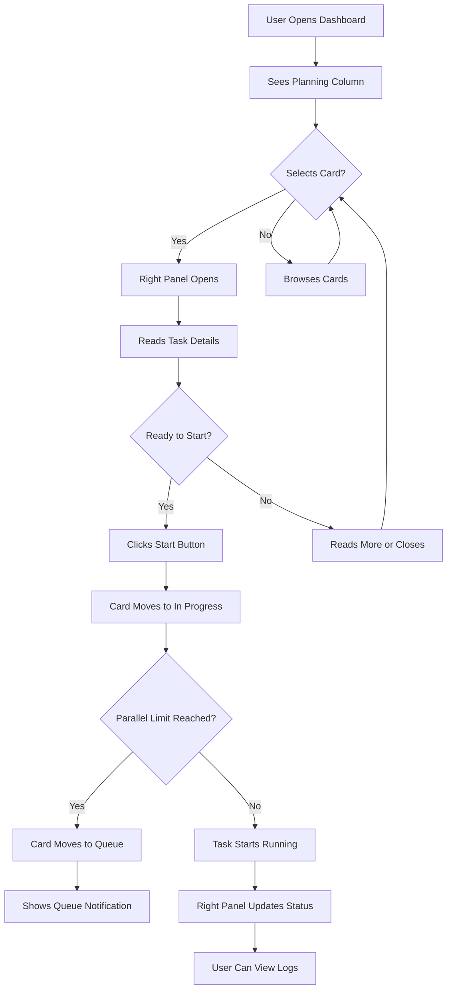

### 2. User Journey - View Task Details

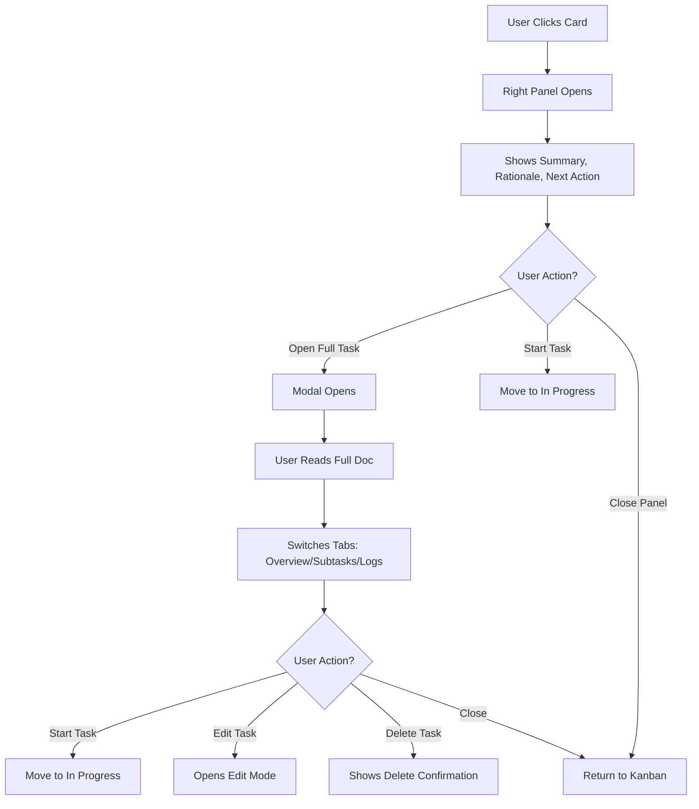

### 3. User Journey - Complete Task Flow

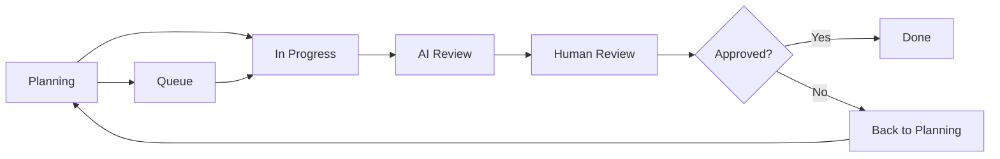

### 4. User Journey - Mobile Experience

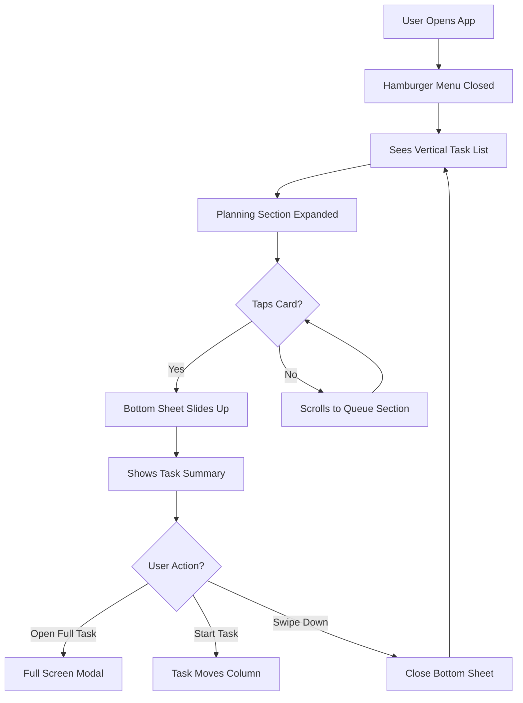

### 5. User Journey - Roadmap View

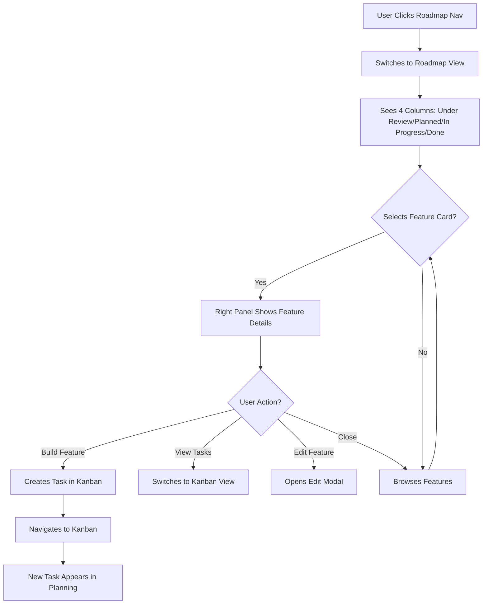

---

## State Machines

### 1. Task State Machine

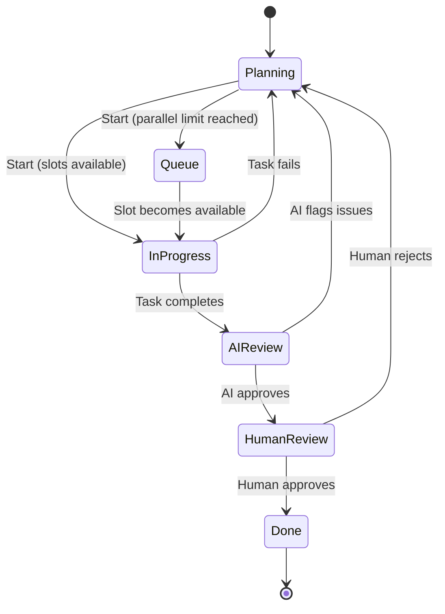

### 2. Right Panel State Machine

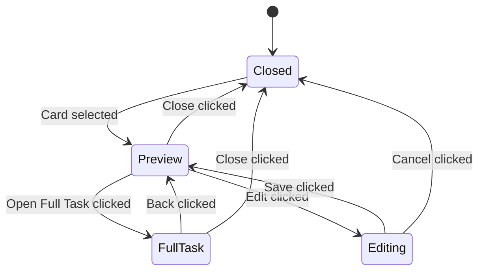

### 3. Card State Machine

```mermaid
stateDiagram-v2
    [*] --> Default
    Default --> Hover: Mouse enters
    Hover --> Default: Mouse leaves
    Hover --> Selected: Click
    Selected --> Dragging: Drag starts
    Dragging --> Selected: Drag ends
    Selected --> Default: Click elsewhere
    Default --> Dragging: Drag starts
```

### 4. Column State Machine

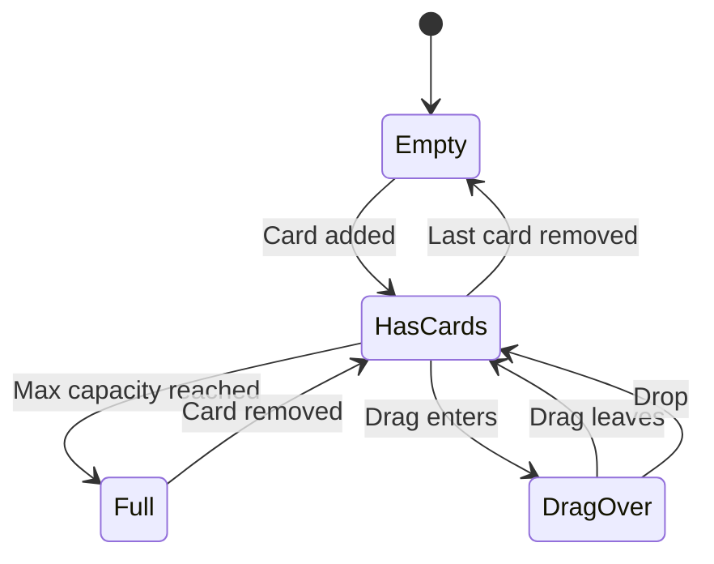

### 5. Queue Management State Machine

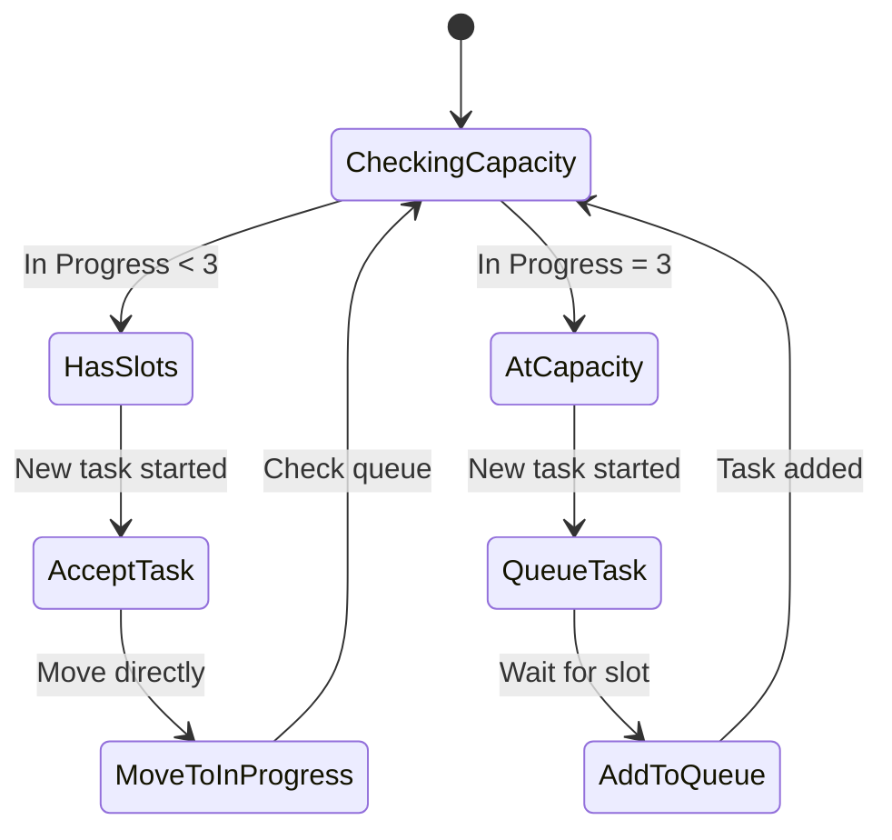

---

## System Architecture

### 1. Component Hierarchy

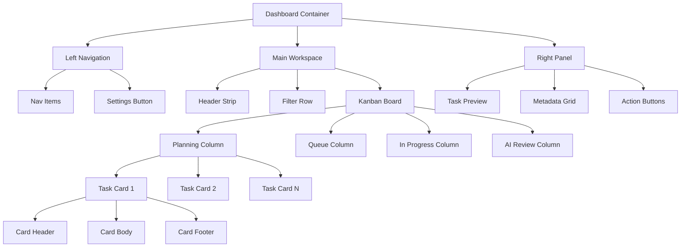

### 2. Data Flow Architecture

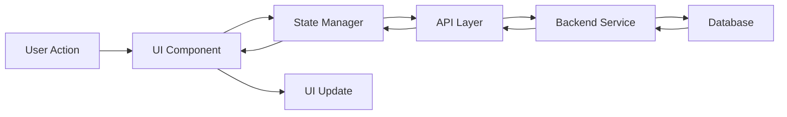

### 3. Mobile Layout Architecture

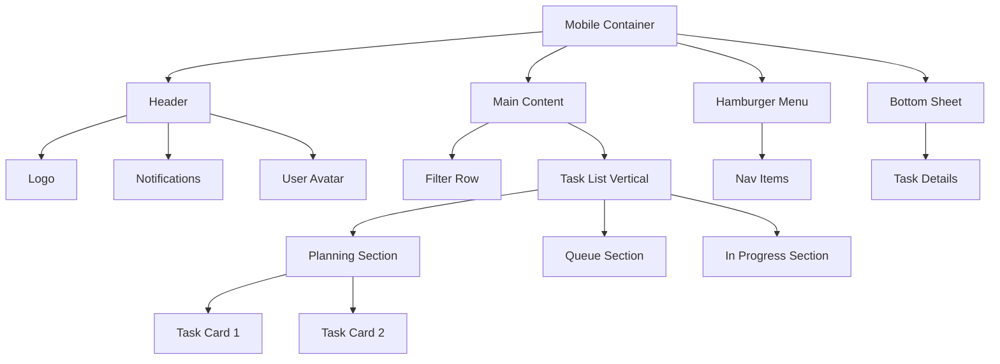

### 4. Responsive Layout Switching

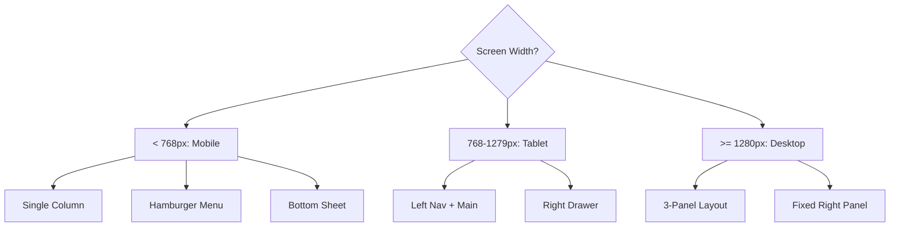

---

## Data Flow Diagrams

### 1. Task Creation Flow

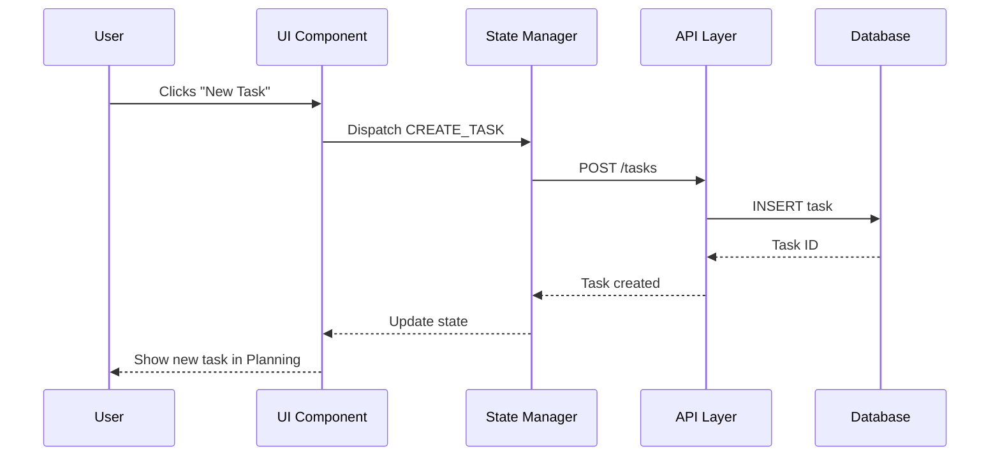

### 2. Drag & Drop Flow

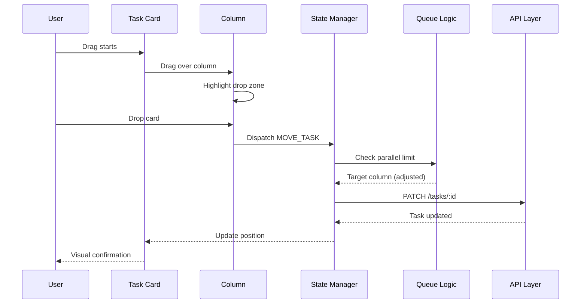

### 3. Queue Management Flow

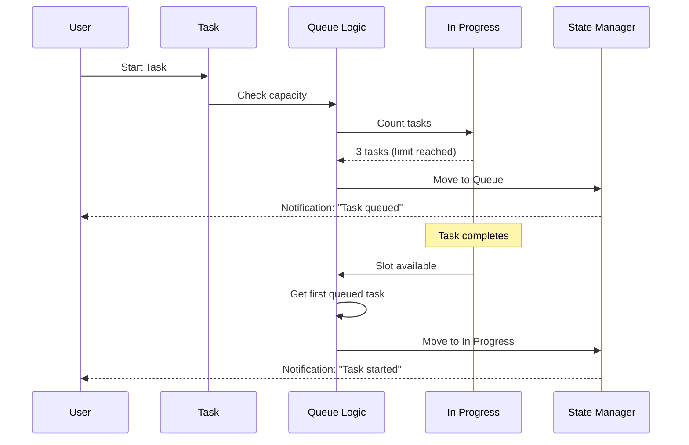

### 4. Right Panel Update Flow

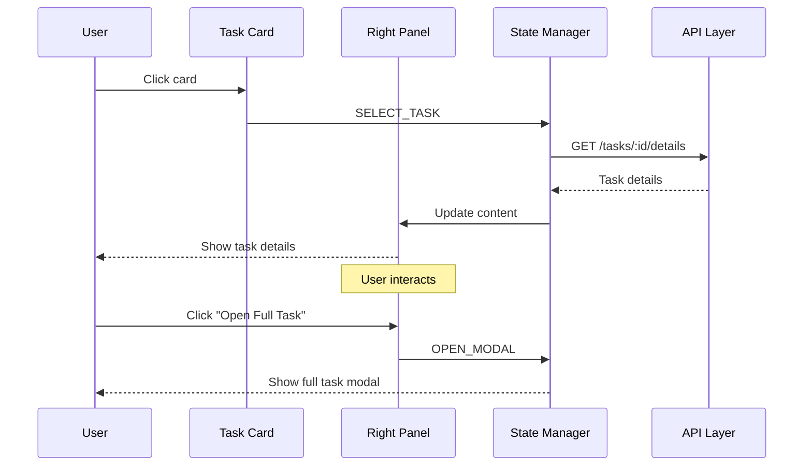

### 5. AI Review Flow

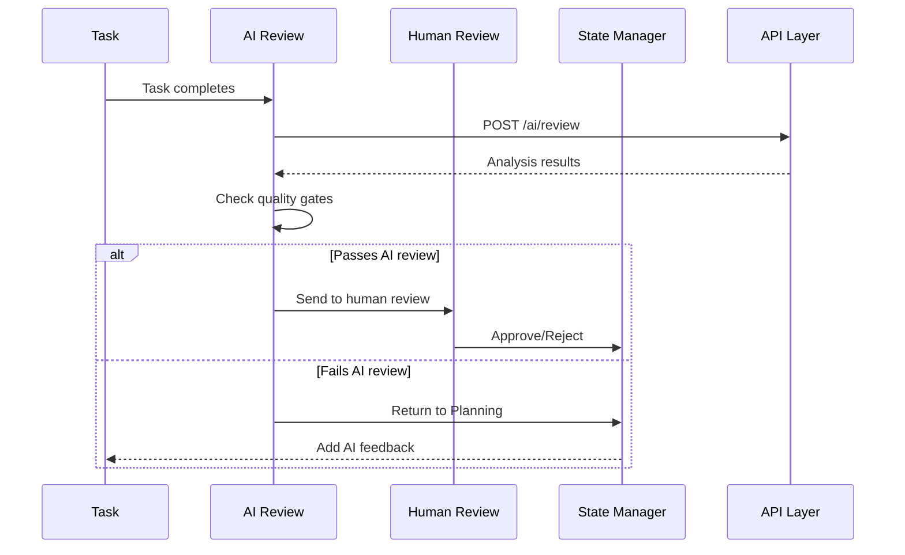

---

## Interaction Sequences

### 1. Start Task Interaction

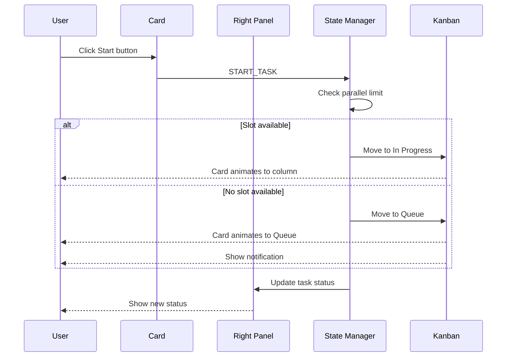

### 2. Filter Tasks Interaction

```mermaid
sequenceDiagram
    participant U as User
    participant F as Filter Dropdown
    participant S as State Manager
    participant K as Kanban

    U->>F: Selects "Phase 1"
    F->>S: FILTER_BY_PHASE
    S->>S: Filter tasks
    S->>K: Update visible cards
    K-->>U: Animate transition
    
    U->>F: Selects "Feature"
    F->>S: FILTER_BY_CATEGORY
    S->>S: Apply additional filter
    S->>K: Update visible cards
    K-->>U: Smooth transition
```

### 3. Mobile Bottom Sheet Interaction

```mermaid
sequenceDiagram
    participant U as User
    participant Card as Task Card
    participant Sheet as Bottom Sheet
    participant Overlay as Dim Overlay

    U->>Card: Tap card
    Card->>Overlay: Show overlay
    Overlay-->>U: Dim background
    Card->>Sheet: Trigger slide up
    Sheet->>Sheet: Animate up (300ms)
    Sheet-->>U: Show task details
    
    alt User swipes down
        U->>Sheet: Swipe down gesture
        Sheet->>Sheet: Animate down (250ms)
        Sheet->>Overlay: Hide overlay
        Overlay-->>U: Remove dim
    else User taps overlay
        U->>Overlay: Tap outside
        Overlay->>Sheet: Close sheet
        Sheet->>Sheet: Animate down
        Overlay-->>U: Remove dim
    end
```

### 4. Responsive Layout Switch

```mermaid
sequenceDiagram
    participant W as Window
    participant D as Dashboard
    participant L as Left Nav
    participant R as Right Panel

    W->>D: Resize to 1200px
    D->>D: Check breakpoint
    
    alt Entering tablet range
        D->>L: Compress to 200px
        D->>R: Convert to drawer
        R-->>D: Slide out
    end
    
    W->>D: Resize to 600px
    D->>D: Check breakpoint
    
    alt Entering mobile range
        D->>L: Hide (hamburger menu)
        D->>R: Convert to bottom sheet
        R-->>D: Move to bottom
    end
```

### 5. Task Edit & Save Flow

```mermaid
sequenceDiagram
    participant U as User
    participant Modal as Task Modal
    participant Form as Edit Form
    participant S as State Manager
    participant API as API Layer

    U->>Modal: Click Edit icon
    Modal->>Form: Enter edit mode
    Form-->>U: Show editable fields
    
    U->>Form: Edit title, description
    Form->>Form: Local state update
    
    U->>Form: Click Save
    Form->>S: SAVE_TASK
    S->>API: PATCH /tasks/:id
    
    alt Save successful
        API-->>S: Task updated
        S->>Modal: Update content
        Modal-->>U: Show success
        Modal->>Form: Exit edit mode
    else Save fails
        API-->>S: Error
        S-->>U: Show error message
        Form-->>U: Keep in edit mode
    end
```

### 6. Real-time Collaboration Flow

```mermaid
sequenceDiagram
    participant U1 as User 1
    participant U2 as User 2
    participant S as State Manager
    participant WS as WebSocket
    participant Server as Server

    U1->>S: Move task to In Progress
    S->>WS: Send update
    WS->>Server: Broadcast task.moved
    Server->>WS: Send to all clients
    WS->>U2: Receive task.moved
    U2->>U2: Update local state
    U2->>U2: Animate card movement
    U2-->>U2: Show notification
```

---

## Workflow Diagrams

### 1. Complete Task Lifecycle

```mermaid
graph TD
    A[Task Created] --> B[Added to Planning]
    B --> C{User Starts Task}
    C -->|Slots Available| D[Move to In Progress]
    C -->|No Slots| E[Move to Queue]
    E --> F[Wait for Slot]
    F --> D
    D --> G[Task Executes]
    G --> H{Task Completes?}
    H -->|Success| I[Move to AI Review]
    H -->|Failure| J[Move to Planning with Error]
    I --> K{AI Approves?}
    K -->|Yes| L[Move to Human Review]
    K -->|No| J
    L --> M{Human Approves?}
    M -->|Yes| N[Move to Done]
    M -->|No| J
    N --> O[Task Archived]
```

### 2. User Navigation Flow

```mermaid
graph TD
    A[Dashboard Home] --> B{Select Module}
    B -->|Kanban| C[Kanban View]
    B -->|Agent Terminals| D[Agent View]
    B -->|Insights| E[Insights View]
    B -->|Roadmap| F[Roadmap View]
    B -->|Settings| G[Settings View]
    C --> H{User Action}
    H -->|View Task| I[Open Right Panel]
    H -->|Start Task| J[Update Task Status]
    H -->|Create Task| K[Open Create Modal]
    F --> L{User Action}
    L -->|View Feature| M[Open Right Panel]
    L -->|Build Feature| N[Create Task in Kanban]
    L -->|Edit Feature| O[Open Edit Modal]
```

### 3. Error Handling Flow

```mermaid
graph TD
    A[User Action] --> B{Action Valid?}
    B -->|Yes| C[Process Action]
    B -->|No| D[Show Validation Error]
    C --> E{API Call Succeeds?}
    E -->|Yes| F[Update UI]
    E -->|No| G[Show Error Message]
    F --> H[Success State]
    G --> I{Retryable Error?}
    I -->|Yes| J[Show Retry Button]
    I -->|No| K[Show Contact Support]
    D --> L[User Corrects Input]
    L --> A
    J --> A
```

### 4. Parallel Task Management

```mermaid
graph TD
    A[Check In Progress Count] --> B{Count < 3?}
    B -->|Yes| C[Accept New Task]
    B -->|No| D[Add to Queue]
    C --> E[Start Task Execution]
    D --> F[Monitor In Progress]
    F --> G{Task Completes}
    G -->|Yes| H[Decrement Count]
    H --> I{Queue Has Tasks?}
    I -->|Yes| J[Get First Queued Task]
    I -->|No| F
    J --> K[Move to In Progress]
    K --> E
```

---

**Status:** Complete Mermaid diagram specification  
**Related Docs:** `/docs/dashboards/auto-startupai.md`, `/docs/dashboards/dash-wireframe.md`
