# Startup Coach - Implementation Plan

> **Feature:** Conversational AI Validation System  
> **Inspired By:** LeanSpark.ai  
> **Phase:** MVP  
> **Priority:** P0  
> **Updated:** 2026-02-04

---

## 🎯 Overall Progress

```
░░░░░░░░░░░░░░░░░░░░░░░░░░░░░░░░░░ 0%

Phase 1: Database & Schema     ░░░░░░░░░░░░░░░░  0%
Phase 2: State Machine         ░░░░░░░░░░░░░░░░  0%
Phase 3: Backend AI Logic      ░░░░░░░░░░░░░░░░  0%
Phase 4: Phase Handlers        ░░░░░░░░░░░░░░░░  0%
Phase 5: Frontend Integration  ░░░░░░░░░░░░░░░░  0%
Phase 6: Testing & Polish      ░░░░░░░░░░░░░░░░  0%
```

**Status:** 0 of 30 tasks completed

---

## 📊 Implementation Summary

| Phase | Tasks | Priority | Dependencies |
|-------|-------|----------|--------------|
| Database & Schema | 5 | P0 | None |
| State Machine | 4 | P0 | Phase 1 |
| Backend AI Logic | 6 | P0 | Phase 1, 2 |
| Phase Handlers | 6 | P0 | Phase 3 |
| Frontend Integration | 6 | P0 | Phase 4, Coach UI (#103) |
| Testing & Polish | 3 | P1 | All phases |

**Total:** 30 tasks

---

## 🏗️ System Architecture


---

## 🔄 Validation State Machine

```mermaid
stateDiagram-v2
    [*] --> Onboarding
    Onboarding --> Assessment: Start validation
    
    Assessment --> Constraint: 7 dimensions scored
    
    Constraint --> CampaignSetup: Bottleneck identified
    
    CampaignSetup --> SprintPlanning: 90-day goal set
    
    SprintPlanning --> SprintExecution: Plan created
    
    SprintExecution --> SprintPlanning: Next sprint (1-5)
    SprintExecution --> CycleReview: All sprints done
    
    CycleReview --> Assessment: Persevere (reassess)
    CycleReview --> CampaignSetup: Pivot (new constraint)
    CycleReview --> [*]: Pause
    
    note right of Assessment
        Score 7 dimensions:
        - Clarity
        - Desirability
        - Viability
        - Feasibility
        - Defensibility
        - Timing
        - Mission
    end note
    
    note right of Constraint
        Find #1 bottleneck:
        - Acquisition
        - Monetization
        - Retention
        - Scalability
    end note
    
    note right of SprintExecution
        PDCA Loop:
        Plan → Do → Check → Act
        Repeat 5 times
    end note
```



---

## 📋 Database Schema


---

## 💬 Conversation Flow


---

## 🎭 Coach Persona System


---

## 📊 Component Summary Table

| # | Component | Priority | Status | Complexity | Est. Time |
|---|-----------|----------|--------|------------|-----------|
| **PHASE 1: DATABASE & SCHEMA** |
| 1 | Create validation_sessions table | P0 | 🔴 Todo | Low | 20 min |
| 2 | Create validation_conversations table | P0 | 🔴 Todo | Low | 15 min |
| 3 | Create validation_assessments table | P0 | 🔴 Todo | Low | 15 min |
| 4 | Create validation_campaigns + sprints tables | P0 | 🔴 Todo | Medium | 30 min |
| 5 | Set up RLS policies for all tables | P0 | 🔴 Todo | Medium | 40 min |
| **PHASE 2: STATE MACHINE** |
| 6 | Define state types and interfaces | P0 | 🔴 Todo | Medium | 30 min |
| 7 | Implement phase transition logic | P0 | 🔴 Todo | High | 60 min |
| 8 | Create state validation functions | P0 | 🔴 Todo | Medium | 40 min |
| 9 | Build progress calculation logic | P0 | 🔴 Todo | Medium | 30 min |
| **PHASE 3: BACKEND AI LOGIC** |
| 10 | Extend ai-chat with coach mode routing | P0 | 🔴 Todo | Medium | 45 min |
| 11 | Build context loader (full memory) | P0 | 🔴 Todo | High | 90 min |
| 12 | Create base coach persona system | P0 | 🔴 Todo | Medium | 60 min |
| 13 | Add industry-specific expertise | P0 | 🔴 Todo | Medium | 45 min |
| 14 | Implement conversation parser | P0 | 🔴 Todo | Medium | 40 min |
| 15 | Build suggested actions generator | P0 | 🔴 Todo | Medium | 30 min |
| **PHASE 4: PHASE HANDLERS** |
| 16 | Onboarding phase handler | P0 | 🔴 Todo | Medium | 60 min |
| 17 | Assessment phase handler | P0 | 🔴 Todo | High | 90 min |
| 18 | Constraint phase handler | P0 | 🔴 Todo | High | 75 min |
| 19 | Campaign setup phase handler | P0 | 🔴 Todo | High | 90 min |
| 20 | Sprint planning phase handler | P0 | 🔴 Todo | High | 90 min |
| 21 | Sprint execution (PDCA) phase handler | P0 | 🔴 Todo | High | 120 min |
| **PHASE 5: FRONTEND INTEGRATION** |
| 22 | Connect coach panel to backend API | P0 | 🔴 Todo | Medium | 45 min |
| 23 | Implement phase progress display | P0 | 🔴 Todo | Medium | 40 min |
| 24 | Build quick actions interaction | P0 | 🔴 Todo | Low | 30 min |
| 25 | Add session state persistence | P0 | 🔴 Todo | Medium | 35 min |
| 26 | Sync validator data with coach context | P0 | 🔴 Todo | High | 60 min |
| 27 | Handle phase transitions in UI | P0 | 🔴 Todo | Medium | 45 min |
| **PHASE 6: TESTING & POLISH** |
| 28 | End-to-end conversation testing | P1 | 🔴 Todo | High | 120 min |
| 29 | Edge case handling (errors, timeouts) | P1 | 🔴 Todo | Medium | 60 min |
| 30 | Performance optimization | P1 | 🔴 Todo | Medium | 45 min |

**Totals:**
- 🟢 Completed: 0 tasks (0%)
- 🟡 In Progress: 0 tasks (0%)
- 🔴 Todo: 30 tasks (100%)

---

## 🚀 Implementation Prompts

### PHASE 1: Database & Schema

#### 🔴 1. Create validation_sessions Table
**Status:** 🔴 Todo  
**Prompt:**
```
Create validation_sessions table to track coach sessions:

Fields:
- id: UUID primary key
- startup_id: Foreign key to startups (cascade delete)
- state: JSONB storing current phase, scores, constraint, campaign, sprint info
- is_active: Boolean (only one active session per startup)
- created_at, updated_at: Timestamps

Constraints:
- UNIQUE(startup_id, is_active) WHERE is_active = true
- Index on startup_id for fast lookups

Default state:
- phase: "onboarding"
- assessmentProgress: 0
- currentSprint: null
```

---

#### 🔴 2. Create validation_conversations Table
**Status:** 🔴 Todo  
**Prompt:**
```
Create validation_conversations table for chat history:

Fields:
- id: UUID primary key
- session_id: Foreign key to validation_sessions (cascade delete)
- role: Text (user | assistant | system)
- content: Text (message content)
- phase: Text (which validation phase)
- created_at: Timestamp

Index on session_id for conversation retrieval
Enable chronological ordering with created_at
```

---

#### 🔴 3. Create validation_assessments Table
**Status:** 🔴 Todo  
**Prompt:**
```
Create validation_assessments table for dimension scores:

Fields:
- id: UUID primary key
- session_id: Foreign key to validation_sessions
- dimension: Text (clarity | desirability | viability | feasibility | defensibility | timing | mission)
- score: Integer CHECK (score BETWEEN 0 AND 10)
- feedback: Text (coach's assessment notes)
- assessed_at: Timestamp

Track score changes over time
Index on session_id + dimension for history queries
```

---

#### 🔴 4. Create Campaigns & Sprints Tables
**Status:** 🔴 Todo  
**Prompt:**
```
Create validation_campaigns table:
- id, session_id, constraint_type, campaign_type, goal
- start_date, end_date, status
- Tracks 90-day campaigns

Create validation_sprints table:
- id, campaign_id, sprint_number (1-5)
- purpose, pdca_step (plan | do | check | act)
- outcomes (JSONB), started_at, completed_at

Create validation_experiments table:
- id, sprint_id, hypothesis, method, success_criteria
- result, learning, status

Link: campaigns → sprints → experiments
```

---

#### 🔴 5. Set Up RLS Policies
**Status:** 🔴 Todo  
**Prompt:**
```
Enable Row Level Security on all validation tables:

Policy: "Users can only access own startup validation data"
- SELECT, INSERT, UPDATE, DELETE allowed WHERE startup_id matches auth.uid() startups

Apply to:
- validation_sessions
- validation_conversations
- validation_assessments
- validation_campaigns
- validation_sprints
- validation_experiments

Test with authenticated user to verify isolation
```

---

### PHASE 2: State Machine

#### 🔴 6. Define State Types
**Status:** 🔴 Todo  
**Prompt:**
```
Create TypeScript interfaces for validation state:

ValidationState interface with:
- phase: enum of 7 phases
- assessmentScores: Record of 7 dimensions → scores
- assessmentProgress: number (0-7)
- constraint: acquisition | monetization | retention | scalability
- campaignType: string
- goal90Day: string
- currentSprint: number (0-5)
- pdcaStep: plan | do | check | act
- sprintResults: array
- cycleDecisions: array

Dimension type: 7 validation dimensions
Phase type: onboarding → assessment → constraint → campaign_setup → sprint_planning → sprint_execution → cycle_review
```

---

#### 🔴 7. Implement Phase Transitions
**Status:** 🔴 Todo  
**Prompt:**
```
Build phase transition logic:

Define valid transitions:
- onboarding → assessment
- assessment → constraint (when 7 scores complete)
- constraint → campaign_setup (when bottleneck identified)
- campaign_setup → sprint_planning (when goal set)
- sprint_planning → sprint_execution
- sprint_execution → sprint_planning (next sprint) OR cycle_review (after sprint 5)
- cycle_review → assessment (persevere) OR campaign_setup (pivot) OR end (pause)

Create validateTransition function:
- Check current phase
- Verify required data exists
- Return true/false + error message

Create transitionPhase function:
- Validate transition
- Update session state
- Save to database
- Return new state
```

---

#### 🔴 8. State Validation Functions
**Status:** 🔴 Todo  
**Prompt:**
```
Create validation functions for state integrity:

isAssessmentComplete:
- Check all 7 dimensions have scores
- Return boolean

isConstraintIdentified:
- Check constraint field is set
- Validate it's one of 4 types
- Return boolean

isCampaignReady:
- Check goal is set
- Check dates are valid
- Return boolean

canStartSprint:
- Check campaign exists
- Check not already at sprint 5
- Return boolean

validatePDCAStep:
- Check current step matches sprint progress
- Ensure do follows plan, check follows do, etc.
- Return boolean
```

---

#### 🔴 9. Progress Calculation
**Status:** 🔴 Todo  
**Prompt:**
```
Build progress tracking functions:

calculateOverallProgress:
- Weight each phase (onboarding 5%, assessment 15%, constraint 10%, campaign 10%, sprints 50%, review 10%)
- Return 0-100 percentage

calculatePhaseProgress:
- Onboarding: 100% when first message sent
- Assessment: (dimensions scored / 7) × 100
- Constraint: 0% or 100%
- Campaign: 0% or 100%
- Sprint: (current sprint / 5) × 100 + (pdca step / 4) × 20
- Review: 0% or 100%

getCurrentMilestone:
- Return human-readable current step
- Examples: "Assessing Problem fit", "Sprint 2: Customer interviews", "90-day review"
```

---

### PHASE 3: Backend AI Logic

#### 🔴 10. Extend ai-chat with Coach Mode
**Status:** 🔴 Todo  
**Prompt:**
```
Modify ai-chat edge function to detect and route coach mode:

Detection logic:
- Check if request includes mode: "coach"
- OR check if startup has active validation session

Routing:
- If coach mode → call handleCoachMode
- Else → existing general chat logic

handleCoachMode function:
- Load validation context
- Get or create session
- Build coach prompts
- Call AI with context
- Parse response
- Update state if needed
- Save conversation
- Return structured response

Response format:
- message: AI reply text
- phase: current validation phase
- progress: percentage + milestone
- suggestedActions: array of quick action buttons
- stateUpdate: optional phase transition
```

---

#### 🔴 11. Build Context Loader
**Status:** 🔴 Todo  
**Prompt:**
```
Create comprehensive context loader:

Load in parallel:
- Startup profile (name, industry, description)
- Lean canvas (all 9 blocks)
- Traction data (metrics, customers, revenue)
- Active validation session (state, progress)
- Assessment history (all dimension scores over time)
- Active campaign (if exists)
- Current sprint (if in progress)
- Recent conversations (last 10 messages for continuity)

Format into AI-readable context:
- Structured summaries
- Key metrics highlighted
- Recent changes noted
- Missing data flagged

Return comprehensive context object for prompt building
```

---

#### 🔴 12. Create Base Coach Persona
**Status:** 🔴 Todo  
**Prompt:**
```
Build base coach persona system prompt:

Core identity:
- World-class startup coach
- Leading industry expert
- Warm, supportive mentor tone

Expertise:
- Helped hundreds of founders
- Recognizes patterns
- Connects dots across journey
- Perfect memory of project history

Communication style:
- Warm but direct
- Use "we" language
- Celebrate wins naturally
- Normalize struggles
- One question at a time
- Always end with clear next step
- Reference past context

Authority approach:
- Confident expert (not tentative)
- Challenge weak thinking kindly
- Share specific patterns
- Give industry benchmarks

Never:
- Say "As an AI..."
- Use unexplained jargon
- Ask multiple questions at once
- Give generic advice when specific data exists

Always:
- Speak as human coach
- Make complex concepts approachable
- Reference their specific data
- Be the $500/hr expert they're getting free
```

---

#### 🔴 13. Add Industry-Specific Expertise
**Status:** 🔴 Todo  
**Prompt:**
```
Create industry expert personas:

SaaS Expert:
- Think in MRR, churn, CAC, LTV, NRR
- Know benchmarks: <5% churn, 3:1 LTV:CAC
- Reference: Salesforce, HubSpot, Slack patterns
- Understand PLG vs sales-led

Marketplace Expert:
- Think in liquidity, take rate, GMV
- Know chicken-and-egg solutions
- Reference: Airbnb, Uber, DoorDash patterns
- Understand supply vs demand constraints

Fintech Expert:
- Know compliance, unit economics, trust
- Understand regulatory moats
- Reference: Stripe, Plaid, Chime patterns
- Know when to partner vs build

Healthtech Expert:
- Know HIPAA, reimbursement, clinical validation
- Understand B2B2C, payer dynamics
- Reference: Oscar, Livongo, Ro patterns
- Regulatory as competitive moat

E-commerce Expert:
- Think in AOV, repeat rate, ROAS
- Know DTC vs marketplace tradeoffs
- Reference: Warby Parker, Dollar Shave Club patterns
- Understand fulfillment economics

General Expert:
- Broad pattern recognition
- Adapt frameworks to specific model
- Know when playbooks apply vs don't

Detection: Match startup.industry to expert persona
```

---

#### 🔴 14. Implement Conversation Parser
**Status:** 🔴 Todo  
**Prompt:**
```
Build response parser to extract structured data from AI output:

Parse for:
- State transitions (detect phase change signals)
- Score assignments (dimension: X/10)
- Constraint identification (acquisition | monetization | retention | scalability)
- Goal setting (90-day objective)
- Suggested actions (quick reply buttons)

Use regex or structured prompting:
- Ask AI to include markers like [SCORE:clarity=8]
- Or use JSON mode for structured output
- Extract and validate

Return parsed object:
- reply: clean message text
- stateUpdate: phase + data changes
- suggestedActions: array of 2-4 actions
- metadata: scores, decisions, flags
```

---

#### 🔴 15. Build Suggested Actions Generator
**Status:** 🔴 Todo  
**Prompt:**
```
Create context-aware quick action system:

Based on current phase, generate 2-4 action buttons:

Onboarding:
- [Tell me more about you]
- [I have a question first]
- [Let's get started]

Assessment:
- [Yes, that's accurate]
- [Not quite - let me clarify]
- [I need to think about this]

Constraint:
- [Yes, let's tackle acquisition]
- [Show me the full breakdown]
- [I disagree - here's why]

Campaign:
- [Yes, let's plan the 90 days]
- [What campaigns have worked for others?]
- [I have a different goal in mind]

Sprint:
- [Done - here's what I learned]
- [Still in progress]
- [I'm stuck - need help]

Review:
- [Persevere - let's keep going]
- [Pivot - change strategy]
- [Pause for now]

Actions should:
- Be contextual to conversation
- Reduce typing burden
- Keep momentum going
```

---

### PHASE 4: Phase Handlers

#### 🔴 16. Onboarding Phase Handler
**Status:** 🔴 Todo  
**Prompt:**
```
Create onboarding conversation flow:

Goal: Warm introduction + understand what they're building

Step 1: Welcome
- Introduce coach role
- Set expectations (journey guide, not just Q&A)
- Warm, friendly tone

Step 2: What are you building?
- Ask for simple explanation
- Accept any format (sentence, paragraph, idea)
- Don't judge or critique yet

Step 3: Current stage check
- Just exploring | Building but no customers | Have early customers
- Multiple choice for easy response

Step 4: Transition to assessment
- Explain what assessment is
- Why it matters
- Set expectation: 7 quick questions
- Transition state to "assessment"

Handler prompt template:
- Include full startup context
- Reference any existing canvas data
- Use industry-appropriate language
- End with clear next step
```

---

#### 🔴 17. Assessment Phase Handler
**Status:** 🔴 Todo  
**Prompt:**
```
Create assessment conversation flow:

Goal: Score 7 dimensions to understand foundation strength

Dimensions to assess:
1. Clarity: Can they explain the problem/solution clearly?
2. Desirability: Do customers want this?
3. Viability: Can it make money?
4. Feasibility: Can they build it?
5. Defensibility: What's the moat?
6. Timing: Is now the right time?
7. Mission: Why them, why this?

For each dimension:
- Ask open-ended question
- Listen to response
- Score internally (0-10)
- Give brief feedback
- Move to next

Progress indicator: "3/7 dimensions assessed"

When all 7 complete:
- Summarize overall score
- Highlight strengths (8-10)
- Flag concerns (0-5)
- Transition to constraint identification

Handler should:
- Track which dimensions assessed
- Save scores to database
- Show empathy for struggles
- Celebrate strong areas
- Ask follow-up if answer unclear
```

---

#### 🔴 18. Constraint Phase Handler
**Status:** 🔴 Todo  
**Prompt:**
```
Create constraint identification flow:

Goal: Find the #1 bottleneck blocking progress

Analysis based on:
- Assessment scores (which dimension weakest?)
- Traction data (customers? revenue? retention?)
- Current stage (idea? MVP? scaling?)

Four possible constraints:
1. Acquisition: No customers / can't find them
2. Monetization: Customers won't pay / pricing unclear
3. Retention: Customers leave / low engagement
4. Scalability: Operations don't scale / margin issues

Conversation flow:
- Present diagnosis clearly
- Explain why this is the bottleneck
- Give context (industry benchmarks, patterns)
- Validate with founder
- Handle objections if they disagree

Example:
"I've analyzed your scores and traction. Here's what I see:
You have zero paying customers. Everything else - the product ideas,
the business model - none of it matters until we solve acquisition.
This is your constraint. Agree?"

When constraint confirmed:
- Save to session state
- Transition to campaign_setup
- Explain next step: 90-day focused plan

Handler should:
- Use assessment + traction data
- Be direct but supportive
- Reference industry expertise
- Allow push-back
```

---

#### 🔴 19. Campaign Setup Phase Handler
**Status:** 🔴 Todo  
**Prompt:**
```
Create 90-day campaign planning flow:

Goal: Define focused campaign to address constraint

Campaign types by constraint:
- Acquisition: Mafia Offer | Demo-Sell-Build | Content-Led Growth
- Monetization: Pricing Experiment | Value Ladder | Packaging Test
- Retention: Onboarding Overhaul | Engagement Loop | Win-Back Campaign
- Scalability: Process Automation | Margin Improvement | Platform Migration

Conversation flow:
- Present 2-3 campaign options for their constraint
- Explain each with examples
- Ask which resonates
- Define specific 90-day goal (measurable)

Example goals:
- "0 → 20 paying customers at $99/mo"
- "Increase retention from 40% → 70%"
- "Validate $199 price point with 10 customers"

Goal criteria: SMART
- Specific: What exactly?
- Measurable: How to track?
- Achievable: Realistic in 90 days?
- Relevant: Addresses constraint?
- Time-bound: 90 days

When goal set:
- Create campaign record in database
- Set start/end dates
- Transition to sprint_planning
- Explain sprint structure (5 × 2-week sprints)

Handler should:
- Know campaign patterns by industry
- Give realistic goal ranges
- Challenge if goal too vague or ambitious
```

---

#### 🔴 20. Sprint Planning Phase Handler
**Status:** 🔴 Todo  
**Prompt:**
```
Create sprint planning flow:

Goal: Plan next 2-week sprint using PDCA

PDCA framework:
- Plan: What will you do? What's the hypothesis?
- Do: Execute the plan
- Check: What did you learn?
- Act: What changes based on learning?

Sprint planning conversation:
- Review 90-day goal
- Ask: What should we focus on in next 2 weeks?
- Help narrow to 1-3 specific experiments
- Define success criteria

Example experiments:
- "Interview 5 target customers"
- "Run Facebook ad to test messaging"
- "Build landing page and collect 20 emails"

For each experiment:
- Hypothesis: "I believe [doing X] will result in [Y] because [Z]"
- Method: How exactly will you do it?
- Success criteria: What result = success?

When plan complete:
- Create sprint record
- Set pdca_step to "plan"
- Transition to sprint_execution
- Set reminder for check-in (7 days)

Handler should:
- Keep experiments small and focused
- Push for specificity
- Ensure measurable outcomes
- Reference industry tactics
```

---

#### 🔴 21. Sprint Execution Phase Handler
**Status:** 🔴 Todo  
**Prompt:**
```
Create sprint execution (PDCA) flow:

Goal: Guide through Do → Check → Act cycle

DO phase:
- Check-in: How's execution going?
- Offer encouragement
- Help remove blockers
- Keep them accountable

CHECK phase (after 2 weeks):
- What did you learn?
- Did you hit success criteria?
- What surprised you?
- Record results in database

ACT phase:
- Based on learning, what changes?
- Persevere with plan?
- Pivot approach?
- Scale what worked?

After Act:
- If sprint 1-4: Transition back to sprint_planning for next sprint
- If sprint 5: Transition to cycle_review

Conversation examples:
- "Week 1 check-in: How many interviews have you done so far?"
- "That's great learning! Even negative results tell us something."
- "Based on this, should we adjust the approach for Sprint 2?"

Handler should:
- Track PDCA progression
- Celebrate small wins
- Normalize failures as learning
- Keep momentum going
- Save all learnings to database
```

---

### PHASE 5: Frontend Integration

#### 🔴 22. Connect Coach Panel to Backend
**Status:** 🔴 Todo  
**Prompt:**
```
Wire coach panel UI to backend API:

API endpoint: POST /functions/v1/ai-chat
Request body:
- message: user's text
- startupId: current startup
- mode: "coach"

Response handling:
- message: display in chat
- phase: update progress indicator
- progress: update percentage bar
- suggestedActions: render as quick action buttons

Error handling:
- Network timeout: show retry button
- 500 error: show friendly message
- Session expired: redirect to create new

Loading states:
- Disable input while sending
- Show typing indicator while waiting
- Optimistic UI: add user message immediately

Real-time updates:
- Consider WebSocket for streaming responses
- Or long-polling for phase updates
```

---

#### 🔴 23. Implement Phase Progress Display
**Status:** 🔴 Todo  
**Prompt:**
```
Build phase progress visualization in coach panel:

Visual stepper showing 5 main phases:
1. Assessment (Discovery)
2. Constraint (Bottleneck)
3. Campaign (90-day plan)
4. Sprint (Execution)
5. Review (Results)

Display:
- Current phase highlighted in emerald
- Completed phases: checkmark icon
- Pending phases: gray circle
- Lines connecting phases

Data source:
- session.state.phase
- session.state.progress

Updates:
- Animate transition when phase changes
- Show celebration animation on completion
- Update percentage bar below stepper

Example:
━━●━━○━━○━━○━━○
Assessment → Constraint → Campaign → Sprint → Review
     ✓          [78%]        ○         ○        ○
```

---

#### 🔴 24. Build Quick Actions Interaction
**Status:** 🔴 Todo  
**Prompt:**
```
Implement quick action buttons below coach messages:

Render:
- Show 2-4 buttons from suggestedActions array
- Vertical stack, full width
- Emerald outline style
- Left-aligned text

Behavior:
- Click sends action as user message
- Disable all actions during send
- Remove actions after click
- Show loading state

Accessibility:
- Keyboard navigable
- Screen reader friendly
- Focus visible

Example actions by phase:
- Onboarding: [Let's get started] [I have questions]
- Assessment: [Yes, that's right] [Not quite]
- Campaign: [Yes, let's plan it] [Show examples]
- Sprint: [Done!] [Still working] [I'm stuck]

Actions disappear when:
- User types custom message
- New coach message arrives
- Phase changes
```

---

#### 🔴 25. Add Session State Persistence
**Status:** 🔴 Todo  
**Prompt:**
```
Persist coach session state across page reloads:

Save to sessionStorage:
- session.id
- session.state (current phase, scores, etc.)
- messages (conversation history)
- progress (percentage, milestone)

Save on:
- Every message send/receive
- Phase transition
- Score update

Restore on:
- Page load
- Navigation back to validator
- Browser refresh

Clear on:
- Logout
- Session end
- Manual clear

Handle edge cases:
- Stale session (> 7 days old): create new
- Corrupted data: reset to fresh
- Multiple tabs: sync via storage events
```

---

#### 🔴 26. Sync Validator Data with Coach
**Status:** 🔴 Todo  
**Prompt:**
```
Connect main validator panel with coach context:

Real-time sync:
- When coach assigns score → update Evidence block
- When coach identifies constraint → highlight in Concerns
- When coach sets goal → update Sprint Progress bar

Visual feedback:
- Animate score change (0 → 8/10)
- Highlight updated blocks with emerald glow
- Scroll to relevant section when referenced

Click-to-explain:
- User clicks "Concerns: No customers" in main panel
- Coach panel receives context and explains
- Coach says: "Right - this is why acquisition is your constraint..."

Data flow:
- Coach updates session state in database
- Frontend polls or uses WebSocket for updates
- Main panel reacts to state changes
- Keep both panels in sync

Example:
COACH: "Your Clarity score is 8/10"
→ Main panel: Clarity block animates from ? to 8/10 with celebration
```

---

#### 🔴 27. Handle Phase Transitions in UI
**Status:** 🔴 Todo  
**Prompt:**
```
Create smooth phase transition experience:

When phase changes:
1. Update progress stepper (move to next phase)
2. Animate percentage bar increase
3. Show brief celebration toast
4. Update milestone text
5. Scroll coach to top
6. Reset input focus

Celebration animations:
- Confetti on major milestones (assessment done, campaign set)
- Checkmark animation on phase completion
- Color transition (yellow → emerald)

State updates:
- Listen for phase field change in response
- Update local state immediately
- Persist to sessionStorage
- Trigger UI animations

Handle backwards transitions (pivot):
- Show different animation (reverse arrow)
- Update progress backwards
- Clear dependent data (e.g., sprints if pivoting)

Accessibility:
- Announce phase change to screen reader
- Maintain keyboard focus
- Reduced motion option
```

---

### PHASE 6: Testing & Polish

#### 🔴 28. End-to-End Conversation Testing
**Status:** 🔴 Todo  
**Prompt:**
```
Test full validation journey:

Test path 1: First-time founder (no data)
- Start onboarding
- Complete assessment (all 7 dimensions)
- Identify constraint
- Set 90-day campaign
- Plan Sprint 1
- Execute PDCA
- Verify data saved at each step

Test path 2: Returning founder (has canvas)
- Context loader pulls canvas
- Coach references existing data
- Assessment uses canvas to inform scores
- Verify continuity

Test path 3: Multi-sprint journey
- Complete Sprint 1
- Plan Sprint 2
- Track progress correctly
- Verify sprint history saved

Edge cases:
- Incomplete assessment (only 4/7 dimensions)
- Disagreement on constraint
- Changing goal mid-campaign
- Pausing and resuming session

Verification:
- Database records match UI state
- Conversation history complete
- Phase transitions logged
- Progress calculations correct
```

---

#### 🔴 29. Edge Case Handling
**Status:** 🔴 Todo  
**Prompt:**
```
Handle error scenarios gracefully:

Network errors:
- Timeout after 30 seconds
- Show retry button
- Save message locally
- Resend when online

AI errors:
- Rate limit: show "Coach is busy, try again in 1 min"
- Invalid response: fallback to general chat
- Context load failure: degrade gracefully

Session errors:
- No active session: create new automatically
- Expired session: archive and create new
- Corrupted state: reset to last valid state

User errors:
- Empty message: disable send button
- Too long message (>1000 chars): show warning
- Rapid-fire messages: throttle to prevent spam

Data errors:
- Missing startup: redirect to create startup
- Missing canvas: coach adapts questions
- Invalid phase: reset to onboarding

Logging:
- Track all errors with context
- Alert on critical failures
- Monitor session abandonment rate
```

---

#### 🔴 30. Performance Optimization
**Status:** 🔴 Todo  
**Prompt:**
```
Optimize for speed and reliability:

Backend:
- Cache startup context (5 min TTL)
- Parallel database queries
- Connection pooling
- Response streaming for long messages

Frontend:
- Lazy load coach panel (code splitting)
- Virtualize long message lists
- Debounce typing indicators
- Optimize re-renders with React.memo

AI calls:
- Set max_tokens appropriately per phase
- Use lower temperature for structured output
- Cache common responses (onboarding intro)
- Implement retry with exponential backoff

Database:
- Index frequently queried fields
- Limit conversation history queries (last 10)
- Batch state updates
- Use JSONB operators efficiently

Monitoring:
- Track API response times
- Monitor AI token usage
- Alert on slow queries
- Measure message send latency

Target metrics:
- Message response: < 3 seconds
- Panel load: < 1 second
- Phase transition: < 500ms
- Mobile performance: 60fps
```

---

## 📅 Implementation Timeline

### Week 1: Foundation
- Database schema + RLS (Phase 1: #1-5)
- State machine types (Phase 2: #6-9)
- Backend routing setup (Phase 3: #10)

### Week 2: AI Core
- Context loader (Phase 3: #11)
- Coach persona (Phase 3: #12-15)
- Onboarding + Assessment handlers (Phase 4: #16-17)

### Week 3: Campaign System
- Constraint handler (Phase 4: #18)
- Campaign setup handler (Phase 4: #19)
- Sprint planning handler (Phase 4: #20)
- Sprint execution handler (Phase 4: #21)

### Week 4: Frontend Integration
- Connect API (Phase 5: #22)
- Progress display (Phase 5: #23-24)
- State persistence (Phase 5: #25-27)

### Week 5: Testing & Polish
- E2E testing (Phase 6: #28)
- Edge cases (Phase 6: #29)
- Performance (Phase 6: #30)

---

## ✅ Acceptance Criteria

### Database
- [ ] All 6 tables created with proper relationships
- [ ] RLS policies prevent cross-startup data access
- [ ] Indexes optimize common queries
- [ ] Migration runs without errors

### State Machine
- [ ] All 7 phases transition correctly
- [ ] State validation prevents invalid transitions
- [ ] Progress calculation accurate
- [ ] History tracking works

### AI Backend
- [ ] Coach mode routes properly
- [ ] Context loader fetches all data
- [ ] Persona adapts to industry
- [ ] Phase handlers guide conversation
- [ ] Responses within 3 seconds

### Frontend
- [ ] Coach panel displays messages
- [ ] Progress stepper updates on phase change
- [ ] Quick actions send messages
- [ ] Session persists across reloads
- [ ] Main panel syncs with coach updates

### User Experience
- [ ] Onboarding → Review flow works end-to-end
- [ ] Conversations feel natural (not robotic)
- [ ] Coach remembers context from earlier messages
- [ ] Industry expertise shows in responses
- [ ] Mobile responsive and performant

---

## 🎯 Success Metrics

**Engagement:**
- 60%+ complete assessment phase
- 40%+ return within 7 days
- 50%+ complete Sprint 1
- Average 10+ messages per session

**Quality:**
- 4.5/5 coach helpfulness rating
- <10% error rate
- <3s response time
- <5% session abandonment

**Business:**
- 30%+ activate coach mode
- 20%+ complete 90-day campaign
- 15%+ invite team members
- 70%+ would recommend

---

## 📚 References

**Design:**
- `/docs/features/02-coach.md` - Coach UI implementation plan
- `/tasks/plan/2026-02-04-startup-coach-design.md` - Full design doc
- `/tasks/leanspark/leansparkai-summary.md` - LeanSpark inspiration

**Code:**
- `/supabase/functions/ai-chat/` - Extend for coach mode
- `/src/pages/Validator.tsx` - 3-panel layout base
- `/docs/features/01-validator-implementation-plan.md` - Validator UI

---

**Last Updated:** 2026-02-04  
**Document Version:** 1.0  
**Owner:** StartupAI Product Team
