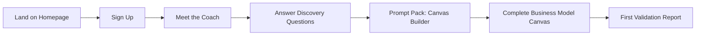
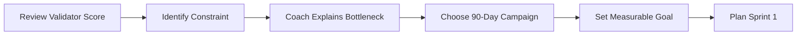
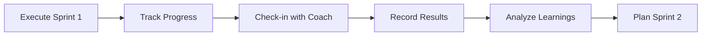
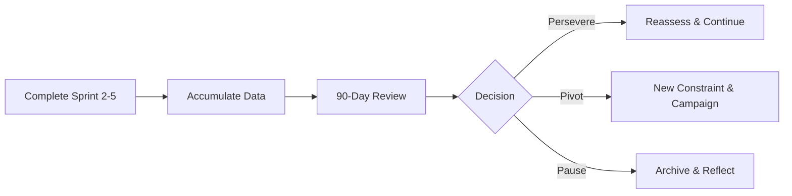

# StartupAI - Product Requirements Document

> **Version:** 1.0  
> **Status:** Draft  
> **Last Updated:** 2026-02-04  
> **Owner:** Product Team

---

## 📋 Executive Summary

**Product Name:** StartupAI  
**Tagline:** From strategy to daily execution, in one guided flow  
**Vision:** An AI operating system for founders that transforms startup building from guesswork into a guided, data-driven process

**Core Value Proposition:** You talk → AI understands your context → gives you decisions, not just data

---

## 🎯 Product Goals

### Primary Goals
1. **Reduce founder uncertainty** - From "I don't know what to do" to "Here's your next step"
2. **Compress learning curves** - From months of trial-and-error to weeks of guided validation
3. **Increase success rates** - From 10% startup success to 30%+ through systematic validation

### Success Metrics
- **Engagement:** 70%+ complete onboarding, 50%+ return weekly
- **Activation:** 60%+ build complete Canvas, 40%+ run first validation
- **Retention:** 30%+ active after 90 days, 50%+ complete full validation cycle
- **Outcome:** 25%+ achieve measurable traction (customers/revenue/users)

---

## 👥 Target Users

### Primary Persona: First-Time Founder
- **Background:** No startup experience, may lack technical/business skills
- **Pain Points:** Overwhelmed, don't know where to start, fear of failure
- **Needs:** Step-by-step guidance, validation of ideas, expert advice
- **Success Criteria:** Clarity on next steps, confidence in decisions

### Secondary Persona: Repeat Founder
- **Background:** Has built startups before, experienced with lean methodology
- **Pain Points:** Time-consuming planning, scattered tools, manual tracking
- **Needs:** Efficiency, automation, advanced insights
- **Success Criteria:** Faster validation cycles, better decision quality

### Tertiary Persona: Corporate Innovator
- **Background:** Building new ventures within existing companies
- **Pain Points:** Bureaucracy, risk-averse culture, limited resources
- **Needs:** Data to justify decisions, structured frameworks, benchmarking
- **Success Criteria:** Executive buy-in, measurable progress, reduced risk

---

## 🏗️ System Architecture

```
┌─────────────────────────────────────────────────────────────────┐
│                        USER INTERFACE                           │
│  [Chat Interface] [Canvas Builder] [Validator] [Dashboard]     │
└─────────────────────────────────────────────────────────────────┘
                              │
                              ▼
┌─────────────────────────────────────────────────────────────────┐
│                      ORCHESTRATION LAYER                        │
│                     [Coach Agent Router]                        │
│         Routes to: Canvas, Pitch, CRM, Validator, etc.         │
└─────────────────────────────────────────────────────────────────┘
                              │
                ┌─────────────┼─────────────┐
                ▼             ▼             ▼
┌──────────────────┐ ┌──────────────────┐ ┌──────────────────┐
│  24 SPECIALIZED  │ │    KNOWLEDGE     │ │   VALIDATION     │
│     AGENTS       │ │      BASE        │ │     ENGINE       │
│                  │ │                  │ │                  │
│ • Canvas Agent   │ │ • Playbooks      │ │ • 7 Dimensions   │
│ • Pitch Agent    │ │ • Vector DB      │ │ • Scoring Logic  │
│ • CRM Agent      │ │ • Industry Data  │ │ • Constraints    │
│ • Validator      │ │ • Benchmarks     │ │ • PDCA Cycles    │
│ • 20+ more       │ │ • Case Studies   │ │ • Sprint System  │
└──────────────────┘ └──────────────────┘ └──────────────────┘
                              │
                              ▼
┌─────────────────────────────────────────────────────────────────┐
│                      DATA PERSISTENCE                           │
│   [User Data] [Startups] [Canvas] [Traction] [Conversations]  │
└─────────────────────────────────────────────────────────────────┘
```

---

## 🔄 User Journey

### Phase 1: Discovery → Onboarding (Days 1-3)



**Experience:**
- User lands on homepage, sees value prop
- Creates account (email or OAuth)
- Greeted by Coach AI: "Let's understand what you're building"
- Guided through Prompt Pack questions
- Canvas auto-populated from responses
- Immediate validation feedback

**Success Criteria:**
- Complete Canvas in <20 minutes
- Understand 9 Canvas blocks
- Receive first Validator score
- Know their #1 constraint

---

### Phase 2: Validation → Planning (Days 4-7)



**Experience:**
- Coach deep-dives into Validator results
- Explains why acquisition/monetization/retention is the bottleneck
- Suggests campaign types based on industry + stage
- User sets SMART goal (e.g., "0 → 20 paying customers")
- Plans first 2-week sprint with experiments

**Success Criteria:**
- Understand validation scores
- Accept or challenge constraint diagnosis
- Commit to 90-day goal
- Plan 1-3 experiments for Sprint 1

---

### Phase 3: Execution → Learning (Days 8-21)



**Experience:**
- User runs experiments (interviews, ads, landing pages)
- Coach checks in mid-sprint: "How's it going?"
- PDCA cycle: Plan → Do → Check → Act
- Records outcomes in system
- Coach helps interpret results
- Pivots or perseveres for next sprint

**Success Criteria:**
- Complete at least 1 experiment
- Record quantitative results
- Extract qualitative learnings
- Make informed decision for Sprint 2

---

### Phase 4: Iteration → Growth (Days 22-90)



**Experience:**
- Repeat sprint cycle 4 more times
- Build momentum and traction
- End-of-cycle review with Coach
- Three-path decision framework
- If persevere: reassess scores, set new 90-day goal
- If pivot: change strategy, reset validation
- If pause: acknowledge decision, save progress

**Success Criteria:**
- Complete all 5 sprints
- Achieve measurable progress toward goal
- Make informed persevere/pivot/pause decision
- Document full journey for learning

---

## 🧩 Core Features

### 1. Coach Chat Interface

**Description:** Conversational AI that guides users through their entire startup journey

**Key Capabilities:**
- Natural language understanding of startup questions
- Context-aware responses (remembers Canvas, traction, history)
- Industry-specific expertise (SaaS, marketplace, fintech, etc.)
- Warm, mentor-like tone with expert authority
- Proactive guidance ("Here's what to do next")

**Technical Requirements:**
- LLM integration (Gemini/GPT-4)
- Context window management (full project memory)
- Conversation history persistence
- Real-time streaming responses
- Multi-turn dialogue coherence

**User Stories:**
- "As a founder, I want to ask 'How do I find my first customers?' and get actionable advice specific to my SaaS business"
- "As a returning user, I want the Coach to remember my previous conversations and pick up where we left off"
- "As a non-technical founder, I want explanations in simple language without jargon"

**Acceptance Criteria:**
- ✅ Responds within 3 seconds
- ✅ References user's Canvas and traction data
- ✅ Provides industry benchmarks and examples
- ✅ Suggests 2-4 quick action buttons
- ✅ Maintains conversation context across sessions

---

### 2. Prompt Packs (Guided Onboarding)

**Description:** Step-by-step question flows that build the Canvas during onboarding

**Key Capabilities:**
- Progressive disclosure (one question at a time)
- Smart branching (adapts based on previous answers)
- Multiple choice + open text inputs
- Real-time Canvas preview as it builds
- Save progress and resume later

**Prompt Pack Types:**
- **Canvas Builder:** 9 blocks in logical order
- **Market Research:** Competitor analysis, TAM/SAM/SOM
- **Customer Discovery:** ICP, pain points, willingness to pay
- **Business Model:** Revenue streams, cost structure
- **Go-to-Market:** Channels, messaging, pricing

**User Stories:**
- "As a first-time founder, I want to be guided through building my business model without needing to know what a 'value proposition' is"
- "As a busy founder, I want to save my progress and come back later without losing my answers"
- "As someone who learns visually, I want to see my Canvas fill in as I answer questions"

**Acceptance Criteria:**
- ✅ Complete Canvas in 15-20 minutes
- ✅ Can pause and resume
- ✅ Shows progress indicator (Step 3 of 9)
- ✅ Provides examples for each question
- ✅ Validates required fields before moving forward

---

### 3. Lean Canvas

**Description:** Interactive business model canvas that serves as the source of truth

**Key Capabilities:**
- 9-block layout (Problem, Solution, UVP, Advantage, Segments, Channels, Revenue, Costs, Metrics)
- Click-to-edit any block
- Real-time sync with Coach context
- Version history (track changes over time)
- Export to PDF/PNG
- Collaborate with team members

**User Stories:**
- "As a founder, I want to update my value proposition after a customer interview and have the Coach immediately reference it"
- "As a team, we want to collaborate on the Canvas and see each other's edits in real-time"
- "As a founder preparing for a pitch, I want to export a clean PDF of my Canvas"

**Acceptance Criteria:**
- ✅ All 9 blocks editable
- ✅ Changes save automatically
- ✅ Shows last updated timestamp
- ✅ Coach references latest Canvas version
- ✅ Validator re-scores on Canvas changes

---

### 4. Startup Validator

**Description:** AI-powered validation engine that scores startups on 7 dimensions

**7 Validation Dimensions:**
1. **Clarity:** Can you explain the problem/solution clearly?
2. **Desirability:** Do customers want this?
3. **Viability:** Can it make money?
4. **Feasibility:** Can you build it?
5. **Defensibility:** What's your moat?
6. **Timing:** Is now the right time?
7. **Mission:** Why you, why this?

**Scoring Logic:**
- Each dimension scored 0-10
- Overall score: weighted average (Desirability + Viability = 40%)
- Verdict: Promising (75-100), Uncertain (50-74), Risky (<50)

**Constraint Identification:**
- Maps low scores → bottlenecks
- Four constraints: Acquisition, Monetization, Retention, Scalability
- Recommends focus area for 90-day campaign

**User Stories:**
- "As a founder, I want to know objectively if my idea is worth pursuing before I quit my job"
- "As an uncertain founder, I want specific feedback on what's weak and how to strengthen it"
- "As a data-driven founder, I want to track how my scores improve over time"

**Acceptance Criteria:**
- ✅ Scores all 7 dimensions with explanations
- ✅ Identifies #1 constraint with rationale
- ✅ Provides specific next steps (not generic advice)
- ✅ Compares to industry benchmarks
- ✅ Shows score changes over time

---

### 5. Validation System (90-Day Sprints)

**Description:** Lean Startup methodology operationalized into a guided system

**Structure:**
- **Campaign:** 90-day focused initiative to address constraint
- **Sprints:** 5 × 2-week execution cycles
- **PDCA Loop:** Plan → Do → Check → Act for each sprint
- **Experiments:** Hypotheses tested within sprints
- **Review:** End-of-cycle decision (Persevere/Pivot/Pause)

**Campaign Types by Constraint:**

| Constraint | Campaign Examples |
|------------|-------------------|
| Acquisition | Mafia Offer, Demo-Sell-Build, Content-Led Growth |
| Monetization | Pricing Experiment, Value Ladder, Packaging Test |
| Retention | Onboarding Overhaul, Engagement Loop, Win-Back |
| Scalability | Process Automation, Margin Improvement, Platform Migration |

**User Stories:**
- "As a founder who doesn't know lean methodology, I want the system to guide me through validation step-by-step"
- "As someone who struggles with follow-through, I want regular check-ins and accountability"
- "As a founder running experiments, I want a structured way to document results and learnings"

**Acceptance Criteria:**
- ✅ Coach guides through campaign selection
- ✅ Breaks 90 days into 5 manageable sprints
- ✅ Tracks PDCA progress for each sprint
- ✅ Prompts for results and learnings
- ✅ Guides end-of-cycle decision making

---

### 6. 24 Specialized Agents

**Description:** Expert AI agents that handle specific domains

**Agent Categories:**

**Core Business Agents:**
- Canvas Agent - Business model design
- Validator Agent - Idea assessment
- Pitch Agent - Pitch deck creation
- Financial Agent - Financial modeling
- Market Research Agent - Industry analysis

**Execution Agents:**
- CRM Agent - Customer relationship tracking
- Sales Agent - Sales process guidance
- Marketing Agent - Campaign planning
- Product Agent - Feature prioritization
- Operations Agent - Process optimization

**Growth Agents:**
- Fundraising Agent - Investor outreach
- Hiring Agent - Team building
- Legal Agent - Legal/compliance basics
- Partnership Agent - Strategic alliances
- Metrics Agent - KPI tracking

**Industry Specialists:**
- SaaS Agent
- Marketplace Agent
- E-commerce Agent
- Fintech Agent
- Healthtech Agent
- B2B Agent
- Consumer Agent
- Hardware Agent
- Social Impact Agent

**Routing Logic:**
- User question analyzed for intent
- Routed to most relevant agent(s)
- Agent pulls from specialized Playbook
- Augmented with Vector DB research
- Response enriched with benchmarks/examples

**User Stories:**
- "As a founder asking about pricing, I want the Pricing Agent's expertise, not generic startup advice"
- "As a SaaS founder, I want SaaS-specific benchmarks (MRR, churn) not marketplace metrics (GMV, take rate)"
- "As someone building a pitch deck, I want the Pitch Agent to know best practices for my industry and stage"

**Acceptance Criteria:**
- ✅ User question routes to correct agent automatically
- ✅ Agent responses include domain-specific insights
- ✅ Multiple agents can collaborate on complex questions
- ✅ Agent handoffs are seamless (user doesn't see seams)
- ✅ Each agent has curated Playbook of tactics

---

### 7. Knowledge Base

**Components:**

**Playbooks:**
- Curated best practices by domain
- Step-by-step tactical guides
- Templates and frameworks
- Industry-specific playbooks
- Stage-specific playbooks (pre-seed, seed, Series A)

**Vector Database:**
- Research papers (startup success factors)
- Industry reports (market size, trends)
- Benchmarking data (metrics by vertical)
- Case studies (successful pivots, failures)
- Founder interviews and lessons

**Data Sources:**
- Y Combinator Startup School
- First Round Review
- a16z blog archives
- CB Insights reports
- Gartner/Forrester research
- Academic papers (Stanford, Harvard)
- Industry associations (SaaS, e-commerce)

**User Stories:**
- "As a founder, I want answers backed by real data and sources, not hallucinations"
- "As someone in fintech, I want advice based on actual fintech benchmarks, not generic startup stats"
- "As a founder exploring pivots, I want to learn from case studies of successful pivots"

**Acceptance Criteria:**
- ✅ All claims include sources
- ✅ Benchmarks are industry + stage specific
- ✅ Playbooks are actionable (not theoretical)
- ✅ Vector DB returns relevant context
- ✅ Knowledge base regularly updated

---

### 8. Dashboard & Analytics

**Description:** Visual overview of startup progress and health

**Widgets:**
- **Validator Score Trend:** Line chart showing score changes over time
- **Sprint Progress:** Current sprint status and completion %
- **90-Day Goal Tracker:** Progress toward campaign objective
- **Key Metrics:** Traction dashboard (customers, revenue, users)
- **Recent Activity:** Latest Canvas updates, experiments, conversations
- **Next Steps:** AI-recommended actions

**Views:**
- **Overview:** High-level snapshot
- **Validation:** Deep-dive into scores and experiments
- **Traction:** Metrics and growth charts
- **Team:** Collaboration and task assignments
- **History:** Full timeline of journey

**User Stories:**
- "As a founder, I want to see at a glance if I'm on track or falling behind"
- "As someone pitching investors, I want to show measurable progress over 90 days"
- "As a team, we want shared visibility into our validation learnings"

**Acceptance Criteria:**
- ✅ Loads in <2 seconds
- ✅ Mobile responsive
- ✅ Updates in real-time
- ✅ Exportable to PDF/PNG
- ✅ Shows trends and insights

---

## 🔐 Security & Privacy

### Data Protection
- All user data encrypted at rest and in transit
- Row-level security isolates startups
- No cross-contamination of data
- GDPR/CCPA compliant

### AI Safety
- No training on user data without explicit consent
- PII redacted from AI training sets
- Conversations stored with user control
- Delete account = delete all data

### Access Control
- Multi-factor authentication optional
- Team permissions (owner, editor, viewer)
- Audit logs for sensitive actions
- API rate limiting

---

## 🎨 Design Principles

### Visual Identity
- **Aesthetic:** BCG consulting-inspired - premium, intelligent, calm
- **Colors:** Beige/cream backgrounds (#FAF9F7, #F5F3EF), emerald/sage accents (#0d5f4e, #6b9d89, #0E3E1B)
- **Typography:** Elegant serif headlines, modern sans-serif body
- **Visuals:** Diagrams, flowcharts, process maps (not photos)
- **Layout:** Generous negative space, architectural structure

### UX Philosophy
- **Progressive disclosure:** Show only what's needed now
- **Guided not gated:** Help users move forward, don't block
- **Context over commands:** Understand intent, minimize clicks
- **Feedback loops:** Always confirm actions, show progress
- **Forgiving:** Easy undo, auto-save, graceful errors

---

## 🚀 Launch Strategy

### Phase 1: Private Alpha (Weeks 1-4)
- **Scope:** Core flow only (Chat → Canvas → Validator)
- **Users:** 20 hand-picked founders
- **Goal:** Validate core value prop, find critical bugs
- **Success:** 70%+ complete Canvas, 4.0+ satisfaction

### Phase 2: Public Beta (Weeks 5-12)
- **Scope:** Add Validation System, 10 core agents
- **Users:** 200 via waitlist + Product Hunt
- **Goal:** Test full 90-day cycle, gather feedback
- **Success:** 40%+ start Sprint 1, 3.5+ NPS

### Phase 3: General Availability (Week 13+)
- **Scope:** All 24 agents, full feature set
- **Users:** Open registration
- **Goal:** Scale to 1,000 active startups
- **Success:** 30%+ complete 90 days, 10%+ referrals

---

## 📊 Business Model

### Pricing Tiers

**Free Tier:**
- 1 startup
- Canvas + Validator
- 50 Coach messages/month
- Basic agents only
- Community support

**Founder ($29/month):**
- 3 startups
- Unlimited Coach messages
- All 24 agents
- Validation System (90-day sprints)
- Priority support
- Export reports

**Team ($99/month):**
- 10 startups
- Everything in Founder
- Collaborate with team (5 seats)
- Advanced analytics
- White-label reports
- API access

**Enterprise (Custom):**
- Unlimited startups
- Everything in Team
- Dedicated success manager
- Custom integrations
- SSO/SAML
- SLA guarantees

---

## 🛠️ Technical Stack

### Frontend
- React + TypeScript
- Tailwind CSS v4
- React Router (Data mode)
- Recharts for visualizations
- Lucide icons

### Backend
- Supabase (database, auth, storage)
- Edge Functions (Deno runtime)
- PostgreSQL with RLS
- Vector database (pgvector)

### AI/ML
- Gemini 2.0 Flash (primary LLM)
- GPT-4 Turbo (fallback)
- Embeddings for Vector DB
- RAG for knowledge retrieval

### Infrastructure
- Vercel (hosting)
- Supabase Cloud (backend)
- CloudFlare CDN
- Sentry (error tracking)
- Mixpanel (analytics)

---

## 📈 Success Criteria

### Product-Market Fit Indicators
- **Retention:** 40%+ weekly active users (WAU)
- **Engagement:** 10+ Coach interactions per user per week
- **Completion:** 50%+ finish onboarding, 30%+ complete 90-day cycle
- **NPS:** Net Promoter Score ≥ 30
- **Referral:** 15%+ invite friends organically

### Business Health Metrics
- **MRR:** $10k MRR by Month 6
- **Conversion:** 20%+ free → paid conversion
- **CAC:** Customer acquisition cost < $50
- **LTV:** Lifetime value > $200
- **Churn:** Monthly churn < 5%

### Impact Metrics
- **Clarity:** 80%+ say "I know what to do next"
- **Confidence:** 70%+ feel more confident in decisions
- **Traction:** 25%+ achieve measurable progress (customers/revenue)
- **Learning:** 90%+ learn something new in first week

---

## ⚠️ Risks & Mitigations

### Risk 1: AI Gives Bad Advice
**Impact:** High - Damages trust, causes founder failures  
**Mitigation:**
- Rigorous testing with domain experts
- Disclaimers that AI is advisory not authoritative
- Feedback loops to flag poor responses
- Human review of high-stakes advice (legal, financial)

### Risk 2: Users Don't Complete Onboarding
**Impact:** High - No activation, high churn  
**Mitigation:**
- A/B test onboarding flows
- Progress indicators and gamification
- Email drip campaigns for drop-offs
- 1-click resume from where left off

### Risk 3: 90-Day System Too Complex
**Impact:** Medium - Users abandon validation  
**Mitigation:**
- Start with simplified 30-day version
- Optional vs required structure
- Allow custom paths for experienced founders
- Coach breaks down into tiny next steps

### Risk 4: Generic Advice (Not Industry-Specific)
**Impact:** Medium - Low perceived value  
**Mitigation:**
- 24 specialized agents with curated Playbooks
- Industry detection and routing
- Benchmarking by vertical
- Case studies per industry

### Risk 5: Privacy Concerns with AI
**Impact:** Medium - Trust issues, regulatory risk  
**Mitigation:**
- Transparent data usage policy
- Opt-in for training data
- Delete account = delete data
- GDPR/CCPA compliance from Day 1

---

## 🔮 Future Roadmap

### Phase 4: Platform Expansion (Months 6-12)
- **Integrations:** Stripe, Notion, Slack, HubSpot, QuickBooks
- **Mobile apps:** iOS and Android native
- **Community:** Founder forums and peer matching
- **Events:** Virtual workshops and office hours
- **Marketplace:** 3rd-party agent plugins

### Phase 5: Network Effects (Months 12-24)
- **Investor matching:** Connect validated startups with VCs
- **Co-founder matching:** AI-powered team building
- **Benchmarking:** Compare to peer startups
- **Partnerships:** Universities, accelerators, incubators
- **API:** Embed StartupAI in other tools

### Phase 6: Enterprise (Months 24+)
- **Corporate innovation:** White-label for enterprises
- **Venture studios:** Portfolio management tools
- **Accelerators:** Batch cohort management
- **Consultants:** White-label for advisors
- **Academic:** Research partnerships

---

## 📚 References

**Design Inspiration:**
- BCG consulting reports and presentations
- McKinsey visual language
- Bain capability building materials

**Methodology:**
- *The Lean Startup* - Eric Ries
- *The Startup Owner's Manual* - Steve Blank
- *Running Lean* - Ash Maurya
- *The Mom Test* - Rob Fitzpatrick
- *Traction* - Gabriel Weinberg

**Competitive Analysis:**
- LeanSpark.ai - Validation methodology
- Y Combinator - Founder education
- Slidebean - Pitch deck tools
- Leanstack - Canvas software
- Strategyzer - Business model tools

---

## ✅ Appendix: Definitions

**Canvas:** Lean Canvas - 9-block business model framework  
**Validator:** AI system that scores startup on 7 dimensions  
**Agent:** Specialized AI with domain expertise  
**Playbook:** Curated tactics and best practices  
**Vector DB:** Searchable knowledge base using embeddings  
**PDCA:** Plan-Do-Check-Act cycle from Lean methodology  
**Sprint:** 2-week execution cycle  
**Campaign:** 90-day focused validation initiative  
**Constraint:** Primary bottleneck blocking progress (acquisition, monetization, retention, scalability)

---

**Document Status:** Draft for internal review  
**Next Steps:** Review with engineering, design, and business teams  
**Approval Required:** CEO, CTO, Head of Product  
**Target Start Date:** Q1 2026
