# StartupAI - System Diagrams

> **Version:** 1.0  
> **Status:** Complete  
> **Last Updated:** 2026-02-04  
> **Purpose:** Visual architecture and workflows

---

## 📋 Table of Contents

1. [System Architecture](#system-architecture)
2. [User Journey Map](#user-journey-map)
3. [Data Flow Workflows](#data-flow-workflows)
4. [Sequence Diagrams](#sequence-diagrams)
5. [State Machine](#state-machine)
6. [Entity-Relationship Model](#entity-relationship-model)
7. [Implementation Timeline](#implementation-timeline)

---

## 🏗️ System Architecture

### High-Level Architecture

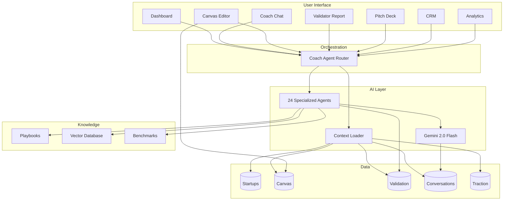

---

### Component Architecture

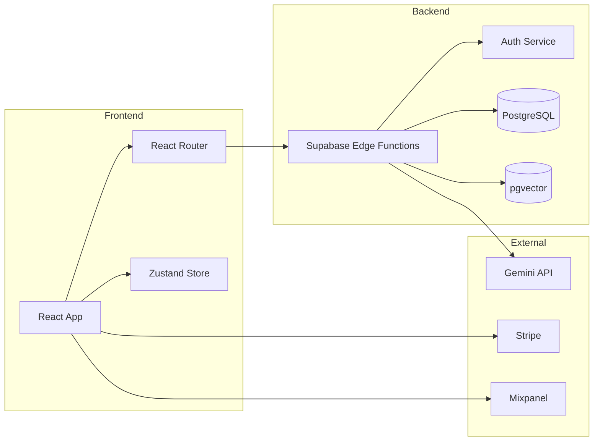

---

## 🗺️ User Journey Map

### Complete User Journey (Day 1 → Day 90)

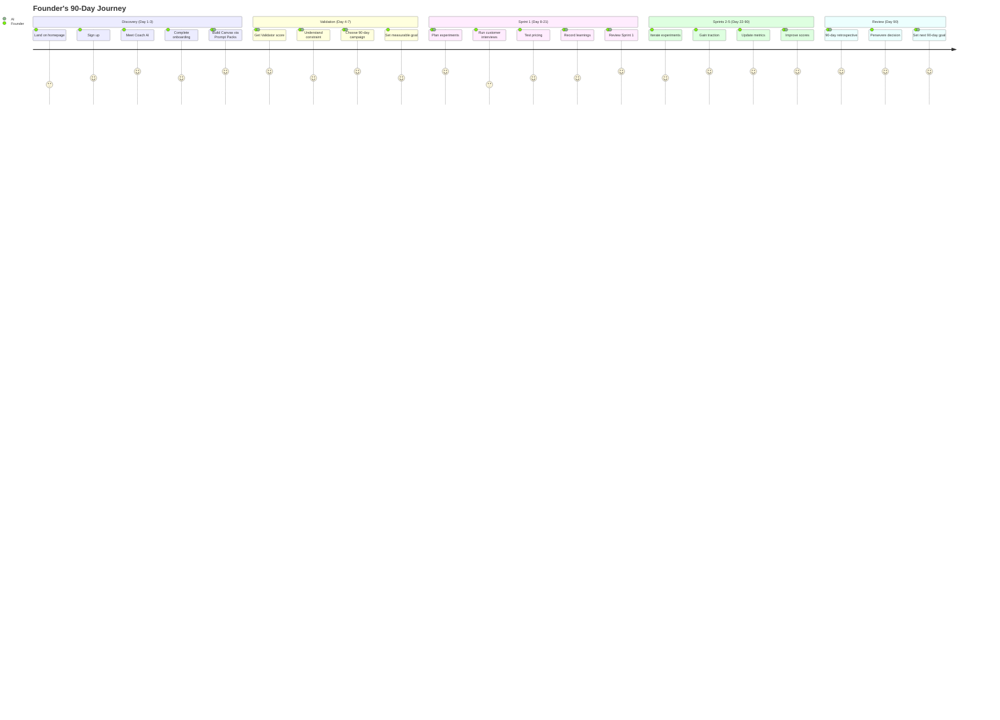

---

### Onboarding Flow

```mermaid
flowchart TD
    Start([New User Signs Up]) --> Welcome[Welcome Screen]
    Welcome --> CoachIntro[Meet Your Coach]
    CoachIntro --> Discovery{Discovery Questions}
    
    Discovery --> Q1[What are you building?]
    Q1 --> Q2[Who is it for?]
    Q2 --> Q3[What problem does it solve?]
    Q3 --> Q4[How will you make money?]
    Q4 --> Q5[Current stage?]
    
    Q5 --> PromptPack[Launch Canvas Prompt Pack]
    PromptPack --> Block1[Problem Block]
    Block1 --> Block2[Customer Block]
    Block2 --> Block3[UVP Block]
    Block3 --> Block4[Solution Block]
    Block4 --> Block5[Channels Block]
    Block5 --> Block6[Revenue Block]
    Block6 --> Block7[Costs Block]
    Block7 --> Block8[Metrics Block]
    Block8 --> Block9[Advantage Block]
    
    Block9 --> CanvasComplete[Canvas Complete!]
    CanvasComplete --> FirstValidation[Run First Validation]
    FirstValidation --> Dashboard[Navigate to Dashboard]
    Dashboard --> End([Onboarding Complete])
    
    style Start fill:#e8f5e9
    style End fill:#e8f5e9
    style CanvasComplete fill:#fff9c4
    style FirstValidation fill:#fff9c4
```

---

## 🔄 Data Flow Workflows

### Chat → Agent → Response Flow

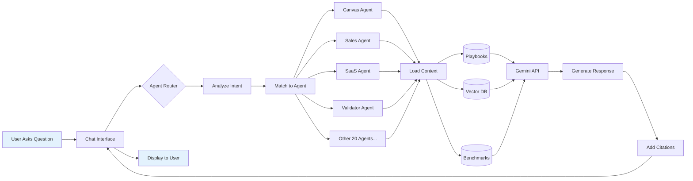

---

### Canvas → Validator → Insights Pipeline

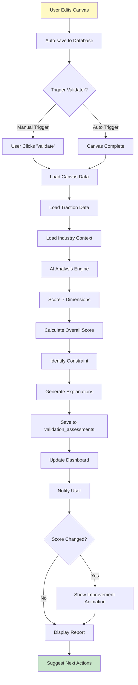

---

### 90-Day Validation Cycle

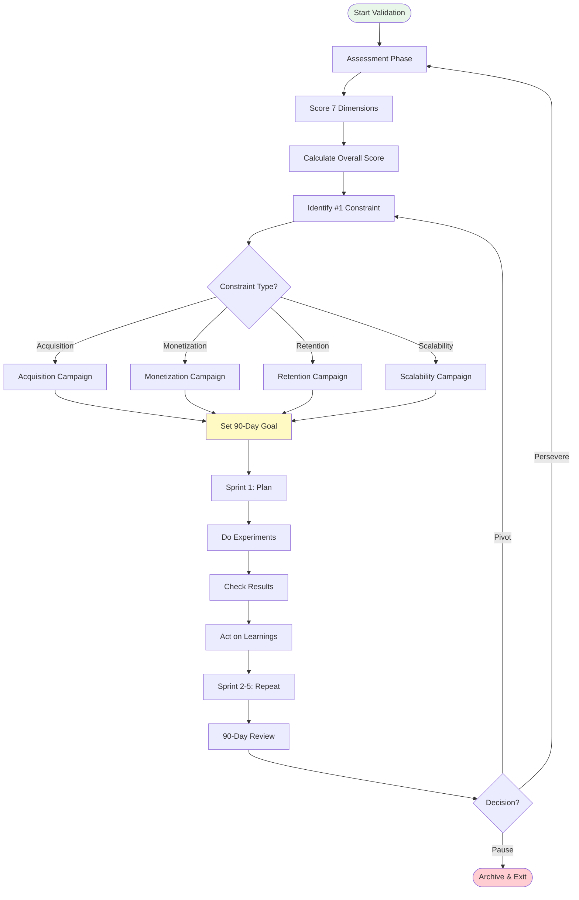

---

## 📞 Sequence Diagrams

### Coach Conversation with Context Loading

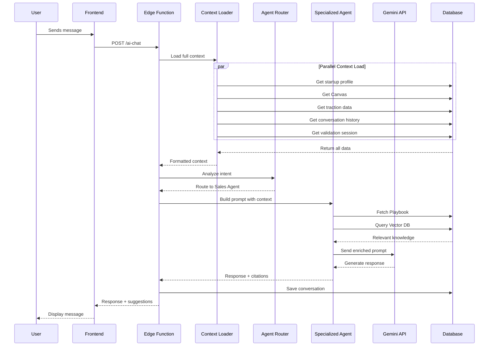

---

### Validator Scoring Process

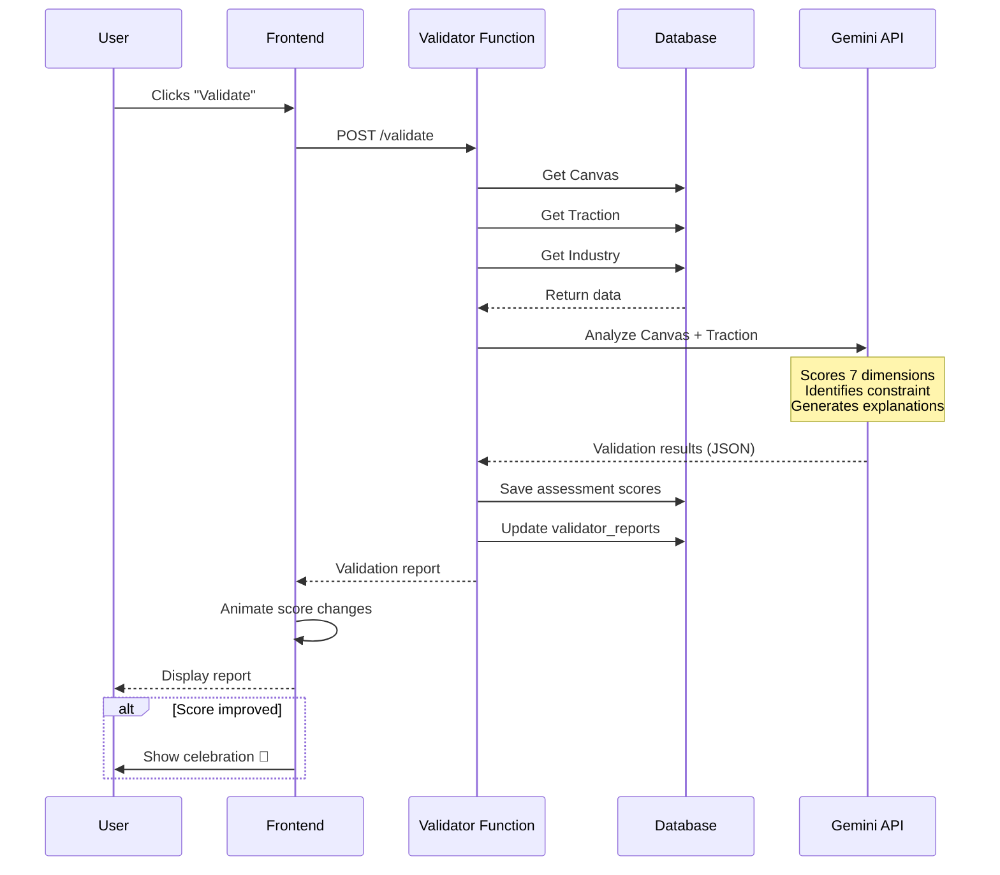

---

### Sprint Execution PDCA Loop

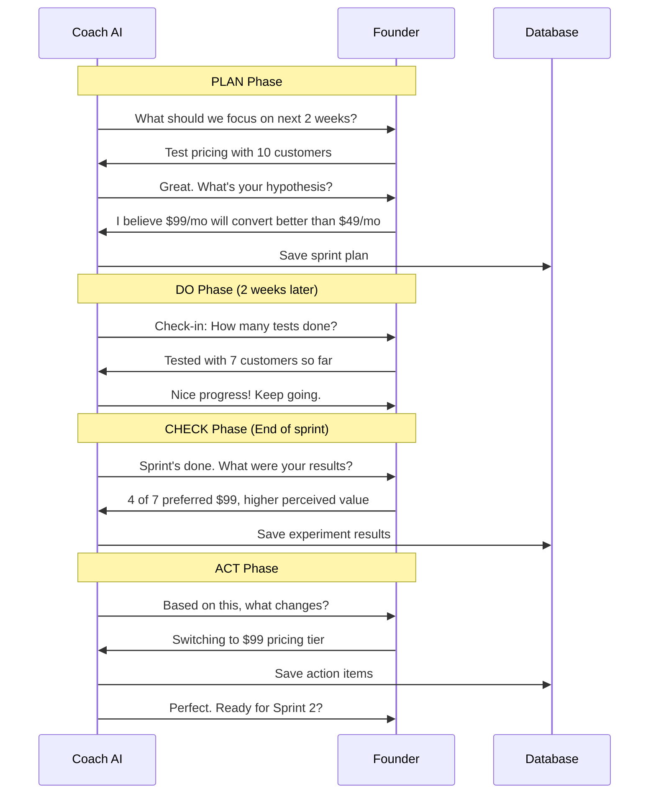

---

## 🔄 State Machine

### Validation Session State Diagram

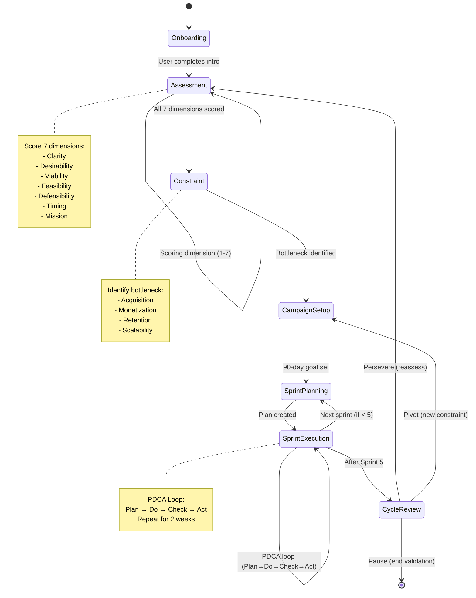

---

## 🗄️ Entity-Relationship Model

### Database Schema (Simplified)

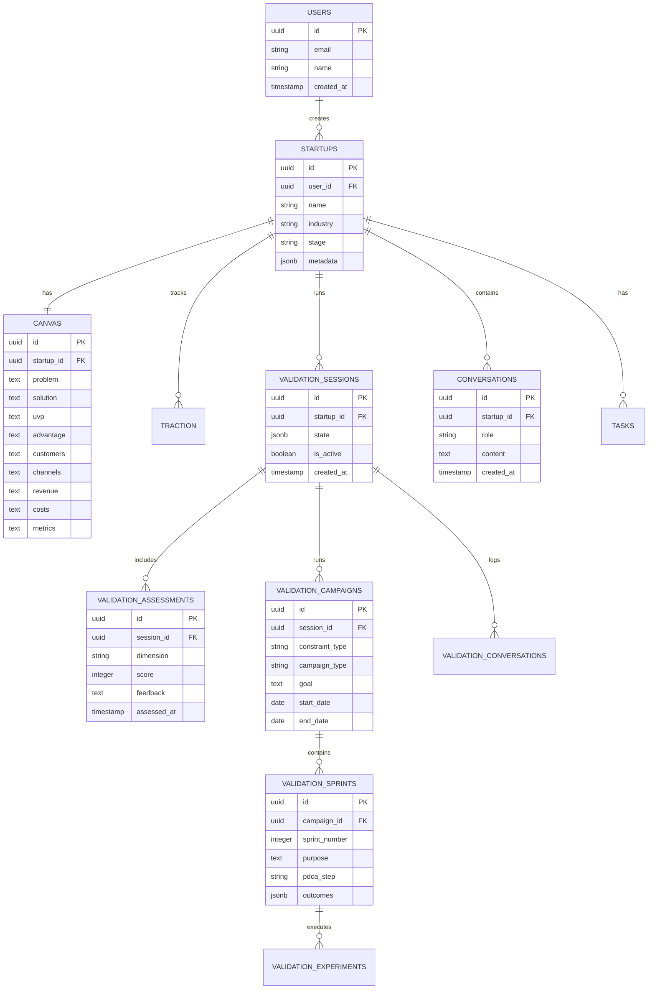

---

### Core Tables Relationships

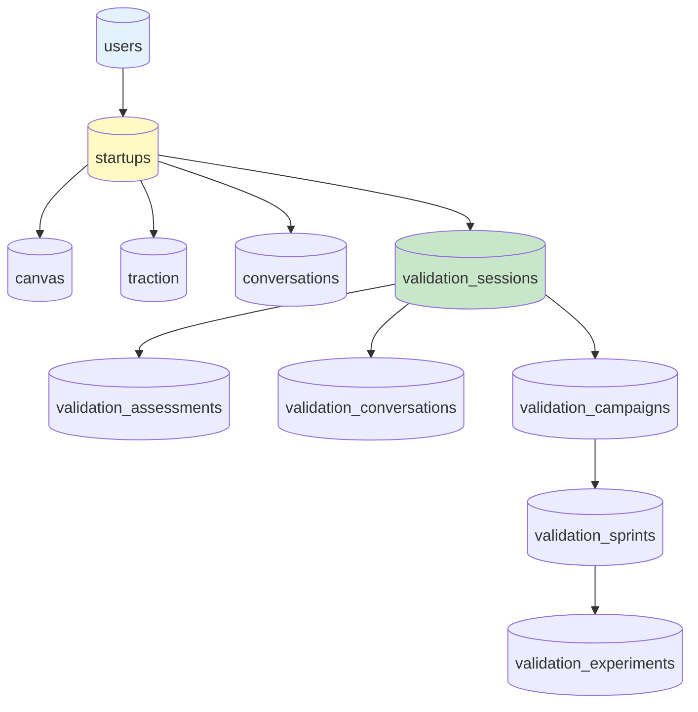

---

## 📊 Implementation Timeline

### 5-Phase Gantt Chart

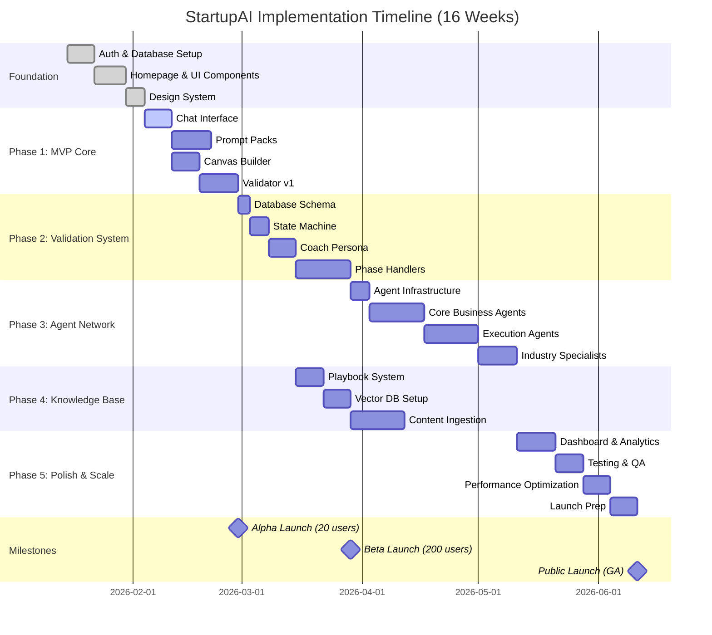

---

### Sprint Breakdown (Weeks)

```mermaid
gantt
    title Development Sprints
    dateFormat YYYY-MM-DD
    
    section Sprint Planning
    Sprint 1: Foundation           :done, s1, 2026-01-15, 2w
    Sprint 2: Chat & Canvas        :active, s2, 2026-01-29, 2w
    Sprint 3: Validator & Prompts  :s3, 2026-02-12, 2w
    Sprint 4: Validation System    :s4, 2026-02-26, 2w
    Sprint 5: Agent Core           :s5, 2026-03-12, 2w
    Sprint 6: Agent Expansion      :s6, 2026-03-26, 2w
    Sprint 7: Knowledge Base       :s7, 2026-04-09, 2w
    Sprint 8: Dashboard & Polish   :s8, 2026-04-23, 2w
```

---

## 🎯 Architecture Patterns

### Block Diagram: AI Context Stack

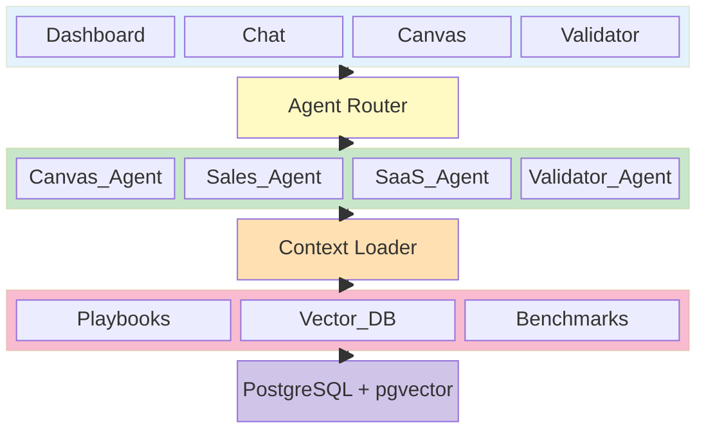

---

## 📐 System Integration Map

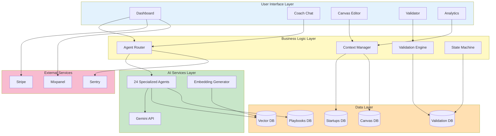

---

## 📝 Summary

**What These Diagrams Show:**

1. **System Architecture** - How all components connect (UI → Router → Agents → Knowledge → Database)
2. **User Journey** - The founder's experience from Day 1 → Day 90
3. **Data Flows** - How information moves through the system (Chat, Validator, Validation cycle)
4. **Sequence Diagrams** - Step-by-step interactions (Coach conversation, Validator scoring, Sprint execution)
5. **State Machine** - Validation phase progression (Onboarding → Assessment → Constraint → Sprints → Review)
6. **Entity-Relationship** - Database structure (Users → Startups → Canvas → Validation → Sprints)
7. **Gantt Chart** - 16-week implementation timeline across 5 phases

**Key Insights:**

- **Centralized Context:** Everything flows through the Context Loader (Canvas, Traction, History)
- **Agent Specialization:** 24 agents, each with domain expertise (Playbooks + Vector DB)
- **Cyclical Validation:** 90-day sprints loop indefinitely (Persevere → Reassess → Repeat)
- **One Source of Truth:** Canvas drives everything (Validator, Pitch Deck, Coach context)
- **Progressive Disclosure:** Users move through states (Onboarding → Validation → Sprints)

---

**Related Documentation:**
- `/docs/features/prd.md` - Full product requirements
- `/docs/features/tasks.md` - 67 implementation tasks
- `/docs/features/03-coach-plan.md` - Coach backend details

---

**Last Updated:** 2026-02-04  
**Maintained By:** Product & Engineering Teams
