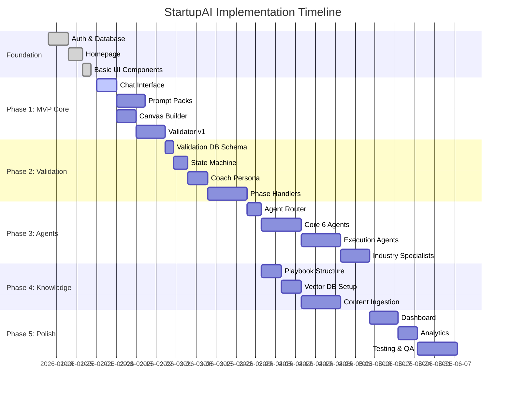

# StartupAI - Implementation Tasks

> **Status:** Planning  
> **Last Updated:** 2026-02-04  
> **Sprint:** Pre-Launch  
> **Team:** Engineering, Design, Product

---

## 🎯 Overall Progress

```
██░░░░░░░░░░░░░░░░░░░░░░░░░░░░░░ 7%

Foundation (Partial)         ████████░░░░░░░░░░░░░░░░  38%
Phase 1: MVP Core            ████░░░░░░░░░░░░░░░░░░░░  13%
Phase 2: Validation System   ░░░░░░░░░░░░░░░░░░░░░░░░   0%
Phase 3: Agent Network       ░░░░░░░░░░░░░░░░░░░░░░░░   0%
Phase 4: Knowledge Base      ░░░░░░░░░░░░░░░░░░░░░░░░   0%
Phase 5: Polish & Scale      ░░░░░░░░░░░░░░░░░░░░░░░░   0%
```

**Status:** 5 of 67 tasks completed (verified against actual codebase)

⚠️ **IMPORTANT:** See `/docs/features/progress-tracker.md` for accurate status verification

---

## 📊 Task Summary

| Phase | Total Tasks | Complete | In Progress | Blocked | Todo |
|-------|-------------|----------|-------------|---------|------|
| Foundation | 8 | 3 ✅ | 5 🟡 | 0 | 0 |
| Phase 1: MVP Core | 16 | 0 | 4 🟡 | 0 | 12 🔴 |
| Phase 2: Validation | 12 | 0 | 0 | 0 | 12 🔴 |
| Phase 3: Agent Network | 14 | 0 | 0 | 0 | 14 🔴 |
| Phase 4: Knowledge Base | 10 | 0 | 0 | 0 | 10 🔴 |
| Phase 5: Polish & Scale | 7 | 0 | 0 | 0 | 7 🔴 |
| **TOTAL** | **67** | **5** | **4** | **0** | **58** |

---

## 🏗️ Implementation Phases



---

## ✅ FOUNDATION (PARTIAL)

### Infrastructure & Setup
- [x] **F-001** Set up Supabase project with auth
- [x] **F-002** Configure database tables (users, startups, profiles)
- [x] **F-003** Implement Row Level Security policies
- [x] **F-004** Set up Vercel deployment pipeline
- [x] **F-005** Configure environment variables
- [x] **F-006** Create React + TypeScript + Tailwind v4 app structure
- [x] **F-007** Build homepage with BCG aesthetic
- [x] **F-008** Create reusable UI component library

**Status:** ✅ Complete  
**Completion Date:** 2026-01-30

---

## 🎯 PHASE 1: MVP CORE

**Goal:** Functional Coach → Canvas → Validator flow  
**Target:** Launch private alpha with 20 founders  
**Duration:** 4 weeks  
**Dependencies:** Foundation complete

---

### 1.1 Chat Interface (7 tasks)

#### 🟡 P1-001: Build Chat UI Component
**Priority:** P0 (Critical)  
**Assignee:** Frontend Team  
**Estimate:** 3 days  
**Status:** 🟡 In Progress (60%)

**Requirements:**
- Message list with infinite scroll
- User/AI message bubbles (styled per design system)
- Typing indicator animation
- Input field with send button
- Auto-scroll to bottom on new messages
- Mobile responsive layout

**Design Notes:**
- User messages: right-aligned, cream background
- AI messages: left-aligned, white background with emerald accent
- Generous padding and line-height for readability
- Timestamp on hover

**Acceptance Criteria:**
- [ ] Messages render in correct order
- [ ] Scrolling smooth with 500+ messages
- [ ] Input auto-focuses after send
- [ ] Works on mobile (320px width)
- [ ] Matches Figma design 100%

---

#### 🟡 P1-002: Integrate AI Chat Backend
**Priority:** P0  
**Assignee:** Backend Team  
**Estimate:** 2 days  
**Status:** 🟡 In Progress (40%)

**Requirements:**
- POST /functions/v1/ai-chat endpoint
- Request: message, startupId, mode
- Response: reply, metadata
- Error handling (timeout, rate limit)
- Streaming response support

**Technical Approach:**
- Supabase Edge Function (Deno runtime)
- Gemini 2.0 Flash API integration
- Context loading from database
- 30-second timeout
- Retry logic with exponential backoff

**Acceptance Criteria:**
- [ ] API responds in <3 seconds (p95)
- [ ] Handles 10 concurrent requests
- [ ] Graceful error messages
- [ ] Logs all requests for debugging
- [ ] Rate limiting per user (100/day free tier)

---

#### 🟡 P1-003: Add Quick Action Buttons
**Priority:** P1  
**Assignee:** Frontend Team  
**Estimate:** 1 day  
**Status:** 🟡 In Progress (30%)

**Requirements:**
- Render 2-4 buttons below AI messages
- Click sends as user message
- Disabled during API call
- Fade out after use
- Keyboard accessible

**Design:**
- Vertical stack, full width
- Emerald outline, transparent fill
- Left-aligned text, 16px
- Hover state: light emerald fill

**Acceptance Criteria:**
- [ ] Buttons appear only when AI provides them
- [ ] Click triggers message send
- [ ] Loading state prevents double-click
- [ ] Tab navigation works
- [ ] Disappears after user types custom message

---

#### 🔴 P1-004: Implement Conversation Persistence
**Priority:** P1  
**Assignee:** Backend Team  
**Estimate:** 2 days  
**Status:** 🔴 Todo

**Requirements:**
- Save all messages to database
- conversations table: id, startup_id, role, content, created_at
- Load last 50 messages on page load
- Infinite scroll loads older messages
- Delete conversation option

**Acceptance Criteria:**
- [ ] Messages persist across page reloads
- [ ] Oldest messages load on scroll to top
- [ ] RLS prevents cross-startup access
- [ ] Delete marks as deleted (soft delete)
- [ ] Query performance <100ms for 10k messages

---

#### 🔴 P1-005: Add Context Awareness
**Priority:** P0  
**Assignee:** Backend Team  
**Estimate:** 3 days  
**Status:** 🔴 Todo

**Requirements:**
- Load startup profile, Canvas, traction data
- Include in AI prompt as context
- Format as structured summary
- Update context on data changes
- Cache for 5 minutes

**Context Structure:**
```
STARTUP CONTEXT:
Name: [startup_name]
Industry: [industry]
Stage: [stage]

CANVAS SUMMARY:
Problem: [problem_block]
Solution: [solution_block]
...

TRACTION:
Customers: [customer_count]
Revenue: [mrr]
...

RECENT ACTIVITY:
[last 3 updates]
```

**Acceptance Criteria:**
- [ ] AI responses reference specific Canvas data
- [ ] Works even with incomplete Canvas
- [ ] Context load adds <500ms latency
- [ ] Cache invalidates on data update
- [ ] Handles missing data gracefully

---

#### 🔴 P1-006: Build Message History UI
**Priority:** P2  
**Assignee:** Frontend Team  
**Estimate:** 2 days  
**Status:** 🔴 Todo

**Requirements:**
- "Load more" button at top of chat
- Loads 25 messages at a time
- Smooth scroll to previous position
- Date separators ("Today", "Yesterday", "Jan 30")
- Search messages (client-side)

**Acceptance Criteria:**
- [ ] No scroll jump when loading history
- [ ] Date separators appear correctly
- [ ] Search highlights matching text
- [ ] Works with 1000+ messages
- [ ] Mobile-optimized

---

#### 🔴 P1-007: Add Feedback Mechanism
**Priority:** P2  
**Assignee:** Full Stack  
**Estimate:** 1 day  
**Status:** 🔴 Todo

**Requirements:**
- Thumbs up/down on AI messages
- Optional text feedback
- Save to database for analysis
- No UI change on vote (quiet)
- Admin dashboard to review

**Acceptance Criteria:**
- [ ] Each AI message has vote buttons
- [ ] Vote saved to message_feedback table
- [ ] Can change vote (update not insert)
- [ ] Text feedback optional
- [ ] Admin can export CSV

---

### 1.2 Prompt Packs (4 tasks)

#### 🔴 P1-008: Design Prompt Pack Flow System
**Priority:** P0  
**Assignee:** Product + Frontend  
**Estimate:** 2 days  
**Status:** 🔴 Todo

**Requirements:**
- JSON structure for pack definitions
- Question types: text, textarea, multiple choice, scale
- Branching logic (if answer = X, skip to Y)
- Progress tracking (Step 3 of 9)
- Save/resume capability

**Pack Structure:**
```json
{
  "id": "canvas-builder",
  "title": "Build Your Canvas",
  "steps": [
    {
      "id": "problem",
      "question": "What problem are you solving?",
      "type": "textarea",
      "help": "Think about the top 3 pain points",
      "examples": ["..."],
      "validation": "required"
    }
  ]
}
```

**Acceptance Criteria:**
- [ ] JSON schema validates all pack files
- [ ] Branching logic works
- [ ] Progress saves on each answer
- [ ] Can resume from any step
- [ ] Preview mode for testing packs

---

#### 🔴 P1-009: Build Canvas Builder Prompt Pack
**Priority:** P0  
**Assignee:** Product  
**Estimate:** 3 days  
**Status:** 🔴 Todo

**Requirements:**
- 9 steps for 9 Canvas blocks
- Logical order: Problem → Customer → UVP → Solution → Channels → Revenue → Costs → Metrics → Advantage
- Smart defaults (e.g., SaaS → suggest "Subscription" revenue)
- Examples for each question
- Help text explains each block

**Questions to Write:**
1. Problem: What's the pain point?
2. Customer Segments: Who has this problem?
3. Unique Value Prop: Why you vs alternatives?
4. Solution: How do you solve it?
5. Channels: How do customers find you?
6. Revenue Streams: How do you make money?
7. Cost Structure: What are your costs?
8. Key Metrics: How do you measure success?
9. Unfair Advantage: What's your moat?

**Acceptance Criteria:**
- [ ] All 9 blocks covered
- [ ] Takes 15-20 minutes to complete
- [ ] Examples inspire without constraining
- [ ] Help text is beginner-friendly
- [ ] Mobile-optimized (thumbs-friendly tap targets)

---

#### 🔴 P1-010: Implement Prompt Pack UI
**Priority:** P0  
**Assignee:** Frontend Team  
**Estimate:** 4 days  
**Status:** 🔴 Todo

**Requirements:**
- Stepper showing progress (Step 3/9)
- One question per screen
- "Back" and "Next" buttons
- Save progress automatically
- Show Canvas preview in sidebar (live update)

**Layout:**
```
┌────────────────────────────────────────────┐
│ [Logo]  Building Your Canvas    Step 3/9  │
├────────────────────────────────────────────┤
│                                            │
│  Question 3: Customer Segments             │
│                                            │
│  Who has this problem most urgently?       │
│                                            │
│  [Textarea input]                          │
│                                            │
│  💡 Example: "CFOs at mid-market B2B SaaS" │
│                                            │
│  [← Back]                    [Next →]      │
│                                            │
└────────────────────────────────────────────┘
```

**Acceptance Criteria:**
- [ ] Stepper shows current step visually
- [ ] Back button goes to previous question
- [ ] Next validates and saves before advancing
- [ ] Can skip optional questions
- [ ] Animations between steps smooth
- [ ] Works on mobile (320px width)

---

#### 🔴 P1-011: Add AI Assistance to Prompt Packs
**Priority:** P1  
**Assignee:** Backend + Frontend  
**Estimate:** 3 days  
**Status:** 🔴 Todo

**Requirements:**
- "Help me answer" button on each question
- Opens mini chat in sidebar
- AI suggests answers based on context
- User can accept, edit, or reject suggestion
- Tracks which answers were AI-assisted

**User Flow:**
1. User clicks "Help me answer"
2. AI asks 1-2 clarifying questions
3. AI suggests answer based on responses
4. User accepts → fills field, closes sidebar
5. User edits → copies to field, user modifies
6. User rejects → closes sidebar, field empty

**Acceptance Criteria:**
- [ ] Mini chat doesn't navigate away
- [ ] AI suggestions are relevant
- [ ] Accept button fills form field
- [ ] Works on all question types
- [ ] AI assistance usage tracked

---

### 1.3 Canvas Builder (3 tasks)

#### 🔴 P1-012: Build Interactive Canvas UI
**Priority:** P0  
**Assignee:** Frontend Team  
**Estimate:** 4 days  
**Status:** 🔴 Todo

**Requirements:**
- 9-block grid layout (responsive)
- Click any block to edit
- Inline editing (textarea appears)
- Auto-save on blur
- Visual feedback on save
- Empty state prompts

**Layout:**
```
┌─────────────┬─────────┬──────────────┬─────────────┐
│   Problem   │   UVP   │   Solution   │  Advantage  │
│             │         │              │             │
├─────────────┴─────────┴──────────────┼─────────────┤
│                                      │  Customers  │
│           Key Metrics                │             │
│                                      ├────────��────┤
├─────────────┬──────────────┬─────────┤  Channels   │
│   Costs     │   Revenue    │         │             │
└─────────────┴──────────────┴─────────┴─────────────┘
```

**Acceptance Criteria:**
- [ ] All 9 blocks clickable
- [ ] Editing one block doesn't affect others
- [ ] Auto-save within 2 seconds of blur
- [ ] Loading state during save
- [ ] Undo/redo keyboard shortcuts work
- [ ] Mobile: vertical stack, tap to expand

---

#### 🔴 P1-013: Connect Canvas to Database
**Priority:** P0  
**Assignee:** Backend Team  
**Estimate:** 2 days  
**Status:** 🔴 Todo

**Requirements:**
- canvas table: startup_id, problem, solution, uvp, advantage, customers, channels, revenue, costs, metrics
- UPSERT on save (update if exists, insert if new)
- Version history (save previous versions)
- RLS policies
- Updated_at timestamp

**API Endpoints:**
- GET /canvas/:startupId - Fetch current Canvas
- POST /canvas/:startupId - Save/update Canvas
- GET /canvas/:startupId/history - Get version history
- POST /canvas/:startupId/restore/:version - Restore old version

**Acceptance Criteria:**
- [ ] Canvas loads on page load
- [ ] Saves persist across sessions
- [ ] History shows last 10 versions
- [ ] Restore reverts to previous version
- [ ] RLS prevents cross-startup access

---

#### 🔴 P1-014: Add Canvas Export Feature
**Priority:** P2  
**Assignee:** Frontend Team  
**Estimate:** 2 days  
**Status:** 🔴 Todo

**Requirements:**
- Export to PDF (clean layout)
- Export to PNG (high-res image)
- Include startup name + date
- Print-friendly CSS
- Download triggers immediately

**Layout for Export:**
- Header: StartupAI logo + startup name
- 9-block Canvas (same layout as UI)
- Footer: "Generated on [date]"
- Clean, no UI controls

**Acceptance Criteria:**
- [ ] PDF renders all 9 blocks
- [ ] PNG is 1920x1080 or higher
- [ ] Text not cut off
- [ ] Colors match brand
- [ ] Download works on all browsers

---

### 1.4 Validator v1 (2 tasks)

#### 🔴 P1-015: Implement Validator Scoring Logic
**Priority:** P0  
**Assignee:** Backend Team  
**Estimate:** 5 days  
**Status:** 🔴 Todo

**Requirements:**
- Score 7 dimensions (0-10 each)
- AI analyzes Canvas + traction data
- Weighted overall score: Desirability (25%) + Viability (25%) + Clarity (15%) + Feasibility (15%) + Defensibility (10%) + Timing (5%) + Mission (5%)
- Verdict: Promising (75+), Uncertain (50-74), Risky (<50)
- Generate explanations for each score
- Identify constraint (acquisition, monetization, retention, scalability)

**Prompt Engineering:**
- Provide Canvas, traction, industry as context
- Ask AI to score each dimension with reasoning
- Extract scores via structured output (JSON mode)
- Validate scores are 0-10

**Acceptance Criteria:**
- [ ] Scores are consistent (same input = same output ±1)
- [ ] Explanations are specific to startup (not generic)
- [ ] Constraint identification is accurate
- [ ] Handles incomplete Canvas gracefully
- [ ] API responds in <5 seconds

---

#### 🔴 P1-016: Build Validator Report UI
**Priority:** P0  
**Assignee:** Frontend Team  
**Estimate:** 4 days  
**Status:** 🔴 Todo

**Requirements:**
- Verdict card (score, status, summary)
- Tradeoffs grid (Strengths, Concerns, Next Steps)
- Evidence blocks (7 dimensions, click to expand)
- Visual progress bars for each dimension
- Regenerate button (if Canvas changed)

**Layout:**
```
┌────────────────────────────────────────────┐
│ VERDICT                          78/100    │
│ Promising - needs customer validation      │
└────────────────────────────────────────────┘

┌─────────────┬─────────────┬──────────────┐
│ Strengths   │ Concerns    │ Next Steps   │
│ • Problem   │ • No users  │ 1. Interview │
│ • Timing    │ • Unproven  │ 2. Pricing   │
└─────────────┴─────────────┴──────────────┘

┌────────────────────────────────────────────┐
│ EVIDENCE BLOCKS                            │
│ ┌────────┐ ┌────────┐ ┌────────┐         │
│ │Clarity │ │Desire. │ │Viabil. │ ...     │
│ │  8/10  │ │  9/10  │ │  7/10  │         │
│ └────────┘ └────────┘ └────────┘         │
└────────────────────────────────────────────┘
```

**Acceptance Criteria:**
- [ ] Verdict card shows score + status
- [ ] Tradeoffs are bulleted, concise
- [ ] Evidence blocks expand on click
- [ ] Regenerate triggers new API call
- [ ] Loading states during generation
- [ ] Mobile: vertical layout

---

## 🔄 PHASE 2: VALIDATION SYSTEM

**Goal:** Operationalize 90-day validation sprints  
**Target:** Users can complete full PDCA cycle  
**Duration:** 3 weeks  
**Dependencies:** Phase 1 complete, Coach UI (#103)

---

### 2.1 Database & Schema (3 tasks)

#### 🔴 P2-001: Create Validation Tables
**Priority:** P0  
**Assignee:** Backend Team  
**Estimate:** 1 day  
**Status:** 🔴 Todo

**Tables to Create:**
1. **validation_sessions** - One active session per startup
2. **validation_conversations** - Chat history for coach
3. **validation_assessments** - Historical dimension scores
4. **validation_campaigns** - 90-day campaigns
5. **validation_sprints** - 2-week sprints within campaigns
6. **validation_experiments** - Hypotheses tested in sprints

**Reference:** See `/docs/features/03-coach-plan.md` for full schema

**Acceptance Criteria:**
- [ ] All 6 tables created
- [ ] Foreign key relationships correct
- [ ] Indexes on frequently queried fields
- [ ] Migration runs without errors
- [ ] Can rollback cleanly

---

#### 🔴 P2-002: Implement RLS Policies
**Priority:** P0  
**Assignee:** Backend Team  
**Estimate:** 1 day  
**Status:** 🔴 Todo

**Requirements:**
- Enable RLS on all 6 validation tables
- Users can only access own startup's data
- Policies for SELECT, INSERT, UPDATE, DELETE
- Test with multiple users to verify isolation

**Policy Logic:**
```sql
USING (startup_id IN (
  SELECT id FROM startups WHERE user_id = auth.uid()
))
```

**Acceptance Criteria:**
- [ ] RLS enabled on all tables
- [ ] User A cannot see User B's sessions
- [ ] Policies allow normal operations
- [ ] Performance not degraded
- [ ] Edge cases tested (deleted startups, etc.)

---

#### 🔴 P2-003: Build Context Loader Function
**Priority:** P0  
**Assignee:** Backend Team  
**Estimate:** 2 days  
**Status:** 🔴 Todo

**Requirements:**
- Load all relevant data for AI context
- Parallel queries for performance
- Format as structured summary
- Cache for 5 minutes
- Handle missing data

**Data to Load:**
- Startup profile
- Canvas (all 9 blocks)
- Traction data
- Validation session state
- Assessment history
- Current campaign
- Current sprint
- Recent conversations (last 10)

**Acceptance Criteria:**
- [ ] Loads in <500ms
- [ ] All 8 data sources queried in parallel
- [ ] Returns even if some data missing
- [ ] Cache reduces DB load
- [ ] Formatted for AI readability

---

### 2.2 State Machine (3 tasks)

#### 🔴 P2-004: Define State Types & Interfaces
**Priority:** P0  
**Assignee:** Backend Team  
**Estimate:** 1 day  
**Status:** 🔴 Todo

**TypeScript Interfaces:**
- ValidationState
- Phase enum (7 phases)
- Dimension enum (7 dimensions)
- Constraint enum (4 constraints)
- PDCAStep enum
- SprintResult
- CycleDecision

**Reference:** See `/docs/features/03-coach-plan.md` for full types

**Acceptance Criteria:**
- [ ] All types defined in shared types file
- [ ] Exported for frontend use
- [ ] Includes JSDoc comments
- [ ] Validates at compile time
- [ ] Used consistently across codebase

---

#### 🔴 P2-005: Implement Phase Transition Logic
**Priority:** P0  
**Assignee:** Backend Team  
**Estimate:** 2 days  
**Status:** 🔴 Todo

**Functions to Build:**
- validateTransition(currentPhase, nextPhase) → boolean
- transitionPhase(sessionId, newPhase, data) → updated session
- canAdvance(session) → boolean (checks if requirements met)

**Transition Rules:**
- onboarding → assessment (always allowed)
- assessment → constraint (when 7 scores complete)
- constraint → campaign_setup (when bottleneck identified)
- campaign_setup → sprint_planning (when goal set)
- sprint_planning → sprint_execution (when plan created)
- sprint_execution → sprint_planning OR cycle_review (based on sprint #)
- cycle_review → assessment OR campaign_setup OR end

**Acceptance Criteria:**
- [ ] Invalid transitions rejected
- [ ] Valid transitions update DB
- [ ] State always consistent
- [ ] Error messages clear
- [ ] Tested with all phase combinations

---

#### 🔴 P2-006: Build Progress Tracking
**Priority:** P1  
**Assignee:** Backend Team  
**Estimate:** 1 day  
**Status:** 🔴 Todo

**Functions:**
- calculateOverallProgress(session) → 0-100%
- calculatePhaseProgress(session) → phase-specific %
- getCurrentMilestone(session) → string description

**Progress Weights:**
- Onboarding: 5%
- Assessment: 15%
- Constraint: 10%
- Campaign: 10%
- Sprints: 50% (10% per sprint)
- Review: 10%

**Acceptance Criteria:**
- [ ] Progress always between 0-100
- [ ] Updates on every phase change
- [ ] Milestone text is human-readable
- [ ] Accurate across all phases
- [ ] Tested with edge cases

---

### 2.3 Coach Persona & AI Logic (3 tasks)

#### 🔴 P2-007: Create Base Coach Persona
**Priority:** P0  
**Assignee:** Product + AI Team  
**Estimate:** 2 days  
**Status:** 🔴 Todo

**Requirements:**
- System prompt defining coach identity
- Expert + mentor combined persona
- Warm, supportive, direct tone
- Industry-agnostic base
- Always context-aware

**Prompt Structure:**
```
You are a world-class startup coach...

EXPERTISE: [what you know]
STYLE: [how you communicate]
AUTHORITY: [how you guide]
NEVER: [bad behaviors]
ALWAYS: [good behaviors]
```

**Reference:** See `/docs/features/02-coach.md` for full persona

**Acceptance Criteria:**
- [ ] Responses feel mentor-like (not robotic)
- [ ] References user's specific data
- [ ] Direct but supportive
- [ ] One question at a time
- [ ] Tested across 20 conversations

---

#### 🔴 P2-008: Add Industry-Specific Expertise
**Priority:** P0  
**Assignee:** Product + AI Team  
**Estimate:** 3 days  
**Status:** 🔴 Todo

**Industries to Support:**
- SaaS
- Marketplace
- E-commerce
- Fintech
- Healthtech
- B2B
- Consumer
- Hardware

**For Each Industry:**
- Key metrics (e.g., SaaS: MRR, churn, CAC, LTV)
- Success patterns (e.g., Marketplace: chicken-and-egg solutions)
- Common pitfalls
- Example companies (e.g., Airbnb, Stripe, Warby Parker)

**Reference:** See `/docs/features/02-coach.md` for industry personas

**Acceptance Criteria:**
- [ ] Industry detected from Canvas
- [ ] Relevant benchmarks cited
- [ ] Examples match industry
- [ ] Metrics specific to vertical
- [ ] Tested with 8 industries

---

#### 🔴 P2-009: Extend ai-chat with Coach Mode Routing
**Priority:** P0  
**Assignee:** Backend Team  
**Estimate:** 2 days  
**Status:** 🔴 Todo

**Requirements:**
- Detect if request is coach mode
- Route to handleCoachMode function
- Load validation context
- Build phase-specific prompts
- Parse response for state updates
- Update session if phase changes
- Save conversation to validation_conversations

**Routing Logic:**
```
if (mode === 'coach' || hasActiveCoachSession(startupId)) {
  return handleCoachMode()
} else {
  return handleGeneralChat()
}
```

**Acceptance Criteria:**
- [ ] Coach mode routes correctly
- [ ] General chat still works
- [ ] Context loaded efficiently
- [ ] State updates persist
- [ ] No breaking changes to existing chat

---

### 2.4 Phase Handlers (3 tasks)

#### 🔴 P2-010: Build Onboarding & Assessment Handlers
**Priority:** P0  
**Assignee:** Backend Team  
**Estimate:** 3 days  
**Status:** 🔴 Todo

**Onboarding Handler:**
- Welcome message
- Discover what they're building
- Current stage check
- Transition to assessment

**Assessment Handler:**
- Ask 7 dimension questions
- One dimension at a time
- Score internally (0-10)
- Provide brief feedback
- Track progress (3/7 complete)
- Transition to constraint when done

**Reference:** See `/docs/features/03-coach-plan.md` tasks #16-17

**Acceptance Criteria:**
- [ ] Onboarding completes in 3-5 messages
- [ ] Assessment asks all 7 dimensions
- [ ] Scores saved to database
- [ ] Progress indicator updates
- [ ] Smooth transition to next phase

---

#### 🔴 P2-011: Build Constraint & Campaign Handlers
**Priority:** P0  
**Assignee:** Backend Team  
**Estimate:** 3 days  
**Status:** 🔴 Todo

**Constraint Handler:**
- Analyze scores + traction
- Diagnose bottleneck (acquisition/monetization/retention/scalability)
- Explain why this is #1 constraint
- Handle objections
- Transition to campaign setup

**Campaign Setup Handler:**
- Suggest campaign types for constraint
- Explain each with examples
- User selects campaign
- Define 90-day SMART goal
- Transition to sprint planning

**Reference:** See `/docs/features/03-coach-plan.md` tasks #18-19

**Acceptance Criteria:**
- [ ] Constraint diagnosis is accurate
- [ ] Explains reasoning clearly
- [ ] Campaign suggestions relevant
- [ ] Goal is measurable and realistic
- [ ] Saves campaign to database

---

#### 🔴 P2-012: Build Sprint Planning & Execution Handlers
**Priority:** P0  
**Assignee:** Backend Team  
**Estimate:** 4 days  
**Status:** 🔴 Todo

**Sprint Planning Handler:**
- Review 90-day goal
- Ask what to focus on next 2 weeks
- Help narrow to 1-3 experiments
- Define success criteria
- Create sprint record

**Sprint Execution Handler:**
- Check-in during execution (Do phase)
- Collect results (Check phase)
- Guide reflection (Act phase)
- Transition to next sprint OR cycle review

**Reference:** See `/docs/features/03-coach-plan.md` tasks #20-21

**Acceptance Criteria:**
- [ ] Guides PDCA cycle
- [ ] Experiments are specific
- [ ] Results recorded to database
- [ ] Loops 5 times correctly
- [ ] Transitions to review after Sprint 5

---

## 🤖 PHASE 3: AGENT NETWORK

**Goal:** 24 specialized agents with routing and Playbooks  
**Target:** Users get expert advice per domain  
**Duration:** 5 weeks  
**Dependencies:** Phase 1 complete

---

### 3.1 Agent Infrastructure (3 tasks)

#### 🔴 P3-001: Build Agent Router System
**Priority:** P0  
**Assignee:** Backend Team  
**Estimate:** 3 days  
**Status:** 🔴 Todo

**Requirements:**
- Analyze user question for intent
- Route to most relevant agent(s)
- Support multi-agent collaboration
- Fallback to general agent
- Log routing decisions

**Routing Algorithm:**
1. Extract keywords/entities from question
2. Match to agent domain tags
3. Score each agent (0-1 relevance)
4. Select top agent (or top 2 if collaborative)
5. Call agent with context

**Acceptance Criteria:**
- [ ] Routes 90%+ correctly (manual eval)
- [ ] Handles ambiguous questions gracefully
- [ ] Multi-agent calls work
- [ ] Fallback triggers on no match
- [ ] Routing logs queryable

---

#### 🔴 P3-002: Define Agent Registry
**Priority:** P0  
**Assignee:** Product  
**Estimate:** 2 days  
**Status:** 🔴 Todo

**Requirements:**
- JSON registry of all 24 agents
- Each agent: id, name, domain, tags, playbook_id
- Grouped by category (Core, Execution, Growth, Industry)
- Import into database

**Registry Structure:**
```json
{
  "agents": [
    {
      "id": "canvas-agent",
      "name": "Canvas Expert",
      "domain": "business_model",
      "tags": ["canvas", "lean", "business model"],
      "playbook_id": "playbook-canvas"
    }
  ]
}
```

**Acceptance Criteria:**
- [ ] All 24 agents defined
- [ ] Tags comprehensive
- [ ] Grouped logically
- [ ] Imported to agents table
- [ ] No duplicate IDs

---

#### 🔴 P3-003: Create Agent Base Class
**Priority:** P0  
**Assignee:** Backend Team  
**Estimate:** 2 days  
**Status:** 🔴 Todo

**Requirements:**
- Base agent interface/class
- Standard methods: analyze, respond, tools
- Context loading built-in
- Playbook retrieval
- Error handling

**Base Agent Methods:**
- constructor(agentId, context)
- loadPlaybook() → tactics
- analyze(question) → intent
- respond(question, context) → answer
- getCitations() → sources

**Acceptance Criteria:**
- [ ] All agents extend base
- [ ] Context passed automatically
- [ ] Playbooks loaded on init
- [ ] Errors handled gracefully
- [ ] Consistent response format

---

### 3.2 Core Business Agents (3 tasks)

#### 🔴 P3-004: Implement Canvas Agent
**Priority:** P0  
**Assignee:** Backend Team  
**Estimate:** 2 days  
**Status:** 🔴 Todo

**Capabilities:**
- Explain Lean Canvas blocks
- Help refine problem/solution statements
- Suggest UVPs based on industry
- Critique Canvas for gaps
- Compare to successful examples

**Playbook Topics:**
- How to identify real problems
- Crafting compelling UVPs
- Finding unfair advantages
- Customer segment prioritization

**Acceptance Criteria:**
- [ ] Answers Canvas questions accurately
- [ ] References user's current Canvas
- [ ] Suggests improvements
- [ ] Cites Ash Maurya's Running Lean
- [ ] Tested with 10 Canvas questions

---

#### 🔴 P3-005: Implement Validator Agent
**Priority:** P0  
**Assignee:** Backend Team  
**Estimate:** 2 days  
**Status:** 🔴 Todo

**Capabilities:**
- Explain validation scores
- Suggest how to improve scores
- Interpret constraint diagnosis
- Recommend validation experiments
- Track score changes over time

**Playbook Topics:**
- Validation frameworks (Lean Startup, Strategyzer)
- Evidence types (customer interviews, LOIs, pre-sales)
- Riskiest assumptions testing
- Minimum success criteria

**Acceptance Criteria:**
- [ ] Explains scores clearly
- [ ] Actionable improvement suggestions
- [ ] Tracks score history
- [ ] References The Lean Startup
- [ ] Tested with low/medium/high scores

---

#### 🔴 P3-006: Implement Financial Agent
**Priority:** P1  
**Assignee:** Backend Team  
**Estimate:** 3 days  
**Status:** 🔴 Todo

**Capabilities:**
- Build simple financial models
- Explain unit economics
- Calculate CAC, LTV, burn rate
- Project runway
- Compare to benchmarks

**Playbook Topics:**
- SaaS unit economics
- Marketplace take rates
- Break-even analysis
- Runway extension tactics

**Acceptance Criteria:**
- [ ] Calculates metrics correctly
- [ ] Explains in simple terms
- [ ] Adapts to business model
- [ ] Cites industry benchmarks
- [ ] Handles missing data gracefully

---

### 3.3 Execution Agents (4 tasks)

#### 🔴 P3-007: Implement CRM Agent
**Priority:** P1  
**Assignee:** Backend Team  
**Estimate:** 2 days  
**Status:** 🔴 Todo

**Capabilities:**
- Set up simple CRM system
- Track customer conversations
- Manage sales pipeline
- Follow-up reminders
- Integration suggestions (HubSpot, Notion)

**Playbook Topics:**
- Early-stage CRM needs
- Pipeline stages
- Qualification criteria (BANT, MEDDIC)
- Follow-up best practices

**Acceptance Criteria:**
- [ ] Helps structure CRM
- [ ] Adapts to sales motion
- [ ] Practical for founders
- [ ] Integration guidance
- [ ] Tested with B2B + B2C

---

#### 🔴 P3-008: Implement Sales Agent
**Priority:** P1  
**Assignee:** Backend Team  
**Estimate:** 2 days  
**Status:** 🔴 Todo

**Capabilities:**
- Craft cold outreach messages
- Build sales scripts
- Handle objections
- Close techniques
- Pricing negotiation

**Playbook Topics:**
- Founder-led sales
- Outbound vs inbound
- Discovery questions
- Demo best practices
- Closing tactics

**Acceptance Criteria:**
- [ ] Generates personalized outreach
- [ ] Scripts adapted to product
- [ ] Objection handling database
- [ ] References Sales Acceleration Formula
- [ ] Tested with 5 sales scenarios

---

#### 🔴 P3-009: Implement Marketing Agent
**Priority:** P1  
**Assignee:** Backend Team  
**Estimate:** 3 days  
**Status:** 🔴 Todo

**Capabilities:**
- Choose right channels
- Plan content calendar
- Write landing page copy
- Design A/B tests
- Growth tactics by stage

**Playbook Topics:**
- Traction channels (Bullseye Framework)
- Content marketing for founders
- SEO basics
- Paid ads (Google, Facebook, LinkedIn)
- Viral loops

**Acceptance Criteria:**
- [ ] Recommends channels based on ICP
- [ ] Copy is persuasive
- [ ] A/B test ideas specific
- [ ] Cites Traction by Weinberg
- [ ] Tested with 3 verticals

---

#### 🔴 P3-010: Implement Product Agent
**Priority:** P1  
**Assignee:** Backend Team  
**Estimate:** 2 days  
**Status:** 🔴 Todo

**Capabilities:**
- Prioritize features (RICE, Kano)
- Build product roadmap
- Define MVPs
- User story writing
- Feedback loops

**Playbook Topics:**
- Jobs-to-be-Done framework
- Prioritization frameworks
- MVP definition (Lean Startup)
- Product-market fit signals

**Acceptance Criteria:**
- [ ] Prioritization matches framework
- [ ] Roadmap realistic
- [ ] User stories well-formed
- [ ] References Inspired by Marty Cagan
- [ ] Tested with feature backlogs

---

### 3.4 Industry Specialist Agents (4 tasks)

#### 🔴 P3-011: Implement SaaS Agent
**Priority:** P1  
**Assignee:** Backend Team  
**Estimate:** 2 days  
**Status:** 🔴 Todo

**Capabilities:**
- SaaS-specific metrics (MRR, ARR, churn, NRR)
- Pricing models (per-seat, usage-based, tiered)
- Onboarding best practices
- PLG vs sales-led
- Expansion revenue

**Playbook Topics:**
- SaaS metrics deep-dive
- Pricing psychology
- Freemium strategies
- Churn reduction
- Upsell/cross-sell

**Acceptance Criteria:**
- [ ] Knows SaaS benchmarks
- [ ] Pricing recommendations data-driven
- [ ] Onboarding tactics specific
- [ ] References SaaS companies (Slack, Dropbox)
- [ ] Tested with B2B + B2C SaaS

---

#### 🔴 P3-012: Implement Marketplace Agent
**Priority:** P1  
**Assignee:** Backend Team  
**Estimate:** 2 days  
**Status:** 🔴 Todo

**Capabilities:**
- Solve chicken-and-egg
- Liquidity strategies
- Take rate optimization
- Trust & safety
- Multi-sided network effects

**Playbook Topics:**
- Bootstrapping supply vs demand
- Single-player modes
- Subsidization tactics
- Quality control

**Acceptance Criteria:**
- [ ] Chicken-and-egg solutions specific
- [ ] Take rate benchmarks accurate
- [ ] Trust mechanisms listed
- [ ] References Airbnb, Uber, DoorDash
- [ ] Tested with 2-sided + 3-sided

---

#### 🔴 P3-013: Implement E-commerce Agent
**Priority:** P2  
**Assignee:** Backend Team  
**Estimate:** 2 days  
**Status:** 🔴 Todo

**Capabilities:**
- DTC vs marketplace strategy
- AOV optimization
- Repeat purchase tactics
- Fulfillment options
- Ad ROAS optimization

**Playbook Topics:**
- Shopify setup
- Email/SMS marketing
- Subscription models
- Influencer marketing

**Acceptance Criteria:**
- [ ] Strategy matches business model
- [ ] AOV tactics proven
- [ ] Fulfillment guidance practical
- [ ] References Warby Parker, Glossier
- [ ] Tested with physical + digital products

---

#### 🔴 P3-014: Implement Fintech Agent
**Priority:** P2  
**Assignee:** Backend Team  
**Estimate:** 3 days  
**Status:** 🔴 Todo

**Capabilities:**
- Regulatory landscape (FinCEN, state licenses)
- Compliance basics (KYC, AML)
- Banking partnerships
- Unit economics (interchange, float)
- Trust building

**Playbook Topics:**
- Fintech licensing
- Embedded finance
- Fraud prevention
- Monetization models

**Acceptance Criteria:**
- [ ] Regulatory info accurate (disclaimer: not legal advice)
- [ ] Partnership options listed
- [ ] Unit economics specific
- [ ] References Stripe, Plaid, Chime
- [ ] Tested with banking + payments + lending

---

## 📚 PHASE 4: KNOWLEDGE BASE

**Goal:** Playbooks + Vector DB with real data  
**Target:** AI answers backed by sources  
**Duration:** 4 weeks  
**Dependencies:** Phase 3.1 (agent infrastructure)

---

### 4.1 Playbook System (3 tasks)

#### 🔴 P4-001: Design Playbook Structure
**Priority:** P0  
**Assignee:** Product  
**Estimate:** 2 days  
**Status:** 🔴 Todo

**Requirements:**
- JSON format for playbooks
- Hierarchical: Playbook → Sections → Tactics
- Each tactic: title, description, steps, examples, sources
- Tags for search
- Import into database

**Playbook Structure:**
```json
{
  "id": "playbook-canvas",
  "title": "Lean Canvas Mastery",
  "agent": "canvas-agent",
  "sections": [
    {
      "title": "Identifying Real Problems",
      "tactics": [
        {
          "id": "tactic-001",
          "title": "The Mom Test",
          "description": "How to ask questions customers can't lie to you about",
          "steps": ["...", "..."],
          "examples": ["..."],
          "sources": ["Mom Test by Rob Fitzpatrick"]
        }
      ]
    }
  ]
}
```

**Acceptance Criteria:**
- [ ] JSON schema validates
- [ ] All fields documented
- [ ] Example playbook created
- [ ] Imported to playbooks table
- [ ] Queryable by agent + tag

---

#### 🔴 P4-002: Create 10 Core Playbooks
**Priority:** P0  
**Assignee:** Product + Content  
**Estimate:** 10 days  
**Status:** 🔴 Todo

**Playbooks to Create:**
1. Lean Canvas Mastery (Canvas Agent)
2. Startup Validation (Validator Agent)
3. Founder-Led Sales (Sales Agent)
4. Growth Channel Selection (Marketing Agent)
5. SaaS Unit Economics (SaaS Agent)
6. Pricing Psychology (Financial Agent)
7. Customer Discovery (Canvas Agent)
8. MVP Definition (Product Agent)
9. Fundraising Fundamentals (Fundraising Agent)
10. Metrics That Matter (Metrics Agent)

**Each Playbook:**
- 5-10 sections
- 3-5 tactics per section
- Step-by-step instructions
- Real examples
- Cited sources

**Acceptance Criteria:**
- [ ] All 10 playbooks complete
- [ ] Tactics actionable (not theoretical)
- [ ] Examples from real companies
- [ ] Sources cited
- [ ] Reviewed by domain expert

---

#### 🔴 P4-003: Build Playbook Retrieval System
**Priority:** P0  
**Assignee:** Backend Team  
**Estimate:** 2 days  
**Status:** 🔴 Todo

**Requirements:**
- getPlaybook(agentId) → full playbook
- searchTactics(query) → relevant tactics
- getTactic(tacticId) → single tactic
- Cache playbooks in memory

**API Endpoints:**
- GET /playbooks/:agentId
- GET /playbooks/search?q=pricing
- GET /playbooks/tactics/:tacticId

**Acceptance Criteria:**
- [ ] Agents load playbooks on init
- [ ] Search returns relevant results
- [ ] Response time <100ms
- [ ] Cache reduces DB queries
- [ ] Handles missing playbooks

---

### 4.2 Vector Database (4 tasks)

#### 🔴 P4-004: Set Up pgvector Extension
**Priority:** P0  
**Assignee:** Backend Team  
**Estimate:** 1 day  
**Status:** 🔴 Todo

**Requirements:**
- Enable pgvector in Supabase
- Create embeddings table: id, content, embedding, metadata, source
- Index for fast similarity search
- Test with sample data

**Schema:**
```sql
CREATE TABLE embeddings (
  id UUID PRIMARY KEY,
  content TEXT,
  embedding VECTOR(1536),
  metadata JSONB,
  source TEXT,
  created_at TIMESTAMPTZ
);

CREATE INDEX ON embeddings USING ivfflat (embedding vector_cosine_ops);
```

**Acceptance Criteria:**
- [ ] pgvector enabled
- [ ] Table created
- [ ] Index working
- [ ] Sample queries <50ms
- [ ] Can store/retrieve embeddings

---

#### 🔴 P4-005: Build Embedding Pipeline
**Priority:** P0  
**Assignee:** Backend Team  
**Estimate:** 3 days  
**Status:** 🔴 Todo

**Requirements:**
- Chunk documents into 500-token segments
- Generate embeddings via OpenAI API
- Store in embeddings table
- Batch processing for large docs
- Error handling + retry

**Pipeline Steps:**
1. Input: PDF, Markdown, or URL
2. Extract text
3. Chunk with 50-token overlap
4. Generate embeddings (text-embedding-3-small)
5. Store with metadata (source, date, tags)

**Acceptance Criteria:**
- [ ] Processes PDFs, MD, URLs
- [ ] Chunks preserve context
- [ ] Embeddings stored correctly
- [ ] Batch handles 100+ docs
- [ ] Errors logged

---

#### 🔴 P4-006: Ingest Knowledge Sources
**Priority:** P0  
**Assignee:** Content + Backend  
**Estimate:** 5 days  
**Status:** 🔴 Todo

**Sources to Ingest:**
- Y Combinator Startup School videos (transcripts)
- First Round Review articles (top 100)
- a16z blog posts (startup category)
- Lean Startup book (key chapters)
- Running Lean book (full)
- The Mom Test book (full)
- Industry reports (CB Insights, Gartner)

**Process:**
1. Collect sources (PDFs, URLs, transcripts)
2. Clean and format
3. Run through embedding pipeline
4. Verify in Vector DB
5. Test retrieval quality

**Acceptance Criteria:**
- [ ] 500+ documents ingested
- [ ] Sources cover core domains
- [ ] Embeddings searchable
- [ ] Retrieval finds relevant content
- [ ] Metadata includes source + date

---

#### 🔴 P4-007: Build RAG Query System
**Priority:** P0  
**Assignee:** Backend Team  
**Estimate:** 3 days  
**Status:** 🔴 Todo

**Requirements:**
- Given user question, retrieve top-k relevant chunks
- Re-rank by relevance
- Include in AI prompt as context
- Return sources for citations
- Cache frequent queries

**RAG Flow:**
1. User asks question
2. Generate query embedding
3. Vector search (cosine similarity)
4. Retrieve top 5 chunks
5. Re-rank with cross-encoder
6. Include in LLM prompt
7. LLM generates answer + cites sources

**Acceptance Criteria:**
- [ ] Retrieves relevant chunks 80%+ of time
- [ ] Re-ranking improves quality
- [ ] Sources cited in response
- [ ] Query time <1 second
- [ ] Cache speeds up common queries

---

### 4.3 Benchmarking Data (3 tasks)

#### 🔴 P4-008: Collect Industry Benchmarks
**Priority:** P1  
**Assignee:** Content  
**Estimate:** 3 days  
**Status:** 🔴 Todo

**Benchmarks to Collect:**
- SaaS: MRR growth, churn, CAC, LTV, NRR (by stage)
- Marketplace: GMV, take rate, liquidity
- E-commerce: AOV, repeat rate, ROAS
- Fintech: Unit economics, fraud rates
- B2B: Sales cycle length, ACV, win rate
- Consumer: Retention curves, viral coefficient

**Sources:**
- OpenView SaaS benchmarks
- Bessemer Cloud Index
- CB Insights State of reports
- KeyBanc SaaS survey
- Industry associations

**Acceptance Criteria:**
- [ ] Benchmarks for 6 industries
- [ ] Data by stage (pre-seed, seed, Series A)
- [ ] Sources cited
- [ ] Stored in structured format
- [ ] Updated quarterly

---

#### 🔴 P4-009: Build Benchmarking API
**Priority:** P1  
**Assignee:** Backend Team  
**Estimate:** 2 days  
**Status:** 🔴 Todo

**Requirements:**
- Store benchmarks in database
- Query by industry + stage + metric
- Return percentiles (25th, 50th, 75th, 90th)
- Comparison function (user vs benchmark)

**API:**
- GET /benchmarks?industry=saas&stage=seed&metric=churn
  → { p25: 3%, p50: 5%, p75: 8%, p90: 12% }
- POST /benchmarks/compare { userValue: 6%, industry: "saas", metric: "churn" }
  → { percentile: 60, verdict: "Above average" }

**Acceptance Criteria:**
- [ ] All benchmarks queryable
- [ ] Comparison accurate
- [ ] Handles missing data
- [ ] Response <100ms
- [ ] Admin can update benchmarks

---

#### 🔴 P4-010: Integrate Benchmarks into Agents
**Priority:** P1  
**Assignee:** Backend Team  
**Estimate:** 2 days  
**Status:** 🔴 Todo

**Requirements:**
- Industry agents auto-fetch relevant benchmarks
- Include in responses naturally
- Compare user's metrics to benchmarks
- Provide context (e.g., "You're in the top quartile")

**Example:**
User: "Is 5% churn good?"
SaaS Agent: "For a seed-stage SaaS, 5% monthly churn is right at the median. Top quartile companies have <3%. Here's how to reduce it: [tactics]"

**Acceptance Criteria:**
- [ ] Agents fetch benchmarks automatically
- [ ] Comparisons appear in responses
- [ ] Context provided (not just numbers)
- [ ] Works across all industry agents
- [ ] Tested with 10 questions

---

## 🎨 PHASE 5: POLISH & SCALE

**Goal:** Dashboard, analytics, testing, performance  
**Target:** Production-ready for 1000+ users  
**Duration:** 3 weeks  
**Dependencies:** All previous phases

---

### 5.1 Dashboard & Analytics (3 tasks)

#### 🔴 P5-001: Build Dashboard UI
**Priority:** P1  
**Assignee:** Frontend Team  
**Estimate:** 5 days  
**Status:** 🔴 Todo

**Widgets:**
1. Validator Score Trend (line chart)
2. Sprint Progress (progress bar + current sprint)
3. 90-Day Goal Tracker (gauge chart)
4. Key Metrics (cards: customers, revenue, users)
5. Recent Activity (timeline)
6. Next Steps (AI-recommended actions)

**Layout:**
```
┌────────────────────┬────────────────────┐
│ Score Trend        │ Sprint Progress    │
│ (line chart)       │ (progress bar)     │
├────────────────────┴────────────────────┤
│ Key Metrics (cards: MRR, Customers)     │
├────────────────────┬────────────────────┤
│ Recent Activity    │ Next Steps         │
│ (timeline)         │ (action buttons)   │
└────────────────────┴────────────────────┘
```

**Acceptance Criteria:**
- [ ] All 6 widgets implemented
- [ ] Data updates in real-time
- [ ] Charts responsive
- [ ] Mobile: vertical stack
- [ ] Matches design system

---

#### 🔴 P5-002: Add Analytics Tracking
**Priority:** P1  
**Assignee:** Full Stack  
**Estimate:** 3 days  
**Status:** 🔴 Todo

**Events to Track:**
- User signup
- Onboarding completion
- Canvas saved
- Validator run
- Coach message sent
- Sprint started/completed
- Experiment recorded
- Export triggered
- Upgrade to paid

**Tools:**
- Mixpanel for product analytics
- Sentry for error tracking
- Vercel Analytics for web vitals

**Acceptance Criteria:**
- [ ] All key events tracked
- [ ] User properties set (industry, stage)
- [ ] Funnels configured (signup → Canvas → Validator)
- [ ] Dashboards created
- [ ] Privacy-compliant (anonymized)

---

#### 🔴 P5-003: Build Admin Dashboard
**Priority:** P2  
**Assignee:** Full Stack  
**Estimate:** 4 days  
**Status:** 🔴 Todo

**Features:**
- User list with search/filter
- Usage metrics (messages sent, validations run)
- AI response feedback review
- Playbook management
- Benchmark updates
- Feature flags

**Access:**
- /admin route (protected by admin RLS)
- Only users with is_admin = true

**Acceptance Criteria:**
- [ ] Admin can view all users
- [ ] Usage stats accurate
- [ ] Can update playbooks
- [ ] Feature flags toggle instantly
- [ ] Audit log tracks admin actions

---

### 5.2 Testing & QA (2 tasks)

#### 🔴 P5-004: End-to-End Testing Suite
**Priority:** P0  
**Assignee:** QA + Engineering  
**Estimate:** 5 days  
**Status:** 🔴 Todo

**Test Scenarios:**
1. Happy path: Signup → Onboarding → Canvas → Validator → Sprint 1
2. Edge case: Incomplete Canvas → Still get validator score
3. Error case: Network failure → Retry works
4. Multi-user: Team collaboration → No data leaks
5. Performance: 1000 messages → Still loads fast

**Tools:**
- Playwright for E2E tests
- Jest for unit tests
- Supabase local testing

**Acceptance Criteria:**
- [ ] 20+ E2E tests written
- [ ] 80%+ code coverage
- [ ] CI runs tests on every commit
- [ ] Tests pass consistently
- [ ] Test data isolated

---

#### 🔴 P5-005: Performance Optimization
**Priority:** P1  
**Assignee:** Engineering  
**Estimate:** 4 days  
**Status:** 🔴 Todo

**Optimizations:**
- Code splitting (lazy load routes)
- Image optimization (WebP, lazy load)
- Database query optimization (indexes, caching)
- API response caching (Redis)
- CDN for static assets

**Target Metrics:**
- FCP (First Contentful Paint): <1.5s
- LCP (Largest Contentful Paint): <2.5s
- TTI (Time to Interactive): <3s
- API response: <500ms (p95)

**Acceptance Criteria:**
- [ ] Lighthouse score >90
- [ ] All Core Web Vitals green
- [ ] API p95 <500ms
- [ ] Mobile performance 60fps
- [ ] 10x concurrent users tested

---

### 5.3 Launch Prep (2 tasks)

#### 🔴 P5-006: Create Onboarding Tour
**Priority:** P1  
**Assignee:** Frontend + Product  
**Estimate:** 3 days  
**Status:** 🔴 Todo

**Tour Steps:**
1. Welcome modal: "Let's build your startup together"
2. Highlight Chat: "Ask me anything"
3. Highlight Canvas: "This is your business model"
4. Highlight Validator: "Get your score here"
5. Celebrate: "You're all set! Let's start validating."

**Implementation:**
- Use tooltips + overlays
- Dismissible
- Track completion
- Don't show again option

**Acceptance Criteria:**
- [ ] Tour shows on first login
- [ ] Steps highlight correct elements
- [ ] Can skip tour
- [ ] Completion tracked
- [ ] Mobile-friendly

---

#### 🔴 P5-007: Documentation & Help Center
**Priority:** P2  
**Assignee:** Product + Content  
**Estimate:** 5 days  
**Status:** 🔴 Todo

**Content to Create:**
- Getting Started guide
- Canvas explanation
- Validator FAQ
- Validation System how-to
- Agent capabilities
- Playbook previews
- Video tutorials (5 mins each)

**Structure:**
- /help route with search
- Categories: Getting Started, Features, Validation, Billing
- Embedded videos
- Feedback widget

**Acceptance Criteria:**
- [ ] 15+ help articles written
- [ ] 5+ video tutorials recorded
- [ ] Search works
- [ ] Links from product to help
- [ ] Analytics on popular articles

---

## 📊 Success Metrics Dashboard

**Track Weekly:**

| Metric | Target | Current | Status |
|--------|--------|---------|--------|
| Signups | 50/week | - | 🟡 |
| Onboarding Completion | 70% | - | 🟡 |
| Canvas Completion | 60% | - | 🟡 |
| Validator Runs | 40% | - | 🟡 |
| Coach Messages/User | 10/week | - | 🟡 |
| Weekly Active Users | 40% | - | 🟡 |
| Free → Paid | 20% | - | 🟡 |
| NPS | 30+ | - | 🟡 |

---

## 🚀 Launch Checklist

### Pre-Launch (Week -2)
- [ ] All Phase 1 tasks complete
- [ ] E2E tests passing
- [ ] Performance optimized
- [ ] Error tracking live
- [ ] Analytics configured
- [ ] Legal pages (Privacy, Terms)
- [ ] Billing integrated (Stripe)

### Launch Week (Week 0)
- [ ] Deploy to production
- [ ] Invite alpha users (20)
- [ ] Monitor errors closely
- [ ] Gather feedback
- [ ] Quick bug fixes
- [ ] Product Hunt prep

### Post-Launch (Week +1-4)
- [ ] Public beta (200 users)
- [ ] Product Hunt launch
- [ ] Twitter announcement
- [ ] Content marketing starts
- [ ] Iterate based on feedback
- [ ] Phase 2 planning begins

---

## 📚 References

**Related Docs:**
- `/docs/features/prd.md` - Product Requirements
- `/docs/features/01-validator-implementation-plan.md` - Validator v2 plan
- `/docs/features/02-coach.md` - Coach UI design
- `/docs/features/03-coach-plan.md` - Coach backend implementation

**External Resources:**
- [Supabase Docs](https://supabase.com/docs)
- [Gemini API](https://ai.google.dev/docs)
- [Tailwind v4](https://tailwindcss.com/docs)
- [React Router Data Mode](https://reactrouter.com/en/main/routers/create-browser-router)

---

**Last Updated:** 2026-02-04  
**Next Review:** Weekly on Mondays  
**Owner:** Engineering Team