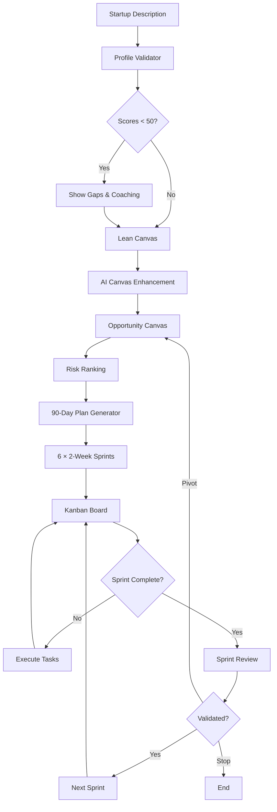
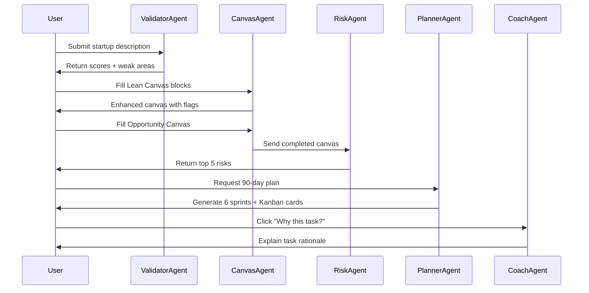
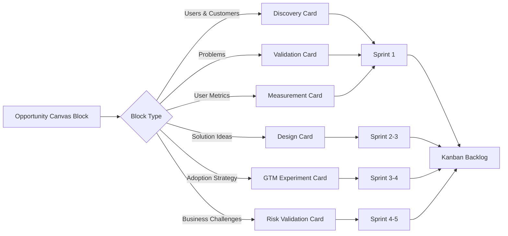
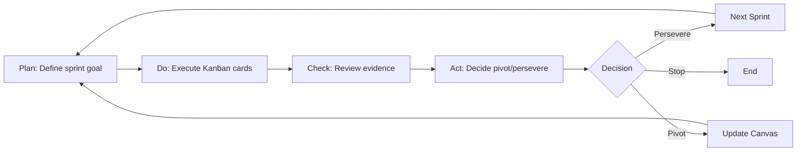
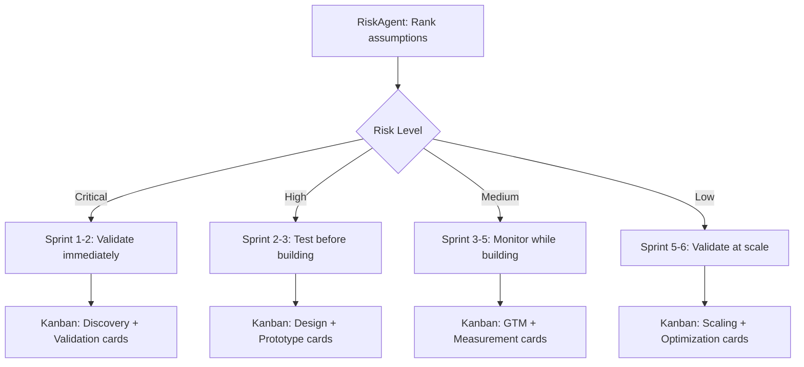
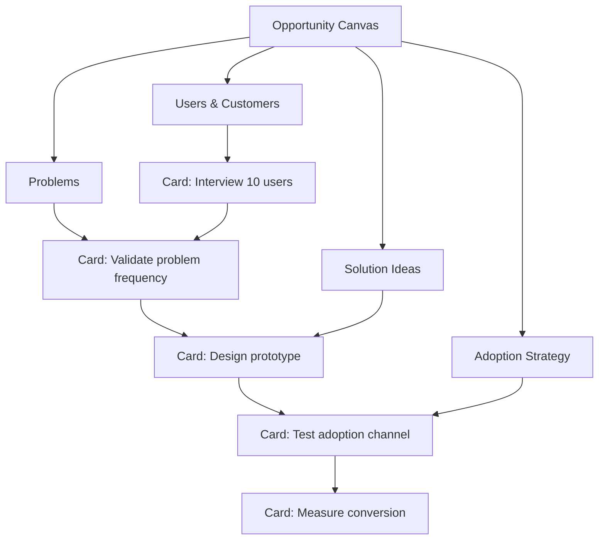

# Opportunity Canvas to 90-Day Execution Plan

## Overview

This document outlines the complete system flow from **Business Profile Validation → Lean Canvas → Opportunity Canvas → AI-Generated 90-Day Kanban Plan**. This transforms strategic thinking into execution-grade tasks with clear learning goals.

---

## System Philosophy

**Core Principle:** Force learning before building

**Flow:**
- **Score** (Profile Validator) → Is this startup fundamentally viable?
- **Hypothesize** (Lean Canvas) → What is the business model hypothesis?
- **Focus** (Opportunity Canvas) → Which opportunity is worth betting on now?
- **Execute** (90-Day Plan) → What exactly do we do next, week by week?

---

## Summary Table: Features, Screens, Agents

### Features

| Feature | Purpose | Output |
|---------|---------|--------|
| **Profile Validator** | Establish baseline quality and risks | Scores + weak areas + primary constraint |
| **Lean Canvas** | Structure business hypothesis | AI-enhanced canvas with quantified blocks |
| **Opportunity Canvas** | Select primary opportunity to validate | Focused canvas defining what to test first |
| **90-Day Plan Generator** | Convert strategy into execution | 6 × 2-week sprints with Kanban cards |
| **AI Coach Panel** | Explain why each task matters | Contextual guidance per sprint |

---

### Screens

| Screen # | Screen Name | Primary User Action | AI Role |
|----------|-------------|---------------------|---------|
| **1** | Startup Profile Validator | Enter startup description + answer questions | Score clarity, desirability, feasibility; flag risks |
| **2** | Lean Canvas (AI-Assisted) | Fill 9 blocks with AI improvements | Improve questions, quantify pain/value, flag vague blocks |
| **3** | Opportunity Canvas | Define who, what problem, which solution | Validate focus area selection |
| **4** | 90-Day Kanban Board | Drag/drop tasks, mark complete | Generate sprint goals and cards from canvas |
| **5** | Sprint Review | Review evidence, decide pivot/persevere | Analyze results, recommend next sprint |

---

### AI Agents

| Agent | Role | Input | Output | Model |
|-------|------|-------|--------|-------|
| **ValidatorAgent** | Score startup + find weakest dimension | Startup description + founder answers | Dimension scores (0-10), identified weak areas | Gemini Pro |
| **CanvasAgent** | Improve Lean & Opportunity Canvas inputs | User-entered canvas blocks | Enhanced, quantified, specific blocks | Gemini Pro |
| **RiskAgent** | Identify riskiest assumption | Completed canvas + validator scores | Top 3 assumptions to test, ordered by risk | Gemini Pro |
| **PlannerAgent** | Convert assumptions → sprint goals → tasks | Opportunity Canvas + risk ranking | 6 × 2-week sprints with Kanban cards | Gemini Pro |
| **ResearchAgent** | Pull relevant market benchmarks & reports | Industry + problem space | Market sizing, competitors, adoption patterns | Gemini Pro + Search |
| **CoachAgent** | Explain why each task exists | Canvas block + Kanban card | Plain-English rationale for task | Gemini Flash |

---

## Screen Flow (End-to-End User Experience)

### Screen 1: Startup Profile Validator

**Purpose:** Establish baseline quality and risks

**Inputs:**
- Startup description (1-2 sentences)
- Founder answers to profile questions

**AI Processing:**
- ValidatorAgent scores 7 dimensions (Problem, Solution, Market, Competition, Business Model, Team, Timing)
- Identifies weak areas (e.g., "Acquisition strategy unclear")
- Flags primary constraint (e.g., "Willingness to pay is unvalidated")

**Outputs:**
- Overall score (0-100)
- Dimension breakdown (0-10 per dimension)
- Risk summary (top 3 concerns)
- Recommendation: "Start with Lean Canvas to structure your hypothesis"

**Navigation:** Click "Continue to Lean Canvas" →

---

### Screen 2: Lean Canvas (AI-Assisted)

**Purpose:** Structure the business model hypothesis

**Layout:** 9 blocks (Problem, Customer Segments, Unique Value Proposition, Solution, Channels, Revenue Streams, Cost Structure, Key Metrics, Unfair Advantage)

**AI Processing per block:**
- CanvasAgent improves vague inputs
- Quantifies pain, value, and channels
- Flags risky or incomplete blocks
- Suggests specific language (e.g., "Marketing agencies" → "B2B marketing agencies (5-50 employees) struggling with campaign ROI")

**Outputs:**
- Completed Lean Canvas with AI enhancements
- Risk flags per block (red/yellow/green)
- Confidence score (0-100)
- Recommendation: "Your UVP is clear, but customer acquisition is risky. Focus on this in Opportunity Canvas."

**Navigation:** Click "Define Opportunity" →

---

### Screen 3: Opportunity Canvas

**Purpose:** Decide what to validate first

**10 Blocks:**

| Block | Question Answered |
|-------|-------------------|
| **Users & Customers** | Who exactly? (specific persona) |
| **Problems** | Which problem? (ranked by severity) |
| **Solutions Today** | What do they use now? (workarounds + competitors) |
| **Solution Ideas** | Why this solution? (3 hypotheses) |
| **How Users Use It** | How will it be adopted? (workflow integration) |
| **Adoption Strategy** | How will they discover it? (channels) |
| **User Metrics** | How is success measured? (leading indicators) |
| **Business Challenges** | What could go wrong? (risks) |
| **Budget** | What resources are available? (time, money, team) |
| **Business Benefits** | What's the outcome if this works? (revenue, retention) |

**AI Processing:**
- RiskAgent ranks assumptions by risk
- PlannerAgent maps blocks → sprint goals
- CoachAgent explains focus rationale

**Outputs:**
- Completed Opportunity Canvas
- Risk-ranked assumptions (top 5)
- Recommended focus area (e.g., "Validate Problem + Adoption Strategy first")
- Preview of 90-day plan

**Navigation:** Click "Generate 90-Day Plan" →

---

### Screen 4: 90-Day AI Plan (Kanban Board)

**Purpose:** Turn strategy into execution

**Structure:**
- 6 × 2-week sprints
- PDCA loop per sprint (Plan → Do → Check → Act)
- Kanban columns: Backlog, Sprint 1-6, Review

**Card Generation Logic:**
Each Opportunity Canvas block generates 1-3 Kanban cards with:
- **Title:** Assumption being tested
- **Canvas Source Badge:** (Problem, Adoption, Metric)
- **Success Criteria:** Clear pass/fail condition
- **Evidence Status:** Not Started / In Progress / Validated / Invalidated

**AI Processing:**
- PlannerAgent creates cards from canvas blocks
- CoachAgent adds "Why this matters" tooltip
- RiskAgent orders cards by risk (highest first)

**Outputs:**
- 6 sprints with 3-5 cards each (18-30 total tasks)
- Sprint goals at top of each column
- Progress indicators (% validated)
- AI recommendations sidebar

**Navigation:** Click on card to expand details →

---

### Screen 5: Sprint Review

**Purpose:** Decide pivot/persevere based on evidence

**Inputs:**
- Marked tasks (validated/invalidated)
- Evidence uploaded (interviews, data, prototypes)

**AI Processing:**
- CoachAgent analyzes results
- RiskAgent updates risk rankings
- PlannerAgent recommends next sprint adjustments

**Outputs:**
- Sprint summary (what was learned)
- Decision recommendation (continue, pivot, stop)
- Updated 90-day plan for next sprint

**Navigation:** Click "Start Next Sprint" or "Pivot Canvas" →

---

## Opportunity Canvas → Kanban Card Mapping

### Detailed Mapping Table

| Opportunity Block | Kanban Card Type | Example Card Title | Success Criteria | Sprint Timing |
|-------------------|------------------|--------------------|------------------|---------------|
| **Users & Customers** | Discovery | Interview 10 founders with recent failed launches | 10 interviews completed, personas documented | Sprint 1 |
| **Problems** | Validation | Validate top 3 frustrations with frequency + cost | 70%+ confirm problem occurs weekly + costs $500+/mo | Sprint 1 |
| **Solutions Today** | Competitive Analysis | Document current tools + workarounds used | Map 5+ competitors + workarounds, identify gaps | Sprint 1-2 |
| **Solution Ideas** | Design | Sketch Wizard-of-Oz demo for Hypothesis #1 | 5 users test demo, 60%+ would switch from current solution | Sprint 2-3 |
| **How Users Use It** | User Journey Mapping | Map first-time user flow from discovery to value | Journey documented, 3+ friction points identified | Sprint 2 |
| **Adoption Strategy** | GTM Experiment | Test cold email vs LinkedIn outreach (50 each) | 5%+ response rate on best channel | Sprint 3-4 |
| **User Metrics** | Measurement Setup | Define success metric for Sprint 1 (leading indicator) | Metric defined, baseline measured | Sprint 1 |
| **Business Challenges** | Risk Validation | Validate willingness to pay ($X/month) | 30%+ say "yes" to pricing in customer interviews | Sprint 4-5 |
| **Budget** | Constraint Definition | Define max spend/time per experiment | Budget allocated across 6 sprints | Sprint 1 |
| **Business Benefits** | Outcome Tracking | Track conversion from free trial to paid | 10%+ conversion rate from trial to paid | Sprint 5-6 |

---

## AI Prompts Per Canvas Block

### Block 1: Users & Customers

**AI Prompt:**
```
You are an expert startup advisor helping a founder define their target customer.

Input: "{user_input}"

Task:
1. Identify if the description is too broad (e.g., "small businesses")
2. Suggest 3 specific personas with:
   - Company size (employees or revenue)
   - Industry vertical
   - Current pain severity (high/medium/low)
   - Buying power (budget authority: yes/no)

3. For each persona, explain:
   - Why they are a good early adopter
   - What trigger event makes them search for a solution

Output format:
Persona 1: [Name]
- Specificity: [specific description]
- Pain severity: [high/medium/low]
- Early adopter fit: [why]
- Trigger event: [when they search]

Recommendation: Start with [Persona X] because [reason]
```

**Example Output:**
```
Persona 1: Marketing Agency Owner (5-20 employees)
- Specificity: B2B agencies serving e-commerce brands, $500K-$2M revenue
- Pain severity: High (lose 10+ hours/week on manual campaign planning)
- Early adopter fit: Tech-savvy, willing to try new tools if time-saving is proven
- Trigger event: When client asks for faster campaign turnaround

Recommendation: Start with Marketing Agency Owner because they have budget authority and immediate pain.
```

---

### Block 2: Problems

**AI Prompt:**
```
You are a problem validation expert.

Input: "{user_input}"

Task:
1. Extract the core problem statement
2. Score the problem on:
   - Frequency (daily/weekly/monthly/rare)
   - Cost (time or money lost per occurrence)
   - Urgency (must solve now vs can wait)
   - Current workarounds (manual/paid tool/accept pain)

3. Identify validation risks:
   - Is the problem self-reported or observed?
   - Is the cost quantifiable?
   - Would solving this be a "vitamin" or "painkiller"?

Output format:
Problem: [one sentence]
Frequency: [X times per week]
Cost: [$Y or Z hours per occurrence]
Urgency: [high/medium/low]
Current workaround: [description]

Validation risk: [what could invalidate this]
Recommended test: [how to validate in 1-2 weeks]
```

**Example Output:**
```
Problem: Marketing agencies waste 10+ hours per campaign on manual brief creation
Frequency: 3-5 times per week
Cost: 10 hours per brief × $50/hour = $500 per campaign
Urgency: High (clients demand faster turnaround)
Current workaround: Manual Google Docs + Copy-paste from past briefs

Validation risk: Problem may be overstated; agencies may not value time savings if output quality drops
Recommended test: Interview 10 agencies, ask "How much time do you spend on briefs?" and "Would you pay to cut this in half?"
```

---

### Block 3: Solutions Today

**AI Prompt:**
```
You are a competitive analysis expert.

Input: "{user_input}"

Task:
1. Identify all current solutions:
   - Direct competitors (same problem, same solution)
   - Indirect competitors (same problem, different solution)
   - Workarounds (manual processes, spreadsheets, etc.)

2. For each solution, analyze:
   - What it does well
   - What it does poorly (gaps)
   - Why users might switch

3. Identify your wedge:
   - What can you do 10x better on ONE dimension?
   - What is underserved in the market?

Output format:
Direct Competitors:
- [Tool 1]: Does [X] well, but lacks [Y]

Indirect Competitors:
- [Tool 2]: Solves [X] differently via [method]

Workarounds:
- [Manual process]: Takes [Z] time, error-prone

Your Wedge: [one sentence - what you do 10x better]
```

**Example Output:**
```
Direct Competitors:
- Jasper AI: Generates marketing copy well, but no brief structure or campaign planning
- Copy.ai: Fast content generation, but generic output, no industry customization

Indirect Competitors:
- Notion templates: Structured briefs, but no AI, still manual
- Freelance copywriters: High quality, but expensive ($500+) and slow (3-5 days)

Workarounds:
- Google Docs + Copy-paste from old briefs: Free but takes 10 hours per campaign

Your Wedge: AI-powered brief generator with fashion industry context, 10x faster than manual (10 hours → 30 minutes)
```

---

### Block 4: Solution Ideas

**AI Prompt:**
```
You are a solution design expert helping founders test hypotheses.

Input: "{user_input}"

Task:
1. Extract 3 solution hypotheses from the input
2. For each hypothesis, define:
   - Core assumption (what must be true)
   - Minimum feature set (MVP scope)
   - Validation method (Wizard of Oz, prototype, landing page)
   - Success criteria (quantifiable)

3. Rank hypotheses by:
   - Ease of testing (time + resources)
   - Risk reduction (does it test the riskiest assumption?)

Output format:
Hypothesis 1: [one sentence]
Core assumption: [what must be true]
MVP scope: [minimum features]
Validation method: [how to test]
Success criteria: [X% of users do Y]

Recommendation: Test [Hypothesis X] first because [reason]
```

**Example Output:**
```
Hypothesis 1: AI can generate campaign briefs 10x faster than manual process
Core assumption: AI output quality is "good enough" for agencies to use without heavy editing
MVP scope: Brief template (audience, tone, deliverables) + AI generator + export to PDF
Validation method: Wizard of Oz (human writes brief using AI prompts, delivers in 30 min)
Success criteria: 70%+ of users say "I would use this weekly"

Hypothesis 2: Fashion-specific context improves brief relevance
Core assumption: Generic AI briefs are too broad; fashion agencies need seasonal/trend awareness
MVP scope: Add fashion trends dropdown (Spring/Summer, Fall/Winter, Streetwear, Luxury)
Validation method: A/B test generic vs fashion-contextualized briefs
Success criteria: Fashion-contextualized briefs score 8+/10 vs 6/10 for generic

Hypothesis 3: Agencies will pay $99/month for 10x time savings
Core assumption: Time saved (10 hours → 30 min) is worth $99/month
MVP scope: Pricing page + Stripe checkout (no product yet, just gauge intent)
Validation method: Landing page with fake pricing, track "Start Free Trial" clicks
Success criteria: 5%+ click-through to fake checkout

Recommendation: Test Hypothesis 1 first because it validates the core value prop (speed + quality)
```

---

### Block 5: How Users Use It

**AI Prompt:**
```
You are a user journey expert.

Input: "{user_input}"

Task:
1. Map the user journey from discovery to value:
   - How do they discover the solution? (search, referral, ad)
   - What is their first action? (sign up, book demo, watch video)
   - What is the "aha moment"? (when they see value)
   - What is the habit loop? (how often they return)

2. Identify friction points:
   - Where might users drop off?
   - What causes confusion or doubt?

3. Suggest experiments to optimize the journey

Output format:
Discovery: [channel]
First action: [what they do]
Aha moment: [when they see value]
Habit loop: [frequency of use]

Friction points:
1. [point 1]
2. [point 2]

Experiment: [how to test journey optimization]
```

**Example Output:**
```
Discovery: Google search "AI campaign brief generator fashion"
First action: Sign up with email, see template library
Aha moment: Generate first brief in 2 minutes vs 10 hours manual
Habit loop: Return 3x/week for new campaign briefs

Friction points:
1. Sign-up friction: Email + password vs one-click Google login
2. Empty state: New users see blank template, not sure where to start

Experiment: A/B test Google login vs email signup, measure completion rate
```

---

### Block 6: Adoption Strategy

**AI Prompt:**
```
You are a go-to-market strategist.

Input: "{user_input}"

Task:
1. Identify best channels for reaching target customer:
   - Organic (SEO, content, community)
   - Paid (Google Ads, LinkedIn, Facebook)
   - Referral (word-of-mouth, partnerships)
   - Sales (outbound email, cold calls)

2. For each channel, estimate:
   - Time to first customer (days/weeks)
   - Cost per customer (CAC)
   - Scalability (low/medium/high)

3. Recommend 2 channels to test first

Output format:
Channel 1: [name]
- Time to first customer: [X days]
- CAC: [$Y]
- Scalability: [low/medium/high]
- Why test this: [reason]

Recommendation: Test [Channel X] and [Channel Y] in parallel
```

**Example Output:**
```
Channel 1: LinkedIn outreach to marketing agency owners
- Time to first customer: 7-14 days
- CAC: $50 (10 hours @ $50/hour ÷ 10 responses)
- Scalability: Medium (limited by time)
- Why test this: Direct access to decision-makers, can validate problem + pricing

Channel 2: Google Ads ("AI campaign brief generator")
- Time to first customer: 3-5 days
- CAC: $200 (estimated CPC $5, 2% conversion = $5 ÷ 0.02)
- Scalability: High (budget-dependent)
- Why test this: Fast feedback, search intent = high buying intent

Recommendation: Test LinkedIn outreach first (low cost, high learning), then Google Ads if pricing is validated
```

---

### Block 7: User Metrics

**AI Prompt:**
```
You are a metrics expert helping founders define success.

Input: "{user_input}"

Task:
1. Define success metrics for each stage:
   - Discovery: How many people visit landing page?
   - Activation: How many sign up?
   - Aha moment: How many generate first brief?
   - Retention: How many return in week 2?
   - Revenue: How many pay?

2. For each metric, define:
   - Target value (based on industry benchmarks)
   - How to measure (analytics tool, manual tracking)
   - Leading indicator (early signal of success)

Output format:
Metric: [name]
Target: [X%]
Measurement: [tool]
Leading indicator: [early signal]
```

**Example Output:**
```
Metric: Activation (Sign-ups)
Target: 30% of landing page visitors sign up
Measurement: Google Analytics + Supabase auth logs
Leading indicator: 50%+ click "Get Started" button

Metric: Aha Moment (First brief generated)
Target: 70% of sign-ups generate a brief within 24 hours
Measurement: Supabase database query (created_at timestamp)
Leading indicator: 80%+ start the brief flow (click "New Brief")

Metric: Retention (Week 2 return)
Target: 40% return in week 2
Measurement: Supabase user activity logs
Leading indicator: Users who generate 2+ briefs in week 1 have 60% week-2 retention
```

---

### Block 8: Business Challenges

**AI Prompt:**
```
You are a risk management expert.

Input: "{user_input}"

Task:
1. Identify top 5 risks that could kill the business:
   - Market risk (is the market too small?)
   - Product risk (can we build it?)
   - Distribution risk (can we reach customers?)
   - Monetization risk (will they pay?)
   - Competition risk (can we win?)

2. For each risk, define:
   - Severity (high/medium/low)
   - Validation method (how to test)
   - Decision criteria (what evidence proves/disproves risk)

Output format:
Risk 1: [name]
Severity: [high/medium/low]
Validation method: [how to test]
Decision criteria: If [X], then pivot; if [Y], then proceed
```

**Example Output:**
```
Risk 1: Willingness to pay ($99/month)
Severity: High (if they won't pay, no business)
Validation method: Customer interviews + pricing page test
Decision criteria: If <20% say yes to $99/month, pivot to freemium; if >30%, proceed

Risk 2: AI output quality is too generic
Severity: High (if quality is bad, no retention)
Validation method: Wizard of Oz test with 10 users
Decision criteria: If quality scores <7/10, add human editing; if >8/10, proceed with AI-only

Risk 3: Market is too small (only 500 agencies match criteria)
Severity: Medium (can expand to adjacent markets)
Validation method: Market sizing research + LinkedIn search
Decision criteria: If TAM <$10M, expand to adjacent verticals (e.g., e-commerce brands)
```

---

### Block 9: Budget

**AI Prompt:**
```
You are a budget planning expert.

Input: "{user_input}"

Task:
1. Allocate budget across 6 sprints (12 weeks):
   - Discovery (interviews, research)
   - Design (prototypes, Figma)
   - Development (MVP, no-code tools)
   - Marketing (ads, landing page)
   - Operations (tools, services)

2. Define constraints:
   - Max spend per sprint
   - Time available per week
   - Team size

Output format:
Total Budget: [$X]
Sprint 1-2: [$Y] (Discovery + Design)
Sprint 3-4: [$Z] (MVP + Marketing)
Sprint 5-6: [$W] (Scaling experiments)

Constraints:
- Max spend: [$X/sprint]
- Time: [Y hours/week]
- Team: [Z people]
```

**Example Output:**
```
Total Budget: $5,000
Sprint 1-2: $500 (Customer interviews $0, Figma $0, landing page $100, ads $400)
Sprint 3-4: $2,000 (No-code MVP $500, ads $1,000, tools $500)
Sprint 5-6: $2,500 (Scale ads $2,000, analytics tools $500)

Constraints:
- Max spend: $1,000/sprint (except scaling)
- Time: 20 hours/week (founder time)
- Team: 1 founder + 1 contract designer
```

---

### Block 10: Business Benefits

**AI Prompt:**
```
You are a business outcomes expert.

Input: "{user_input}"

Task:
1. Define success outcomes for each stage:
   - Validation: What evidence proves product-market fit?
   - Growth: What does success look like in 6 months?
   - Scale: What does success look like in 12 months?

2. For each outcome, define:
   - Revenue target
   - Customer count
   - Retention rate
   - NPS score

Output format:
Validation (3 months):
- Revenue: [$X MRR]
- Customers: [Y paying]
- Retention: [Z%]

Growth (6 months):
- Revenue: [$X MRR]
- Customers: [Y paying]
- Retention: [Z%]
```

**Example Output:**
```
Validation (3 months):
- Revenue: $1,000 MRR (10 customers @ $99/month)
- Customers: 10 paying, 50 free trial
- Retention: 60% month-2 retention
- NPS: 40+ (would recommend)

Growth (6 months):
- Revenue: $10,000 MRR (100 customers @ $99/month)
- Customers: 100 paying, 500 free trial
- Retention: 70% month-2 retention
- NPS: 50+ (strong advocates)

Scale (12 months):
- Revenue: $50,000 MRR (500 customers @ $99/month)
- Customers: 500 paying, 2,000 free trial
- Retention: 80% month-2 retention
- NPS: 60+ (organic referrals)
```

---

## Kanban Card Templates

### Template 1: Discovery Card

**Title:** Interview [X] users about [problem]

**Canvas Source:** Users & Customers, Problems

**Description:**
Conduct [X] interviews with [persona] to validate:
1. Problem frequency (daily/weekly/monthly)
2. Cost of problem (time or money)
3. Current workarounds used
4. Willingness to try new solution

**Success Criteria:**
- [X] interviews completed
- [Y%] confirm problem occurs at least weekly
- [Z%] say current solution is inadequate

**Evidence:**
- Interview notes (Google Doc link)
- Recorded calls (if consent given)
- Persona validation matrix

**AI Coach Tip:**
"This task validates if the problem is real and severe. If <50% confirm weekly pain, pivot to a different problem."

---

### Template 2: Validation Card

**Title:** Validate [assumption] with [method]

**Canvas Source:** Problems, Solution Ideas

**Description:**
Test the assumption that [assumption statement].

Method: [Wizard of Oz / Prototype / Landing page / Survey]

**Success Criteria:**
- [X%] of users [behavior]
- Confidence level: [high/medium/low]

**Evidence:**
- Test results (spreadsheet)
- User feedback (quotes)
- Metrics dashboard screenshot

**AI Coach Tip:**
"This is a riskiest assumption test. If it fails, [what to do next]."

---

### Template 3: Design Card

**Title:** Create [prototype] for [use case]

**Canvas Source:** Solution Ideas, How Users Use It

**Description:**
Design and test a [prototype type] that demonstrates [value prop].

**Success Criteria:**
- [X] users test prototype
- [Y%] complete core workflow
- [Z/10] average usability score

**Evidence:**
- Figma/prototype link
- User testing videos
- Feedback summary

**AI Coach Tip:**
"Keep it minimal. Only build what's needed to test [core assumption]."

---

### Template 4: GTM Experiment Card

**Title:** Test [channel] for [customer acquisition]

**Canvas Source:** Adoption Strategy

**Description:**
Run a [timeframe] experiment on [channel] to acquire [X] customers.

Budget: [$Y]
Target CAC: [$Z]

**Success Criteria:**
- [X] customers acquired
- CAC ≤ [$Z]
- [Y%] conversion rate

**Evidence:**
- Analytics dashboard
- Campaign performance report
- Cost breakdown

**AI Coach Tip:**
"If CAC > 3x LTV, this channel is not scalable. Pivot to organic or referral."

---

### Template 5: Measurement Card

**Title:** Define and track [metric]

**Canvas Source:** User Metrics

**Description:**
Set up tracking for [metric name] to measure [what success looks like].

**Success Criteria:**
- Metric defined with clear formula
- Baseline measured
- Target set for next sprint

**Evidence:**
- Analytics setup (screenshot)
- Baseline data (spreadsheet)
- Target vs actual comparison

**AI Coach Tip:**
"This metric is a leading indicator of [outcome]. Track it weekly."

---

### Template 6: Risk Validation Card

**Title:** Validate [risk] with [test]

**Canvas Source:** Business Challenges

**Description:**
Test the risk that [risk statement] could invalidate the business.

**Success Criteria:**
- Evidence collected: [yes/no]
- Decision made: [pivot/persevere/stop]

**Evidence:**
- Test results
- Decision rationale
- Next steps

**AI Coach Tip:**
"If this risk is confirmed, [pivot recommendation]."

---

## Mermaid Diagrams

### Diagram 1: Full System Workflow



---

### Diagram 2: AI Agent Flow



---

### Diagram 3: Kanban Card Generation Logic



---

### Diagram 4: PDCA Sprint Loop



---

### Diagram 5: Risk-to-Sprint Mapping



---

### Diagram 6: Canvas-to-Card Dependency Tree



---

## Why This System Works

### 1. Forces Learning Before Building
Most tools stop at planning. This system **enforces validation** before execution. You can't skip to Sprint 3 without validating Sprint 1 assumptions.

### 2. Reduces Risk Systematically
RiskAgent orders tasks by **riskiest assumption first**. If the core hypothesis is wrong, you learn it in Week 2, not Month 6.

### 3. Clear Decision Points
Every sprint ends with **pivot/persevere/stop**. No endless building without validation.

### 4. AI as Coach, Not Oracle
CoachAgent explains **why** each task exists, so founders learn the validation process, not just follow steps.

### 5. Evidence-Driven
Every card requires **evidence** (interviews, data, prototypes). No opinions, only validated learning.

---

## Next Steps for Implementation

### Phase 1: Profile Validator (Week 1-2)
- Build 7-dimension scoring system
- Create ValidatorAgent prompt
- Design score display UI

### Phase 2: Lean Canvas AI (Week 3-4)
- Implement CanvasAgent per block
- Add risk flagging logic
- Design canvas enhancement UI

### Phase 3: Opportunity Canvas (Week 5-6)
- Build 10-block canvas form
- Integrate RiskAgent ranking
- Design risk visualization

### Phase 4: 90-Day Plan Generator (Week 7-10)
- Build PlannerAgent card generation
- Create Kanban board UI
- Implement drag/drop functionality

### Phase 5: Sprint Review System (Week 11-12)
- Build evidence upload system
- Create CoachAgent decision logic
- Design pivot/persevere UI

---

## Appendix: Figma Design Prompts

### Prompt 1: Workflow Progress Bar

**Design Request:**
Create a horizontal progress bar showing 4 stages:
1. Profile (with checkmark if complete)
2. Lean Canvas (current step highlighted)
3. Opportunity (upcoming, gray)
4. 90-Day Plan (upcoming, gray)

**Style:**
- Clean, minimal, professional
- Emerald green (#0D5F4E) for complete/current
- Light gray (#E5E7EB) for upcoming
- Connecting lines between stages
- Icons per stage (chart, canvas, target, calendar)

---

### Prompt 2: Kanban Board with AI Insights

**Design Request:**
Create a Kanban board with:
- Columns: Backlog, Sprint 1-6, Review
- Cards: Title, canvas source badge, success criteria, evidence status
- AI Coach panel on right sidebar
- Sprint goals at top of each column

**Style:**
- Calm, professional, startup-focused
- Subtle color coding per canvas block (blue: discovery, green: validation, purple: design, orange: GTM)
- Drag/drop affordance (subtle shadow on hover)
- High clarity, low visual noise

**Interactions:**
- Click card → expand to show details
- Click "Why this?" → AI Coach tooltip
- Drag card → move between sprints
- Mark complete → checkmark + evidence upload

---

### Prompt 3: Opportunity Canvas Layout

**Design Request:**
Create a 10-block canvas with:
- Left panel: Canvas blocks (color-coded)
- Center panel: AI insights per block
- Right panel: Risk ranking (top 5 assumptions)

**Style:**
- Two-column layout (canvas left, AI right)
- Each block expandable with AI prompts
- Risk badges (red: critical, yellow: high, gray: medium)
- Clean typography, generous whitespace

---

## File Structure (for future implementation)

```
/app/opportunity-canvas/
  page.tsx (main canvas UI)
  
/app/opportunity-canvas/components/
  CanvasBlock.tsx (reusable block component)
  AIInsightPanel.tsx (AI suggestions)
  RiskRanking.tsx (risk visualization)
  
/app/90-day-plan/
  page.tsx (Kanban board)
  
/app/90-day-plan/components/
  KanbanCard.tsx (draggable card)
  SprintColumn.tsx (sprint container)
  AICoachPanel.tsx (sidebar)
  
/lib/ai-agents/
  validatorAgent.ts
  canvasAgent.ts
  riskAgent.ts
  plannerAgent.ts
  researchAgent.ts
  coachAgent.ts
  
/types/
  opportunity.ts (Opportunity Canvas types)
  kanban.ts (Kanban card types)
```

---

**End of Document**

This plan provides a complete blueprint for transforming strategic thinking (Opportunity Canvas) into execution-grade tasks (90-Day Kanban Plan) with AI guidance at every step.
