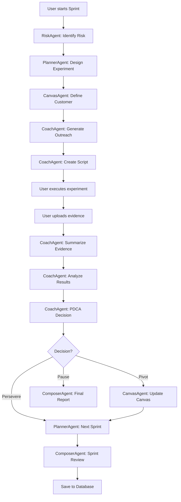
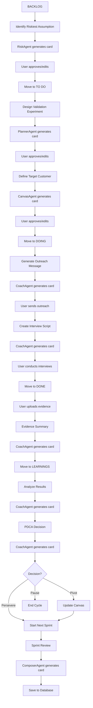
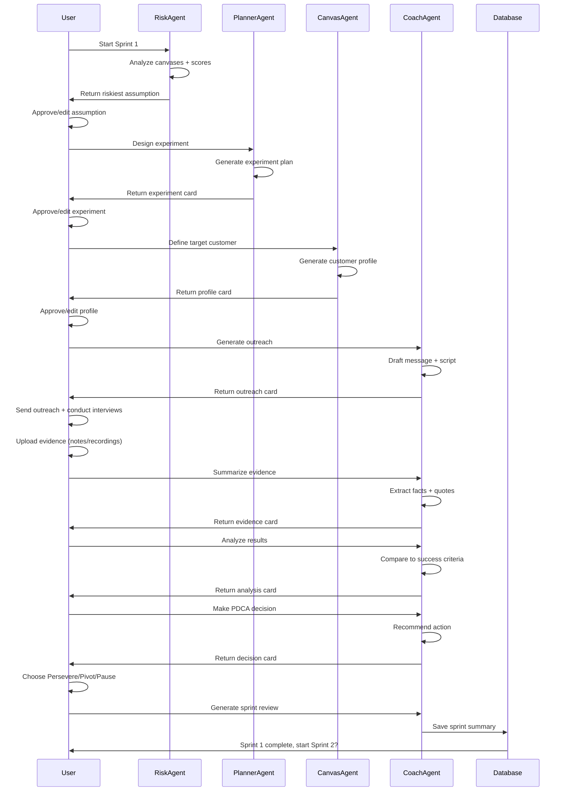
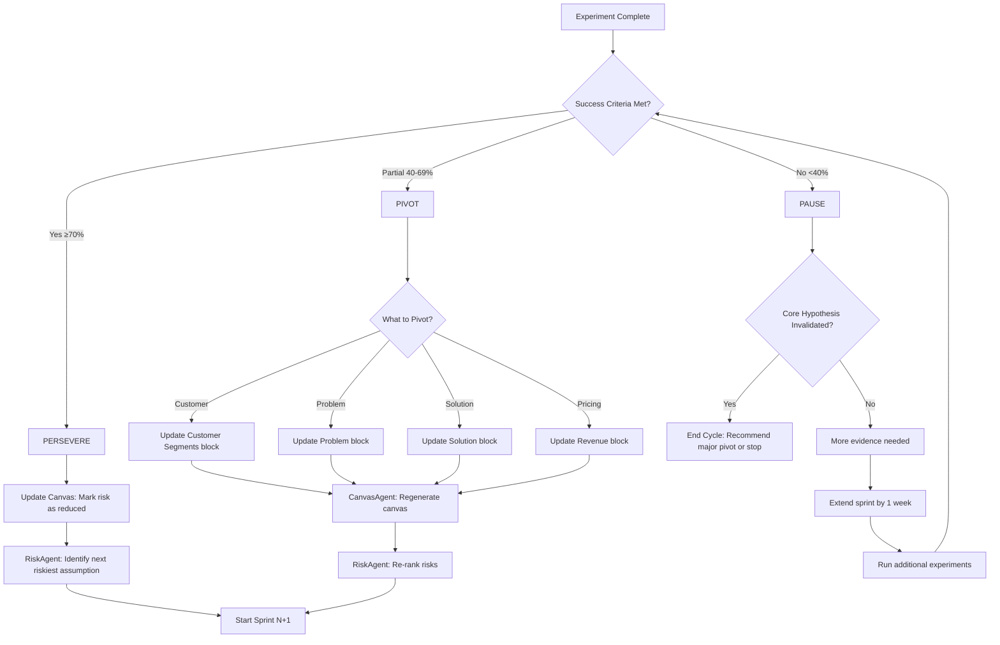
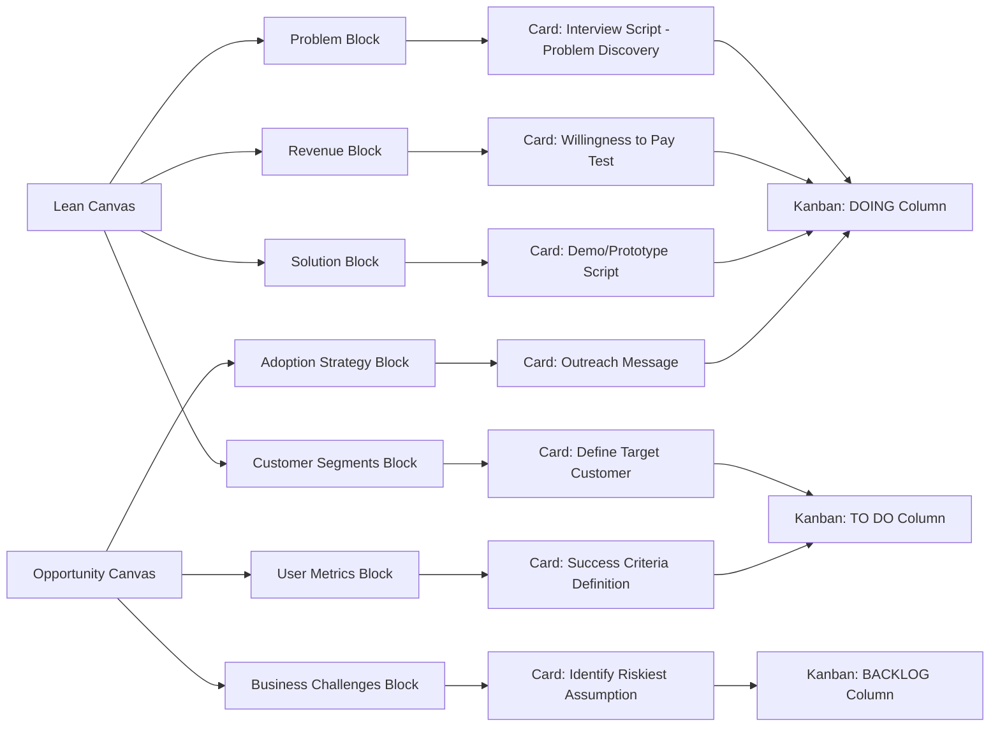
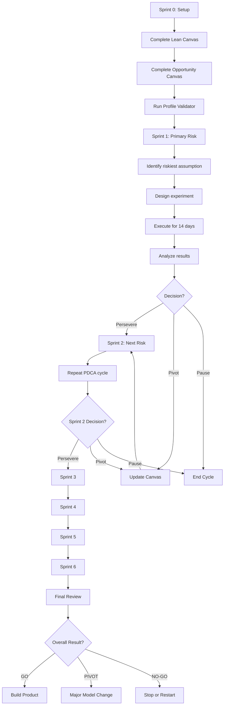

# Kanban Card AI Prompts System

## Overview

This document defines the complete AI prompt system for generating, executing, and analyzing Kanban cards in the 90-Day Validation Cycle. Every card is designed to replace belief with proof through structured experimentation.

---

## Core Philosophy

**Every card exists to replace belief with proof.**

### Product Principles

1. **Evidence > Optimism** - Facts over feelings
2. **Decisions over Perfection** - Clear action beats endless planning
3. **Plain Language** - No startup jargon
4. **Action-Oriented** - Real-world experiments, not theory
5. **Fast Feedback** - 14-day max per experiment

---

## Global Prompt Context

**Injected into every card generation:**

```
You are an AI startup validation agent.

Context:
- Startup profile (problem, customer, model)
- Lean Canvas (9 blocks)
- Opportunity Canvas (10 blocks)
- Market research summaries
- Previous sprint learnings

Goal:
Help validate the riskiest assumption within a 90-day cycle.

Rules:
- Be concrete (avoid "consider doing X" - say "do X")
- Prefer real-world actions over theory
- Define success/failure clearly (quantifiable criteria)
- Reference specific canvas blocks when relevant
- No startup jargon (write for non-technical founders)

Output format:
- Clear action items
- Specific success criteria
- Estimated time/cost
- Evidence requirements
```

---

## Kanban Board Structure

### Columns (5)

| Column | Purpose | Card Count (Typical) | Duration |
|--------|---------|---------------------|----------|
| **Backlog** | Identify what to test | 3-5 cards | N/A |
| **To Do** | Design experiments | 2-3 cards | 1-2 days |
| **Doing** | Execute in real world | 1-2 cards | 7-10 days |
| **Done** | Capture evidence | 2-4 cards | 1-2 days |
| **Learnings** | Make decisions | 1 card | 1-2 days |

**Total Sprint Duration:** 14 days (2 weeks)

---

## Card Types & AI Prompts

### Column 1: BACKLOG

#### Card Type: Identify Riskiest Assumption

**Purpose:** Analyze canvases and prioritize what to test first

**AI Agent:** RiskAgent (Gemini Pro)

**Input Required:**
- Lean Canvas (complete)
- Opportunity Canvas (complete)
- Validator scores (7 dimensions)

**AI Prompt:**

```
Analyze the provided Lean Canvas and Opportunity Canvas.

Task:
Identify the single riskiest assumption that must be true for this startup to succeed.

Consider:
1. Customer pain severity (is the problem real?)
2. Willingness to pay (will they buy?)
3. Solution feasibility (can it be built?)
4. Market accessibility (can we reach customers?)
5. Competitive differentiation (why choose us?)

For each assumption, evaluate:
- Impact: If wrong, does the business fail? (High/Medium/Low)
- Uncertainty: How confident are we? (0-100%)
- Cost to validate: Time and money required (Low/Medium/High)

Formula: Risk Score = (Impact × Uncertainty) / Cost to validate

Output:
1. Assumption statement (one sentence)
2. Risk score (0-100)
3. Why this is the riskiest assumption (2-3 sentences)
4. What evidence would reduce uncertainty (specific list)
5. Recommended validation method (interview/landing page/paid pilot/demo)

Example output:
{
  "assumption": "Fashion marketing agencies will pay $99/month for AI campaign brief generation",
  "risk_score": 85,
  "reasoning": "Willingness to pay is completely unvalidated. Agencies may love the tool but refuse to pay if they perceive AI as 'free'. This is an existential risk.",
  "evidence_needed": [
    "10+ agencies say 'yes' to $99/month pricing in interviews",
    "3+ agencies pre-pay for pilot",
    "Conversion rate from demo to paid is >20%"
  ],
  "validation_method": "Paid pilot campaign"
}
```

**Success Criteria:**
- Assumption is specific and falsifiable
- Risk score is justified with reasoning
- Evidence requirements are clear
- Validation method matches assumption type

**Agent Routing:** RiskAgent → PlannerAgent

---

### Column 2: TO DO

#### Card Type: Design Validation Experiment

**Purpose:** Convert assumption into a testable experiment

**AI Agent:** PlannerAgent (Gemini Pro)

**Input Required:**
- Risky assumption (from Backlog)
- Budget constraints (from Opportunity Canvas)
- Time constraints (14-day sprint)

**AI Prompt:**

```
Given this assumption:
"{assumption_statement}"

Design a fast, low-cost experiment to validate or invalidate it within 14 days.

Constraints:
- Budget: ${budget_max}
- Time: 14 days
- Team: {team_size} people, {hours_per_week} hours/week

Experiment design requirements:
1. Type: Choose ONE (interview, landing page, paid pilot, Wizard of Oz demo, survey)
2. Sample size: Minimum participants needed for statistical significance
3. Target user profile: Specific persona (job role, company size, trigger event)
4. Exact action: What must users DO? (not "respond positively" - be specific)
5. Success criteria: Clear pass/fail threshold (e.g., "30%+ say yes to $99 pricing")
6. Failure criteria: When to stop early (e.g., "0/10 show interest after 10 interviews")

Output format:
{
  "experiment_type": "Paid pilot campaign",
  "hypothesis": "If we offer a $100 paid pilot (3 sessions), 20%+ of demo attendees will pre-pay",
  "sample_size": 20,
  "target_profile": {
    "job_role": "Marketing Agency Owner",
    "company_size": "5-20 employees",
    "industry": "B2B marketing agencies serving e-commerce",
    "trigger_event": "Recent failed campaign or client churn in last 3 months"
  },
  "exact_action": "User books demo, completes session, pays $100 via Stripe link",
  "success_criteria": "4+ users (20%) convert from demo to paid pilot",
  "failure_criteria": "0/10 convert after 10 demos - stop and pivot",
  "estimated_time": "10 days (2 days setup, 7 days outreach, 1 day analysis)",
  "estimated_cost": "$200 (LinkedIn ads $150, tools $50)"
}
```

**Success Criteria:**
- Experiment is feasible within 14 days
- Sample size is realistic
- Success/failure criteria are quantifiable
- Cost is within budget

**Agent Routing:** PlannerAgent → CoachAgent (provides tips)

---

#### Card Type: Define Target Customer

**Purpose:** Specify exactly who to contact for experiment

**AI Agent:** CanvasAgent (Gemini Pro)

**Input Required:**
- Experiment design (from Design Validation Experiment card)
- Customer Segments block (from Lean Canvas)
- Users & Customers block (from Opportunity Canvas)

**AI Prompt:**

```
Define the ideal customer to contact for this experiment:
"{experiment_description}"

Avoid generic personas. Be ultra-specific.

Requirements:
1. Job role (not "founder" - what type of founder?)
2. Company stage (revenue, employees, funding)
3. Industry vertical (specific niche, not "B2B SaaS")
4. Recent trigger event (what happened that makes them search for a solution NOW?)
5. Where to reach them (LinkedIn, email list, community, event)
6. Red flags (who to AVOID contacting)

Output format:
{
  "job_role": "Marketing Agency Owner",
  "company_stage": {
    "revenue": "$500K-$2M annually",
    "employees": "5-20 people",
    "funding": "Bootstrapped or angel-funded"
  },
  "industry_vertical": "B2B marketing agencies serving e-commerce brands (fashion, beauty, home goods)",
  "trigger_event": "Lost a major client in last 3 months OR hired first full-time strategist",
  "reach_channels": [
    "LinkedIn (search 'Marketing Agency Owner' + 'E-commerce')",
    "Cold email via Apollo.io",
    "Agency Slack communities (GrowthHackers, Demand Curve)"
  ],
  "red_flags": [
    "Agencies <$300K revenue (too small, no budget)",
    "Agencies >$5M revenue (too big, established processes)",
    "Solo freelancers (not decision-makers)"
  ],
  "estimated_pool_size": "500-1,000 agencies in US matching criteria"
}
```

**Success Criteria:**
- Profile is specific enough to find 50-100 matching people
- Trigger event is recent (last 1-6 months)
- Reach channels are actionable
- Red flags prevent wasted outreach

**Agent Routing:** CanvasAgent → CoachAgent (validates targeting)

---

### Column 3: DOING

#### Card Type: Generate Outreach Message

**Purpose:** Draft outreach to invite customers to experiment

**AI Agent:** CoachAgent (Gemini Flash - fast)

**Input Required:**
- Target customer profile (from Define Target Customer)
- Experiment type (from Design Validation Experiment)
- Startup one-liner (from Lean Canvas)

**AI Prompt:**

```
Write a short outreach message to invite this target customer to participate in the experiment.

Target: {target_profile_summary}
Experiment: {experiment_type}
Ask: {specific_action_requested}

Constraints:
- 4-6 sentences total
- NO product pitching ("we built an AI tool...")
- Focus on THEIR problem, not your solution
- End with a specific ask (call, demo, payment, test)
- Conversational tone (not corporate)
- Subject line (if email) or hook (if LinkedIn)

Rules:
1. Lead with their pain or trigger event
2. Show you understand their context
3. Offer value exchange (their time for insight/help)
4. Make the ask clear and low-friction
5. Avoid buzzwords (AI-powered, revolutionary, disruptive)

Output format (Email):
{
  "subject_line": "Question about campaign brief workflow",
  "body": "Hi {First Name},\n\nI noticed {trigger event - e.g., your LinkedIn post about client churn}. I'm researching how agencies like yours handle campaign brief creation when clients demand faster turnaround.\n\nWould you be open to a 20-minute call to walk me through your current process? I'm building something that might help, but I'm more interested in understanding your workflow first.\n\nIf this resonates, here's my calendar: [link]\n\nThanks,\n{Your Name}",
  "follow_up_1": "(3 days later) Hi {First Name}, bumping this up. Still curious about your brief process if you have 20 min this week.",
  "follow_up_2": "(7 days later) Last ping — I know you're busy. If now's not the time, no worries. Good luck with {their specific challenge}."
}

Output format (LinkedIn):
{
  "connection_request": "Hi {First Name} — I'm researching campaign brief workflows at agencies like {Company Name}. Would love to connect and learn from your experience.",
  "first_message": "Thanks for connecting! Quick question: how do you handle campaign briefs when clients need faster turnaround? I'm talking to agency owners about this and would love 15 min of your time if you're open to it."
}
```

**Success Criteria:**
- Message is 4-6 sentences
- No product pitch
- Specific ask at the end
- Conversational tone
- Subject line/hook is curiosity-driven

**Agent Routing:** CoachAgent → (User sends outreach manually)

---

#### Card Type: Interview/Demo Script

**Purpose:** Guide conversation to test assumption

**AI Agent:** CoachAgent (Gemini Flash)

**Input Required:**
- Assumption being tested
- Experiment type (interview vs demo)
- Target customer profile

**AI Prompt:**

```
Create a step-by-step interview or demo script to test this assumption:
"{assumption_statement}"

Experiment type: {interview | demo}
Target: {target_profile_summary}

Structure (5 parts):

1. CONTEXT-SETTING (2 min)
   - Build rapport
   - Explain purpose (research, not sales)
   - Get permission to ask questions

2. PROBLEM DISCOVERY (10 min)
   - Understand their current workflow
   - Identify pain points (frequency, cost, urgency)
   - Probe for workarounds

3. CURRENT SOLUTION (5 min)
   - What tools/processes do they use now?
   - What do they like/dislike?
   - What would make them switch?

4. SOLUTION REACTION (8 min)
   - (If demo) Show solution, observe reaction
   - (If interview) Describe solution, gauge interest
   - Ask "would you use this?" and "when?"

5. WILLINGNESS TO PAY (5 min)
   - Test pricing hypothesis
   - Ask about budget and decision process
   - Gauge urgency (would you buy today/this month/this quarter?)

Output format:
{
  "part_1_context": [
    "Thanks for taking the time to chat. I'm researching how agencies handle campaign briefs.",
    "This is pure research — I'm not selling anything today.",
    "Mind if I ask you some questions about your workflow?"
  ],
  "part_2_problem_discovery": [
    "Walk me through the last campaign brief you created. What was the process?",
    "How much time did it take start to finish?",
    "What part was most frustrating or time-consuming?",
    "How often do you create briefs? (daily/weekly/monthly)",
    "What happens if you need to turn around a brief in 24 hours?"
  ],
  "part_3_current_solution": [
    "What tools or templates do you use today?",
    "What do you like about your current process?",
    "If you could wave a magic wand, what would you change?",
    "Have you tried any AI tools for this? Why or why not?"
  ],
  "part_4_solution_reaction": [
    "(Show demo or describe solution)",
    "What's your first reaction?",
    "Would this solve your problem? Why or why not?",
    "What would you change or add?",
    "If this existed, would you use it weekly?"
  ],
  "part_5_willingness_to_pay": [
    "If this saved you 10 hours per week, what would that be worth to you?",
    "Would you pay $99/month for this? (pause and wait)",
    "What price point feels like a no-brainer?",
    "If I had a pilot available today for $100 (3 sessions), would you try it?"
  ],
  "red_flags": [
    "If they say 'maybe' or 'interesting' without specifics → low intent",
    "If they can't quantify pain (time/cost) → problem not real",
    "If they say 'yes' but won't commit to next step → false positive"
  ],
  "green_flags": [
    "They describe pain unprompted with specific examples",
    "They ask about pricing before you bring it up",
    "They say 'when can I get this?' or 'can I try it now?'"
  ]
}
```

**Success Criteria:**
- Script is 30 minutes or less
- Questions are open-ended (not leading)
- Willingness-to-pay section is direct
- Red/green flags help interpret answers

**Agent Routing:** CoachAgent → (User conducts interview)

---

### Column 4: DONE

#### Card Type: Evidence Summary

**Purpose:** Capture raw facts from experiments

**AI Agent:** CoachAgent (Gemini Flash)

**Input Required:**
- Interview notes or recordings (user-provided)
- Experiment type
- Success criteria (from experiment design)

**AI Prompt:**

```
Summarize the results of this experiment based on the provided notes/recordings.

Experiment: {experiment_summary}
Success criteria: {criteria}
Notes/transcript: {user_provided_input}

Task:
Extract key evidence WITHOUT interpretation yet. Focus on:

1. REPEATED PAIN POINTS
   - What problems were mentioned by multiple participants?
   - How severe are they? (frequency, cost, urgency)

2. EMOTIONAL SIGNALS
   - What made people excited, frustrated, or dismissive?
   - Direct quotes showing emotion

3. OBJECTIONS
   - Why did people say "no" or "maybe"?
   - Specific concerns about solution/pricing

4. BUYING SIGNALS
   - Who showed strong intent? (asked about pricing, timeline, next steps)
   - Who committed to action? (pre-paid, signed up, shared with team)

5. SURPRISES
   - What was unexpected?
   - What contradicted our assumptions?

Output format:
{
  "sample_size": 12,
  "completion_rate": "10/12 completed (83%)",
  "repeated_pain_points": [
    "8/10 said creating briefs takes 8-12 hours (not 3-4 as we assumed)",
    "6/10 mentioned client revisions as bigger pain than initial creation"
  ],
  "emotional_signals": [
    "Quote: 'If you could cut this down to 30 minutes, I'd cry' (Participant 3)",
    "Quote: 'We lose clients because we're too slow' (Participant 7)"
  ],
  "objections": [
    "5/10 worried AI output would be 'too generic'",
    "3/10 said $99/month is too expensive without proof"
  ],
  "buying_signals": [
    "3/10 asked 'when can I get this?'",
    "2/10 pre-paid $100 for pilot (20% conversion)"
  ],
  "surprises": [
    "Agencies care more about speed than quality (unexpected)",
    "They're willing to pay MORE ($149) if we guarantee 90% time savings"
  ]
}

RULES:
- Use direct quotes (with participant IDs)
- Quantify where possible (X/Y said...)
- No interpretation yet — save for next card
- Flag contradictions or outliers
```

**Success Criteria:**
- Evidence is factual (not interpreted)
- Quantified where possible (X/Y participants)
- Direct quotes included
- Surprises are noted

**Agent Routing:** CoachAgent → CoachAgent (next card)

---

### Column 5: LEARNINGS

#### Card Type: Analyze Results vs Criteria

**Purpose:** Compare evidence to success criteria and draw conclusions

**AI Agent:** CoachAgent (Gemini Pro - deeper reasoning)

**Input Required:**
- Evidence summary (from previous card)
- Success criteria (from experiment design)
- Original assumption

**AI Prompt:**

```
Compare the experiment results against the predefined success criteria.

Original assumption: "{assumption}"
Success criteria: {criteria}
Failure criteria: {failure_criteria}
Evidence: {evidence_summary}

Task:
Answer these questions with evidence-backed reasoning:

1. DID THE ASSUMPTION HOLD?
   - Yes / Partially / No
   - Evidence supporting this conclusion
   - Confidence level (0-100%)

2. WHAT SURPRISED US?
   - What did we get wrong in our hypothesis?
   - What new insights emerged?

3. WHAT CHANGED IN OUR UNDERSTANDING?
   - Customer: Who is the real customer? (if different from assumption)
   - Problem: What is the real problem? (if different)
   - Solution: What solution do they actually want?
   - Pricing: What will they pay? (if different)

4. RISKS ADDRESSED
   - Which risks are now reduced?
   - Which new risks were discovered?

5. NEXT SPRINT FOCUS
   - What should we test next?
   - Why is this the next priority?

Output format:
{
  "assumption_result": "Partially validated",
  "evidence": "2/10 pre-paid (20% conversion, met criteria). BUT objections revealed pricing concerns.",
  "confidence": 70,
  "surprises": [
    "Agencies value speed over quality (we assumed opposite)",
    "They're willing to pay $149 if guaranteed 90% time savings (higher than our $99 hypothesis)"
  ],
  "updated_understanding": {
    "customer": "Still marketing agencies 5-20 employees, but specifically those with <48hr client turnaround demands",
    "problem": "Speed is primary pain, not creativity or quality",
    "solution": "AI brief generator is RIGHT solution, but needs speed guarantee",
    "pricing": "Raise to $149/month, add money-back guarantee"
  },
  "risks_addressed": [
    "Willingness to pay: REDUCED from 85% to 40% (validated at higher price)"
  ],
  "new_risks": [
    "Can we deliver 90% time savings consistently? (untested)",
    "Will quality suffer at high speed? (customer concern)"
  ],
  "next_sprint_focus": "Test delivery speed and quality with 10 paid pilots. Success = 90%+ time savings with 8+/10 quality score."
}

BE EXPLICIT AND FACTUAL. Avoid "we should consider" — say "we should do X because Y."
```

**Success Criteria:**
- Clear verdict on assumption (validated/partial/invalidated)
- Surprises are documented
- Updated understanding is specific
- Next sprint focus is prioritized

**Agent Routing:** CoachAgent → RiskAgent (re-prioritize risks)

---

#### Card Type: PDCA Decision (Act)

**Purpose:** Decide what happens next based on evidence

**AI Agent:** CoachAgent (Gemini Pro)

**Input Required:**
- Analysis results (from previous card)
- Updated risk ranking (from RiskAgent)
- Lean Canvas + Opportunity Canvas (current state)

**AI Prompt:**

```
Based on the evidence and analysis, recommend one action:
- ✅ PERSEVERE: Assumption holds, continue as planned
- 🔁 PIVOT: Adjust segment, problem, offer, or approach
- ⏸ PAUSE: Evidence is inconclusive or invalidates core hypothesis

Evidence summary: {analysis_summary}
Decision criteria:
- PERSEVERE if: Success criteria met (≥70%), risk reduced significantly
- PIVOT if: Partial validation (40-69%), clear path to improvement
- PAUSE if: Failure criteria met (<40%), no clear path forward

Output format:
{
  "decision": "PIVOT",
  "reasoning": "Assumption partially validated (20% conversion met criteria), but objections revealed pricing/speed concerns. Clear path to improvement: raise price to $149 + guarantee 90% time savings.",
  "confidence": 75,
  "what_changes": {
    "lean_canvas": {
      "unique_value_prop": "Change from 'AI campaign briefs' to 'Campaign briefs in 30 min, guaranteed or money back'",
      "revenue": "Change from $99/month to $149/month"
    },
    "opportunity_canvas": {
      "solution_ideas": "Add speed guarantee (30 min) as core differentiator",
      "user_metrics": "Track time savings (target: 90%+) as primary success metric"
    }
  },
  "next_sprint_goal": "Validate delivery speed and quality with 10 paid pilots at $149/month. Success = 90%+ time savings + 8+/10 quality score.",
  "avoid_in_next_sprint": [
    "Don't add more features yet — focus on speed",
    "Don't lower price — validate premium positioning first"
  ]
}

DECISION RULES:
- A clear decision (even if it's a pivot) is progress
- Pivots should be specific (not "try something different")
- Always link to canvas updates
- Next sprint must test NEW riskiest assumption
```

**Success Criteria:**
- Decision is clear (Persevere/Pivot/Pause)
- Reasoning is evidence-backed
- Canvas updates are specific
- Next sprint goal is defined

**Agent Routing:** CoachAgent → PlannerAgent (generate next sprint)

---

### Special Card: Sprint Review (Auto-Generated)

**Purpose:** Close the sprint loop with executive summary

**AI Agent:** ComposerAgent (Gemini Pro - synthesis)

**Input Required:**
- All cards from current sprint (Backlog → Learnings)
- Sprint number (1-6)
- Overall goal (from 90-Day Plan)

**AI Prompt:**

```
Generate a sprint review summary for Sprint {sprint_number}/6.

Overall 90-day goal: {goal_summary}
Sprint goal: {sprint_goal}

Include:

1. ASSUMPTION TESTED
   - What we believed at start of sprint

2. EXPERIMENT RUN
   - What we did (type, sample size, duration)

3. EVIDENCE COLLECTED
   - What we learned (quantified)

4. DECISION TAKEN
   - Persevere / Pivot / Pause + reasoning

5. IMPACT ON BUSINESS MODEL
   - What changed in Lean Canvas or Opportunity Canvas
   - What stays the same

6. NEXT SPRINT PREVIEW
   - What we'll test next
   - Why this is the priority

Output format (executive summary, <300 words):

---

**Sprint {N} Review: {Sprint Goal Title}**

**Assumption Tested:**
"{assumption_statement}"

**Experiment:**
{experiment_type} with {sample_size} participants over {days} days.

**Evidence:**
- {key_finding_1}
- {key_finding_2}
- {key_finding_3}

**Decision: {PERSEVERE | PIVOT | PAUSE}**
{reasoning_sentence}

**Model Updates:**
- Lean Canvas: {what_changed}
- Opportunity Canvas: {what_changed}

**Next Sprint:**
Test {next_assumption} via {next_experiment}. Success = {next_criteria}.

---

Tone: Executive summary, factual, no fluff. This is your startup's learning log.
```

**Success Criteria:**
- Summary is <300 words
- Includes all 6 sections
- Factual tone (no optimism bias)
- Links to next sprint

**Agent Routing:** ComposerAgent → (Save to database, display to user)

---

## JSON Schema for Kanban Cards

### Card Base Schema

```json
{
  "$schema": "http://json-schema.org/draft-07/schema#",
  "title": "KanbanCard",
  "type": "object",
  "required": ["id", "type", "column", "sprint", "created_at", "status"],
  "properties": {
    "id": {
      "type": "string",
      "description": "UUID for card"
    },
    "type": {
      "type": "string",
      "enum": [
        "identify_risk",
        "design_experiment",
        "define_customer",
        "outreach_message",
        "interview_script",
        "evidence_summary",
        "analyze_results",
        "pdca_decision",
        "sprint_review"
      ]
    },
    "column": {
      "type": "string",
      "enum": ["backlog", "to_do", "doing", "done", "learnings"]
    },
    "sprint": {
      "type": "integer",
      "minimum": 1,
      "maximum": 6,
      "description": "Sprint number (1-6)"
    },
    "title": {
      "type": "string",
      "maxLength": 100
    },
    "description": {
      "type": "string",
      "maxLength": 500
    },
    "ai_generated": {
      "type": "boolean",
      "description": "Was this card generated by AI?"
    },
    "agent_name": {
      "type": "string",
      "enum": ["RiskAgent", "PlannerAgent", "CanvasAgent", "CoachAgent", "ComposerAgent"]
    },
    "input_data": {
      "type": "object",
      "description": "Inputs used to generate card"
    },
    "output_data": {
      "type": "object",
      "description": "AI-generated output"
    },
    "status": {
      "type": "string",
      "enum": ["not_started", "in_progress", "complete", "validated", "invalidated"]
    },
    "created_at": {
      "type": "string",
      "format": "date-time"
    },
    "updated_at": {
      "type": "string",
      "format": "date-time"
    },
    "completed_at": {
      "type": "string",
      "format": "date-time"
    },
    "evidence_urls": {
      "type": "array",
      "items": {
        "type": "string",
        "format": "uri"
      },
      "description": "Links to Google Docs, recordings, etc."
    },
    "success_criteria": {
      "type": "object",
      "properties": {
        "metric": {"type": "string"},
        "target": {"type": "number"},
        "actual": {"type": "number"},
        "met": {"type": "boolean"}
      }
    },
    "canvas_source": {
      "type": "object",
      "properties": {
        "canvas_type": {
          "type": "string",
          "enum": ["lean", "opportunity"]
        },
        "block_name": {"type": "string"}
      },
      "description": "Which canvas block this card relates to"
    }
  }
}
```

---

### Example Card Instance (Identify Risk)

```json
{
  "id": "card_abc123",
  "type": "identify_risk",
  "column": "backlog",
  "sprint": 1,
  "title": "Riskiest Assumption",
  "description": "Identify the single riskiest assumption that must be true for this startup to succeed.",
  "ai_generated": true,
  "agent_name": "RiskAgent",
  "input_data": {
    "lean_canvas": {
      "problem": "Founders waste months building products nobody wants",
      "customer_segments": "Early-stage SaaS founders pre-PMF",
      "revenue": "$99/month SaaS"
    },
    "opportunity_canvas": {
      "problems": "Unsure if idea is worth building",
      "business_challenges": "Low willingness to pay before proof"
    },
    "validator_scores": {
      "viability": 5,
      "desirability": 6
    }
  },
  "output_data": {
    "assumption": "Founders will pay $99/month for AI validation coaching before they have traction",
    "risk_score": 85,
    "reasoning": "Willingness to pay is completely unvalidated. Founders may love the tool but refuse to pay if they perceive AI as 'free'. This is an existential risk.",
    "evidence_needed": [
      "10+ founders say 'yes' to $99/month in interviews",
      "3+ founders pre-pay for pilot",
      "Conversion rate from demo to paid is >20%"
    ],
    "validation_method": "Paid pilot campaign"
  },
  "status": "complete",
  "created_at": "2026-02-06T10:00:00Z",
  "updated_at": "2026-02-06T10:05:00Z",
  "completed_at": "2026-02-06T10:05:00Z",
  "canvas_source": {
    "canvas_type": "opportunity",
    "block_name": "business_challenges"
  }
}
```

---

### Example Card Instance (Evidence Summary)

```json
{
  "id": "card_def456",
  "type": "evidence_summary",
  "column": "done",
  "sprint": 1,
  "title": "Evidence Collected",
  "description": "Summarize results from 10 founder interviews about willingness to pay.",
  "ai_generated": true,
  "agent_name": "CoachAgent",
  "input_data": {
    "experiment_type": "Customer interviews",
    "sample_size": 10,
    "notes_url": "https://docs.google.com/document/d/abc123"
  },
  "output_data": {
    "sample_size": 10,
    "completion_rate": "10/10 completed (100%)",
    "repeated_pain_points": [
      "8/10 said they waste 2-4 weeks validating ideas manually",
      "6/10 mentioned fear of building the wrong thing"
    ],
    "emotional_signals": [
      "Quote: 'I'd pay $99 tomorrow if this saves me one failed launch' (Participant 3)",
      "Quote: 'This is exactly what I needed 6 months ago' (Participant 7)"
    ],
    "objections": [
      "3/10 worried AI can't understand their specific market",
      "2/10 said $99 is expensive without seeing results"
    ],
    "buying_signals": [
      "4/10 asked 'when can I sign up?'",
      "2/10 offered to pre-pay $100 for pilot (20% conversion)"
    ],
    "surprises": [
      "Founders willing to pay MORE ($149) for human + AI hybrid",
      "They care about speed (<48 hours) more than depth"
    ]
  },
  "status": "complete",
  "created_at": "2026-02-08T14:00:00Z",
  "completed_at": "2026-02-08T15:30:00Z",
  "evidence_urls": [
    "https://docs.google.com/document/d/abc123",
    "https://drive.google.com/recordings/xyz789"
  ],
  "success_criteria": {
    "metric": "willingness_to_pay",
    "target": 30,
    "actual": 20,
    "met": false
  },
  "canvas_source": {
    "canvas_type": "opportunity",
    "block_name": "business_challenges"
  }
}
```

---

## Agent Routing Logic

### Agent Mapping Table

| Card Type | AI Agent | Model | Avg Duration | Next Agent |
|-----------|----------|-------|--------------|------------|
| **identify_risk** | RiskAgent | Gemini Pro | 5-8s | PlannerAgent |
| **design_experiment** | PlannerAgent | Gemini Pro | 8-12s | CoachAgent |
| **define_customer** | CanvasAgent | Gemini Pro | 5-8s | CoachAgent |
| **outreach_message** | CoachAgent | Gemini Flash | 3-5s | (User action) |
| **interview_script** | CoachAgent | Gemini Flash | 5-8s | (User action) |
| **evidence_summary** | CoachAgent | Gemini Flash | 8-12s | CoachAgent |
| **analyze_results** | CoachAgent | Gemini Pro | 10-15s | RiskAgent |
| **pdca_decision** | CoachAgent | Gemini Pro | 8-12s | PlannerAgent |
| **sprint_review** | ComposerAgent | Gemini Pro | 8-12s | (Save to DB) |

---

### Routing Flow Diagram



---

### Agent Execution Rules

**Rule 1: Sequential Execution**
- Cards must complete in order within a sprint
- Can't generate "Analyze Results" card before "Evidence Summary"
- Can't skip "Design Experiment" card

**Rule 2: User Confirmation**
- User must approve AI-generated cards before moving to next column
- User can edit AI outputs before accepting
- User can regenerate card if output is unsatisfactory

**Rule 3: Evidence Requirements**
- Cards in "Done" column MUST have evidence URLs
- "Analyze Results" card requires "Evidence Summary" to be complete
- "PDCA Decision" card requires "Analyze Results" to be complete

**Rule 4: Sprint Boundaries**
- Sprint review auto-generates after final "PDCA Decision" card
- Can't start Sprint N+1 until Sprint N review is complete
- Maximum 1 sprint in progress at a time

**Rule 5: Failure Handling**
- If agent fails (timeout, error), show partial output + "Regenerate" button
- If user rejects AI output 3 times, offer manual card creation
- If experiment fails early (failure criteria met), skip to "PDCA Decision"

---

## Global Microcopy System

### Board-Level Microcopy

**Board Title:**
```
90-Day Validation Board
```

**Board Subtitle:**
```
Turn assumptions into evidence. Every card should reduce uncertainty.
```

**Board Helper Text:**
```
Don't aim for progress. Aim for proof.
```

**Empty Board State:**
```
Your board is empty because nothing is being tested yet.
Click "Start Sprint 1" to identify your riskiest assumption.
```

---

### Column-Level Microcopy

#### BACKLOG Column

**Purpose:**
```
Decide what matters most
```

**Empty State:**
```
No assumptions yet. Let AI find the biggest risk in your model.
```

**Helper Text:**
```
If this assumption is wrong, the business fails. Start here.
```

---

#### TO DO Column

**Purpose:**
```
Plan concrete validation work
```

**Empty State:**
```
No experiments designed yet. Click "Design Experiment" to get started.
```

**Helper Text:**
```
Choose the fastest, cheapest way to get a clear yes or no.
```

**Quality Hint:**
```
Good experiments have clear pass/fail criteria, not "we'll see how it goes."
```

---

#### DOING Column

**Purpose:**
```
Execute in the real world
```

**Empty State:**
```
Nothing in progress. Move a card here when you're ready to execute.
```

**Helper Text:**
```
This is where assumptions meet reality.
```

**Stuck Alert (7+ days):**
```
This card hasn't moved in 7 days. Simplify the experiment or ask for help.
```

---

#### DONE Column

**Purpose:**
```
Capture raw evidence
```

**Empty State:**
```
No evidence collected yet. Complete an experiment to add cards here.
```

**Helper Text:**
```
Evidence ≠ conclusions. Just capture facts and quotes for now.
```

**Missing Evidence Warning:**
```
This card has no evidence attached. Upload interview notes, recordings, or data.
```

---

#### LEARNINGS Column

**Purpose:**
```
Make a decision
```

**Empty State:**
```
No learnings captured. Analyze evidence to move cards here.
```

**Helper Text:**
```
A clear decision is progress — even if it's a pivot.
```

**Insight Hint:**
```
Surprises are more valuable than validation.
```

---

### Card-Level Microcopy

#### Identify Riskiest Assumption

**Title:**
```
Riskiest Assumption
```

**Description:**
```
What must be true for this startup to work — but isn't proven yet?
```

**CTA:**
```
Identify assumption
```

---

#### Design Validation Experiment

**Title:**
```
Design Experiment
```

**Description:**
```
How will you test this assumption in the real world?
```

**Checklist Labels:**
```
☐ Experiment type selected
☐ Target customer defined
☐ Success criteria set
```

**CTA:**
```
Generate experiment
```

---

#### Define Target Customer

**Title:**
```
Define Who to Talk To
```

**Description:**
```
Who feels this problem most strongly right now?
```

**Helper Text:**
```
Be specific. "Founders" is too broad. Timing matters.
```

**Hint:**
```
Recent events (failed launch, hiring, churn) increase signal.
```

**CTA:**
```
Define customer profile
```

---

#### Generate Outreach Message

**Title:**
```
Outreach Message
```

**Description:**
```
Invite real customers to participate in your experiment.
```

**Helper Text:**
```
Don't pitch. Ask about their problem.
```

**Quality Indicator:**
```
Good outreach feels helpful, not salesy.
```

**CTA:**
```
Draft message
```

---

#### Interview/Demo Script

**Title:**
```
Interview Script
```

**Description:**
```
Guide the conversation to test your assumption.
```

**Helper Text:**
```
Let them talk. Your job is to listen.
```

**Warning:**
```
Avoid leading questions. Curiosity beats confirmation.
```

**CTA:**
```
Generate script
```

---

#### Evidence Summary

**Title:**
```
Evidence Collected
```

**Description:**
```
What did people actually say or do?
```

**Helper Text:**
```
Capture facts, quotes, and behaviors — not opinions yet.
```

**Note:**
```
Evidence ≠ conclusions.
```

**CTA:**
```
Summarize evidence
```

---

#### Analyze Results

**Title:**
```
What Did We Learn?
```

**Description:**
```
Compare results against your success criteria.
```

**Helper Text:**
```
Did reality confirm or challenge your assumption?
```

**Insight Hint:**
```
Surprises are more valuable than validation.
```

**CTA:**
```
Analyze results
```

---

#### PDCA Decision

**Title:**
```
Decide Next Step
```

**Description:**
```
Based on evidence, choose what happens next.
```

**Decision Options:**
```
✅ Persevere — assumption holds
🔁 Pivot — adjust segment, problem, or offer
⏸ Pause — evidence is inconclusive
```

**Helper Text:**
```
A clear decision is progress — even if it's a pivot.
```

**CTA:**
```
Make decision
```

---

#### Sprint Review

**Title:**
```
Sprint Summary
```

**Description:**
```
One-page view of what you tested and what changed.
```

**Auto-Generated Sections:**
```
• Assumption tested
• Experiment run
• Evidence gathered
• Decision made
• Model changes
```

**Helper Text:**
```
This is your startup's learning log.
```

**CTA:**
```
Start next sprint
```

---

### Alert & Warning Messages

**Stuck Too Long (7+ days):**
```
⚠️ This card hasn't moved in 7 days. Simplify the experiment or ask for help.
```

**No Learning Captured:**
```
⚠️ Experiments without learnings are just activity. Move this card to Learnings.
```

**Missing Evidence:**
```
⚠️ This card has no evidence attached. Upload notes, recordings, or data to proceed.
```

**Low Sample Size:**
```
⚠️ Sample size is <10. Results may not be statistically significant.
```

**Contradictory Evidence:**
```
⚠️ Evidence contradicts success criteria. Review before making decision.
```

---

## Tone Rules (Non-Negotiable)

### Writing Principles

1. **Plain Language**
   - ❌ "Leverage synergies"
   - ✅ "Use what you have"

2. **No Startup Jargon**
   - ❌ "Disruptive paradigm shift"
   - ✅ "This changes how people work"

3. **Action-Oriented**
   - ❌ "Consider exploring opportunities"
   - ✅ "Interview 10 customers this week"

4. **Evidence > Optimism**
   - ❌ "This looks promising!"
   - ✅ "3/10 showed buying intent"

5. **Decisions Over Perfection**
   - ❌ "Let's think about this more"
   - ✅ "Pivot to segment B"

---

### Voice & Tone Matrix

| Context | Voice | Example |
|---------|-------|---------|
| **Starting Sprint** | Confident, clear | "Let's find your riskiest assumption" |
| **Mid-Experiment** | Encouraging, realistic | "5/10 complete. Keep going." |
| **Failed Experiment** | Honest, forward-looking | "This didn't work. Here's why. Try this next." |
| **Successful Validation** | Factual, momentum-building | "Assumption validated. Next sprint: scale." |
| **Sprint Review** | Executive, concise | "Sprint 1: Tested pricing. Result: Pivot to $149." |

---

## Mermaid Diagrams

### Diagram 1: Full Card Flow (Column to Column)



---

### Diagram 2: Agent Execution Sequence



---

### Diagram 3: Decision Tree (PDCA Logic)



---

### Diagram 4: Canvas-to-Card Mapping



---

### Diagram 5: Sprint Cycle (6 Sprints)



---

### Diagram 6: Evidence Flow (Done → Learnings)

```mermaid
graph TD
    A[User completes experiment] --> B[User uploads evidence]
    B --> C{Evidence Type?}
    
    C -->|Interview Notes| D[Google Doc link]
    C -->|Recordings| E[Drive/Loom link]
    C -->|Survey Results| F[CSV file]
    C -->|Analytics| G[Screenshot]
    
    D --> H[CoachAgent: Evidence Summary card]
    E --> H
    F --> H
    G --> H
    
    H --> I[Extract: Pain points, Emotions, Objections, Buying signals]
    I --> J[Move to DONE column]
    
    J --> K[User clicks "Analyze Results"]
    K --> L[CoachAgent: Analyze Results card]
    L --> M[Compare to success criteria]
    M --> N[Identify surprises + updated understanding]
    N --> O[Move to LEARNINGS column]
    
    O --> P[User clicks "Make Decision"]
    P --> Q[CoachAgent: PDCA Decision card]
    Q --> R{Decision Type?}
    
    R -->|Persevere| S[Mark assumption as validated]
    R -->|Pivot| T[Flag canvas blocks to update]
    R -->|Pause| U[Request more evidence]
    
    S --> V[Generate Sprint Review]
    T --> V
    U --> W[Extend sprint or add new experiment]
    W --> A
    
    V --> X[Save to Database]
    X --> Y[Display Sprint Summary to user]
```

---

## Implementation Checklist

### Phase 1: Card Generation System (Week 1-2)

- [ ] Build RiskAgent prompt logic
- [ ] Build PlannerAgent prompt logic
- [ ] Build CanvasAgent prompt logic
- [ ] Build CoachAgent prompt logic
- [ ] Build ComposerAgent prompt logic
- [ ] Test all prompts with sample data
- [ ] Implement JSON schema validation
- [ ] Add error handling for agent failures

---

### Phase 2: Kanban UI (Week 3-4)

- [ ] Build 5-column Kanban board layout
- [ ] Implement drag-and-drop functionality
- [ ] Add card creation modal
- [ ] Add card detail view
- [ ] Implement card status badges
- [ ] Add evidence upload functionality
- [ ] Implement microcopy system
- [ ] Add empty states for all columns

---

### Phase 3: Agent Routing (Week 5-6)

- [ ] Build agent execution pipeline
- [ ] Implement sequential card generation
- [ ] Add user approval/edit flow
- [ ] Build evidence validation logic
- [ ] Implement PDCA decision logic
- [ ] Add sprint review auto-generation
- [ ] Build canvas update mechanism
- [ ] Test full sprint cycle end-to-end

---

### Phase 4: Polish & Testing (Week 7-8)

- [ ] Add loading states for AI generation
- [ ] Implement retry logic for failed agents
- [ ] Add "Regenerate" button for rejected outputs
- [ ] Build sprint navigation (1-6)
- [ ] Add progress tracking (cards complete/total)
- [ ] Implement stuck card alerts (7+ days)
- [ ] Add export functionality (PDF sprint review)
- [ ] Conduct user testing with 5 founders

---

## File Structure (Future Implementation)

```
/app/90-day-plan/
  page.tsx (Kanban board UI)
  [sprintId]/
    page.tsx (Sprint detail view)
  
/app/90-day-plan/components/
  KanbanBoard.tsx (5 columns)
  KanbanCard.tsx (draggable card)
  CardDetailModal.tsx (expanded view)
  EvidenceUpload.tsx (file upload)
  AIGenerationStatus.tsx (loading state)
  SprintReview.tsx (summary display)
  
/lib/ai-agents/
  riskAgent.ts (identify riskiest assumption)
  plannerAgent.ts (design experiments)
  canvasAgent.ts (define customer profiles)
  coachAgent.ts (generate scripts, analyze results)
  composerAgent.ts (sprint reviews)
  
/lib/kanban/
  cardGenerator.ts (route to correct agent)
  evidenceValidator.ts (check evidence requirements)
  pdcaLogic.ts (decision tree)
  sprintManager.ts (sprint lifecycle)
  
/types/
  kanban.ts (Card, Column, Sprint types)
  evidence.ts (Evidence types)
```

---

## Summary

**This system provides:**

1. ✅ **9 AI prompts** for every Kanban card type
2. ✅ **Global context** injected into every prompt
3. ✅ **JSON schema** for cards with full validation
4. ✅ **Agent routing logic** (which agent runs which prompt)
5. ✅ **Complete microcopy** for board, columns, cards, alerts
6. ✅ **6 Mermaid diagrams** visualizing workflows
7. ✅ **Tone rules** for consistent voice
8. ✅ **Implementation checklist** for phased rollout

**Every card exists to replace belief with proof.**

This is execution-grade validation, not just strategy-grade planning.

---

**End of Document**
