# Gantt Diagrams - Lean Canvas to 90-Day Execution Implementation

## Overview

This document provides Gantt charts visualizing the complete implementation timeline for the Lean Canvas to 90-Day Execution system, based on features, screens, agents, and tasks documented in the `/docs/lean` folder.

---

## 1. Master Implementation Timeline (12 Weeks)

**Project:** Complete Lean Canvas Validation System  
**Duration:** 12 weeks (3 months)  
**Phases:** 5 major phases across all features

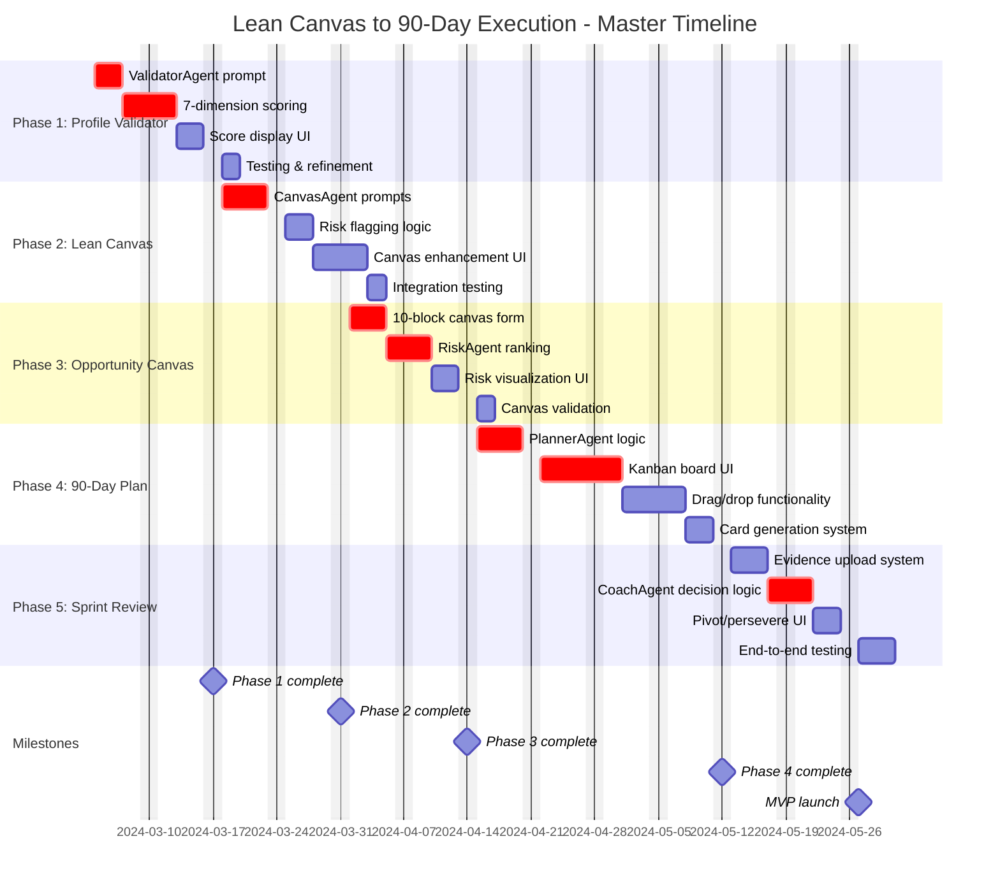

---

## 2. AI Agents Development Timeline (6 Agents)

**Focus:** Building all 6 AI agents with prompts and logic  
**Duration:** 8 weeks (parallel with UI development)

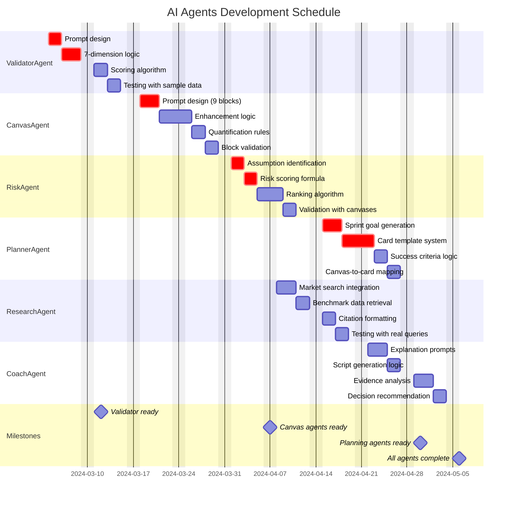

---

## 3. Screen Development Timeline (5 Screens)

**Focus:** Building all 5 main screens with UI/UX  
**Duration:** 10 weeks

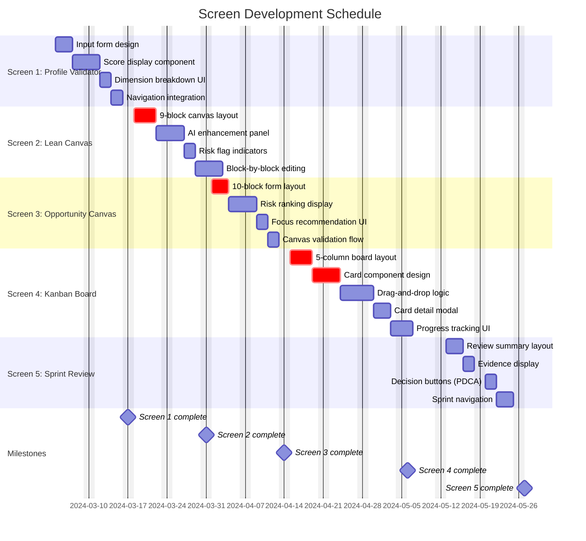

---

## 4. Feature Development Timeline (5 Core Features)

**Focus:** End-to-end feature implementation  
**Duration:** 12 weeks

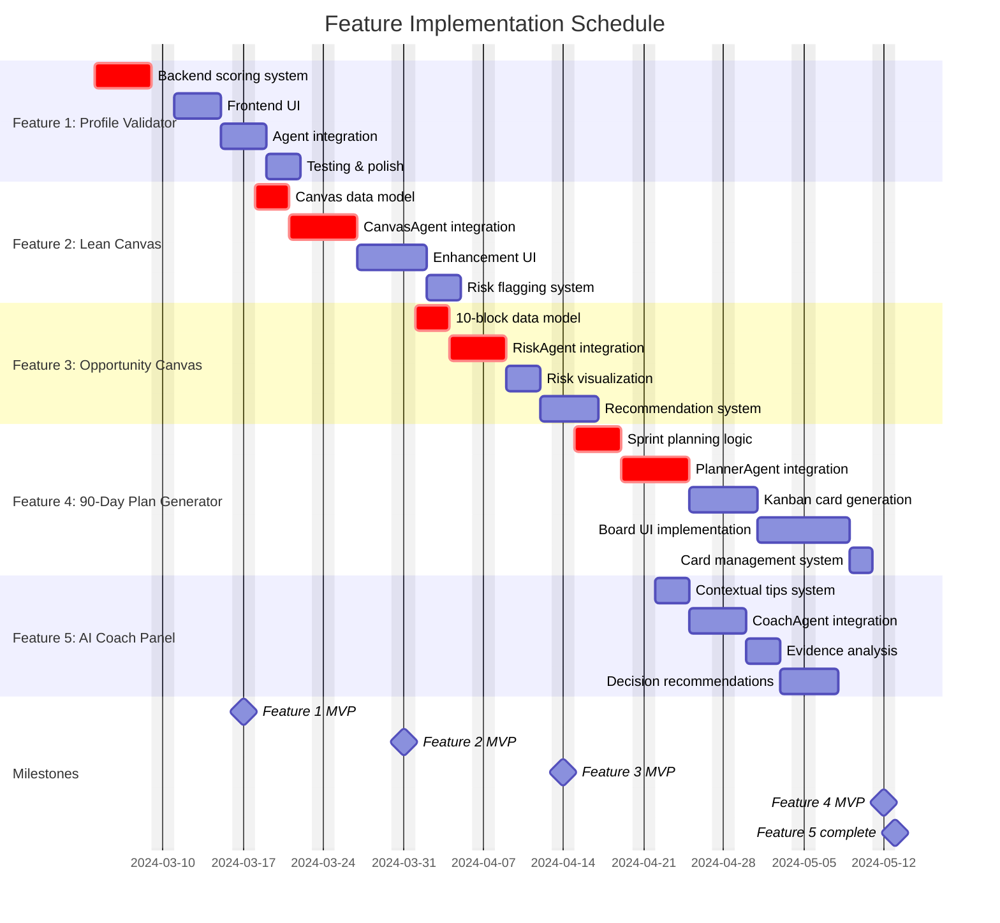

---

## 5. Kanban System Development (8 Weeks)

**Focus:** Complete Kanban card generation and execution system  
**Duration:** 8 weeks (parallel track)

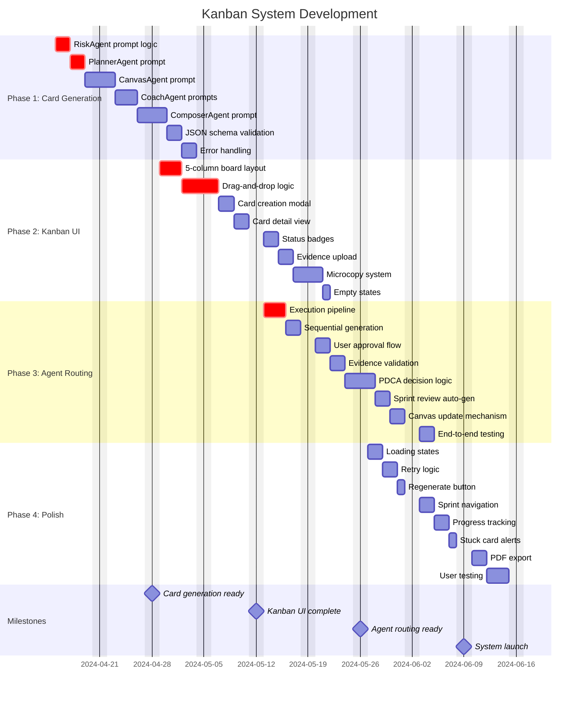

---

## 6. Agent Dependencies & Parallel Work

**Focus:** Which agents can be built in parallel vs sequentially  
**Duration:** 8 weeks

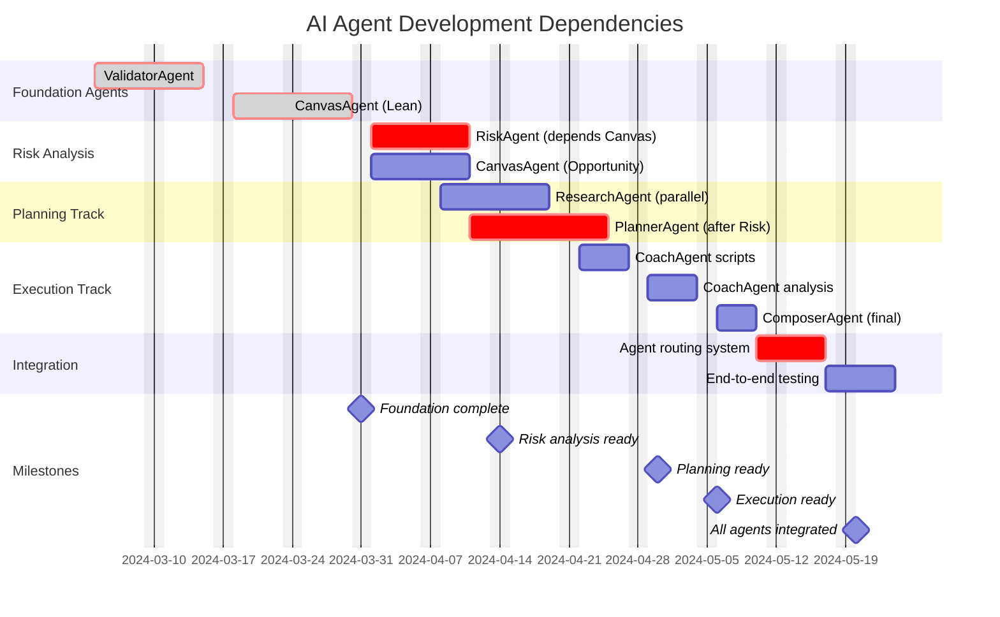

---

## 7. Critical Path Analysis

**Focus:** Identifying blocking tasks that delay the entire project  
**Duration:** 12 weeks

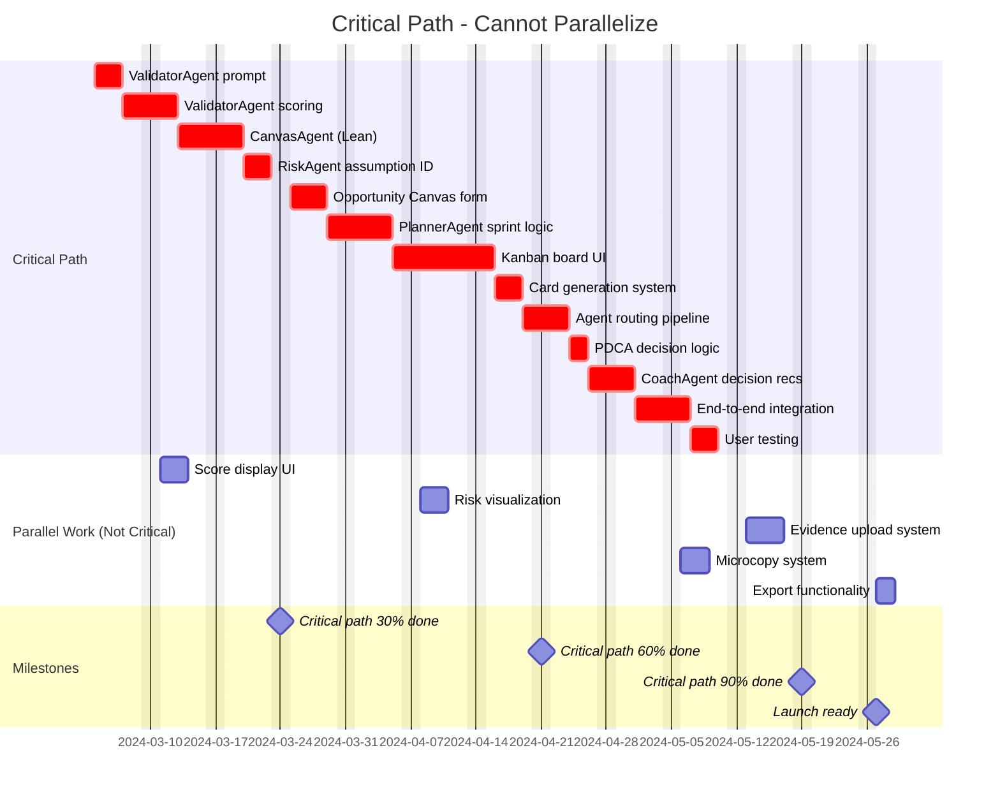

---

## 8. Sprint Cycle Implementation (6 Sprints × 2 Weeks)

**Focus:** Building the 90-day validation cycle system  
**Duration:** 12 weeks (to build the system, not run it)

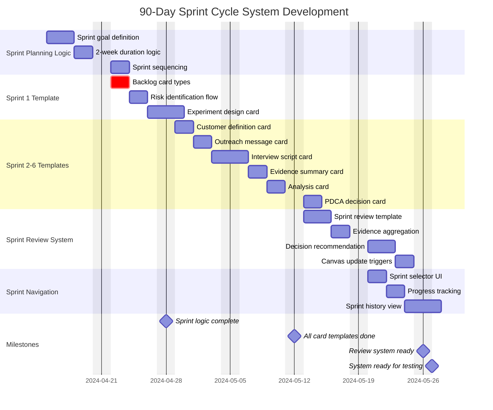

---

## 9. Testing & Quality Assurance Timeline

**Focus:** Testing phases across all components  
**Duration:** 4 weeks (overlapping with development)

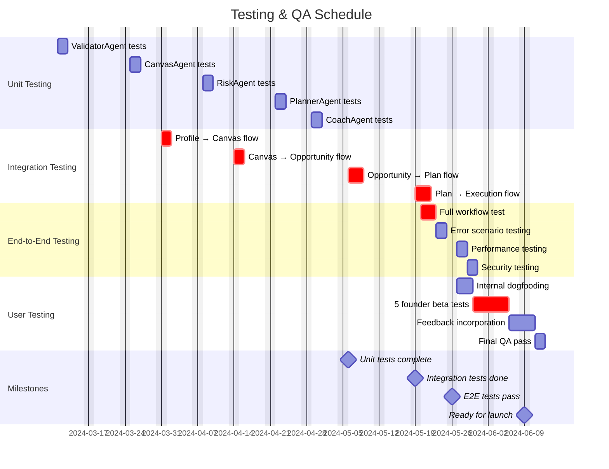

---

## 10. Documentation & Deployment Timeline

**Focus:** Documentation, deployment prep, and launch  
**Duration:** 2 weeks (final phase)

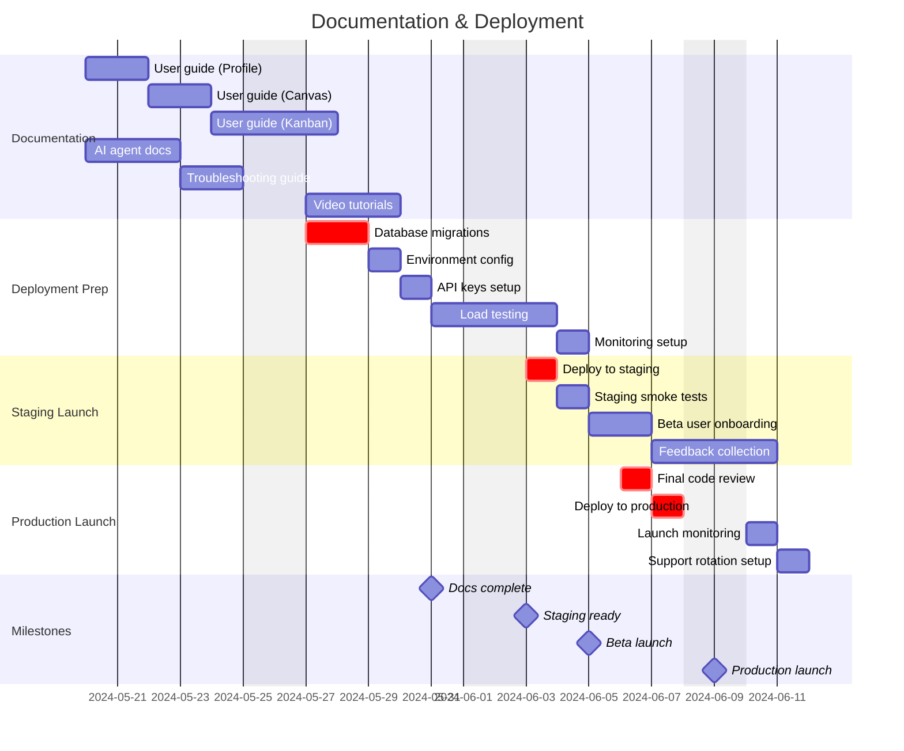

---

## 11. Resource Allocation Timeline

**Focus:** Team member assignments across phases  
**Duration:** 12 weeks

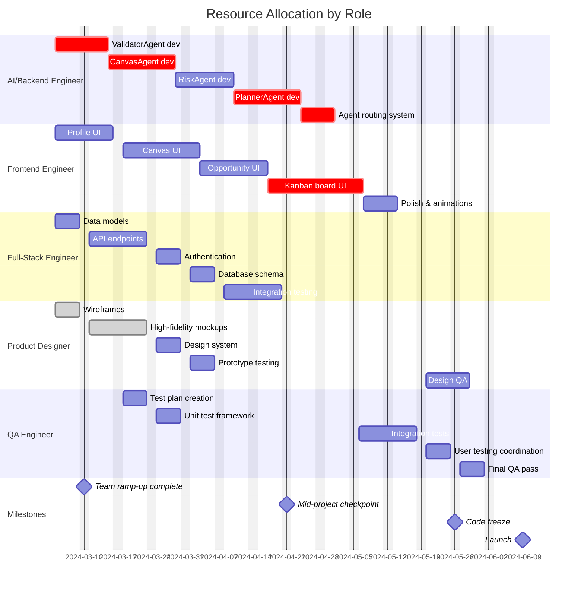

---

## 12. Risk Mitigation Timeline

**Focus:** Addressing project risks proactively  
**Duration:** Throughout 12 weeks

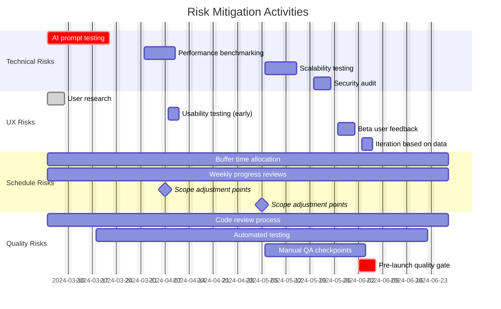

---

## Summary: Key Dates & Milestones

### Phase Completion Dates

| Phase | Start Date | End Date | Duration | Status |
|-------|-----------|----------|----------|--------|
| **Phase 1: Profile Validator** | March 4, 2024 | March 17, 2024 | 2 weeks | Not started |
| **Phase 2: Lean Canvas AI** | March 18, 2024 | March 31, 2024 | 2 weeks | Not started |
| **Phase 3: Opportunity Canvas** | April 1, 2024 | April 14, 2024 | 2 weeks | Not started |
| **Phase 4: 90-Day Plan Generator** | April 15, 2024 | May 12, 2024 | 4 weeks | Not started |
| **Phase 5: Sprint Review System** | May 13, 2024 | May 27, 2024 | 2 weeks | Not started |
| **Testing & QA** | May 27, 2024 | June 9, 2024 | 2 weeks | Not started |

### Critical Milestones

| Milestone | Date | Dependencies | Risk Level |
|-----------|------|--------------|------------|
| **ValidatorAgent Complete** | March 12, 2024 | None | Low |
| **CanvasAgent Complete** | March 31, 2024 | ValidatorAgent | Medium |
| **RiskAgent Complete** | April 14, 2024 | CanvasAgent | Medium |
| **PlannerAgent Complete** | April 30, 2024 | RiskAgent | High |
| **Kanban Board UI Complete** | May 6, 2024 | PlannerAgent | High |
| **Agent Routing Complete** | May 26, 2024 | All agents + UI | Critical |
| **MVP Launch Ready** | May 27, 2024 | Full system | Critical |
| **Beta Launch** | June 5, 2024 | Testing complete | Medium |
| **Production Launch** | June 9, 2024 | Beta feedback | Low |

---

## Notes on Timeline Assumptions

1. **Team Size:** Assumes 5-person team (1 AI/Backend, 1 Frontend, 1 Full-Stack, 1 Designer, 1 QA)
2. **Working Days:** Monday-Friday, excluding weekends
3. **Sprint Duration:** 2-week sprints for agile development
4. **Buffer Time:** 10% buffer built into each phase for unexpected issues
5. **Parallel Work:** Many tasks can run in parallel (UI + Backend)
6. **Critical Path:** ValidatorAgent → CanvasAgent → RiskAgent → PlannerAgent → Kanban UI → Agent Routing
7. **Dependencies:** Later phases depend on completion of earlier agents
8. **Testing:** Overlaps with development; continuous integration
9. **Documentation:** Starts in week 8, continues through launch
10. **Launch Date:** Target June 9, 2024 (flexible based on quality gates)

---

## Gantt Chart Legend

| Symbol/Color | Meaning |
|--------------|---------|
| **crit** tag | Critical path task (blocks other work) |
| **done** tag | Completed task |
| **active** tag | Currently in progress |
| **milestone** | Key checkpoint (no duration) |
| **after X** | Task starts after task X completes |
| **Darker bars** | Critical path tasks |
| **Lighter bars** | Non-blocking tasks |

---

**End of Document**

This Gantt diagram set provides a complete visual timeline for implementing the Lean Canvas to 90-Day Execution system, based on all documented features, screens, agents, and tasks in the `/docs/lean` folder.
