# Lean Canvas System - Mermaid Workflow Diagrams

**Document:** mermaid-diagrams.md  
**Purpose:** Complete system architecture, data flows, and user journeys  
**Date:** February 6, 2026  
**System:** Lean Canvas V2 → Opportunity Canvas → 90-Day Plan

---

## 1. USER JOURNEY FLOW

### Complete User Journey (Entry to Execution)

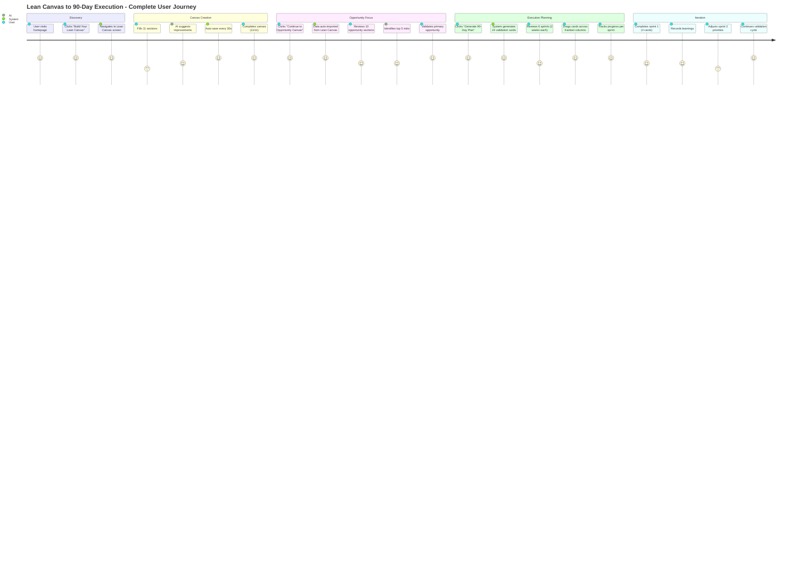

---

## 2. SYSTEM ARCHITECTURE

### Component Hierarchy

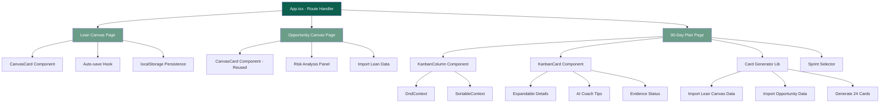

---

## 3. DATA FLOW ARCHITECTURE

### Complete Data Flow (All 3 Screens)

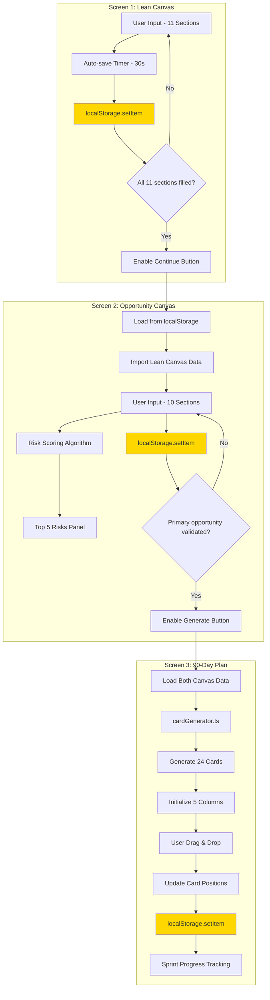

---

## 4. NAVIGATION FLOW

### Route Navigation Map

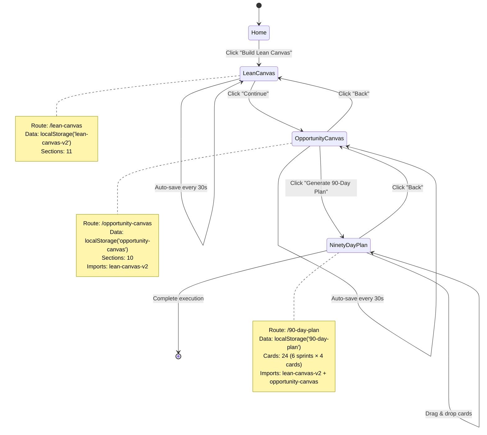

---

## 5. DRAG & DROP WORKFLOW

### Kanban Drag & Drop Sequence

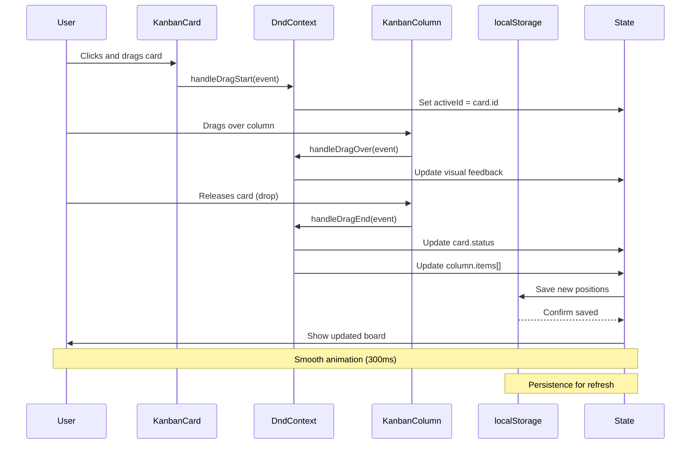

---

## 6. CARD GENERATION ALGORITHM

### 24-Card Generation from Canvas Data

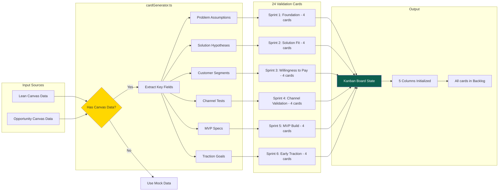

---

## 7. AUTO-SAVE MECHANISM

### localStorage Auto-Save Flow

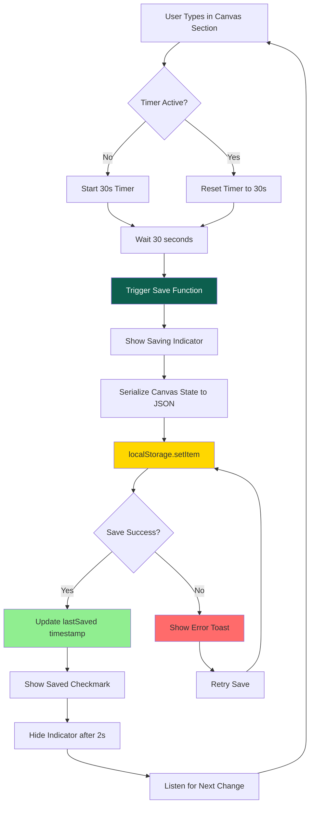

---

## 8. RISK ANALYSIS WORKFLOW

### Opportunity Canvas Risk Scoring

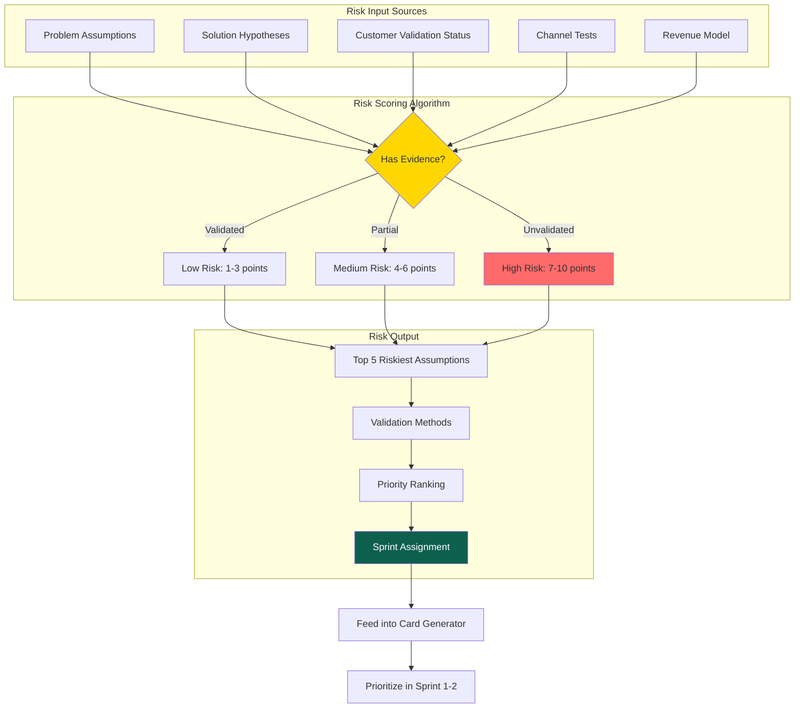

---

## 9. SPRINT PROGRESS TRACKING

### Sprint Completion Flow

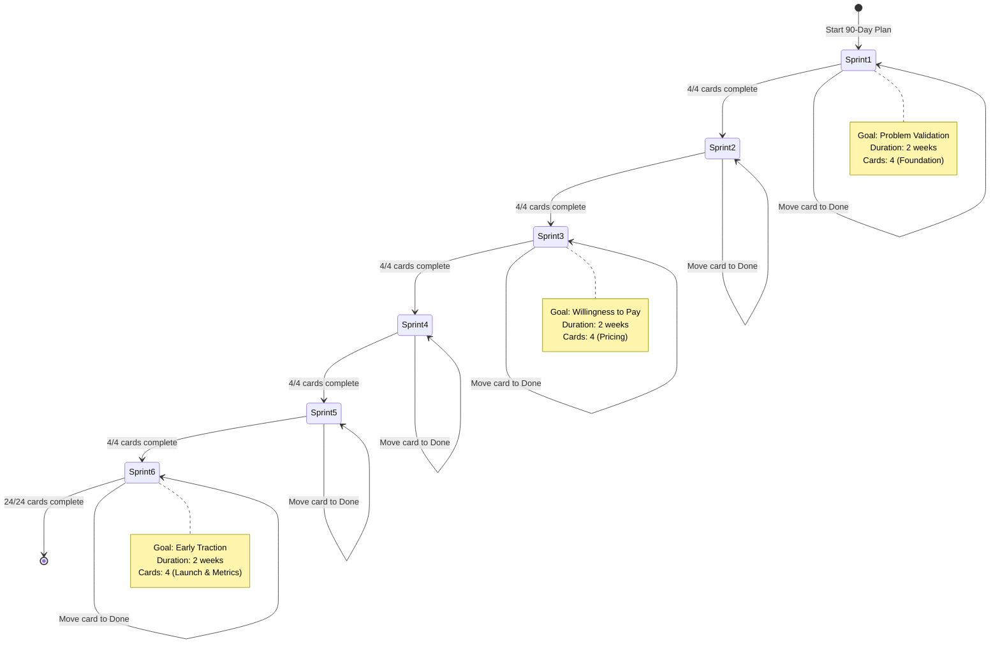

---

## 10. COMPONENT INTERACTION

### Inter-Component Communication

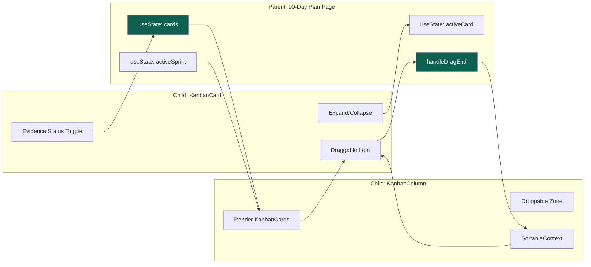

---

## 11. ERROR HANDLING FLOW

### localStorage Error Recovery

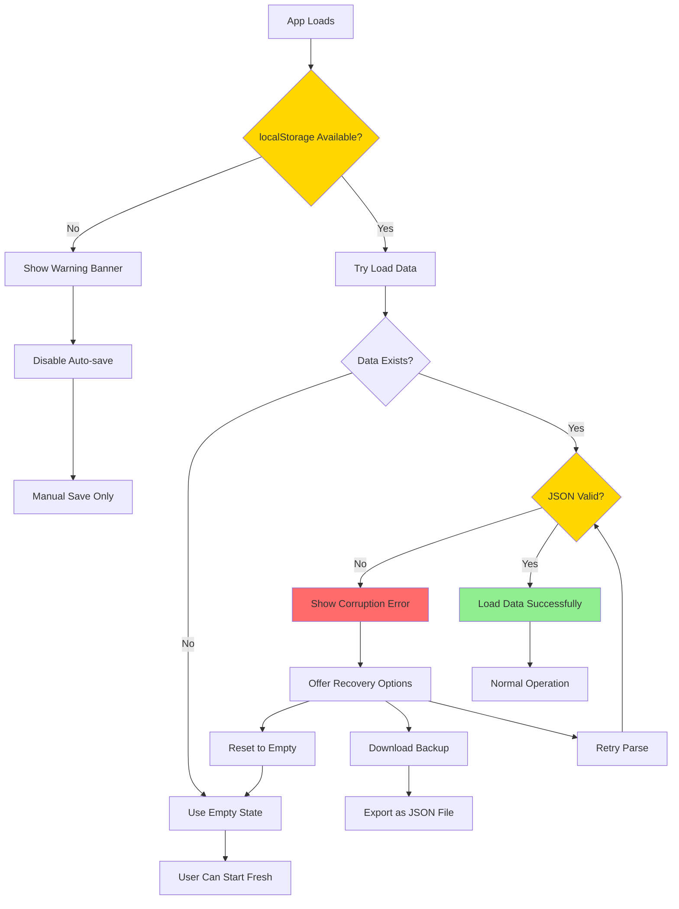

---

## 12. EXPORT/SHARE WORKFLOW

### Future Export Feature Flow

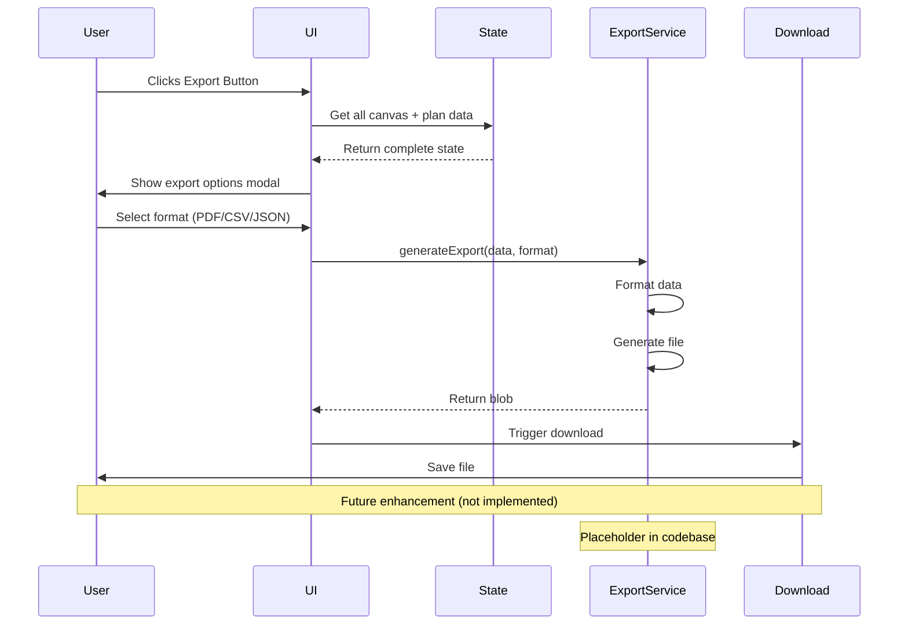

---

## 13. MOBILE RESPONSIVE FLOW

### Layout Adaptation Strategy

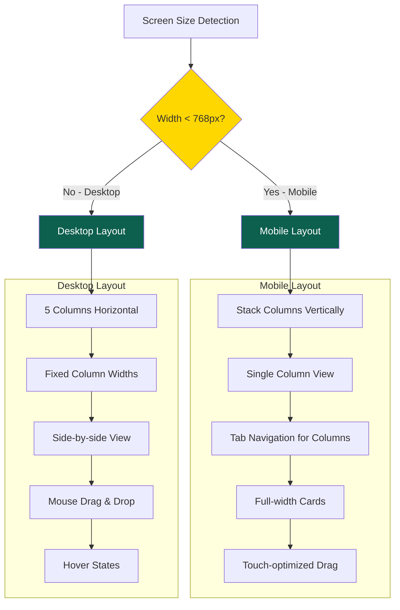

---

## 14. COMPLETE SYSTEM STATE

### Global State Management

```mermaid
flowchart TB
    subgraph "localStorage Keys"
        LS1["'lean-canvas-v2'"]
        LS2["'opportunity-canvas'"]
        LS3["'90-day-plan'"]
    end
    
    subgraph "React State (Screen 1)"
        S1[canvas: LeanCanvasState]
        S2[isSaving: boolean]
        S3[lastSaved: string]
    end
    
    subgraph "React State (Screen 2)"
        S4[canvas: OpportunityCanvasState]
        S5[risks: Risk[]]
        S6[isSaving: boolean]
    end
    
    subgraph "React State (Screen 3)"
        S7[cards: Card[]]
        S8[activeSprint: number]
        S9[activeCard: string | null]
        S10[columns: Column[]]
    end
    
    S1 --> LS1
    S2 --> LS1
    S3 --> LS1
    
    S4 --> LS2
    S5 --> LS2
    S6 --> LS2
    
    S7 --> LS3
    S8 --> LS3
    S9 --> LS3
    S10 --> LS3
    
    LS1 --> S4
    LS1 --> S7
    LS2 --> S7
    
    style LS1 fill:#FFD700
    style LS2 fill:#FFD700
    style LS3 fill:#FFD700
```

---

## 15. VALIDATION CARD LIFECYCLE

### Individual Card Journey

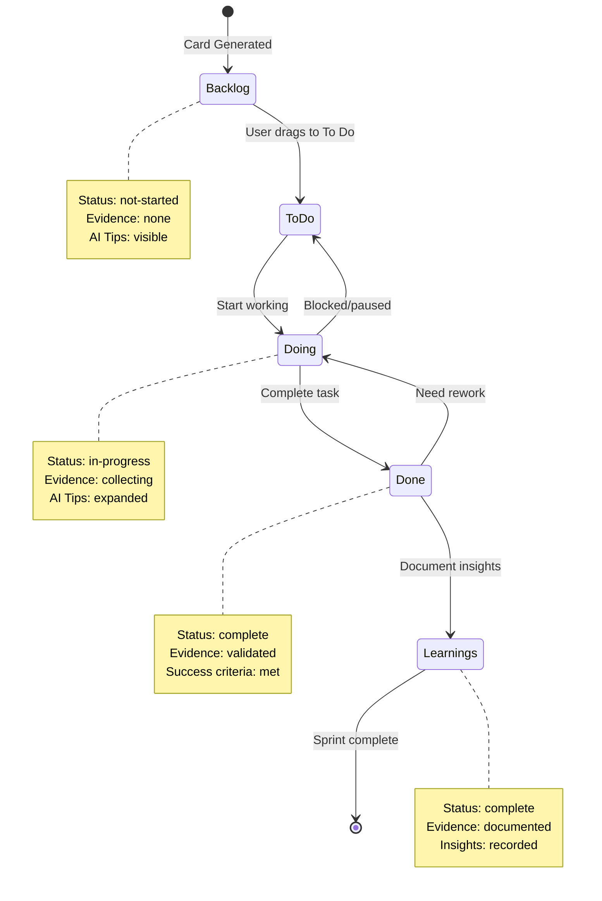

---

## Summary

**Total Diagrams:** 15 comprehensive Mermaid workflows  
**Coverage:**
- User journeys (1)
- System architecture (2)
- Data flows (3)
- Navigation (1)
- Drag & drop (2)
- Auto-save (1)
- Risk analysis (1)
- Progress tracking (1)
- Component interaction (1)
- Error handling (1)
- Export/share (1)
- Mobile responsive (1)

**Format:** GitHub-compatible Mermaid syntax  
**Purpose:** Complete visual documentation of Lean Canvas system  
**Status:** ✅ Production-ready diagrams

---

**Last Updated:** February 6, 2026  
**Maintainer:** StartupAI Development Team
