# Pitch Deck Wizard - Workflows & Logic Diagrams

**Project:** StartupAI Pitch Deck Generator  
**Phase:** 13 - Industry-Specific Wizard  
**Document Type:** Workflows, User Journeys, Logic Flows  
**Last Updated:** January 27, 2026

---

## Overview

This document contains Mermaid diagrams for all workflows, user journeys, conditional logic, AI agent interactions, and state management in the pitch deck wizard.

---

## Table of Contents

1. [Overall User Journey](#1-overall-user-journey)
2. [Step-by-Step Flow](#2-step-by-step-flow)
3. [Industry Selection Logic](#3-industry-selection-logic)
4. [AI Suggestion Engine](#4-ai-suggestion-engine)
5. [Validation Logic](#5-validation-logic)
6. [State Management](#6-state-management)
7. [Data Flow](#7-data-flow)
8. [Component Architecture](#8-component-architecture)

---

## 1. Overall User Journey

### High-Level Flow

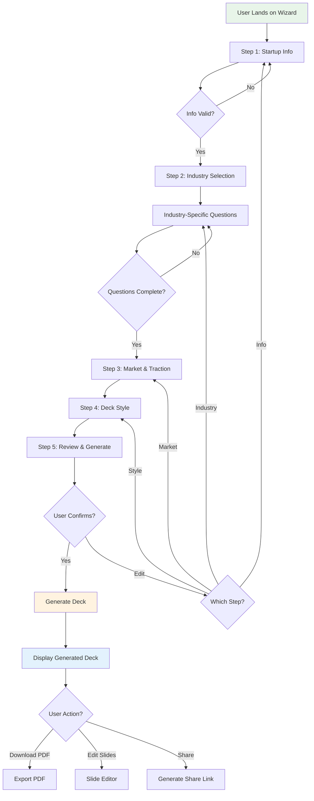

---

## 2. Step-by-Step Flow

### Step 1: Startup Info

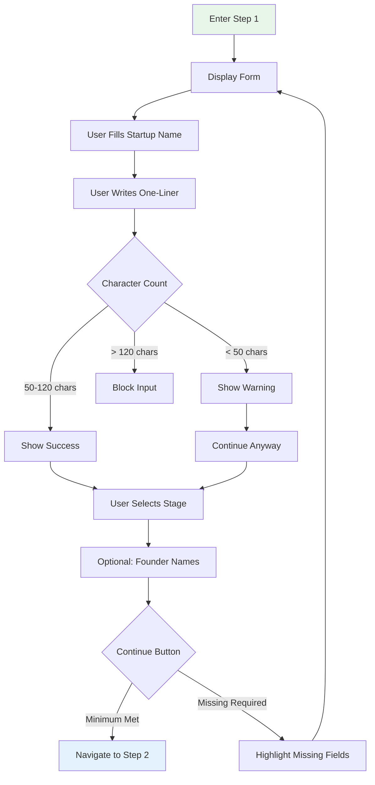

### Step 2: Industry Focus

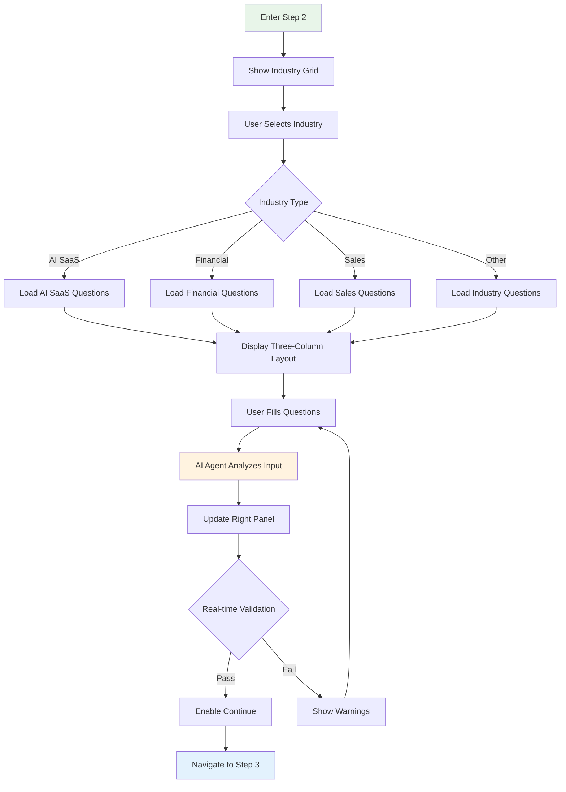

### Step 3: Market & Traction

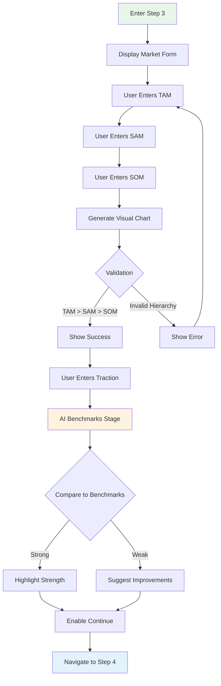

### Step 4: Deck Style

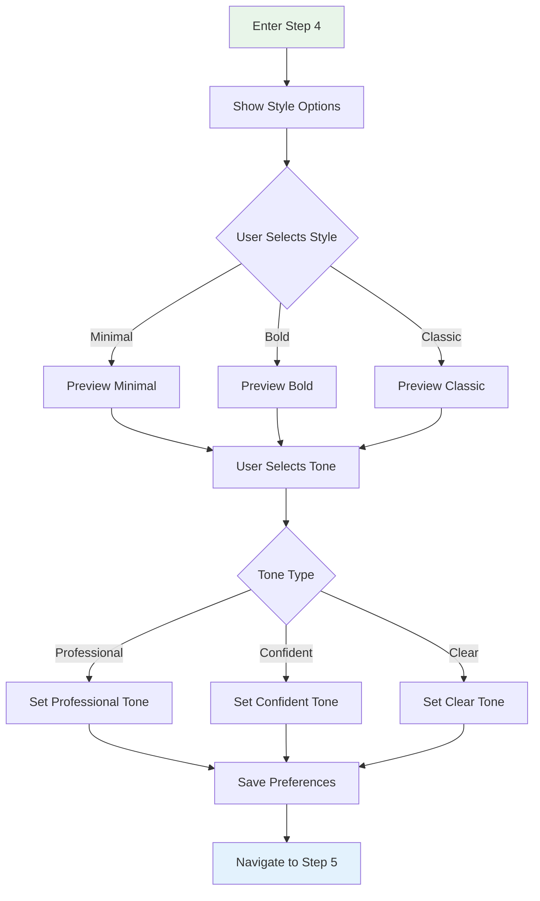

### Step 5: Review & Generate

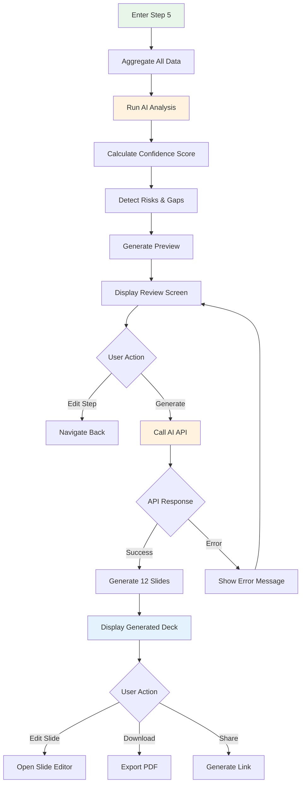

---

## 3. Industry Selection Logic

### Industry Routing

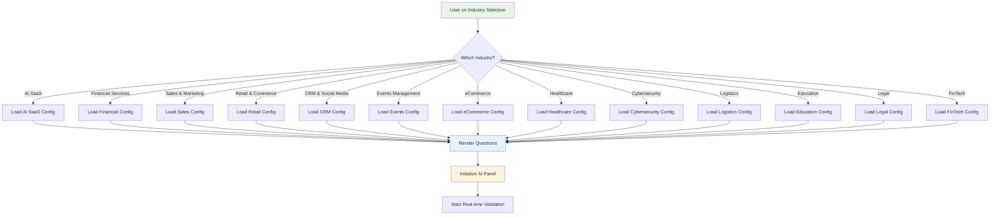

### Industry Configuration Schema

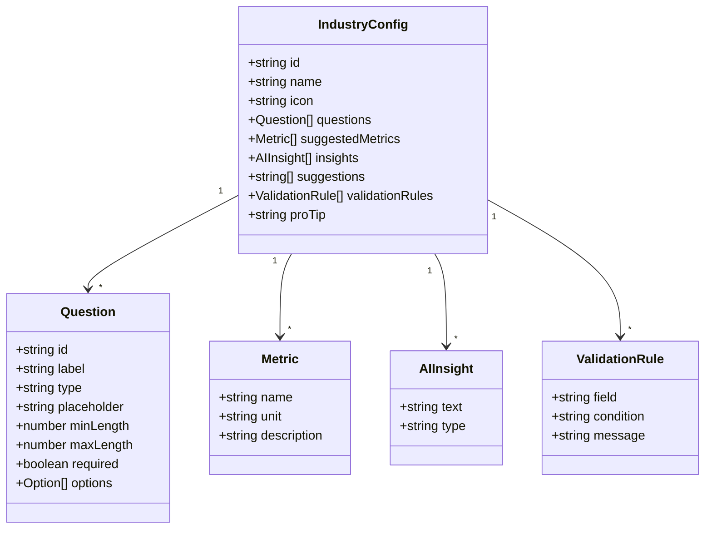

---

## 4. AI Suggestion Engine

### AI Analysis Flow

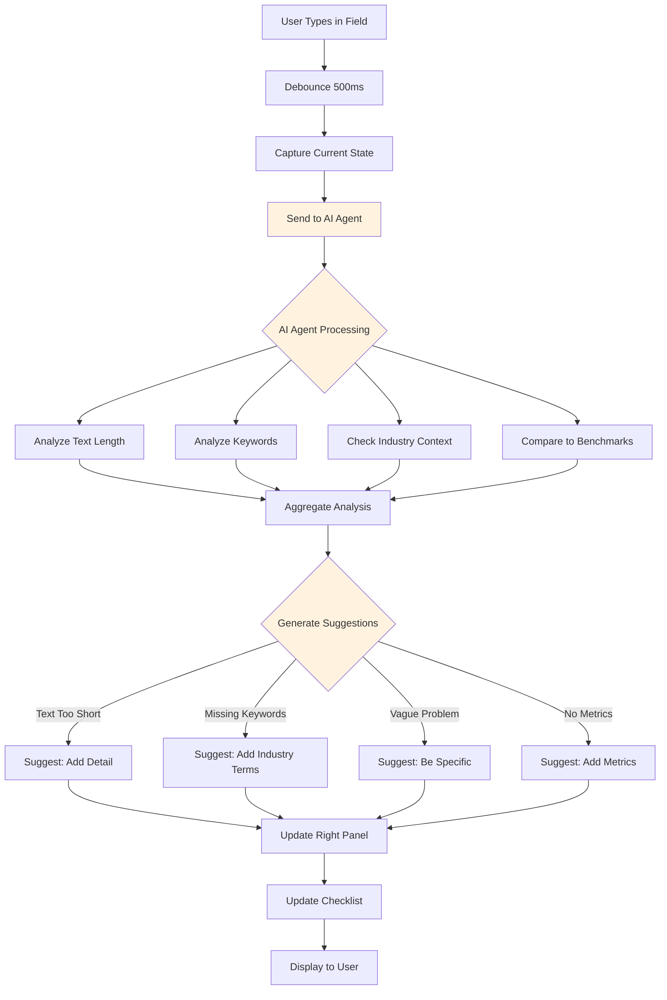

### AI Suggestion Triggers

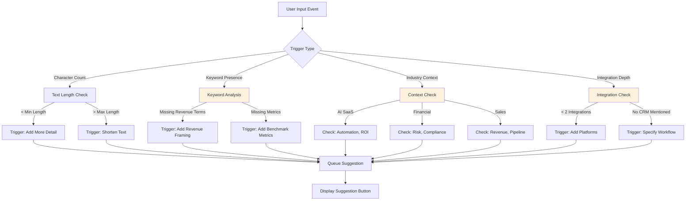

### Suggestion Priority Logic

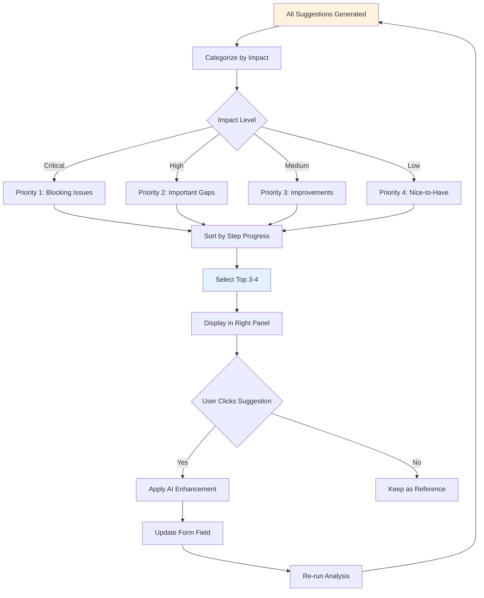

---

## 5. Validation Logic

### Field Validation

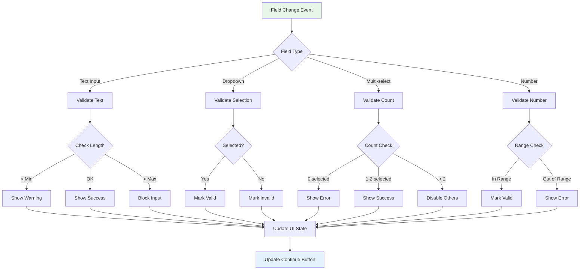

### Step Validation

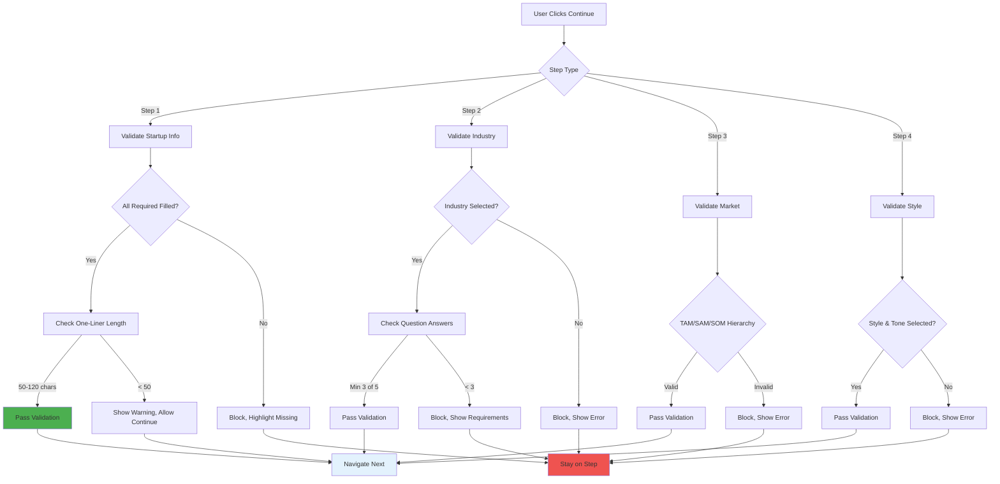

### Checklist Validation

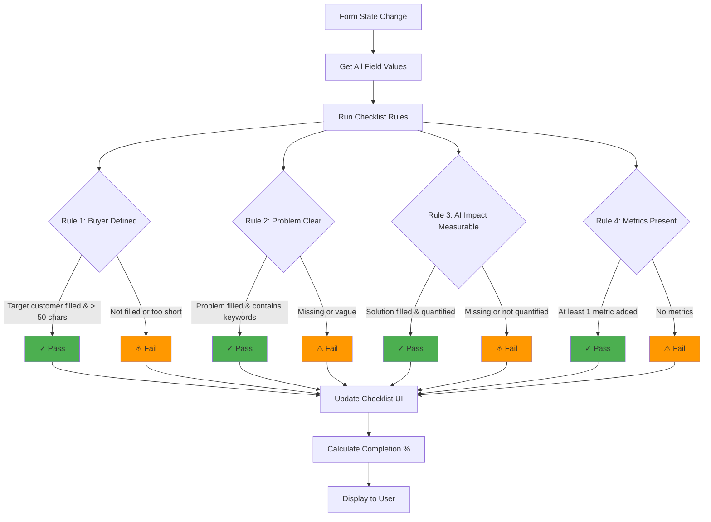

---

## 6. State Management

### Global State Structure

```mermaid
graph TD
    A[WizardState] --> B[currentStep: number]
    A --> C[startupInfo: StartupInfo]
    A --> D[industryData: IndustryData]
    A --> E[marketData: MarketData]
    A --> F[styleData: StyleData]
    A --> G[generatedDeck: Deck]
    
    C --> C1[name: string]
    C --> C2[oneLiner: string]
    C --> C3[stage: string]
    C --> C4[founders: string]
    
    D --> D1[industryId: string]
    D --> D2[answers: Record]
    D --> D3[metrics: Metric[]]
    
    E --> E1[tam: number]
    E --> E2[sam: number]
    E --> E3[som: number]
    E --> E4[traction: Traction]
    
    F --> F1[style: string]
    F --> F2[tone: string]
    
    G --> G1[slides: Slide[]]
    G --> G2[confidence: number]
    G --> G3[analysis: Analysis]
    
    style A fill:#e3f2fd
    style C fill:#fff3e0
    style D fill:#fff3e0
    style E fill:#fff3e0
    style F fill:#fff3e0
    style G fill:#e8f5e9
```

### State Updates

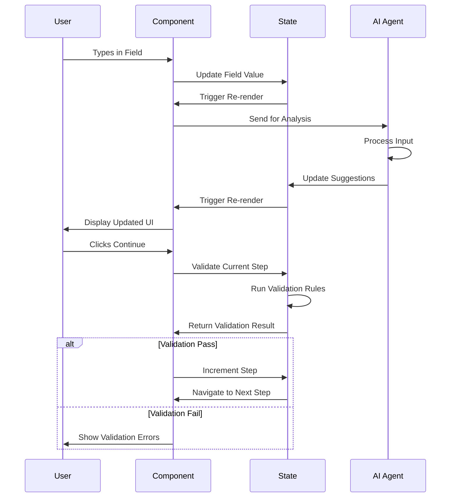

---

## 7. Data Flow

### Complete Data Flow

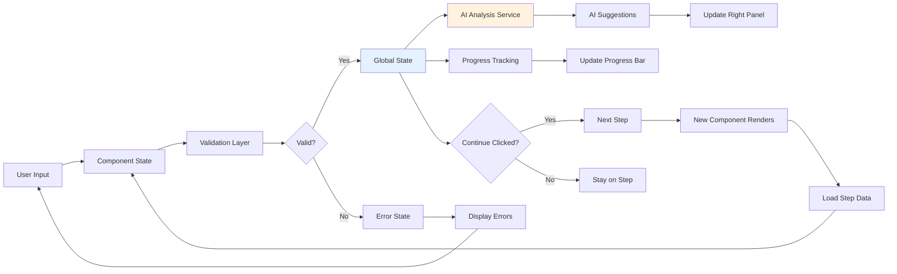

### API Integration Points

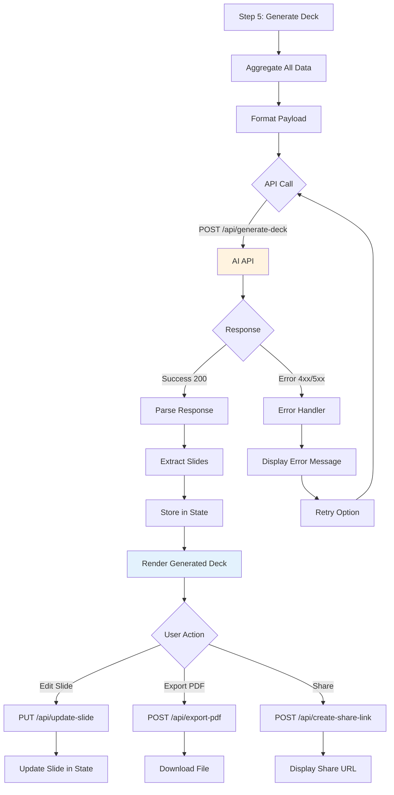

---

## 8. Component Architecture

### Component Hierarchy

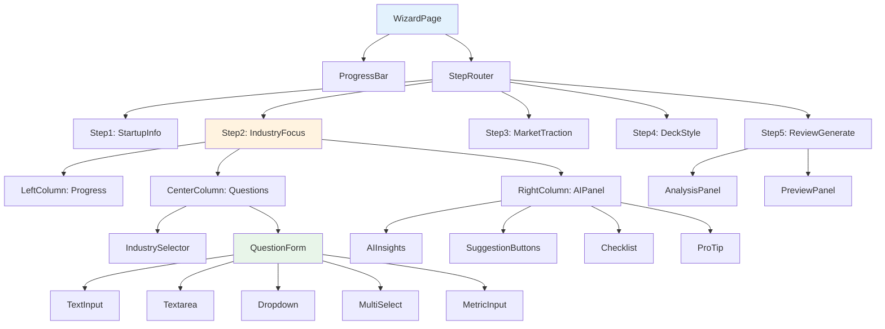

### Component Props Flow

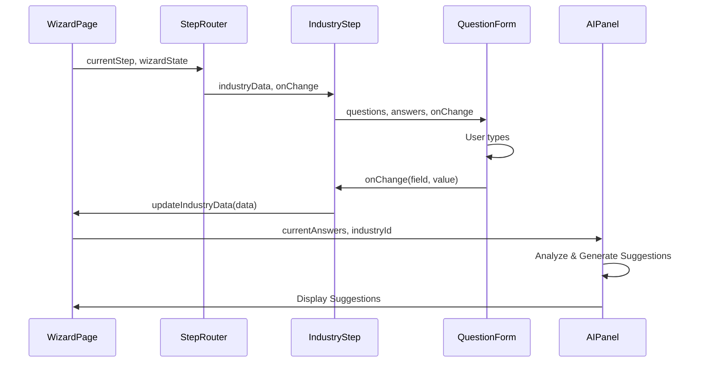

---

## 9. Conditional Logic Flows

### Industry-Specific Question Rendering

```mermaid
graph TD
    A[Load Industry Questions] --> B{Industry Type}
    
    B -->|AI SaaS| C[Render 5 Questions]
    C --> C1[Target Customer with Dropdown]
    C --> C2[Core Problem Textarea]
    C --> C3[AI Solution Textarea]
    C --> C4[Why This Wins Bullets]
    C --> C5[Proof Metrics 3 Fields]
    
    B -->|Financial Services| D[Render 5 Questions]
    D --> D1[Customer/Buyer Textarea]
    D --> D2[Financial Problem Textarea]
    D --> D3[AI Solution Textarea]
    D --> D4[Value Drivers Multi-Select]
    D --> D5[Metrics 3-5 Fields]
    
    B -->|CRM & Social| E[Render 6 Questions]
    E --> E1[User/Buyer Textarea]
    E --> E2[Growth Problem Textarea]
    E --> E3[AI Solution Textarea]
    E --> E4[Integrations Multi-Select]
    E --> E5[Value Drivers Multi-Select]
    E --> E6[Metrics 2-4 Fields]
    
    C1 --> F[Render Question Components]
    C2 --> F
    C3 --> F
    C4 --> F
    C5 --> F
    D1 --> F
    D2 --> F
    D3 --> F
    D4 --> F
    D5 --> F
    E1 --> F
    E2 --> F
    E3 --> F
    E4 --> F
    E5 --> F
    E6 --> F
    
    style B fill:#fff3e0
    style F fill:#e3f2fd
```

### Multi-Select Logic

```mermaid
graph TD
    A[User Clicks Checkbox] --> B{Current Count}
    
    B -->|0 selected| C[Add Selection]
    C --> D[Update State]
    
    B -->|1 selected| E{Max Limit?}
    E -->|No Limit| C
    E -->|Max 2| F[Add Selection]
    F --> G[Count = 2]
    
    B -->|2 selected Max 2| H{Clicking Selected?}
    H -->|Yes| I[Remove Selection]
    H -->|No| J[Block, Show Message]
    
    I --> K[Update State]
    J --> L["Max 2 selections"]
    
    G --> M[Disable Remaining]
    
    D --> N[Re-render UI]
    K --> N
    M --> N
    L --> N
    
    style A fill:#e8f5e9
    style N fill:#e3f2fd
```

---

## 10. Error Handling

### Error Flow

```mermaid
graph TD
    A[Error Occurs] --> B{Error Type}
    
    B -->|Validation Error| C[Display Inline Error]
    C --> D[Highlight Field]
    D --> E[Show Error Message]
    E --> F[Block Continue Button]
    
    B -->|API Error| G[Display Toast Notification]
    G --> H{Retry Available?}
    H -->|Yes| I[Show Retry Button]
    H -->|No| J[Show Support Link]
    
    B -->|Network Error| K[Display Connection Error]
    K --> L[Show Offline Message]
    L --> M[Auto-retry on Reconnect]
    
    B -->|Timeout Error| N[Display Timeout Message]
    N --> O[Suggest: Simplify Input]
    O --> P[Show Retry Button]
    
    F --> Q[User Corrects Input]
    I --> R[User Retries]
    P --> R
    
    Q --> S[Clear Error State]
    R --> T[Retry Operation]
    
    S --> U[Re-validate]
    T --> V{Success?}
    V -->|Yes| W[Continue Flow]
    V -->|No| A
    
    style A fill:#ef5350
    style W fill:#4caf50
```

---

## 11. Performance Optimization

### Debouncing & Caching

```mermaid
graph TD
    A[User Types] --> B[Start Debounce Timer]
    B --> C{Timer Active?}
    C -->|Yes| D[Reset Timer]
    C -->|No| E[Start New Timer]
    
    D --> F[Wait 500ms]
    E --> F
    
    F --> G{Still Typing?}
    G -->|Yes| D
    G -->|No| H[Execute Analysis]
    
    H --> I{Result Cached?}
    I -->|Yes| J[Return Cached Result]
    I -->|No| K[Call AI API]
    
    K --> L[Store in Cache]
    L --> M[Return Result]
    J --> M
    
    M --> N[Update UI]
    
    style H fill:#fff3e0
    style J fill:#4caf50
    style K fill:#ff9800
```

---

## 12. Accessibility Flow

### Keyboard Navigation

```mermaid
graph TD
    A[User Presses Tab] --> B[Move to Next Field]
    B --> C[Add Focus Indicator]
    C --> D{Field Type}
    
    D -->|Input| E[Allow Text Entry]
    D -->|Dropdown| F[Press Space to Open]
    D -->|Checkbox| G[Press Space to Toggle]
    D -->|Button| H[Press Enter to Click]
    
    E --> I[Continue Tabbing]
    F --> I
    G --> I
    H --> I
    
    I --> J{Shift+Tab Pressed?}
    J -->|Yes| K[Move to Previous Field]
    J -->|No| B
    
    K --> C
    
    style C fill:#e3f2fd
```

---

## 13. Mobile Responsive Flow

### Layout Adaptation

```mermaid
graph TD
    A[Page Loads] --> B{Screen Width}
    
    B -->|< 768px Mobile| C[Single Column Layout]
    C --> C1[Stack Progress Bar]
    C --> C2[Stack Content]
    C --> C3[Stack AI Panel Below]
    
    B -->|768-1024px Tablet| D[Two Column Layout]
    D --> D1[Progress Bar Full Width]
    D --> D2[Content 60% + AI 40%]
    
    B -->|> 1024px Desktop| E[Three Column Layout]
    E --> E1[Left Progress 240px]
    E --> E2[Center Content Flex]
    E --> E3[Right AI 320px]
    
    C1 --> F[Render Responsive UI]
    C2 --> F
    C3 --> F
    D1 --> F
    D2 --> F
    E1 --> F
    E2 --> F
    E3 --> F
    
    F --> G{Orientation Change?}
    G -->|Yes| B
    G -->|No| H[Maintain Layout]
    
    style B fill:#fff3e0
    style F fill:#e3f2fd
```

---

## 14. Analytics & Tracking

### Event Tracking Flow

```mermaid
graph TD
    A[User Action] --> B{Event Type}
    
    B -->|Page View| C[Track: Step Viewed]
    B -->|Field Change| D[Track: Field Edited]
    B -->|Button Click| E[Track: Button Clicked]
    B -->|Error Shown| F[Track: Error Encountered]
    B -->|AI Suggestion| G[Track: Suggestion Displayed]
    B -->|Deck Generated| H[Track: Deck Created]
    
    C --> I[Send to Analytics]
    D --> I
    E --> I
    F --> I
    G --> I
    H --> I
    
    I --> J{Include Metadata}
    J --> K[Add Timestamp]
    J --> L[Add User Session]
    J --> M[Add Industry Type]
    J --> N[Add Step Number]
    
    K --> O[Queue Event]
    L --> O
    M --> O
    N --> O
    
    O --> P{Batch Ready?}
    P -->|Yes| Q[Send Batch]
    P -->|No| R[Wait for More Events]
    
    Q --> S[Analytics Dashboard]
    
    style I fill:#fff3e0
    style S fill:#e3f2fd
```

---

**Status:** Complete workflow and logic diagrams  
**Last Updated:** January 27, 2026  
**Related Docs:** `/docs/pitch-deck/wireframes.md` (UI layouts)  
**Next Step:** Implement state management and component logic
