# StartupAI - Visual Sitemap Diagram

**For Figma Implementation**  
**Last Updated:** January 27, 2026  
**Style:** Minimal, Professional, Neutral Colors

---

## 🎨 DESIGN SPECIFICATIONS

### **Colors**
- Background: `#FAFAF8` (off-white)
- Active Pages: `#0D5F4E` (emerald green)
- Planned Pages: `#E8E6E1` (light gray)
- Placeholder: `#F5F5F3` (lighter gray)
- Text: `#2D2D2D` (charcoal)
- Borders: `#E8E6E1` (light gray)

### **Typography**
- Headers: Serif, 18px, Medium
- Page Names: Sans-serif, 14px, Regular
- Labels: Sans-serif, 11px, Regular
- Status: Mono, 9px, Medium

### **Shapes**
- All rectangles: 8px border radius
- Padding: 16px horizontal, 12px vertical
- Gap between items: 12px
- Gap between sections: 32px

### **Layout**
- Max width: 1400px
- Columns: Auto-fit based on content
- Alignment: Top-down, left-to-right
- Hierarchy: Indentation 24px per level

---

## 📐 LAYOUT STRUCTURE

```
┌──────────────────────────────────────────────────────────────────────────┐
│                                                                          │
│                           STARTUPAI SITEMAP                              │
│                                                                          │
│                         Last Updated: Jan 27, 2026                       │
│                                                                          │
└──────────────────────────────────────────────────────────────────────────┘

┌──────────────────────────────────────────────────────────────────────────┐
│  AUTH & ENTRY                                                            │
└──────────────────────────────────────────────────────────────────────────┘

    ┌─────────────────┐
    │   Homepage (/)  │  ✅ Active
    └─────────────────┘

┌──────────────────────────────────────────────────────────────────────────┐
│  DASHBOARD                                                               │
└──────────────────────────────────────────────────────────────────────────┘

    ┌────────────────────┐
    │  Kanban Board (/)  │  ✅ Active
    └────────────────────┘

    ┌──────────────────────────┐
    │  Roadmap (/roadmap)      │  ✅ Active
    └──────────────────────────┘

    ┌──────────────────────────┐
    │  Agent Terminals         │  🔜 Planned
    └──────────────────────────┘

    ┌──────────────────────────┐
    │  Insights                │  🔜 Planned
    └──────────────────────────┘

    ┌──────────────────────────┐
    │  Ideation                │  🔜 Planned
    └──────────────────────────┘

    ┌──────────────────────────┐
    │  Content                 │  🔜 Planned
    └──────────────────────────┘

    ┌──────────────────────────┐
    │  MCP Overview            │  🔜 Planned
    └──────────────────────────┘

    ┌──────────────────────────┐
    │  Worktrees               │  🔜 Planned
    └──────────────────────────┘

    ┌──────────────────────────┐
    │  GitHub Issues           │  🔜 Planned
    └──────────────────────────┘

    ┌──────────────────────────┐
    │  GitHub PRs              │  🔜 Planned
    └──────────────────────────┘

    ┌──────────────────────────┐
    │  Settings                │  🔜 Planned
    └──────────────────────────┘

┌──────────────────────────────────────────────────────────────────────────┐
│  PITCH DECK & FUNDRAISING                                                │
└──────────────────────────────────────────────────────────────────────────┘

    ┌────────────────────────────────┐
    │  Pitch Deck Generator (/)      │  ✅ Active
    └────────────────────────────────┘

    ┌────────────────────────────────┐
    │  Pitch Deck Wizard (/wizard)   │  ✅ Active
    └────────────────────────────────┘

    ┌──────────────────────────────────────┐
    │  AI Suggestions Demo                 │  ✅ Active
    └──────────────────────────────────────┘

    ┌──────────────────────────────────────┐
    │  AI Suggestions Enhanced             │  ✅ Active
    └──────────────────────────────────────┘

┌──────────────────────────────────────────────────────────────────────────┐
│  EDUCATIONAL & HOW-TO                                                    │
└──────────────────────────────────────────────────────────────────────────┘

    ┌────────────────────────────────┐
    │  How It Works - Overview       │  ✅ Active
    └────────────────────────────────┘

    ┌────────────────────────────────┐
    │  How Pitch Generator Works     │  ✅ Active
    └────────────────────────────────┘

    ┌────────────────────────────────┐
    │  How Pitch Works (Screenshots) │  ✅ Active
    └────────────────────────────────┘

    ┌────────────────────────────────┐
    │  How It Works V2               │  ✅ Active
    └────────────────────────────────┘

    ┌────────────────────────────────┐
    │  How It Works V3               │  ✅ Active
    └────────────────────────────────┘

┌──────────────────────────────────────────────────────────────────────────┐
│  EVENTS & NETWORKING                                                     │
└──────────────────────────────────────────────────────────────────────────┘

    ┌────────────────────────────────┐
    │  Events List (/events)         │  ✅ Active
    └────────────────────────────────┘

    ┌────────────────────────────────┐
    │  Event Detail (/events/detail) │  ✅ Active
    └────────────────────────────────┘

┌──────────────────────────────────────────────────────────────────────────┐
│  INFOGRAPHICS & RESEARCH                                                 │
└──────────────────────────────────────────────────────────────────────────┘

    ┌─────────────────────────────────────────┐
    │  AI Landscape                           │  ✅ Active
    └─────────────────────────────────────────┘

    ┌─────────────────────────────────────────┐
    │  AI Adoption 2025                       │  ✅ Active
    └─────────────────────────────────────────┘

    ┌─────────────────────────────────────────┐
    │  AI Industry Adoption                   │  ✅ Active
    └─────────────────────────────────────────┘

    ┌─────────────────────────────────────────┐
    │  AI Jobs & Future of Work               │  ✅ Active
    └─────────────────────────────────────────┘

    ┌─────────────────────────────────────────┐
    │  AI Jobs V2                             │  ✅ Active
    └─────────────────────────────────────────┘

    ┌─────────────────────────────────────────┐
    │  AI Investment Hubs                     │  ✅ Active
    └─────────────────────────────────────────┘

    ┌─────────────────────────────────────────┐
    │  AI Startup Products                    │  ✅ Active
    └─────────────────────────────────────────┘

    ┌─────────────────────────────────────────┐
    │  AI Product Intelligence V2             │  ✅ Active
    └─────────────────────────────────────────┘

┌──────────────────────────────────────────────────────────────────────────┐
│  SUPPORTING PAGES (PLACEHOLDERS)                                         │
└──────────────────────────────────────────────────────────────────────────┘

    PRODUCT
    ┌──────────────────┐
    │  Features        │  📋 Placeholder
    └──────────────────┘
    ┌──────────────────┐
    │  Pricing         │  📋 Placeholder
    └──────────────────┘
    ┌──────────────────┐
    │  Security        │  📋 Placeholder
    └──────────────────┘

    COMPANY
    ┌──────────────────┐
    │  About           │  📋 Placeholder
    └──────────────────┘
    ┌──────────────────┐
    │  Blog            │  📋 Placeholder
    └──────────────────┘
    ┌──────────────────┐
    │  Careers         │  📋 Placeholder
    └──────────────────┘
    ┌──────────────────┐
    │  Contact         │  📋 Placeholder
    └──────────────────┘

    RESOURCES
    ┌──────────────────┐
    │  Documentation   │  📋 Placeholder
    └──────────────────┘
    ┌──────────────────┐
    │  Help Center     │  📋 Placeholder
    └──────────────────┘
    ┌──────────────────┐
    │  Community       │  📋 Placeholder
    └──────────────────┘
    ┌──────────────────┐
    │  Founder Stories │  📋 Placeholder
    └──────────────────┘
    ┌──────────────────┐
    │  API Reference   │  📋 Placeholder
    └──────────────────┘

    LEGAL
    ┌──────────────────┐
    │  Privacy Policy  │  📋 Placeholder
    └──────────────────┘
    ┌──────────────────┐
    │  Terms           │  📋 Placeholder
    └──────────────────┘
    ┌──────────────────┐
    │  Cookie Policy   │  📋 Placeholder
    └──────────────────┘
    ┌──────────────────┐
    │  Data Processing │  📋 Placeholder
    └──────────────────┘

┌──────────────────────────────────────────────────────────────────────────┐
│  STATISTICS                                                              │
└──────────────────────────────────────────────────────────────────────────┘

    Total Pages: 47
    ✅ Active: 22 pages
    🔜 Planned: 9 pages
    📋 Placeholder: 16 links
```

---

## 🎯 FIGMA IMPLEMENTATION GUIDE

### **Step 1: Setup**
1. Create new Figma file: "StartupAI Sitemap"
2. Set canvas: 1400px width, auto height
3. Add background: #FAFAF8

### **Step 2: Create Components**

#### **Page Box Component**
```
- Size: Auto width (min 200px), 48px height
- Border radius: 8px
- Padding: 16px horizontal, 12px vertical
- Border: 1px solid #E8E6E1

Variants:
1. Active (✅)
   - Background: #0D5F4E
   - Text: #FFFFFF
   - Status badge: "Active" (white text)

2. Planned (🔜)
   - Background: #E8E6E1
   - Text: #2D2D2D
   - Status badge: "Planned" (charcoal text)

3. Placeholder (📋)
   - Background: #F5F5F3
   - Text: #A3A3A3
   - Status badge: "Placeholder" (gray text)
```

#### **Section Header Component**
```
- Width: 100%
- Height: 56px
- Background: transparent
- Border bottom: 2px solid #E8E6E1
- Padding: 16px
- Text: Serif, 18px, Medium, #2D2D2D
- Transform: Uppercase, Letter spacing: 1px
```

### **Step 3: Build Hierarchy**

1. **Title Section**
   - Center aligned
   - "STARTUPAI SITEMAP" (Serif, 32px, Bold)
   - "Last Updated: Jan 27, 2026" (Sans, 12px, Regular, Gray)
   - Gap: 64px from sections

2. **Section Groups**
   - Create auto-layout frames
   - Gap: 32px between sections
   - Gap: 12px between items
   - Align: Top-left

3. **Page Boxes**
   - Use component instances
   - Set appropriate variant (Active/Planned/Placeholder)
   - Left indent: 24px per level

### **Step 4: Add Connections (Optional)**

For visual flow diagrams:
```
- Use 2px lines
- Color: #E8E6E1
- Style: Straight, no arrows
- Connect parent to child pages
```

### **Step 5: Export**

**For Documentation:**
- Export as PNG: 2x resolution
- Export as PDF: Vector format

**For Presentation:**
- Export as interactive prototype
- Add click-through navigation

---

## 📊 MERMAID DIAGRAM (Simplified Hierarchy)

```mermaid
graph TD
    ROOT[StartupAI] --> HOME[Homepage]
    ROOT --> DASH[Dashboard]
    ROOT --> PITCH[Pitch Deck]
    ROOT --> LEARN[How It Works]
    ROOT --> EVENTS[Events]
    ROOT --> INFO[Infographics]
    ROOT --> SUPPORT[Supporting Pages]
    
    DASH --> DASH1[Kanban Board ✅]
    DASH --> DASH2[Roadmap ✅]
    DASH --> DASH3[Agent Terminals 🔜]
    DASH --> DASH4[Insights 🔜]
    DASH --> DASH5[Ideation 🔜]
    DASH --> DASH6[Content 🔜]
    DASH --> DASH7[MCP Overview 🔜]
    DASH --> DASH8[Worktrees 🔜]
    DASH --> DASH9[GitHub Issues 🔜]
    DASH --> DASH10[GitHub PRs 🔜]
    DASH --> DASH11[Settings 🔜]
    
    PITCH --> PITCH1[Generator ✅]
    PITCH --> PITCH2[Wizard ✅]
    PITCH --> PITCH3[AI Suggestions Demo ✅]
    PITCH --> PITCH4[AI Suggestions Enhanced ✅]
    
    LEARN --> LEARN1[Overview ✅]
    LEARN --> LEARN2[Pitch Generator ✅]
    LEARN --> LEARN3[Screenshots ✅]
    LEARN --> LEARN4[V2 ✅]
    LEARN --> LEARN5[V3 ✅]
    
    EVENTS --> EVENTS1[List ✅]
    EVENTS --> EVENTS2[Detail ✅]
    
    INFO --> INFO1[AI Landscape ✅]
    INFO --> INFO2[AI Adoption 2025 ✅]
    INFO --> INFO3[AI Industry Adoption ✅]
    INFO --> INFO4[AI Jobs & Future ✅]
    INFO --> INFO5[AI Jobs V2 ✅]
    INFO --> INFO6[AI Investment Hubs ✅]
    INFO --> INFO7[AI Products ✅]
    INFO --> INFO8[AI Products V2 ✅]
    
    SUPPORT --> PROD[Product 📋]
    SUPPORT --> COMP[Company 📋]
    SUPPORT --> RES[Resources 📋]
    SUPPORT --> LEG[Legal 📋]
    
    PROD --> PROD1[Features]
    PROD --> PROD2[Pricing]
    PROD --> PROD3[Security]
    
    COMP --> COMP1[About]
    COMP --> COMP2[Blog]
    COMP --> COMP3[Careers]
    COMP --> COMP4[Contact]
    
    RES --> RES1[Documentation]
    RES --> RES2[Help Center]
    RES --> RES3[Community]
    RES --> RES4[Founder Stories]
    RES --> RES5[API Reference]
    
    LEG --> LEG1[Privacy Policy]
    LEG --> LEG2[Terms of Service]
    LEG --> LEG3[Cookie Policy]
    LEG --> LEG4[Data Processing]
    
    style ROOT fill:#0D5F4E,color:#fff
    style HOME fill:#0D5F4E,color:#fff
    
    style DASH1 fill:#0D5F4E,color:#fff
    style DASH2 fill:#0D5F4E,color:#fff
    style PITCH1 fill:#0D5F4E,color:#fff
    style PITCH2 fill:#0D5F4E,color:#fff
    style PITCH3 fill:#0D5F4E,color:#fff
    style PITCH4 fill:#0D5F4E,color:#fff
    style LEARN1 fill:#0D5F4E,color:#fff
    style LEARN2 fill:#0D5F4E,color:#fff
    style LEARN3 fill:#0D5F4E,color:#fff
    style LEARN4 fill:#0D5F4E,color:#fff
    style LEARN5 fill:#0D5F4E,color:#fff
    style EVENTS1 fill:#0D5F4E,color:#fff
    style EVENTS2 fill:#0D5F4E,color:#fff
    style INFO1 fill:#0D5F4E,color:#fff
    style INFO2 fill:#0D5F4E,color:#fff
    style INFO3 fill:#0D5F4E,color:#fff
    style INFO4 fill:#0D5F4E,color:#fff
    style INFO5 fill:#0D5F4E,color:#fff
    style INFO6 fill:#0D5F4E,color:#fff
    style INFO7 fill:#0D5F4E,color:#fff
    style INFO8 fill:#0D5F4E,color:#fff
    
    style DASH3 fill:#E8E6E1
    style DASH4 fill:#E8E6E1
    style DASH5 fill:#E8E6E1
    style DASH6 fill:#E8E6E1
    style DASH7 fill:#E8E6E1
    style DASH8 fill:#E8E6E1
    style DASH9 fill:#E8E6E1
    style DASH10 fill:#E8E6E1
    style DASH11 fill:#E8E6E1
    
    style PROD fill:#F5F5F3
    style COMP fill:#F5F5F3
    style RES fill:#F5F5F3
    style LEG fill:#F5F5F3
```



---

## 📏 COMPONENT DIMENSIONS

### **Page Box Sizes**
```
Active Page:
- Min width: 200px
- Height: 48px
- Padding: 16px × 12px
- Font: Sans-serif, 14px, Medium
- Status badge: 60px × 20px

Planned Page:
- Same dimensions as Active
- Different colors

Placeholder:
- Min width: 180px
- Height: 40px
- Padding: 12px × 10px
- Font: Sans-serif, 12px, Regular
- Status badge: 80px × 18px
```

### **Section Headers**
```
Width: 100% (auto)
Height: 56px
Padding: 16px
Border bottom: 2px
Font: Serif, 18px, Medium
Letter spacing: 1px
```

### **Spacing**
```
Between sections: 32px
Between page boxes: 12px
Section header to content: 16px
Left indent per level: 24px
```

---

## 🎨 COLOR PALETTE

```
Primary Green (Active):    #0D5F4E
Light Gray (Planned):      #E8E6E1
Lightest Gray (Placeholder): #F5F5F3
Charcoal (Text):           #2D2D2D
Medium Gray (Secondary):   #A3A3A3
Off-white (Background):    #FAFAF8
White:                     #FFFFFF
```

---

## ✅ CHECKLIST FOR FIGMA CREATION

- [ ] Set up canvas (1400px × auto)
- [ ] Apply background color (#FAFAF8)
- [ ] Create page box component with 3 variants
- [ ] Create section header component
- [ ] Build title section (centered)
- [ ] Create AUTH & ENTRY section
- [ ] Create DASHBOARD section (11 pages)
- [ ] Create PITCH DECK section (4 pages)
- [ ] Create EDUCATIONAL section (5 pages)
- [ ] Create EVENTS section (2 pages)
- [ ] Create INFOGRAPHICS section (8 pages)
- [ ] Create SUPPORTING PAGES section (16 items)
- [ ] Add statistics footer
- [ ] Apply consistent spacing
- [ ] Test component swapping
- [ ] Export PNG (2x)
- [ ] Export PDF
- [ ] Create interactive prototype (optional)

---

**Ready for Figma!** Use this guide to create a clean, professional sitemap that reflects the current StartupAI structure.
