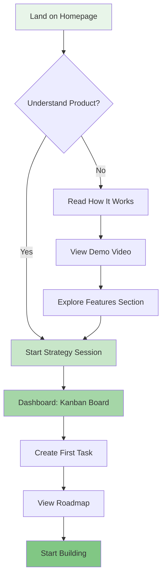
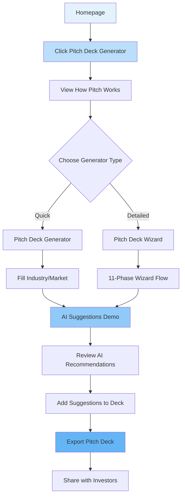
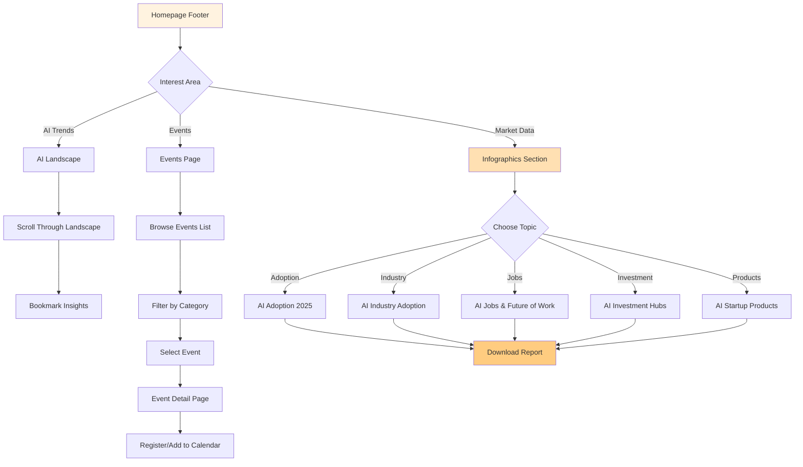
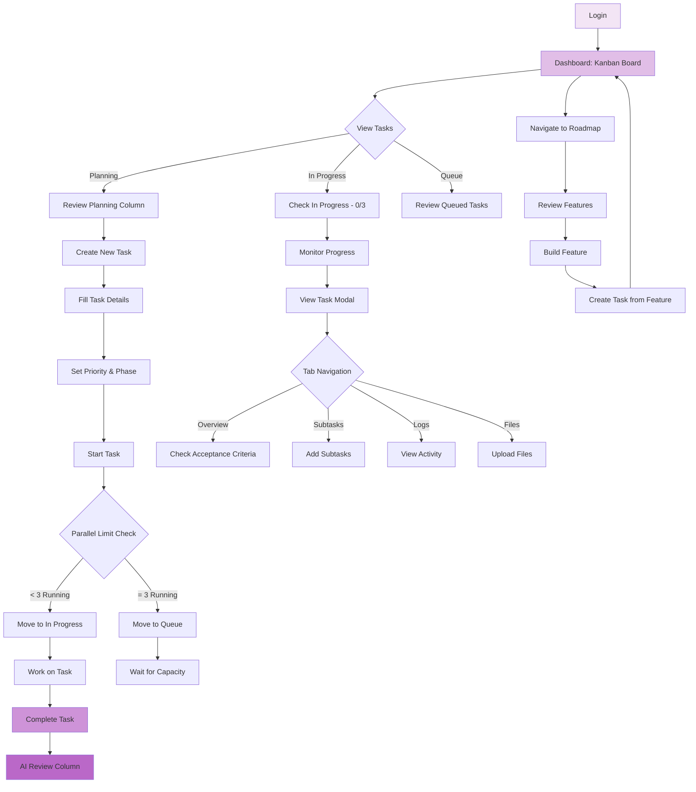
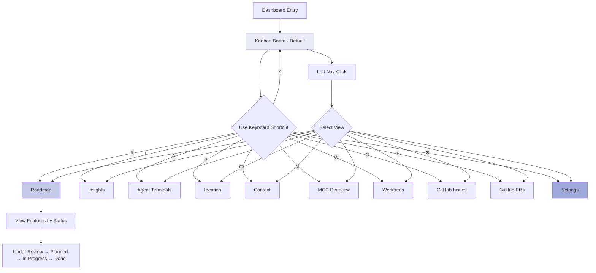
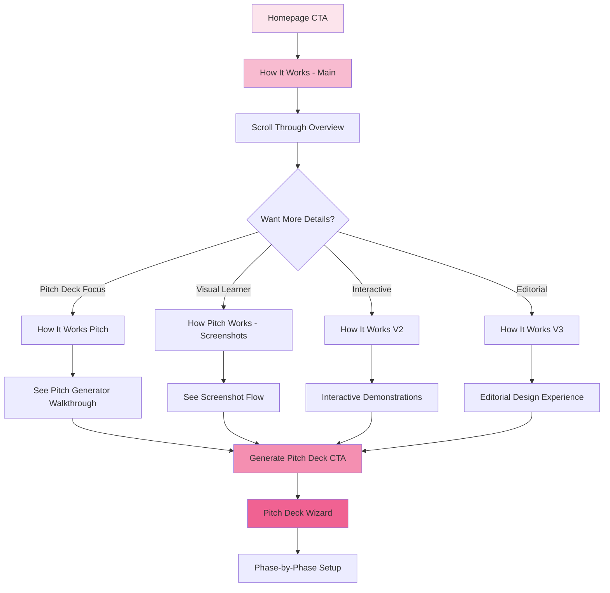
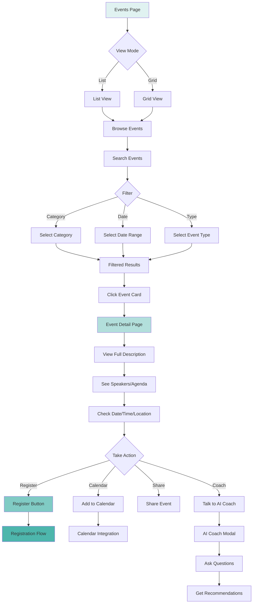
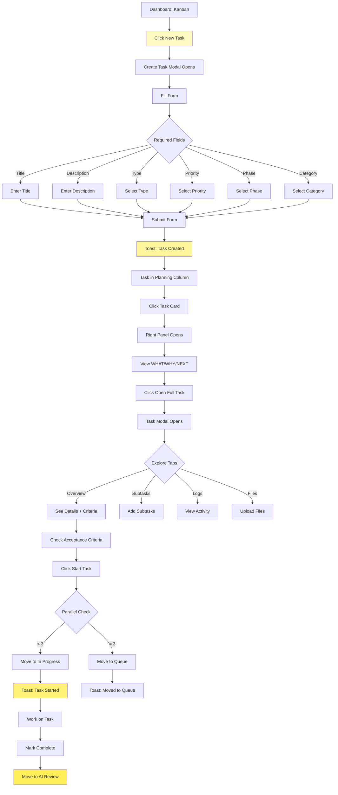
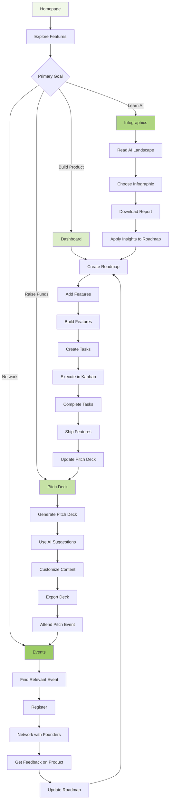

# StartupAI - Complete Sitemap & User Journeys

**Last Updated:** January 27, 2026  
**Version:** 1.0  
**Status:** Production

---

## 📑 TABLE OF CONTENTS

1. [Site Structure Tree](#site-structure-tree)
2. [Route Map](#route-map)
3. [User Journeys (Mermaid Diagrams)](#user-journeys-mermaid-diagrams)
4. [Navigation Hierarchy](#navigation-hierarchy)
5. [Page Inventory](#page-inventory)

---

## 🌳 SITE STRUCTURE TREE

```
StartupAI
│
├── 🏠 Homepage (/)
│   ├── Hero
│   ├── How It Works
│   ├── Insight Statement
│   ├── Features
│   ├── Startup System
│   ├── Value Pillars
│   ├── Guided Flow
│   ├── Single Source
│   ├── Outcomes
│   ├── Pitch Deck Section
│   ├── Final CTA
│   └── Footer
│
├── 📊 Dashboard (/dashboard)
│   ├── Kanban Board (/)
│   ├── Agent Terminals (/agents) [planned]
│   ├── Insights (/insights) [planned]
│   ├── Roadmap (/roadmap) ✅
│   ├── Ideation (/ideation) [planned]
│   ├── Content (/content) [planned]
│   ├── MCP Overview (/mcp) [planned]
│   ├── Worktrees (/worktrees) [planned]
│   ├── GitHub Issues (/issues) [planned]
│   ├── GitHub PRs (/prs) [planned]
│   └── Settings (/settings) [planned]
│
├── 🎯 Pitch Deck (/pitch-deck)
│   ├── Generator (/) ✅
│   ├── Wizard (/wizard) ✅
│   ├── AI Suggestions Demo (/ai-suggestions-demo) ✅
│   └── AI Suggestions Enhanced (/ai-suggestions-enhanced-demo) ✅
│
├── 📚 How It Works
│   ├── Overview (/how-it-works) ✅
│   ├── Pitch Generator (/how-it-works-pitch) ✅
│   ├── Screenshots Version (/how-pitch-works) ✅
│   ├── Version 2 (/how-it-works-v2) ✅
│   └── Version 3 (/how-it-works-v3) ✅
│
├── 📅 Events (/events)
│   ├── List View ✅
│   └── Detail View (/detail) ✅
│
├── 📈 Infographics & Resources
│   ├── AI Landscape (/ai-landscape) ✅
│   ├── AI Adoption 2025 (/infographics/ai-adoption-2025) ✅
│   ├── AI Industry Adoption (/infographics/ai-industry-adoption) ✅
│   ├── AI Jobs & Future of Work (/infographics/ai-jobs-future-work) ✅
│   ├── AI Jobs V2 (/infographics/ai-jobs-v2) ✅
│   ├── AI Investment Hubs (/infographics/ai-hubs) ✅
│   ├── AI Startup Products (/infographics/ai-products) ✅
│   └── AI Product Intelligence V2 (/infographics/ai-products-v2) ✅
│
└── 📄 Supporting Pages [placeholders]
    ├── Product
    │   ├── Features
    │   ├── Pricing
    │   ├── Security
    │   └── Roadmap
    │
    ├── Company
    │   ├── About
    │   ├── Blog
    │   ├── Careers
    │   └── Contact
    │
    ├── Resources
    │   ├── Documentation
    │   ├── Help Center
    │   ├── Community
    │   ├── Founder Stories
    │   └── API Reference
    │
    └── Legal
        ├── Privacy Policy
        ├── Terms of Service
        ├── Cookie Policy
        └── Data Processing
```

---

## 🗺️ ROUTE MAP

### **Active Routes (✅)**

| Route | Page Name | Type | Status |
|-------|-----------|------|--------|
| `/` | Homepage | Landing | ✅ Active |
| `/dashboard` | Kanban Board | Dashboard | ✅ Active |
| `/dashboard/roadmap` | Roadmap | Dashboard | ✅ Active |
| `/pitch-deck` | Pitch Deck Generator | Product | ✅ Active |
| `/pitch-deck-wizard` | Pitch Deck Wizard | Product | ✅ Active |
| `/pitch-deck/ai-suggestions-demo` | AI Suggestions Demo | Product | ✅ Active |
| `/pitch-deck/ai-suggestions-enhanced-demo` | AI Suggestions Enhanced | Product | ✅ Active |
| `/how-it-works` | How It Works | Educational | ✅ Active |
| `/how-it-works-pitch` | How Pitch Works | Educational | ✅ Active |
| `/how-pitch-works` | How Pitch Works (Screenshots) | Educational | ✅ Active |
| `/how-it-works-v2` | How It Works V2 | Educational | ✅ Active |
| `/how-it-works-v3` | How It Works V3 | Educational | ✅ Active |
| `/events` | Events List | Events | ✅ Active |
| `/events/detail` | Event Detail | Events | ✅ Active |
| `/ai-landscape` | AI Landscape | Resources | ✅ Active |
| `/infographics/ai-adoption-2025` | AI Adoption 2025 | Infographic | ✅ Active |
| `/infographics/ai-industry-adoption` | AI Industry Adoption | Infographic | ✅ Active |
| `/infographics/ai-jobs-future-work` | AI Jobs & Future of Work | Infographic | ✅ Active |
| `/infographics/ai-jobs-v2` | AI Jobs V2 | Infographic | ✅ Active |
| `/infographics/ai-hubs` | AI Investment Hubs | Infographic | ✅ Active |
| `/infographics/ai-products` | AI Startup Products | Infographic | ✅ Active |
| `/infographics/ai-products-v2` | AI Product Intelligence V2 | Infographic | ✅ Active |

### **Planned Routes (🔜)**

| Route | Page Name | Type | Status |
|-------|-----------|------|--------|
| `/dashboard/agents` | Agent Terminals | Dashboard | 🔜 Planned |
| `/dashboard/insights` | Insights | Dashboard | 🔜 Planned |
| `/dashboard/ideation` | Ideation | Dashboard | 🔜 Planned |
| `/dashboard/content` | Content | Dashboard | 🔜 Planned |
| `/dashboard/mcp` | MCP Overview | Dashboard | 🔜 Planned |
| `/dashboard/worktrees` | Worktrees | Dashboard | 🔜 Planned |
| `/dashboard/issues` | GitHub Issues | Dashboard | 🔜 Planned |
| `/dashboard/prs` | GitHub PRs | Dashboard | 🔜 Planned |
| `/dashboard/settings` | Settings | Dashboard | 🔜 Planned |

### **Placeholder Routes (📋)**

| Route | Page Name | Type | Status |
|-------|-----------|------|--------|
| `/#features` | Features | Product | 📋 Placeholder |
| `/#pricing` | Pricing | Product | 📋 Placeholder |
| `/#security` | Security | Product | 📋 Placeholder |
| `/#about` | About | Company | 📋 Placeholder |
| `/#blog` | Blog | Company | 📋 Placeholder |
| `/#careers` | Careers | Company | 📋 Placeholder |
| `/#contact` | Contact | Company | 📋 Placeholder |
| `/#documentation` | Documentation | Resources | 📋 Placeholder |
| `/#help` | Help Center | Resources | 📋 Placeholder |
| `/#community` | Community | Resources | 📋 Placeholder |
| `/#stories` | Founder Stories | Resources | 📋 Placeholder |
| `/#api` | API Reference | Resources | 📋 Placeholder |
| `/#privacy` | Privacy Policy | Legal | 📋 Placeholder |
| `/#terms` | Terms of Service | Legal | 📋 Placeholder |
| `/#cookies` | Cookie Policy | Legal | 📋 Placeholder |
| `/#data` | Data Processing | Legal | 📋 Placeholder |

---

## 🧭 USER JOURNEYS (MERMAID DIAGRAMS)

### **Journey 1: First-Time Founder - Getting Started**



### **Journey 2: Fundraising Founder - Pitch Deck Creation**



### **Journey 3: Research & Learning Path**



### **Journey 4: Power User - Daily Workflow**



### **Journey 5: Dashboard Navigation Flow**



### **Journey 6: Content Discovery - Footer Navigation**

```mermaid
graph TD
    A[Any Page] --> B[Scroll to Footer]
    B --> C{Section}
    
    C -->|Product| D{Product Links}
    D -->|Features| E[Anchor to Features]
    D -->|Dashboard| F[/dashboard]
    D -->|How it works| G[/how-it-works]
    D -->|Pitch Deck| H[/pitch-deck]
    D -->|Events| I[/events]
    
    C -->|Company| J{Company Links}
    J -->|About| K[#about]
    J -->|Blog| L[#blog]
    J -->|Careers| M[#careers]
    J -->|Contact| N[#contact]
    
    C -->|Resources| O{Resources Links}
    O -->|Documentation| P[#documentation]
    O -->|Help Center| Q[#help]
    O -->|Community| R[#community]
    O -->|Founder Stories| S[#stories]
    O -->|AI Landscape| T[/ai-landscape]
    O -->|Infographics| U[Choose Infographic]
    
    U --> V{Topic}
    V -->|Adoption| W[AI Adoption 2025]
    V -->|Industry| X[AI Industry Adoption]
    V -->|Jobs| Y[AI Jobs & Future of Work]
    V -->|Hubs| Z[AI Investment Hubs]
    V -->|Products| AA[AI Startup Products]
    
    C -->|Legal| AB{Legal Links}
    AB -->|Privacy| AC[Privacy Policy]
    AB -->|Terms| AD[Terms of Service]
    AB -->|Cookies| AE[Cookie Policy]
    AB -->|Data| AF[Data Processing]
    
    style B fill:#FFEBEE
    style F fill:#FFCDD2
    style T fill:#EF9A9A
    style W fill:#E57373
```

### **Journey 7: Multi-Page How It Works Exploration**



### **Journey 8: Event Discovery to Registration**



### **Journey 9: Task Management Complete Flow**



### **Journey 10: Cross-Feature Integration Flow**



---

## 📍 NAVIGATION HIERARCHY

### **Primary Navigation (Top Level)**

```
Homepage
├── Hero Section
│   ├── Start Strategy Session (CTA)
│   └── View Demo (CTA)
│
├── Inline Sections
│   ├── How It Works
│   ├── Insight Statement
│   ├── Features
│   ├── Startup System
│   ├── Value Pillars
│   ├── Guided Flow
│   ├── Single Source
│   ├── Outcomes
│   ├── Pitch Deck Section
│   └── Final CTA
│
└── Footer Navigation
    ├── Product Links
    ├── Company Links
    ├── Resources Links
    └── Legal Links
```

### **Dashboard Navigation (Left Sidebar)**

```
Dashboard
├── PROJECT SECTION
│   ├── Kanban Board (K) ✅
│   ├── Agent Terminals (A) 🔜
│   ├── Insights (I) 🔜
│   ├── Roadmap (R) ✅
│   ├── Ideation (D) 🔜
│   ├── Content (C) 🔜
│   ├── MCP Overview (M) 🔜
│   ├── Worktrees (W) 🔜
│   ├── GitHub Issues (G) 🔜
│   └── GitHub PRs (P) 🔜
│
└── SETTINGS SECTION
    └── Settings (⚙) 🔜
```

### **Footer Navigation (4 Columns)**

```
Footer
├── PRODUCT
│   ├── Features
│   ├── Dashboard ✅
│   ├── How it works ✅
│   ├── Pitch Deck Generator ✅
│   ├── How Pitch Generator Works ✅
│   ├── How It Works (Screenshots) ✅
│   ├── How It Works V2 ✅
│   ├── How It Works V3 ✅
│   ├── Pricing
│   ├── Security
│   ├── Roadmap
│   └── Events ✅
│
├── COMPANY
│   ├── About
│   ├── Blog
│   ├── Careers
│   └── Contact
│
├── RESOURCES
│   ├── Documentation
│   ├── Help Center
│   ├── Community
│   ├── Founder Stories
│   ├── API Reference
│   ├── AI Landscape ✅
│   ├── AI Adoption Report 2025 ✅
│   ├── AI Industry Adoption 2025 ✅
│   ├── AI Jobs & Future of Work 2024-2026 ✅
│   ├── AI Jobs & Future of Work V2 ✅
│   ├── AI Investment Hubs 2025 ✅
│   ├── AI Startup Products 2024-2026 ✅
│   └── AI Product Intelligence V2 ✅
│
└── LEGAL
    ├── Privacy Policy
    ├── Terms of Service
    ├── Cookie Policy
    └── Data Processing
```

---

## 📋 PAGE INVENTORY

### **By Feature Area**

#### **LANDING & ONBOARDING**
1. **Homepage** (`/`)
   - Type: Marketing Landing Page
   - Sections: 11 (Hero through Final CTA)
   - CTAs: Start Strategy Session, View Demo
   - Status: ✅ Active

#### **DASHBOARD & WORKFLOW**
2. **Kanban Board** (`/dashboard`)
   - Type: Task Management Dashboard
   - Features: 4 columns (Planning, Queue, In Progress, AI Review)
   - Actions: Create task, start task, view task, delete task
   - Status: ✅ Active

3. **Roadmap** (`/dashboard/roadmap`)
   - Type: Feature Planning Dashboard
   - Features: 4 columns (Under Review, Planned, In Progress, Done)
   - Components: Feature cards, priority badges, impact tags
   - Status: ✅ Active

4. **Agent Terminals** (`/dashboard/agents`)
   - Type: Developer Tools Dashboard
   - Status: 🔜 Planned

5. **Insights** (`/dashboard/insights`)
   - Type: Analytics Dashboard
   - Status: 🔜 Planned

6. **Ideation** (`/dashboard/ideation`)
   - Type: Brainstorming Workspace
   - Status: 🔜 Planned

7. **Content** (`/dashboard/content`)
   - Type: Content Management
   - Status: 🔜 Planned

8. **MCP Overview** (`/dashboard/mcp`)
   - Type: MCP Integration Dashboard
   - Status: 🔜 Planned

9. **Worktrees** (`/dashboard/worktrees`)
   - Type: Git Worktree Manager
   - Status: 🔜 Planned

10. **GitHub Issues** (`/dashboard/issues`)
    - Type: Issue Tracker Integration
    - Status: 🔜 Planned

11. **GitHub PRs** (`/dashboard/prs`)
    - Type: Pull Request Manager
    - Status: 🔜 Planned

12. **Settings** (`/dashboard/settings`)
    - Type: User Preferences
    - Status: 🔜 Planned

#### **PITCH DECK & FUNDRAISING**
13. **Pitch Deck Generator** (`/pitch-deck`)
    - Type: Simple Generator
    - Features: Basic form, industry selection, AI-powered
    - Status: ✅ Active

14. **Pitch Deck Wizard** (`/pitch-deck-wizard`)
    - Type: Full 11-Phase Wizard
    - Features: 50+ features across 11 phases, step-by-step
    - Status: ✅ Active

15. **AI Suggestions Demo** (`/pitch-deck/ai-suggestions-demo`)
    - Type: Demo Page
    - Features: AI-powered suggestions, industry-specific
    - Status: ✅ Active

16. **AI Suggestions Enhanced** (`/pitch-deck/ai-suggestions-enhanced-demo`)
    - Type: Enhanced Demo
    - Features: Bulk add, explicit actions, production-ready
    - Status: ✅ Active

#### **EDUCATIONAL & HOW-TO**
17. **How It Works - Overview** (`/how-it-works`)
    - Type: Educational Landing
    - Features: Scroll-driven sections, visual storytelling
    - Status: ✅ Active

18. **How Pitch Generator Works** (`/how-it-works-pitch`)
    - Type: Feature Walkthrough
    - Features: Pitch deck focus, step-by-step
    - Status: ✅ Active

19. **How Pitch Works - Screenshots** (`/how-pitch-works`)
    - Type: Visual Guide
    - Features: Screenshot-based tutorial
    - Status: ✅ Active

20. **How It Works V2** (`/how-it-works-v2`)
    - Type: Enhanced Walkthrough
    - Features: Interactive elements, refined UX
    - Status: ✅ Active

21. **How It Works V3** (`/how-it-works-v3`)
    - Type: Editorial Design
    - Features: Luxury aesthetic, elegant layout
    - Status: ✅ Active

#### **EVENTS & NETWORKING**
22. **Events List** (`/events`)
    - Type: Event Directory
    - Features: List/grid view, search, filters
    - Views: List, Grid
    - Status: ✅ Active

23. **Event Detail** (`/events/detail`)
    - Type: Event Page
    - Features: Full description, speakers, agenda, registration, AI coach
    - Status: ✅ Active

#### **INFOGRAPHICS & RESEARCH**
24. **AI Landscape** (`/ai-landscape`)
    - Type: Infographic Page
    - Features: Scroll-driven, comprehensive overview
    - Status: ✅ Active

25. **AI Adoption 2025** (`/infographics/ai-adoption-2025`)
    - Type: Infographic Report
    - Features: Data visualizations, scroll animations
    - Status: ✅ Active

26. **AI Industry Adoption** (`/infographics/ai-industry-adoption`)
    - Type: Industry Report
    - Features: Sector-specific data, charts
    - Status: ✅ Active

27. **AI Jobs & Future of Work** (`/infographics/ai-jobs-future-work`)
    - Type: Jobs Report
    - Features: Employment trends, skill analysis
    - Status: ✅ Active

28. **AI Jobs V2** (`/infographics/ai-jobs-v2`)
    - Type: Enhanced Jobs Report
    - Features: Updated data, improved UX
    - Status: ✅ Active

29. **AI Investment Hubs** (`/infographics/ai-hubs`)
    - Type: Geographic Report
    - Features: Hub analysis, investment data
    - Status: ✅ Active

30. **AI Startup Products** (`/infographics/ai-products`)
    - Type: Product Directory
    - Features: Startup showcase, product categories
    - Status: ✅ Active

31. **AI Product Intelligence V2** (`/infographics/ai-products-v2`)
    - Type: Enhanced Product Report
    - Features: Deep product analysis, trends
    - Status: ✅ Active

---

## 📊 STATISTICS

### **Pages by Status**
- ✅ **Active:** 22 pages
- 🔜 **Planned:** 9 pages
- 📋 **Placeholder:** 16 links
- **Total:** 47 pages/sections

### **Pages by Category**
- **Landing & Marketing:** 1
- **Dashboard & Workflow:** 11 (2 active, 9 planned)
- **Pitch Deck & Fundraising:** 4
- **Educational & How-To:** 5
- **Events & Networking:** 2
- **Infographics & Research:** 8
- **Supporting Pages:** 16 (placeholders)

### **Route Depth**
- **Root Level (`/`):** 6 pages
- **Dashboard (`/dashboard/*`):** 11 pages
- **Pitch Deck (`/pitch-deck/*`):** 4 pages
- **Infographics (`/infographics/*`):** 7 pages
- **Events (`/events/*`):** 2 pages

---

## 🎯 KEY USER PATHS

### **Path 1: First Visit to Active User**
```
Homepage → How It Works → Start Strategy → Dashboard → Create Task → Start Building
```

### **Path 2: Fundraising Journey**
```
Homepage → Pitch Deck Section → Pitch Deck Wizard → AI Suggestions → Export → Events
```

### **Path 3: Research & Learning**
```
Footer → Resources → Choose Infographic → Read Report → Apply to Roadmap → Dashboard
```

### **Path 4: Event Discovery**
```
Footer → Events → Browse List → Filter → Event Detail → Register → Calendar
```

### **Path 5: Daily Workflow**
```
Dashboard → Kanban → Create Task → Start Task → Work → Complete → AI Review
```

---

## 🔗 CROSS-LINKING STRATEGY

### **From Homepage:**
- → Dashboard (CTA)
- → How It Works (Inline)
- → Pitch Deck (Section)
- → Events (Footer)
- → Infographics (Footer)

### **From Dashboard:**
- → Roadmap (Left Nav)
- → All Dashboard Views (Left Nav)
- → Settings (Left Nav)

### **From Pitch Deck:**
- → Wizard (Upgrade path)
- → AI Suggestions (Enhancement)
- → How It Works (Learn more)

### **From Events:**
- → Event Detail (Click card)
- → Dashboard (Post-registration)

### **From Infographics:**
- → Other Infographics (Related content)
- → Dashboard (Apply insights)

---

## 📝 NOTES

### **Design Patterns**
- **Scroll-driven:** How It Works, Infographics, AI Landscape
- **Wizard/Multi-step:** Pitch Deck Wizard (11 phases)
- **Kanban:** Dashboard task management
- **List/Grid Toggle:** Events page
- **Modal-based:** Task creation, task detail
- **Tab Navigation:** Task modal (4 tabs), Roadmap views

### **Navigation Patterns**
- **Footer:** Comprehensive site navigation with active badges
- **Left Sidebar:** Dashboard-specific navigation with keyboard shortcuts
- **Inline CTAs:** Homepage sections
- **Breadcrumbs:** Not currently implemented
- **Back Buttons:** Not currently implemented

### **Active Features**
- ✅ Task CRUD operations
- ✅ Toast notifications
- ✅ State management (Context API)
- ✅ Modal system
- ✅ Filters & search
- ✅ Keyboard shortcuts (dashboard)
- ✅ AI suggestions (pitch deck)
- ✅ Event registration
- ✅ Scroll animations (infographics)

### **Planned Features**
- 🔜 Drag & drop
- 🔜 Real-time collaboration
- 🔜 GitHub integration
- 🔜 MCP integration
- 🔜 Analytics dashboard
- 🔜 Content management
- 🔜 User authentication
- 🔜 Mobile responsive

---

**Last Updated:** January 27, 2026  
**Maintained By:** StartupAI Development Team  
**Version:** 1.0
